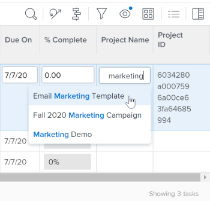

# 21.4 - Miglioramenti al reporting

Questa pagina descrive tutti i miglioramenti apportati all’ambiente di anteprima con la versione 21.4 di Reporting. Questi miglioramenti saranno resi disponibili nell’ambiente di produzione la settimana del 4 ottobre 2021.

Per un elenco di tutte le modifiche disponibili con la versione 21.4, consulta la [Panoramica sulla versione 21.4](../../../product-announcements/product-releases/21.4-release-activity/21-4-release-overview.md).

## Nuovo aspetto del campo Assegnazioni negli elenchi e nei report aggiornati

>[!NOTE]
>
>Precedentemente disponibile nell’ambiente di produzione con la versione 21.2, quindi temporaneamente rimosso dall’ambiente di produzione il 20 maggio 2021.

>[!NOTE]
>
>Questa funzione è disponibile solo nella nuova esperienza Adobe Workfront.

Per mantenere l’aspetto moderno delle altre aree della nuova esperienza Workfront, è stato modificato lo stile del campo Assegnazioni negli elenchi e nei rapporti aggiornati. Questa riprogettazione include:

* Un avatar arrotondato per le immagini del profilo utente, i ruoli e i team
* Visualizzazione delle iniziali per gli utenti senza immagini del profilo
* Icona di una nuova mansione
* Una nuova icona Persone per le assegnazioni avanzate
* Icona Un nuovo accesso con restrizioni
* Altre modifiche di progettazione minori

Per ulteriori informazioni sulle assegnazioni negli elenchi, consulta [Assegnare attività](../../../manage-work/tasks/assign-tasks/assign-tasks.md) o [Assegnare problemi](../../../manage-work/issues/manage-issues/assign-issues.md).

## Nuovo aspetto per i campi typeahead negli elenchi e nei report aggiornati

>[!NOTE]
>
>Precedentemente disponibile nell’ambiente di produzione con la versione 21.2, quindi temporaneamente rimosso dall’ambiente di produzione il 20 maggio 2021.

>[!NOTE]
>
>Questa funzione è disponibile solo nella nuova esperienza Adobe Workfront.

Per conferire un aspetto moderno alle altre aree della nuova esperienza Workfront, è stato modificato lo stile dei campi typeahead negli elenchi e nei report aggiornati. Queste modifiche includono:

* L’icona Typeahead è stata rimossa dal campo.
* Quando fai clic su un campo di completamento automatico, ora viene visualizzato il menu dei suggerimenti prima di immettere il testo.
* Il menu dei suggerimenti è più reattivo alla lunghezza dei valori, che ora vengono troncati alla fine quando viene raggiunto il limite di caratteri anziché al centro del valore.

Per informazioni sugli elenchi aggiornati, vedere la sezione [Differenza tra gli elenchi aggiornati e quelli legacy](../../../workfront-basics/navigate-workfront/use-lists/view-items-in-a-list.md#updated) nell&#39;articolo [Introduzione agli elenchi in Adobe Workfront](../../../workfront-basics/navigate-workfront/use-lists/view-items-in-a-list.md).

