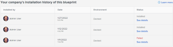

# Miglioramenti dell’amministratore 2.2

Questa pagina descrive tutti i miglioramenti apportati dall’amministratore all’ambiente di anteprima con la versione 22.2. Questi miglioramenti saranno resi disponibili nell&#39;ambiente di produzione

<!--
<MadCap:conditionalText data-mc-conditions="QuicksilverOrClassic.Draft mode">
in January 2022
</MadCap:conditionalText>
-->

la settimana del 4 aprile 2022. Per un elenco di tutte le modifiche disponibili con la versione 22.2, vedi [Panoramica sulla versione 22.2](../../../product-announcements/product-releases/22.2-release-activity/22-2-release-overview.md).

## Configurare un modulo personalizzato per l’utilizzo con più tipi di oggetto

Ora è possibile configurare un modulo personalizzato nuovo o esistente per l’utilizzo con più tipi di oggetto, rendendo il modulo molto più utile. Gli utenti potranno allegare e compilare il modulo sugli oggetti di tutti i tipi per i quali lo si configura.

In precedenza era possibile configurare un modulo personalizzato in modo che funzionasse con un solo tipo di oggetto.

Questa funzionalità funziona con tutti i moduli personalizzati creati in precedenza nel sistema Workfront. Ad esempio, se si dispone già di un modulo personalizzato creato per il tipo di oggetto Task, è ora possibile configurare il modulo in modo che funzioni anche con altri tipi di oggetto, ad esempio Progetto e Problema.

Per ulteriori informazioni, consulta la sezione . [Iniziare a creare un modulo personalizzato](../../../administration-and-setup/customize-workfront/create-manage-custom-forms/create-or-edit-a-custom-form.md#start) nell&#39;articolo [Creare o modificare un modulo personalizzato](../../../administration-and-setup/customize-workfront/create-manage-custom-forms/create-or-edit-a-custom-form.md).

>[!NOTE]
>
>* Al momento della versione di anteprima iniziale di questa funzionalità, abbiamo temporaneamente disattivato la possibilità di copiare un modulo personalizzato con più oggetti. Questa capacità è stata attivata il 24 marzo. Per informazioni sulla copia di un modulo personalizzato, vedere [Copiare un modulo personalizzato per crearne uno nuovo](../../../administration-and-setup/customize-workfront/create-manage-custom-forms/copy-custom-form-to-create-a-new-one.md).
>* In un campo personalizzato calcolato, alcuni campi a cui si fa riferimento potrebbero non essere compatibili con i tipi di oggetto configurati per il modulo. La soluzione è un carattere jolly che consente al calcolo di generare valori diversi, a seconda dell’oggetto a cui è allegato il modulo. Abbiamo aggiunto il jolly il 24 marzo. Per informazioni su come utilizzarlo, consulta la sezione . [Campi personalizzati calcolati nei moduli personalizzati con più oggetti](../../../administration-and-setup/customize-workfront/create-manage-custom-forms/add-calculated-data-to-custom-form.md#calculat) nell&#39;articolo [Aggiungere dati calcolati a un modulo personalizzato](../../../administration-and-setup/customize-workfront/create-manage-custom-forms/add-calculated-data-to-custom-form.md).
>* Per le interruzioni di sezione nei moduli personalizzati, è stato creato un set di autorizzazioni comuni di visualizzazione e modifica per tutti i tipi di oggetto che è possibile configurare per un modulo. In uno scenario, è stato rilevato che una di queste autorizzazioni, Modifica limitata, potrebbe causare errori in un modulo. Questo è stato fissato il 24 marzo. Per ulteriori informazioni sulle interruzioni di sezione, consulta [Aggiungere un’interruzione di sezione a un modulo personalizzato](../../../administration-and-setup/customize-workfront/create-manage-custom-forms/add-a-section-break-to-a-custom-form.md).
>

## Il catalogo Blueprint è disponibile per tutti gli utenti e gli amministratori possono consentire le richieste

Tutti gli utenti di Adobe Workfront possono ora sfogliare il catalogo delle blueprint disponibili. Per ulteriori informazioni, consulta [Sfoglia il catalogo dei progetti e richiedi l&#39;installazione dei progetti](../../../administration-and-setup/blueprints/browse-catalog.md).

Inoltre, l&#39;amministratore di sistema può consentire agli utenti di accedere per richiedere l&#39;installazione dei progetti. L’assegnazione di una coda di richiesta per memorizzare le richieste consente agli utenti di effettuare richieste dal catalogo blueprint. Per ulteriori informazioni, consulta [Configurare l’accesso alle blueprint](../../../administration-and-setup/blueprints/configure-access-to-blueprints.md).

## Aggiungere un’immagine a un modulo personalizzato

In un modulo personalizzato creato o modificato, è ora possibile aggiungere un’immagine e includere una descrizione delle informazioni o delle istruzioni che gli utenti possono leggere quando passano il puntatore del mouse su di essa.

Questo potrebbe essere utile, ad esempio, per mostrare il branding per un nuovo prodotto o per fornire informazioni visive di cui gli utenti hanno bisogno durante la compilazione del modulo.

In precedenza, i moduli personalizzati erano completamente basati su testo.

>[!NOTE]
>
>Nelle nuove aree di esperienza Adobe Workfront non ancora modernizzate, ad esempio la casella che viene visualizzata quando si modificano in blocco gli elementi, le immagini dei moduli personalizzati non vengono visualizzate. Verranno visualizzati man mano che continuiamo ad aggiornare tali aree.

Per ulteriori informazioni, consulta [Aggiunta o modifica di un widget di risorse in un modulo personalizzato](../../../administration-and-setup/customize-workfront/create-manage-custom-forms/add-widget-or-edit-its-properties-in-a-custom-form.md).

## Nuove configurazioni predefinite del livello di accesso

Per soddisfare meglio le esigenze della maggior parte degli amministratori che creano nuovi livelli di accesso, abbiamo modificato la configurazione predefinita per le opzioni &quot;Ottimizza le impostazioni&quot; elencate di seguito. Questi vengono visualizzati quando fai clic sull’icona a forma di ingranaggio  su un pulsante Modifica.

Tutte queste modifiche disattivano un&#39;opzione precedentemente attivata per impostazione predefinita. Se questo non soddisfa le esigenze della tua organizzazione, puoi attivarli quando imposti un nuovo livello di accesso o in un secondo momento.

>[!IMPORTANT]
>
>Questa modifica di configurazione predefinita influisce solo sui livelli di accesso creati da ora in poi, non su quelli creati in precedenza.

* In un nuovo livello di accesso con un tipo di licenza Piano:

   * Condividi a livello di sistema è ora disabilitata per progetti, attività, problemi, portfolio, programmi, rapporti, filtri, documenti e modelli.
   * Per i rapporti anche le funzioni Visualizza rapporti incorporati e Condividi rapporti pubblici sono disabilitate.
   * Condividi documenti al pubblico è disabilitata anche per i documenti.

* In un nuovo livello di accesso con un tipo di licenza Lavoro:

   * Condividi a livello di sistema è ora disabilitata per i filtri e i documenti.
   * Condividi documenti al pubblico è disabilitata anche per i documenti.

* In un nuovo livello di accesso con un tipo di licenza Request or Review:

   * Condividi a livello di sistema è ora disabilitata per i filtri.

## Disattivare un gruppo

Quando le organizzazioni interne cambiano, potrebbe essere necessario interrompere l’utilizzo di determinati gruppi in Workfront e crearne di nuovi. Per facilitare questa fase, abbiamo aggiunto la possibilità di disattivare un gruppo senza perdere i dati storici. Per gli utenti abituali che non hanno bisogno di visualizzarli, i gruppi inattivi vengono cancellati dai campi tipo-avanti del gruppo.

È comunque possibile trovare e configurare opzioni, preferenze e associazioni di oggetti per i gruppi inattivi gestiti. La disattivazione di un gruppo non comporta alcuna modifica per gli oggetti a cui è associato il gruppo.

In precedenza, non era possibile disattivare un gruppo.

Per ulteriori informazioni, consulta [Disattivare o riattivare un gruppo](../../../administration-and-setup/manage-groups/create-and-manage-groups/deactivate-or-reactivate-a-group.md).

## Miglioramenti alla cronologia dell’installazione di Blueprint

Quando si installa una blueprint, ora viene visualizzato un messaggio per visualizzare gli oggetti specifici (ad esempio ruoli, team o gruppi) che sono stati installati correttamente con la blueprint ed eventuali oggetti che non sono stati installati. È inoltre possibile visualizzare l’elenco degli oggetti installati nella pagina Dettagli blueprint facendo clic su Visualizza dettagli accanto a una specifica installazione nella tabella della cronologia dell’installazione.

Per ulteriori informazioni, consulta [Installare una blueprint](../../../administration-and-setup/blueprints/blueprints-install.md).

## Viene ora visualizzato un avviso durante l’installazione di una blueprint solo anteprima in Produzione

Alcuni blueprint sono disponibili solo per l’installazione nell’ambiente di anteprima a scopo di test.

Se accedi al contenuto solo anteprima nell’ambiente di produzione, Sandbox 1 o Sandbox 2, il pulsante di installazione non è attivo e potresti visualizzare un messaggio di avviso.

Per ulteriori informazioni, consulta [Installare una blueprint](../../../administration-and-setup/blueprints/blueprints-install.md).
