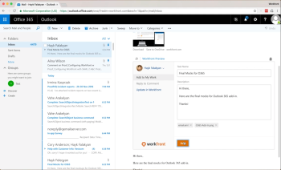
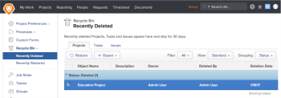
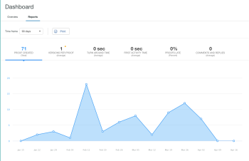

# Versione di Workfront R1

## COINVOLGIMENTO ED EFFICIENZA PER TUTTI

Workfront rilascia tre volte l’anno nuove funzionalità di prodotto per tutte le linee di prodotti (release 1, release 2 e release 3). Nella prima versione dell’anno 2017 (R1,), diversi miglioramenti apportati alle funzionalità di base di Workfront, ProofHQ e Workfront DAM consentono ai knowledge worker di essere più produttivi, coinvolti e dedicare meno tempo alla gestione del lavoro e più lavoro.

## NOVITÀ DELL’ULTIMA VERSIONE

* [MIGLIORAMENTI DI WORKFRONT](#workfront-enhancements)
* [MIGLIORAMENTI DI PROOFHQ](#proofhq-enhancements)
* [MIGLIORAMENTI DI WORKFRONT DAM](#workfront-dam-enhancements)

## MIGLIORAMENTI DI WORKFRONT {#workfront-enhancements}

\
**Gestisci il lavoro direttamente dall&#39;e-mail**
L&#39;integrazione diretta in Outlook 365 consente di eliminare il lavoro duplicato durante l&#39;aggiornamento di Workfront direttamente da Outlook 365. Converti le e-mail in attività, invia conversazioni e allegati e-mail come aggiornamenti e rispondi ai commenti, senza mai uscire da Outlook.

Per ulteriori informazioni, consulta:  [Funzionalità rese disponibili in anteprima nel 2016](../../../../product-announcements/product-releases/quarterly-release-archive/r1-release-activity/available-in-preview-in-2016.md)

\
**Mantenere i progetti in linea con il budget**
Gestisci le risorse e il loro utilizzo, mantenendo i progetti sulla strada giusta e nel rispetto del budget, utilizzando il nuovo rapporto Utilizzo. Visualizzare le ore pianificate rispetto a quelle effettive per progetto e ruolo e confrontare regolarmente risorse e reparti.

Per ulteriori informazioni, consulta:  [Anteprima R1 3](../../../../product-announcements/product-releases/quarterly-release-archive/r1-release-activity/r1-preview-3.md)

\
**Personalizzazione della terminologia e delle notifiche**
Rendi Workfront più rilevante per il tuo team sfruttando la funzione di terminologia personalizzata per modificare termini come &quot;Portfolio&quot; o &quot;Progetto&quot; in base al tuo linguaggio preferito, indipendentemente dal settore. Inoltre, ogni utente può ora personalizzare i tipi di notifiche che riceve regolando la propria frequenza di riepilogo.

Per ulteriori informazioni, consulta:  [Anteprima R1 3](../../../../product-announcements/product-releases/quarterly-release-archive/r1-release-activity/r1-preview-3.md)

**Vista Milestone**
Le nuove icone di stato dell’avanzamento consentono di ottenere di più dai rapporti milestone. Inoltre, ora è possibile modificare la percentuale di completamento direttamente dalla vista milestone.

Per ulteriori informazioni, consulta:  [Anteprima R1 5](../../../../product-announcements/product-releases/quarterly-release-archive/r1-release-activity/r1-preview-5.md)

**Cestino Workfront**
Il nuovo Cestino di Workfront consente di ripristinare progetti, attività, problemi e tutti i documenti, i moduli e gli aggiornamenti correlati entro 30 giorni dall’eliminazione.

Per ulteriori informazioni, consulta:  [Anteprima R1 1 e 2](../../../../product-announcements/product-releases/quarterly-release-archive/r1-release-activity/r1-peview-1-and-2.md)

### MIGLIORAMENTI DI PROOFHQ {#proofhq-enhancements}

\
**Ricerca e ricerca bozza**
La nuova funzionalità di ricerca di ProofHQ consente di cercare e trovare tutte le istanze di una parola o frase direttamente nelle bozze durante la revisione. Questo vale per tutti i documenti basati su testo, inclusi i PDF e i file di Microsoft Word.

Per ulteriori informazioni, consulta:  [Finale R1](../../../../product-announcements/product-releases/quarterly-release-archive/r1-release-activity/r1-final.md)

\
**Reporting visivo e visualizzazioni personalizzate avanzate**
Le nuove metriche di reporting in ProofHQ consentono di monitorare il tempo di risposta, le percentuali di ritardo, il numero di commenti e il tempo alla prima attività. Le nuove viste personalizzate creano una logica di filtro avanzata che ti consente di ottenere i dati esatti nel momento più opportuno.

Per ulteriori informazioni, consulta:  [Finale R1](../../../../product-announcements/product-releases/quarterly-release-archive/r1-release-activity/r1-final.md)

**Anteprima ProofHQ**
ProofHQ ora consente di testare le nuove funzioni in un ambiente di anteprima prima di rilasciarle a tutti gli utenti.

## MIGLIORAMENTI DI WORKFRONT DAM {#workfront-dam-enhancements}

\
**Collegamenti incorporati DAM**
Per i team di marketing che necessitano di un modo migliore per gestire, pubblicare e monitorare l’utilizzo delle risorse digitali su piattaforme esterne, la funzione dei collegamenti incorporati offre il controllo necessario per gestire il processo di condivisione dei contenuti giusti al momento giusto.

**Campi metadati richiesti DAM**
Migliora la categorizzazione delle risorse digitali con i campi di metadati obbligatori che consentono un maggiore controllo sulla condivisione delle risorse.

**Coinvolgi tutti ed efficienza con Workfront.**
Workfront è una soluzione di gestione del lavoro aziendale che consente ai knowledge worker e ai dirigenti moderni di:

* Personalizzare il lavoro per adattarlo alle preferenze individuali e organizzative e aumentarne l’adozione
* Lavora in modo più efficiente da qualsiasi luogo
* Ottenere una migliore e più significativa visibilità delle risorse, sia a livello di budget che di personale
* Fornire il lavoro giusto, più rapidamente che in passato

**ULTERIORI INFORMAZIONI**

* Scarica il foglio dati R1 qui:  [https://resources.workfront.com/data-sheets/r1-release-datasheet](https://resources.workfront.com/data-sheets/r1-release-datasheet)
* Scarica le domande frequenti sulla versione R1 qui: [https://resources.workfront.com/data-sheets/r1-faq-for-customers](https://resources.workfront.com/data-sheets/r1-faq-for-customers)
* Per un elenco completo dei miglioramenti disponibili in R1: [Panoramica dell’attività sulla versione R1](../../../../product-announcements/product-releases/quarterly-release-archive/r1-release-activity/r1-release-activity-overview.md)

Workfront. Perché Il Lavoro È Importante.
