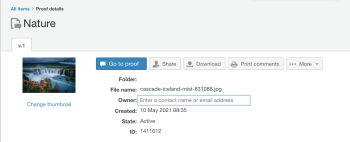

# Attività rilascio bozza Workfront: settimana del 17 maggio 2021

In questa pagina sono descritte le modifiche apportate all&#39;applicazione di verifica autonoma Workfront Proof. Le modifiche qui descritte non sono applicabili alla funzionalità di verifica all’interno dell’applicazione Adobe Workfront.

## I menu del profilo utente in Workfront Proof ora utilizzano i campi di completamento automatico per cercare gli utenti

>[!NOTE]
>
>Questa funzione è stata rilasciata nell’ambiente di anteprima il 20 maggio 2021. Verrà rilasciato nell’ambiente di produzione il 16 settembre 2021.

Per facilitare la gestione dei menu a discesa di grandi dimensioni che elencano tutti gli utenti del sistema, abbiamo sostituito tutti i menu di ricerca dei profili utente con una ricerca typehead nella funzione autonoma di Adobe Workfront Proof. Alcuni esempi di menu di ricerca dei profili utente includono

* Proprietari bozza
* Contatti fuori sede
* Proprietari del modello

In precedenza, tutti i menu a discesa per la ricerca dei profili elencavano tutti gli utenti nel sistema, generando un menu di grandi dimensioni.

