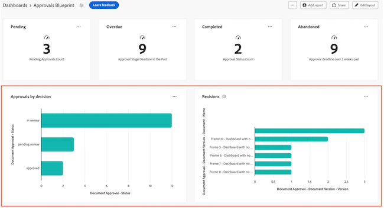
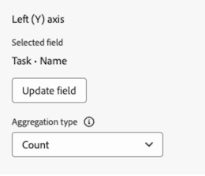

# Creare un rapporto di grafico in un dashboard di Canvas

Le informazioni evidenziate in questa pagina si riferiscono a funzionalità non ancora generalmente disponibili. È disponibile solo nell&#39;ambiente di anteprima per tutti i clienti.

>[!IMPORTANT]
>
>La funzione Dashboard di Canvas è attualmente disponibile solo per gli utenti che partecipano alla fase beta. Alcune parti della caratteristica potrebbero non essere complete o non funzionare come previsto in questa fase. Invia un feedback relativo alla tua esperienza seguendo le istruzioni riportate nella sezione [Provide feedback](/help/quicksilver/product-announcements/betas/canvas-dashboards-beta/canvas-dashboards-beta-information.md#provide-feedback) dell&#39;articolo di panoramica della versione beta di Canvas Dashboards. 
>In caso di feedback su un possibile bug o problema tecnico, invia un ticket al supporto Workfront. Per ulteriori informazioni, vedere [Contattare l&#39;Assistenza clienti](/help/quicksilver/workfront-basics/tips-tricks-and-troubleshooting/contact-customer-support.md). 
>Tieni presente che questa versione beta non è disponibile sui seguenti provider cloud:
>
>* Porta la tua chiave per Amazon Web Services
>* Azure
>* Piattaforma Google Cloud

Puoi generare e aggiungere un rapporto di grafico a un dashboard di Canvas per visualizzare i dati come grafico a barre, a colonne, a linee o a torta.

## Requisiti di accesso

+++ Espandi per visualizzare i requisiti di accesso per la funzionalità descritta in questo articolo. 

<table style="table-layout:auto"> 
<col> 
</col> 
<col> 
</col> 
<tbody> 
<tr> 
   <td role="rowheader">
Pacchetto Adobe Workfront
</td> 
   <td> 

Qualsiasi 
 
   </td> 
<tr> 
 <tr> 
   <td role="rowheader">
Licenza Adobe Workfront
</td> 
   <td> 

Standard
 

Piano
 
   </td> 
   </tr> 
  </tr> 
  <tr> 
   <td role="rowheader">
Configurazioni del livello di accesso
</td> 
   <td>
Modificare l’accesso a rapporti, dashboard e calendari

  </td> 
  </tr>  
</tbody> 
</table>

Per ulteriori dettagli sulle informazioni contenute in questa tabella, vedere [Requisiti di accesso nella documentazione di Workfront](/help/quicksilver/administration-and-setup/add-users/access-levels-and-object-permissions/access-level-requirements-in-documentation.md).
+++

## Prerequisiti

È necessario creare un dashboard prima di creare un report grafico.

## Creare un rapporto di grafico in un dashboard di Canvas

Sono disponibili molte opzioni di configurazione per la creazione di un rapporto grafico. In questa sezione ti guideremo attraverso il processo generale di creazione di un elemento.

{{step1-to-dashboards}}

1. Nel pannello a sinistra, fai clic su **Dashboard Canvas**.

1. Fai clic su **Nuovo dashboard** nell&#39;angolo superiore destro.

1. Nella casella **Crea dashboard** immettere il **Nome** e la **Descrizione** del dashboard.

1. Fai clic su **Crea**.

1. Nella casella **Aggiungi report** selezionare **Crea report**.

1. Sul lato sinistro, selezionare **Grafico**.

1. Nell&#39;angolo in alto a destra, fai clic su **Crea rapporto**.

1. (Facoltativo) Segui i passaggi seguenti per configurare la sezione **Dettagli**:

   1. Immetti un rapporto **Nome**.

   1. Immetti un rapporto **Descrizione**.

   1. Se lo desideri, deseleziona la casella **Mostra serie extra come &quot;Altro&quot;**.

      >[!NOTE]
      >
      >È possibile visualizzare in un grafico un massimo di 60 serie. Se questa casella è selezionata, tutte le serie al di sopra del limite vengono consolidate in un raggruppamento **Altro** nel grafico.
1. Scegliere il tipo di grafico da creare:
   * [Grafico a barre, a colonne o a linee](#bar-column-or-line-chart)
   * [Grafico a torta](#pie-chart)

### Grafico a barre, a colonne o a linee

>[!NOTE]
>
>Potrebbero essere presenti campi aggiuntivi a seconda del tipo di campo selezionato. Le opzioni descritte di seguito sono standard per tutti i tipi di campo.

1. Nel pannello a sinistra, fai clic sull&#39;icona **Genera grafico** .

1. Nel menu a discesa **Tipo di grafico**, selezionare **Barra**, **Colonna** o **Riga**.
1. Nel secondo menu a discesa, seleziona la barra, la colonna o il tipo di riga:
   * **Semplice**
   * **Serie multiple**
   * **In pila**

1. Nella sezione **Asse inferiore (X)**, selezionare il **Campo aggiornamento**, quindi individuare e selezionare il campo contenente i dati che verranno riepilogati nel grafico.
1. Nell&#39;elenco a discesa **Tipo di aggregazione** selezionare la modalità di rollup dei dati per produrre l&#39;output del grafico.
1. (Facoltativo) Aggiungere un&#39;etichetta di asse nello spazio fornito.
1.  (Facoltativo) Attiva/Disattiva **Nascondi asse**. 
1. (Facoltativo) Immettere un **valore riga di riferimento** per impostare una destinazione o una soglia nel grafico.
1. Scegliere un tipo di **riga** dal menu a discesa.
1. Seleziona il pulsante **Aggiorna campo** sotto la seconda sezione, quindi individua e seleziona il secondo campo da visualizzare nel grafico.

### Grafico a torta

>[!NOTE]
>
>Potrebbero essere presenti campi aggiuntivi a seconda del tipo di campo selezionato. Le opzioni descritte di seguito sono standard per tutti i tipi di campo.

1. Nel pannello a sinistra, fai clic sull&#39;icona **Genera grafico** .

1. Nel menu a discesa **Tipo di grafico**, selezionare **Barra**.
1. Nella sezione **Metrica**, seleziona il **Campo di aggiornamento**, quindi individua e seleziona il campo contenente i dati che verranno riepilogati nel grafico.
1. Nell&#39;elenco a discesa **Tipo di aggregazione** selezionare la modalità di rollup dei dati per produrre l&#39;output del grafico.
1. Nella sezione **Segmento**, seleziona il **Campo di aggiornamento**, quindi individua e seleziona il campo contenente i segmenti che desideri visualizzare nel grafico a torta.
1.  (Facoltativo) Nella sezione **Torta**, attiva **Mostra etichette segmento** per visualizzare le etichette segmento.
1.  (Facoltativo) Attiva **Mostra totale** per visualizzare il totale al centro del grafico. Se l&#39;opzione è abilitata, sono disponibili opzioni aggiuntive per visualizzare un&#39;etichetta del centro e scegliere il formato del valore.

>[!NOTE]
>
>I tipi di aggregazione vengono visualizzati come segue:
>
>* Conta tipi di aggregazione: il valore centrale visualizzato è un conteggio di tutti i segmenti del grafico.
>* Somma tipi di aggregazione: il valore centrale visualizzato è il totale aggregato del valore numerico o di valuta.
>* Tipi di aggregazione media, massima e minima: il valore centrale visualizza di conseguenza il valore medio, massimo o minimo.

1. (Facoltativo) Nella sezione Legenda attivare **Mostra legenda** per visualizzare la legenda del grafico.

1.  (Facoltativo) Scegliere una **posizione legenda** dal menu a discesa.

## Configurare impostazioni aggiuntive per i report grafico

### Filtri

Segui i passaggi seguenti per configurare la sezione **Filtro**:

1. Nel pannello a sinistra, fai clic sull&#39;icona **Filtro**.
1. Selezionare **Modifica filtro**.
1. Fare clic su **Aggiungi condizione** e quindi specificare il campo in base al quale si desidera filtrare e il modificatore che definisce il tipo di condizione che il campo deve soddisfare.
1. (Facoltativo) Fai clic su **Aggiungi gruppo di filtri** per aggiungere un altro set di criteri di filtro. L&#39;operatore di default tra i set è AND. Fai clic sull’operatore per modificarlo in O.

### Impostazioni di espansione

Segui i passaggi seguenti per configurare la sezione **Impostazioni colonna di espansione**:

1. Nel pannello a sinistra, fai clic sull&#39;icona **Colonne espansione** . I campi del grafico vengono visualizzati automaticamente come colonne nella sezione di anteprima a destra.

1. (Facoltativo) Per aggiornare una delle configurazioni di colonna esistenti, seleziona la colonna da aggiornare nella sezione **Colonne correnti**, quindi aggiorna le informazioni desiderate (ad esempio etichetta, stato del collegamento e condizioni).

1. Fare clic su **Aggiungi colonna** e quindi selezionare il campo che si desidera visualizzare come colonna nella tabella. Ripetere questo processo per ogni colonna che si desidera aggiungere.

### Impostazioni del gruppo di espansione

Segui i passaggi seguenti per configurare la sezione **Impostazioni gruppo di espansione**:

1. Nel pannello a sinistra, fai clic sull&#39;icona **Impostazioni gruppo** .

1. Fare clic sul pulsante **Aggiungi raggruppamento** e quindi selezionare il campo da creare come raggruppamento.

1. Fai clic su **Salva** per creare il report e aggiungerlo al dashboard.

## Creare un esempio di rapporto di grafico

In questa sezione verranno descritti i passaggi necessari per creare un istogramma in cui vengano visualizzate le attività scadute per proprietario del progetto.

{{step1-to-dashboards}}

1. Nel pannello a sinistra, fai clic su **Dashboard Canvas**.

1. Fai clic su **Nuovo dashboard** nell&#39;angolo superiore destro.

1. Nella casella **Crea dashboard** immettere il **Nome** e la **Descrizione** del dashboard.

1. Fai clic su **Crea**.

1. Nella casella **Aggiungi report** selezionare **Crea report**.

1. Sul lato sinistro, selezionare **Grafico**.

1. Nell&#39;angolo in alto a destra, fai clic su **Crea rapporto**.

1. Segui i passaggi seguenti per configurare la sezione **Dettagli**:

   1. Immetti un report **Nome** (ad esempio *Attività scadute dal proprietario del progetto*).

   1. Immetti un rapporto **Descrizione**.

1. Segui i passaggi seguenti per configurare la sezione **Genera grafico**:

   1. Nel pannello a sinistra, fai clic sull&#39;icona **Genera grafico**.

   1. Nel menu a discesa **Tipo di grafico**, selezionare **Colonna**.

   1. Nel menu a discesa **Tipo colonna**, selezionare **Semplice**.

   1. Seleziona il pulsante **Aggiorna campo** nella sezione **Asse inferiore (X)**, quindi individua e seleziona il campo **Attività** > **Progetto** > **Proprietario** > **Nome**.

      

   1. Fai clic sul pulsante **Seleziona campo** sotto la sezione **Asse sinistro (Y)**, quindi individua e seleziona il campo **Attività** > **Nome**.

   1. Nel menu a discesa **Tipo di aggregazione**, selezionare **Conteggio**.

      

1. Segui i passaggi seguenti per configurare la sezione **Filtro**:

   1. Nel pannello a sinistra, fai clic sull&#39;icona **Filtro**.

   1. Selezionare **Modifica filtro**.

   1. Fai clic su **Aggiungi condizione**.

   1. Fare clic nell&#39;area delle condizioni vuota, quindi selezionare **Scegli campo**.

   1. Selezionare il campo **Percentuale completata**.

   1. Nel menu a discesa **Operatori**, seleziona **Minore di**, quindi immetti *100* nel campo valutatore.

   1. Fai clic su **Aggiungi condizione**, quindi su **Scegli campo**.

   1. Seleziona il campo **Data di completamento pianificata**.

   1. Nel menu a discesa **Operatori**, seleziona **Minore di**.

   1. Imposta **Data relativa** su **ON**.

   1. Immetti *$$TODAY* nel campo valutatore.

      Per ulteriori informazioni sui caratteri jolly, vedere la sezione Variabili di filtro per i caratteri jolly basati sulla data nell&#39;articolo [Modifica filtri di report in un dashboard di Canvas](/help/quicksilver/reports-and-dashboards/canvas-dashboards/manage-reports/edit-report-filters.md).

      

1. Segui i passaggi seguenti per configurare la sezione **Impostazioni colonna di espansione**:

   1. Nel pannello a sinistra, fai clic sull&#39;icona **Colonne espansione** . I campi del grafico vengono visualizzati automaticamente come colonne nella sezione di anteprima a destra.

   1. Fai clic su **Aggiungi colonna**, quindi seleziona il campo **Assegnato a** > **Nome**.

   1. Fai clic su **Aggiungi colonna**, quindi seleziona il campo **Data inizio pianificata**.

   1. Fai clic su **Aggiungi colonna**, quindi seleziona il campo **Data di completamento pianificata**.

   1. Fai clic su **Aggiungi colonna**, quindi seleziona il campo **Data ultimo aggiornamento**.

   1. (Facoltativo) Per visualizzare l&#39;ora di aggiornamento, seleziona l&#39;opzione **Data ultimo aggiornamento** nel campo **Colonne correnti**, quindi seleziona un&#39;opzione relativa al valore dell&#39;ora nel menu a discesa **Formato data**.

1. Segui i passaggi seguenti per configurare la sezione **Impostazioni gruppo di espansione**:

   1. Nel pannello a sinistra, fai clic sull&#39;icona **Impostazioni gruppo** .

   1. Fai clic sul pulsante **Aggiungi raggruppamento**, quindi seleziona il campo **Progetto** > **Nome**.

1. Fai clic su **Salva** per creare il report e aggiungerlo al dashboard.

## Considerazioni durante la creazione di un rapporto grafico

### Rapporti con dati finanziari

Gli utenti con l’accesso Visualizzazione o Modifica dei dati finanziari nel loro livello di accesso continueranno a visualizzare i dati finanziari nelle visualizzazioni del dashboard di Canvas, anche se l’autorizzazione Visualizza dati finanziari viene rimossa a livello di task o progetto.

* Gli utenti che non dispongono dei diritti relativi ai dati finanziari a livello di accesso non visualizzeranno i dati finanziari nei rapporti.
* Gli utenti che visualizzano i dati finanziari sono limitati ai record per i quali dispongono già delle autorizzazioni di visualizzazione (progetti, attività, problemi, ecc.). Non vedranno i valori finanziari per i record a cui non possono accedere.
* I creatori dei rapporti devono essere cauti nell’includere dati finanziari nelle dashboard e devono prestare attenzione a chi condividono le dashboard per evitare accessi involontari.

Si tratta di un limite noto e prevediamo di affrontarlo il più rapidamente possibile.

### Utilizzo del selettore di campo

L&#39;elenco a discesa **Sezioni** nella sezione **Genera grafico** è progettato per limitare le scelte in un selettore di campi in modo da semplificare la ricerca di un oggetto durante la creazione di un report di tabella. Per iniziare, selezionate un oggetto entità di base.

* **Tutte le sezioni**: tutti i tipi di oggetto in Workfront Workflow e Workfront Planning.
* **Oggetti Workfront**: oggetti flusso di lavoro Workfront nativi.
* **Tipi di record di pianificazione**: tipi di record personalizzati definiti in Workfront Planning.

Una volta selezionato l&#39;oggetto entità di base, l&#39;elenco a discesa **Sezioni** viene aggiornato con le opzioni del tipo di campo applicabili tra cui scegliere.

* **Tutte le sezioni**: campi nativi, campi personalizzati e oggetti correlati.
* **Tutti i campi**: campi nativi e personalizzati (escluse le relazioni).
* **Campi personalizzati**: campi definiti dal cliente in un modulo personalizzato o in un record Planning.
* **Campi Workfront**: solo campi nativi.
* **Relazioni**: record connessi.

### Riferimento a oggetti figlio

Le relazioni disponibili per colonne aggiuntive, opzioni di filtro e attributi di raggruppamento sono in genere limitate agli oggetti più in alto nella gerarchia degli oggetti di Workfront oppure dispongono di una singola selezione sull&#39;oggetto dell&#39;entità di base del report. Esistono alcune eccezioni a questo, tra cui:

* Progetto > Attività
* Approvazione documento > Fasi di approvazione documento
* Fasi di approvazione documento > Partecipanti fase di approvazione documento

Quando si utilizza una delle relazioni padre-figlio elencate sopra, nella tabella viene visualizzata una riga per ogni record figlio connesso all&#39;oggetto padre.