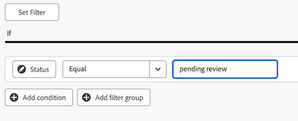

# Generare un rapporto KPI in una dashboard dell’area di lavoro

>[!IMPORTANT]
>
>La funzione Dashboard di Canvas è attualmente disponibile solo per gli utenti che partecipano alla fase beta. Alcune parti della caratteristica potrebbero non essere complete o non funzionare come previsto in questa fase. Invia un feedback relativo alla tua esperienza seguendo le istruzioni riportate nella sezione [Provide feedback](/help/quicksilver/product-announcements/betas/canvas-dashboards-beta/canvas-dashboards-beta-information.md#provide-feedback) dell&#39;articolo di panoramica della versione beta di Canvas Dashboards. 
>Se hai un feedback su un possibile bug o problema tecnico, invia un ticket al supporto Workfront. Per ulteriori informazioni, consulta [Contatta l&#39;Assistenza clienti](/help/quicksilver/workfront-basics/tips-tricks-and-troubleshooting/contact-customer-support.md). 
>Questa versione beta non è disponibile sui seguenti provider cloud:
>
>* Porta la tua chiave per Amazon Web Services
>* Azure
>* Piattaforma Google Cloud

Puoi generare e aggiungere un rapporto KPI a un dashboard di Canvas che rappresenti visivamente i dati chiave degli indicatori di prestazioni sotto forma di numero, da utilizzare per visualizzare le prestazioni dei progetti e dei team.

## Requisiti di accesso

+++ Espandi per visualizzare i requisiti di accesso per la funzionalità descritta in questo articolo.

<table style="table-layout:auto"> 
<col> 
</col> 
<col> 
</col> 
<tbody> 
<tr> 
   <td role="rowheader">
Pacchetto Adobe Workfront
</td> 
   <td> 

Qualsiasi 
 
   </td> 
<tr> 
 <tr> 
   <td role="rowheader">
Licenza di Adobe Workfront
</td> 
   <td> 

Standard
 

Piano
 
   </td> 
   </tr> 
  </tr> 
  <tr> 
   <td role="rowheader">
Configurazioni del livello di accesso
</td> 
   <td>
Modificare l’accesso a rapporti, dashboard e calendari

  </td> 
  </tr>  
</tbody> 
</table>

Per ulteriori dettagli sulle informazioni contenute in questa tabella, consulta [Requisiti di accesso nella documentazione Workfront](/help/quicksilver/administration-and-setup/add-users/access-levels-and-object-permissions/access-level-requirements-in-documentation.md).
+++

## Prerequisiti

È necessario creare un dashboard prima di creare un rapporto KPI.

## Generare un rapporto KPI in una dashboard dell’area di lavoro

Sono disponibili molte opzioni di configurazione per la creazione di un rapporto KPI. In questa sezione ti guideremo attraverso il processo generale di creazione di un elemento.

{{step1-to-dashboards}}

1. Nel pannello a sinistra, fai clic su **Dashboard Canvas**.

1. Fai clic su **Nuovo dashboard** nell&#39;angolo superiore destro.

1. Nella casella **Crea dashboard** immettere il **Nome** e la **Descrizione** del dashboard.

1. Fai clic su **Crea**.

1. Nella casella **Aggiungi report** selezionare **Crea report**.

1. A sinistra, seleziona **Indicatore KPI**.

1. Nell&#39;angolo superiore destro, fai clic su **Crea report**.

1. Segui i passaggi riportati di seguito per configurare la sezione **Dettagli**:

   1. Immetti un report **Nome**.
   1. Immettere un rapporto **Descrizione**.

      >[!NOTE]
      >
      >La descrizione verrà utilizzata come didascalia sotto il valore dell&#39;indicatore KPI. Se non si immette una descrizione, verrà generata automaticamente una didascalia in base all&#39;aggregatore e al tipo di aggregazione selezionati nei passaggi seguenti.

1. Seguire i passaggi riportati di seguito per configurare la sezione **Genera indicatore KPI**:

   1. Nel pannello a sinistra, fare clic sull&#39;icona **Genera indicatore KPI** .

   1. Fare clic su **Seleziona campo** e quindi specificare il campo che si desidera aggiungere al report.

   1. Nell&#39;elenco a discesa **Tipo di aggregazione** selezionare la modalità di rollup dei dati per generare l&#39;output dell&#39;indicatore KPI. Le opzioni in questo campo variano a seconda del tipo di campo selezionato nel passaggio precedente.

1. Segui i passaggi riportati di seguito per configurare la sezione **Filtro**:

   1. Nel pannello a sinistra, fai clic sull&#39;icona **Filtro** .

   1. Selezionare **Modifica filtro**.

   1. Fare clic su **Aggiungi condizione** e quindi specificare il campo in base al quale si desidera filtrare e il modificatore che definisce il tipo di condizione che il campo deve soddisfare.

   1. (Facoltativo) Fai clic su **Aggiungi gruppo di filtri** per aggiungere un altro set di criteri di filtro. L&#39;operatore di default tra i set è AND. Fai clic sull’operatore per modificarlo in O.

      Per ulteriori informazioni sui filtri, vedere [Modificare i filtri dei report in un dashboard di area di lavoro](/help/quicksilver/reports-and-dashboards/canvas-dashboards/manage-reports/edit-report-filters.md).

1. Seguire i passaggi riportati di seguito per configurare la sezione **Impostazioni colonna di espansione**:

   1. Nel pannello a sinistra, fare clic sull&#39;icona **Colonne espansione** . I campi del grafico vengono visualizzati automaticamente come colonne nella sezione di anteprima a destra.

   1. (Facoltativo) Per aggiornare le configurazioni di colonna esistenti, selezionare la colonna che si desidera aggiornare nella sezione **Colonne correnti**, quindi aggiornare le informazioni desiderate (ad esempio etichetta, stato del collegamento e regole di formattazione).

   1. Fare clic su **Aggiungi colonna** e quindi selezionare il campo da visualizzare come colonna nella tabella. Ripetere questa procedura per ogni colonna da aggiungere.

1. Seguire i passaggi riportati di seguito per configurare la sezione **Impostazioni gruppo di espansione**:

   1. Nel pannello a sinistra, fai clic sull&#39;icona **Impostazioni gruppo** .

   1. Fai clic sul pulsante **Aggiungi raggruppamento** e seleziona il campo da creare come raggruppamento.

1. Fai clic su **Salva** per creare il report e aggiungerlo al dashboard.

## Creare un esempio di report KPI

In questa sezione verranno descritti i passaggi per creare un report KPI che visualizzi le approvazioni di documenti in sospeso.

Per ulteriori informazioni sugli esempi di report KPI, vedere [Creare un dashboard di report per la revisione e le approvazioni](/help/quicksilver/review-and-approve-work/document-reviews-and-approvals/create-review-and-approval-dashboard.md).

{{step1-to-dashboards}}

1. Nel pannello a sinistra, fai clic su **Dashboard Canvas**.

1. Fai clic su **Nuovo dashboard** nell&#39;angolo superiore destro.

1. Nella casella **Crea dashboard** immettere il **Nome** e la **Descrizione** del dashboard.

1. Fai clic su **Crea**.

1. Nella casella **Aggiungi report**, seleziona **Crea report**.

1. A sinistra, seleziona **Indicatore KPI**.

1. Nell&#39;angolo superiore destro, fai clic su **Crea report**.

1. Segui i passaggi riportati di seguito per configurare la sezione **Dettagli**:

   1. Digita *In sospeso* nel campo **Nome**.
   1. Digitare *Approvazioni in sospeso* nel campo **Descrizione**. Viene visualizzata come didascalia sotto il valore dell&#39;indicatore KPI.

1. Segui i passaggi seguenti per configurare la sezione **Genera KPI**:

   1. Nel pannello a sinistra, fai clic sull&#39;icona **Genera KPI** .

   1. Fare clic su **Seleziona campo**.

   1. Individua e seleziona la cartella **Approvazione documento**.

   1. Seleziona **Stato**.

   1. Nel menu a discesa **Tipo di aggregazione**, selezionare **Conteggio**.

1. Segui i passaggi seguenti per configurare la sezione **Filtro**:

   1. Nel pannello a sinistra, fai clic sull&#39;icona **Filtro** .

   1. Selezionare **Modifica filtro**.

   1. Fai clic su **Aggiungi condizione**.

   1. Fai clic sul filtro delle condizioni vuoto, fai clic su **Scegli un campo**, quindi scegli **Stato**.
   1. Lascia l&#39;operatore come **Uguale**, quindi digita _in attesa di revisione_ nella casella di testo.
      
1. Fai clic su **Salva** nell&#39;angolo in alto a destra dello schermo.

## Considerazioni durante la creazione di un rapporto KPI

### Rapporti con dati finanziari

Gli utenti con l’accesso Visualizzazione o Modifica dei dati finanziari nel loro livello di accesso continueranno a visualizzare i dati finanziari nelle visualizzazioni del dashboard di Canvas, anche se l’autorizzazione Visualizza dati finanziari viene rimossa a livello di task o progetto.

* Gli utenti che non dispongono dei diritti relativi ai dati finanziari a livello di accesso non vedranno i dati finanziari nei rapporti.
* Gli utenti che possono vedere i dati finanziari, li vedono solo per i record per i quali dispongono già delle autorizzazioni di visualizzazione (progetti, attività, problemi, ecc.). Non potranno vedere i valori finanziari per i record a cui non possono accedere.
* Per evitare che persone non autorizzate possano accedere a dati finanziari, chi crea i rapporti deve valutare attentamente se includere dati finanziari nelle dashboard e con chi condividere le dashboard stesse.

Si tratta di un limite noto che intendiamo correggere il più rapidamente possibile.

### Utilizzo del selettore di campi

Il menu a discesa **Sezioni** nella sezione **Genera indicatore KPI** è progettato per restringere le scelte in un selettore di campi per facilitare la ricerca di un oggetto durante la creazione di un report di tabella. Per iniziare, selezionare un oggetto entità di base.

* **Tutte le sezioni**: tutti i tipi di oggetto in Workfront Workflow e Workfront Planning.
* **Oggetti Workfront**: oggetti del flusso di lavoro Workfront nativi.
* **Tipi di record di Planning**: tipi di record personalizzati definiti in Workfront Planning.

Una volta selezionato l&#39;oggetto entità di base, l&#39;elenco a discesa **Sezioni** viene aggiornato con le opzioni del tipo di campo applicabili tra cui scegliere.

* **Tutte le sezioni**: campi nativi, campi personalizzati e oggetti correlati.
* **Tutti i campi**: campi nativi e personalizzati (escluse le relazioni).
* **Campi personalizzati**: campi definiti dal cliente in un modulo personalizzato o in un record Planning.
* **Campi Workfront**: solo campi nativi.
* **Relazioni**: record connessi.

### Riferimento a oggetti figlio

Le relazioni disponibili per colonne aggiuntive, opzioni di filtro e attributi di raggruppamento sono in genere limitate agli oggetti più in alto nella gerarchia degli oggetti di Workfront oppure dispongono di una singola selezione sull&#39;oggetto dell&#39;entità di base del report. Sono previste alcune eccezioni, tra cui:

* Progetto > Attività
* Approvazione documento > Fasi approvazione documento
* Fasi approvazione documento > Partecipanti fase approvazione documento

Quando si utilizza una delle relazioni padre-figlio elencate in precedenza, nella tabella verrà visualizzata una riga per ogni record figlio connesso all&#39;oggetto padre.

