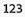

# Creare un rapporto di tabella pivot in un dashboard Canvas

>[!IMPORTANT]
>
>La funzione Dashboard di Canvas è attualmente disponibile solo per gli utenti che partecipano alla fase beta. Alcune parti della caratteristica potrebbero non essere complete o non funzionare come previsto in questa fase. Invia un feedback relativo alla tua esperienza seguendo le istruzioni riportate nella sezione [Provide feedback](/help/quicksilver/product-announcements/betas/canvas-dashboards-beta/canvas-dashboards-beta-information.md#provide-feedback) dell&#39;articolo di panoramica di Canvas Dashboards beta. 
>In caso di feedback su un possibile bug o problema tecnico, invia un ticket al supporto Workfront. Per ulteriori informazioni, consulta [Contattare l’Assistenza clienti](/help/quicksilver/workfront-basics/tips-tricks-and-troubleshooting/contact-customer-support.md). 
>Tieni presente che questa versione beta non è disponibile sui seguenti provider cloud:
>
>* Porta la tua chiave per Amazon Web Services
>* Azure
>* Piattaforma Google Cloud

È possibile aggiungere un rapporto di tabella pivot a un dashboard di Canvas per visualizzare i totali aggregati per i dati, ad esempio somme, conteggi e medie, in formato tabella. Le tabelle pivot sono utili quando si confrontano più valori o conteggi aggregati con più dimensioni.

## Requisiti di accesso

+++ Espandi per visualizzare i requisiti di accesso per la funzionalità descritta in questo articolo.

<table style="table-layout:auto"> 
<col> 
</col> 
<col> 
</col> 
<tbody> 
<tr> 
   <td role="rowheader">
Pacchetto Adobe Workfront
</td> 
   <td> 

Qualsiasi 
 
   </td> 
<tr> 
 <tr> 
   <td role="rowheader">
Licenza di Adobe Workfront
</td> 
   <td> 

Standard
 

Piano
 
   </td> 
   </tr> 
  </tr> 
  <tr> 
   <td role="rowheader">
Configurazioni del livello di accesso
</td> 
   <td>
Modificare l’accesso a rapporti, dashboard e calendari

  </td> 
  </tr>  
</tbody> 
</table>

Per ulteriori dettagli sulle informazioni contenute in questa tabella, consulta [Requisiti di accesso nella documentazione Workfront](/help/quicksilver/administration-and-setup/add-users/access-levels-and-object-permissions/access-level-requirements-in-documentation.md).
+++

## Prerequisiti

È necessario creare un dashboard prima di creare un rapporto di tabella pivot. Per ulteriori informazioni, vedere [Creare un dashboard Canvas](/help/quicksilver/reports-and-dashboards/canvas-dashboards/create-dashboards/create-dashboards.md).

## Creare un rapporto di tabella pivot in un dashboard Canvas

Sono disponibili molte opzioni di configurazione per la creazione di un rapporto di tabella pivot. In questa sezione ti guideremo attraverso il processo generale di creazione di un elemento.

{{step1-to-dashboards}}

1. Nel pannello a sinistra, fai clic su **Dashboard canvas**, quindi fai clic sul nome del dashboard a cui aggiungere il report.

1. Fai clic su **Aggiungi report** nell&#39;angolo superiore destro della pagina.

1. Nella casella **Aggiungi report** selezionare **Crea report**.

1. Sul lato sinistro, selezionare **Tabella pivot**.

1. Nell&#39;angolo superiore destro fare clic su **Crea report**.

1. (Facoltativo) Segui i passaggi seguenti per configurare la sezione **Dettagli**:

   1. Scegliere l&#39;**entità principale** per il report.

      >[!NOTE]
      >
      > L’entità principale imposta l’oggetto da cui provengono i campi. Una volta selezionato, ogni selettore di campo utilizzato successivamente in questo report inizia da tale oggetto, in modo da poter passare direttamente al campo desiderato.

   1. Immetti un rapporto **Nome**.

   1. Immetti un rapporto **Descrizione**.

   1. (Facoltativo) Nel campo **Esegui il report con i diritti di accesso di**, inizia a digitare il nome dell&#39;utente di cui desideri utilizzare le autorizzazioni, quindi seleziona l&#39;utente quando viene visualizzato nell&#39;elenco. Quando configuri un report per l’esecuzione come altro utente, tutti gli utenti del dashboard visualizzano gli stessi dati, indipendentemente dal proprio livello di accesso. Se non selezioni un utente, ogni visualizzatore visualizza i dati in base alle proprie autorizzazioni.

      >[!IMPORTANT]
      >
      >Se l’utente selezionato viene disattivato o perde l’accesso alle aree di lavoro o ai tipi di record rilevanti, il rapporto potrebbe visualizzare dati incompleti o non essere riprodotto correttamente.

1. Segui i passaggi seguenti per configurare la sezione **Metriche**:

   1. Nel pannello a sinistra, fai clic sull&#39;icona **Mostra metriche** .

   1. Fare clic su **Aggiungi metrica** e quindi selezionare il campo desiderato. Il campo viene visualizzato come colonna nella sezione di anteprima a destra.

      >[!NOTE]
      >
      > Una metrica (detta anche misura) è un campo numerico che si desidera sommare o sommare. Ad esempio, è possibile sommare tutti i costi o contare il numero di attività.

   1. Immetti un&#39;etichetta **Colonna**.

   1. Nell&#39;elenco a discesa **Tipo di aggregazione** selezionare la modalità di rollup dei dati per il campo. Le opzioni in questo campo variano a seconda del tipo di campo selezionato.

   1. Ripeti i due passaggi precedenti per ogni metrica da aggiungere.

1. Segui i passaggi seguenti per configurare la sezione **Segmenti**:

   1. Nel pannello a sinistra, fai clic sull&#39;icona del gruppo di espansione **Segmenti** .

   1. Fare clic su **Aggiungi segmento** e quindi selezionare il segmento desiderato. Il campo viene visualizzato come colonna nella sezione di anteprima a destra.

      >[!NOTE]
      >
      >Un segmento è la categoria utilizzata per raggruppare i dati, ad esempio per raggruppare le attività in base allo stato o al proprietario. È così che le metriche vengono ordinate e totalizzate.

   1. Ripeti i due passaggi precedenti per aggiungere fino a 2 segmenti.

1. Segui i passaggi seguenti per configurare la sezione **Filtro**:

   1. Nel pannello a sinistra, fai clic sull&#39;icona **Filtro** .

   1. Selezionare **Modifica filtro**.

   1. Fare clic su **Aggiungi condizione** e quindi specificare il campo in base al quale si desidera filtrare e il modificatore che definisce il tipo di condizione che il campo deve soddisfare.

   1. (Facoltativo) Fai clic su **Aggiungi gruppo di filtri** per aggiungere un altro set di criteri di filtro. L&#39;operatore di default tra i set è AND. Fai clic sull’operatore per modificarlo in O.

1. Segui i passaggi seguenti per configurare la sezione **Impostazioni colonna di espansione**:

   1. Nel pannello a sinistra, fai clic sull&#39;icona **Colonne espansione** .

   1. Fare clic su **Aggiungi colonna** e quindi selezionare il campo che si desidera visualizzare come colonna nella tabella di espansione. Ripetere questo processo per ogni colonna che si desidera aggiungere.

1. Fai clic su **Salva** per creare il report e aggiungerlo al dashboard.

## Creare un esempio di rapporto di tabella pivot

In questa sezione verranno descritti i passaggi necessari per creare un rapporto di tabella pivot che riepiloghi i dati di completamento dell&#39;attività.

{{step1-to-dashboards}}

1. Nel pannello a sinistra, fai clic su **Dashboard canvas**, quindi fai clic sul nome del dashboard a cui aggiungere il report.

1. Fai clic su **Aggiungi report** nell&#39;angolo superiore destro della pagina.

1. Nella casella **Aggiungi report** selezionare **Crea report**.

1. Sul lato sinistro, selezionare **Tabella pivot**.

1. Nell&#39;angolo superiore destro fare clic su **Crea report**.

1. Segui i passaggi seguenti per configurare la sezione **Dettagli**:

   1. Scegli **Attività** come **Entità principale**.
   1. Digitare *Ore pianificate rispetto alle ore effettive per portfolio e progetto* nel campo **Nome**.
   1. Digitare una descrizione nel campo **Descrizione**.

1. Segui i passaggi seguenti per configurare la sezione **Metriche**:

   1. Nel pannello a sinistra, fai clic sull&#39;icona **Mostra metriche** .
   1. Fai clic su **Aggiungi metrica**, quindi seleziona **Nome**. Digitare *Numero attività* nel campo **Etichetta colonna**. Nel menu a discesa **Tipo di aggregazione**, selezionare **Conteggio**.
   1. Fai clic su **Aggiungi metrica**, quindi seleziona **Ore effettive**. Digitare *Ore effettive* nel campo **Etichetta colonna**. Nel menu a discesa **Tipo di aggregazione**, selezionare **Somma**.
   1. Fai clic su **Aggiungi metrica**, quindi seleziona **Ore pianificate**. Digitare *Totale ore pianificate* nel campo **Etichetta colonna**. Nel menu a discesa **Tipo di aggregazione**, selezionare **Somma**.

1. Segui i passaggi seguenti per configurare la sezione **Segmenti**:

   1. Nel pannello a sinistra, fai clic sull&#39;icona del gruppo di espansione **Segmenti** .
   1. Fai clic su **Aggiungi segmento**, quindi seleziona **Progetto** > **Portfolio** > **Nome**.
   1. Fai clic su **Aggiungi segmento**, quindi seleziona **Progetto** > **Nome**.

1. Segui i passaggi seguenti per configurare la sezione **Filtro**:

   1. Nel pannello a sinistra, fai clic sull&#39;icona **Filtro** .
   1. Seleziona **Modifica filtro**, quindi **Aggiungi condizione**.
   1. Fai clic sul filtro delle condizioni vuoto, quindi fai clic su **Scegli un campo**.
   1. Seleziona **Stato**.
   1. Cambia l&#39;operatore in **Equal**, quindi scegli *in corso*.

1. Segui i passaggi seguenti per configurare la sezione **Impostazioni colonna di espansione**:

   1. Nel pannello a sinistra, fai clic sull&#39;icona **Colonne espansione** .
   1. Fai clic su **Aggiungi colonna**, quindi seleziona **Nome**.
   1. Fai clic su **Aggiungi colonna**, quindi seleziona **Assegnato a** > **Nome**.
   1. Fai clic su **Aggiungi colonna**, quindi seleziona **Data di completamento pianificata**.

1. Fai clic su **Salva** nell&#39;angolo in alto a destra dello schermo.

## Considerazioni durante la creazione di un rapporto di tabella pivot

### Rapporti con dati finanziari

Gli utenti con l’accesso Visualizzazione o Modifica dei dati finanziari nel loro livello di accesso continueranno a visualizzare i dati finanziari nelle visualizzazioni del dashboard di Canvas, anche se l’autorizzazione Visualizza dati finanziari viene rimossa a livello di task o progetto.

* Gli utenti che non dispongono dei diritti relativi ai dati finanziari a livello di accesso non vedranno i dati finanziari nei rapporti.
* Gli utenti che possono vedere i dati finanziari, li vedono solo per i record per i quali dispongono già delle autorizzazioni di visualizzazione (progetti, attività, problemi, ecc.). Non potranno vedere i valori finanziari per i record a cui non possono accedere.
* Per evitare che persone non autorizzate possano accedere a dati finanziari, chi crea i rapporti deve valutare attentamente se includere dati finanziari nelle dashboard e con chi condividere le dashboard stesse.

Si tratta di un limite noto e prevediamo di affrontarlo in futuro.

### Utilizzo del selettore di campo

L&#39;elenco a discesa **Sezioni** nella sezione **Genera tabella pivot** è progettato per limitare le scelte in un selettore di campi in modo da semplificare la ricerca di un oggetto durante la creazione di un report di tabella pivot. Per iniziare, selezionate un oggetto entità di base.

* **Tutte le sezioni**: tutti i tipi di oggetto in Workfront e Workfront Planning.
* **Oggetti Workfront**: oggetti Workfront nativi.
* **Tipi di record di pianificazione**: tipi di record personalizzati definiti in Workfront Planning.

Una volta selezionato l&#39;oggetto entità di base, l&#39;elenco a discesa **Sezioni** viene aggiornato con le opzioni del tipo di campo applicabili tra cui scegliere.

* **Tutte le sezioni**: campi nativi, campi personalizzati e oggetti correlati.
* **Tutti i campi**: campi nativi e personalizzati (escluse le relazioni).
* **Campi personalizzati**: campi definiti dal cliente in un modulo personalizzato o in un record Planning.
* **Campi Workfront**: solo campi nativi.
* **Relazioni**: record connessi.

### Riferimento a oggetti correlati

Limitiamo l’accesso alla scelta di oggetti secondari come segmenti di una tabella pivot. Le opzioni del segmento possono essere attributi del record stesso o altri record correlati che non rappresentano una relazione 1:many o molti:many.

Inoltre, limitiamo l’accesso al riferimento a qualsiasi attributo principale o secondario come metrica per ridurre il potenziale di doppio conteggio o di doppio riepilogo dei valori, con conseguente rappresentazione errata dei dati effettivi.
