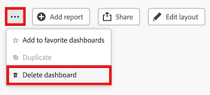

# Eliminare una dashboard dell’area di lavoro

>[!IMPORTANT]
>
>La funzione Dashboard di Canvas è attualmente disponibile solo per gli utenti che partecipano alla fase beta. Alcune parti della caratteristica potrebbero non essere complete o non funzionare come previsto in questa fase. Invia un feedback relativo alla tua esperienza seguendo le istruzioni riportate nella sezione [Provide feedback](/help/quicksilver/product-announcements/betas/canvas-dashboards-beta/canvas-dashboards-beta-information.md#provide-feedback) dell&#39;articolo di panoramica di Canvas Dashboards beta. 
>In caso di feedback su un possibile bug o problema tecnico, invia un ticket al supporto Workfront. Per ulteriori informazioni, consulta [Contattare l’Assistenza clienti](/help/quicksilver/workfront-basics/tips-tricks-and-troubleshooting/contact-customer-support.md). 
>Tieni presente che questa versione beta non è disponibile sui seguenti provider cloud:
>
>* Porta la tua chiave per Amazon Web Services
>* Azure
>* Piattaforma Google Cloud

Una volta che non è più necessario un dashboard Canvas, puoi rimuoverlo da Adobe Workfront.

## Requisiti di accesso

+++ Espandi per visualizzare i requisiti di accesso per la funzionalità descritta in questo articolo.

<table style="table-layout:auto"> 
<col> 
</col> 
<col> 
</col> 
<tbody> 
<tr> 
   <td role="rowheader">
Pacchetto Adobe Workfront
</td> 
   <td> 

Qualsiasi 
 
   </td> 
<tr> 
 <tr> 
   <td role="rowheader">
Licenza di Adobe Workfront
</td> 
   <td> 

Standard 
 

Piano
 
   </td> 
   </tr> 
  </tr> 
  <tr> 
   <td role="rowheader">
Configurazioni del livello di accesso
</td> 
   <td>
Modificare l’accesso a rapporti, dashboard e calendari

  </td> 
  </tr>  
    </tr>  
        <tr> 
   <td role="rowheader">
Autorizzazioni sugli oggetti
</td> 
   <td>
Gestire le autorizzazioni per il dashboard

  </td> 
  </tr>
</tbody> 
</table>

Per ulteriori dettagli sulle informazioni contenute in questa tabella, consulta [Requisiti di accesso nella documentazione Workfront](/help/quicksilver/administration-and-setup/add-users/access-levels-and-object-permissions/access-level-requirements-in-documentation.md).
+++

## Prerequisiti

È necessario creare un dashboard prima di eliminarlo.

Per ulteriori informazioni, vedere [Creare un dashboard Canvas](/help/quicksilver/reports-and-dashboards/canvas-dashboards/create-dashboards/create-dashboards.md).

## Eliminare una dashboard

>[!WARNING]
>
> Una volta eliminato un dashboard, non è più possibile recuperarlo insieme a tutti i relativi rapporti e/o visualizzazioni personalizzati. 
> Se elimini una dashboard contenente un report classico, il report classico non verrà eliminato.

{{step1-to-dashboards}}

1. Nel pannello a sinistra, fai clic su **Dashboard Canvas**.

1. Nella pagina **Dashboard canvas** selezionare il dashboard che si desidera eliminare.

1. Nell&#39;angolo superiore destro, seleziona l&#39;icona **Altro** , quindi seleziona **Elimina dashboard**.
   

1. Nella finestra di dialogo **Elimina dashboard** selezionare la casella di controllo **Confermo di voler eliminare questo dashboard**.

1. Fai clic su **Elimina**.
