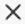

# Filtrare un dashboard di Canvas

>[!IMPORTANT]
>
>La funzione Dashboard di Canvas è attualmente disponibile solo per gli utenti che partecipano alla fase beta. Alcune parti della caratteristica potrebbero non essere complete o non funzionare come previsto in questa fase. Invia un feedback relativo alla tua esperienza seguendo le istruzioni riportate nella sezione [Provide feedback](/help/quicksilver/product-announcements/betas/canvas-dashboards-beta/canvas-dashboards-beta-information.md#provide-feedback) dell&#39;articolo di panoramica della versione beta di Canvas Dashboards. 
>&#x200B;>In caso di feedback su un possibile bug o problema tecnico, invia un ticket al supporto Workfront. Per ulteriori informazioni, vedere [Contattare l&#39;Assistenza clienti](/help/quicksilver/workfront-basics/tips-tricks-and-troubleshooting/contact-customer-support.md). 
>&#x200B;>Tieni presente che questa versione beta non è disponibile sui seguenti provider cloud:
>
>* Porta la tua chiave per Amazon Web Services
>* Azure
>* Piattaforma Google Cloud

Puoi applicare un filtro a un dashboard di Canvas contenente prompt. Un prompt funziona da modificatore di filtro che applica criteri di filtro aggiuntivi in modo da poter limitare ulteriormente i risultati. Questi prompt possono essere modificati ogni volta che si applica il filtro, consentendo di regolare i risultati visualizzati senza dover modificare i criteri di filtro principali del dashboard o di ogni singolo rapporto.

## Requisiti di accesso

+++ Espandere per visualizzare i requisiti di accesso. 

<table style="table-layout:auto"> 
<col> 
</col> 
<col> 
</col> 
<tbody> 
<tr> 
   <td role="rowheader">
piano Adobe Workfront
</td> 
   <td> 

Qualsiasi 
 
   </td> 
<tr> 
 <tr> 
   <td role="rowheader">
Licenza Adobe Workfront
</td> 
   <td> 

Corrente: Piano 
 

Nuovo: Standard
 
   </td> 
   </tr> 
  </tr> 
  <tr> 
   <td role="rowheader">
Configurazioni del livello di accesso
</td> 
   <td>
Modificare l’accesso a rapporti, dashboard e calendari

  </td> 
  </tr> 
    </tr>  
        <tr> 
   <td role="rowheader">
Autorizzazioni oggetto
</td> 
   <td>
Gestire le autorizzazioni per il dashboard

  </td> 
  </tr> 
</tbody> 
</table>

Per ulteriori dettagli sulle informazioni contenute in questa tabella, vedere [Requisiti di accesso nella documentazione di Workfront](/help/quicksilver/administration-and-setup/add-users/access-levels-and-object-permissions/access-level-requirements-in-documentation.md).
+++

## Prerequisiti

È necessario creare un dashboard prima di filtrarlo.

Per ulteriori informazioni, vedere [Creare un dashboard Canvas](/help/quicksilver/reports-and-dashboards/canvas-dashboards/create-dashboards/create-dashboards.md).

## Filtrare un dashboard

Per filtrare un dashboard, effettua le seguenti operazioni nell’ordine elencato:

* [Parte 1: Creare un filtro del dashboard](#part-1-create-a-dashboard-filter)
* [Parte 2: creazione di un prompt del dashboard](#part-2-define-a-dashboard-prompt)
* [Parte 3: Applicare un prompt del dashboard](#step-3-apply-a-dashboard-prompt)

>[!NOTE]
>
>Il filtro del dashboard verrà applicato a tutti i rapporti in cui i filtri a livello di dashboard non sono disabilitati.  È possibile escludere singoli report dall&#39;applicazione di filtri a livello di dashboard espandendo il menu delle azioni per ogni report e selezionando l&#39;opzione **Disattiva filtri**.

### Parte 1: Creare un filtro del dashboard

Con un filtro dashboard, puoi applicare un filtro comune a tutti i rapporti disponibili in un dashboard senza dover modificare i filtri per ogni singolo rapporto.

>[!NOTE]
>
>Questi filtri possono essere configurati solo da un utente con accesso Gestisci al dashboard.

{{step1-to-dashboards}}

1. Nel pannello a sinistra, fai clic su **Dashboard Canvas**.

1. Nella pagina **Dashboard area di lavoro** selezionare il dashboard a cui si desidera applicare un filtro.

1. Nell&#39;angolo superiore sinistro della pagina dei dettagli del dashboard, fare clic su **Filtri**. Viene visualizzato il pannello laterale dei filtri.

1. Selezionare **Modifica filtri**. Viene visualizzata la finestra di dialogo **Dashboard filters**.

1. (Facoltativo) Per aggiungere una regola, effettua le seguenti operazioni:

   1. Seleziona l&#39;icona **Modifica** a destra della casella della regola.

      

   1. Fare clic su **Aggiungi condizione** e quindi aggiungere le seguenti informazioni:
      * Seleziona un campo in base al quale filtrare.
      * Seleziona un’opzione (o un modificatore di filtro) per definire il tipo di condizione che il campo deve soddisfare.

   1. (Facoltativo) Fai clic su **Aggiungi gruppo di filtri** per aggiungere un altro set di criteri di filtro. L&#39;operatore di default tra i set è AND. Fai clic sull’operatore per modificarlo in O.

1. Procedi a [Parte 2: crea un prompt del dashboard](#part-2-define-a-dashboard-prompt).

### Parte 2: definire un prompt del dashboard

Un prompt del dashboard consente agli utenti di applicare filtri personalizzati aggiuntivi ai rapporti disponibili nel dashboard.

>[!NOTE]
>
>Le opzioni del prompt del dashboard possono essere configurate solo da un utente con accesso Gestisci al dashboard.

1. Per aggiungere una richiesta, effettua le seguenti operazioni:

   1. Seleziona **Aggiungi prompt**. I nuovi campi vengono visualizzati sul lato destro dello schermo.

   1. Immettere un&#39;etichetta nel campo **Personalizza etichetta**.

   1. Selezionare il campo su cui si desidera basare il prompt digitando il nome del campo e selezionandolo quando viene visualizzato nell&#39;elenco. 

1. Per aggiungere un prompt personalizzato, effettua le seguenti operazioni:

   1. Selezionare **Aggiungi prompt personalizzato**. I nuovi campi vengono visualizzati sul lato destro dello schermo.

   1. (Facoltativo) Immetti una nuova etichetta nel campo **Personalizza etichetta**. Per impostazione predefinita, l&#39;etichetta *Nuovo prompt personalizzato* è assegnata.

   1. Fare clic su **Aggiungi nuova opzione**.

   1. Immettere il nome del prompt nel campo **Valore opzione**.

   1. Fare clic su **Aggiungi condizione** e quindi specificare il campo in base al quale si desidera filtrare e il modificatore che definisce il tipo di condizione che il campo deve soddisfare.

      >[!NOTE]
      >
      >La condizione di un prompt personalizzato può essere modificata solo utilizzando la modalità testo. Questo consente di applicare più condizioni in un singolo campo.

   1. (Facoltativo) Fai clic su **Aggiungi gruppo di filtri** per aggiungere un altro set di criteri di filtro. L&#39;operatore di default tra i set è AND. Fai clic sull’operatore per modificarlo in O.

1. Fai clic su **Salva** per applicare il filtro al dashboard.

1. Procedi a [Parte 3: Applica un prompt del dashboard](#step-3-apply-a-dashboard-prompt).

### Passaggio 3: applicare un prompt del dashboard

Tutti gli utenti con accesso a un dashboard possono applicare un prompt del dashboard a un dashboard di Canvas una volta creati il filtro e i prompt.

{{step1-to-dashboards}}

1. Nel pannello a sinistra, fai clic su **Dashboard Canvas**.

1. Nella pagina **Dashboard area di lavoro** selezionare il dashboard a cui si desidera applicare il prompt.

1. Nell&#39;angolo superiore sinistro della pagina dei dettagli del dashboard, fare clic su **Filtri**. Viene visualizzato il pannello laterale dei filtri.

1. Nella sezione **Mostra record in cui...** scegliere una condizione per uno o tutti i prompt visualizzati. Viene applicato il prompt e nell&#39;angolo del widget del report viene visualizzato un tag **Filtri dashboard applicati**.
   

1. Fai clic sull&#39;icona **Chiudi**  nell&#39;angolo superiore destro per nascondere il pannello.
