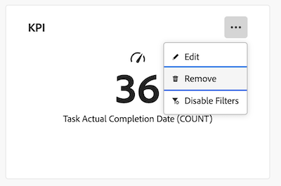

# Eliminare un rapporto in un dashboard Canvas

>[!IMPORTANT]
>
>La funzione Dashboard di Canvas è attualmente disponibile solo per gli utenti che partecipano alla fase beta. Alcune parti della caratteristica potrebbero non essere complete o non funzionare come previsto in questa fase. Invia un feedback relativo alla tua esperienza seguendo le istruzioni riportate nella sezione [Provide feedback](/help/quicksilver/product-announcements/betas/canvas-dashboards-beta/canvas-dashboards-beta-information.md#provide-feedback) dell&#39;articolo di panoramica della versione beta di Canvas Dashboards. 
>>In caso di feedback su un possibile bug o problema tecnico, invia un ticket al supporto Workfront. Per ulteriori informazioni, vedere [Contattare l&#39;Assistenza clienti](/help/quicksilver/workfront-basics/tips-tricks-and-troubleshooting/contact-customer-support.md). 
>>Tieni presente che questa versione beta non è disponibile sui seguenti provider cloud:
>
>* Porta la tua chiave per Amazon Web Services
>* Azure
>* Piattaforma Google Cloud

Dopo aver creato un dashboard di Canvas e aver aggiunto i relativi rapporti, puoi eliminare i rapporti meno recenti che non sono più applicabili per quel dashboard specifico.

L’eliminazione di un rapporto è permanente. Se devi aggiungere nuovamente un rapporto dopo che è stato eliminato, dovrai ricrearlo.

## Requisiti di accesso

+++ Espandere per visualizzare i requisiti di accesso. 

<table style="table-layout:auto"> 
<col> 
</col> 
<col> 
</col> 
<tbody> 
<tr> 
   <td role="rowheader">
piano Adobe Workfront
</td> 
   <td> 

Qualsiasi 
 
   </td> 
<tr> 
 <tr> 
   <td role="rowheader">
Licenza Adobe Workfront
</td> 
   <td> 

Corrente: Piano 
 

Nuovo: Standard
 
   </td> 
   </tr> 
  </tr> 
  <tr> 
   <td role="rowheader">
Configurazioni del livello di accesso
</td> 
   <td>
Modificare l’accesso a rapporti, dashboard e calendari

  </td> 
  </tr>  
      <tr> 
   <td role="rowheader">
Autorizzazioni oggetto
</td> 
   <td>
Gestire le autorizzazioni per il dashboard

  </td> 
  </tr>
</tbody> 
</table>

Per ulteriori dettagli sulle informazioni contenute in questa tabella, vedere [Requisiti di accesso nella documentazione di Workfront](/help/quicksilver/administration-and-setup/add-users/access-levels-and-object-permissions/access-level-requirements-in-documentation.md).
+++

## Prerequisiti

È necessario applicare un report a un dashboard prima di eliminarlo.

Per ulteriori informazioni, vedere [Creare un dashboard Canvas](/help/quicksilver/reports-and-dashboards/canvas-dashboards/create-dashboards/create-dashboards.md).

## Eliminare un rapporto

>[!WARNING]
>
>Una volta eliminato, il report non può essere recuperato.

{{step1-to-dashboards}}

1. Nel pannello a sinistra, fai clic su **Dashboard Canvas**.

1. Nella pagina **Dashboard area di lavoro** selezionare il dashboard contenente il report che si desidera eliminare.

1. Nella pagina dei dettagli del dashboard, fai clic sull&#39;icona **Altro**  nell&#39;angolo superiore destro del widget del report che desideri eliminare.

1. Selezionare **Rimuovi**.
   

1. Nella finestra di dialogo **Elimina report** fare clic su **Elimina**.
