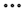

# Copiare e spostare i rapporti nei dashboard di Canvas

{{highlighted-preview}}

>[!IMPORTANT]
>
>La funzione Dashboard di Canvas è attualmente disponibile solo per gli utenti che partecipano alla fase beta. Alcune parti della caratteristica potrebbero non essere complete o non funzionare come previsto in questa fase. Invia un feedback relativo alla tua esperienza seguendo le istruzioni riportate nella sezione [Provide feedback](/help/quicksilver/product-announcements/betas/canvas-dashboards-beta/canvas-dashboards-beta-information.md#provide-feedback) dell&#39;articolo di panoramica di Canvas Dashboards beta. 
>In caso di feedback su un possibile bug o problema tecnico, invia un ticket al supporto Workfront. Per ulteriori informazioni, consulta [Contattare l’Assistenza clienti](/help/quicksilver/workfront-basics/tips-tricks-and-troubleshooting/contact-customer-support.md). 
>Tieni presente che questa versione beta non è disponibile sui seguenti provider cloud:
>
>* Porta la tua chiave per Amazon Web Services
>* Azure
>* Piattaforma Google Cloud

È possibile duplicare un rapporto di indicatore KPI, tabella o grafico in un dashboard di Canvas dopo averlo creato. Una volta duplicato, puoi modificare il rapporto in base alle esigenze prima di salvarlo.

## Requisiti di accesso

+++ Espandi per visualizzare i requisiti di accesso per la funzionalità descritta in questo articolo. 

<table style="table-layout:auto"> 
<col> 
</col> 
<col> 
</col> 
<tbody> 
<tr> 
   <td role="rowheader">
Pacchetto Adobe Workfront
</td> 
   <td> 

Qualsiasi 
 
   </td> 
<tr> 
 <tr> 
   <td role="rowheader">
Licenza di Adobe Workfront
</td> 
   <td> 

Standard 
 

Piano
 
   </td> 
   </tr> 
  </tr> 
  <tr> 
   <td role="rowheader">
Configurazioni del livello di accesso
</td> 
   <td>
Modificare l’accesso a rapporti, dashboard e calendari

  </td> 
  </tr>  
      <tr> 
   <td role="rowheader">
Autorizzazioni sugli oggetti
</td> 
   <td>
Gestire le autorizzazioni per il dashboard

  </td> 
  </tr>
</tbody> 
</table>

Per ulteriori dettagli sulle informazioni contenute in questa tabella, consulta [Requisiti di accesso nella documentazione Workfront](/help/quicksilver/administration-and-setup/add-users/access-levels-and-object-permissions/access-level-requirements-in-documentation.md).
+++

## Prerequisiti

Per poter essere duplicato, è necessario aggiungere un report a un dashboard.

Per ulteriori informazioni, vedere [Creare un dashboard Canvas](/help/quicksilver/reports-and-dashboards/canvas-dashboards/create-dashboards/create-dashboards.md).

## Duplicare un rapporto in produzione

{{step1-to-dashboards}}

1. Nel pannello a sinistra, fai clic su **Dashboard Canvas**.
1. Nella pagina **Dashboard Canvas**, fai clic sull&#39;icona **Altro**  nell&#39;angolo superiore destro del report da duplicare, quindi seleziona **Duplica**.

   

1. (Facoltativo) Nella casella **Configura** visualizzata, immettere un nuovo report **Nome** nella scheda **Dettagli**.

1. (Facoltativo) Apporta le regolazioni necessarie alle configurazioni utilizzando le schede a sinistra.

   >[!NOTE]
   >
   >Queste schede variano a seconda che sia stato duplicato un KPI, una tabella o un rapporto grafico.  Per ulteriori informazioni, vedere [Generare un report KPI in un dashboard Canvas](/help/quicksilver/reports-and-dashboards/canvas-dashboards/add-reports/build-kpi-report.md), [Creare un report grafico in un dashboard Canvas](/help/quicksilver/reports-and-dashboards/canvas-dashboards/add-reports/build-chart-report.md) e [Creare un report tabella in un dashboard Canvas](/help/quicksilver/reports-and-dashboards/canvas-dashboards/add-reports/build-table-report.md).

1. Fai clic su **Salva**. Il report duplicato viene visualizzato nel dashboard.

## Copiare o spostare un rapporto in Anteprima

È possibile copiare un report nel dashboard corrente, copiarlo in un altro dashboard o spostarlo in un altro dashboard. La copia crea un duplicato del rapporto nella destinazione; lo spostamento lo riposiziona dal dashboard corrente.

>[!IMPORTANT]
>
>* Per copiare un rapporto, è necessario disporre delle autorizzazioni di gestione per il dashboard di destinazione.
>* Per spostare un rapporto, devi gestire l’accesso ai dashboard di origine e di destinazione.
>* Se nel report è configurato l&#39;utente Esegui come e non si è amministratori di sistema o utente Esegui come, è comunque possibile copiarlo o spostarlo, ma l&#39;utente Esegui come viene rimosso dal report risultante.

Per copiare o spostare un report:

{{step1-to-dashboards}}

1. Nel pannello a sinistra, fai clic su **Dashboard Canvas**.
1. Apri il dashboard contenente il rapporto.
1. Fai clic sull&#39;icona **Altro**  nell&#39;angolo superiore destro del report, quindi seleziona **Copia report**.

   

1. Nella finestra di dialogo **Copia report** scegliere una delle opzioni seguenti:

   <table>
   <tr>
   <td><strong>Copia</strong></td>
   <td>Fai clic su <strong>Copia</strong> nella parte inferiore della schermata per copiare il report. Il dashboard corrente è selezionato per impostazione predefinita. Per copiare un rapporto è necessario gestire l’accesso alla dashboard.</td>
   </tr>
   <tr>
   <td><strong>Copia e sposta</strong></td>
   <td>Seleziona un dashboard di destinazione diverso per copiare il rapporto e spostarlo in un nuovo dashboard. Il report originale rimane nel dashboard corrente.Per copiare e spostare un rapporto è necessario disporre dell’accesso in gestione al dashboard di destinazione. </td>
   </tr>
   <tr>
   <td><strong>Sposta</strong></td>
   <td>Seleziona un dashboard di destinazione diverso in cui spostare il rapporto. In questo modo il report viene riposizionato nel dashboard di destinazione e rimosso da quello corrente. Per spostare un rapporto è necessario disporre dell’accesso di gestione ai dashboard di origine e di destinazione.</td>
   </tr>
   </table>

   >[!NOTE]
   >
   >Se nel report è configurato l&#39;utente Esegui come e non si è un amministratore di sistema o l&#39;utente impostato come utente Esegui come, è comunque possibile copiare o spostare il report. L&#39;opzione Esegui come utente viene rimossa dal report risultante.

1. Fai clic su **Salva**.

   

