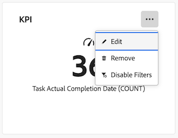

# Modificare un rapporto in una dashboard dell’area di lavoro

>[!IMPORTANT]
>
>La funzione Dashboard Canvas è attualmente disponibile solo per gli utenti che partecipano alla fase beta. Durante questa fase, alcune parti della caratteristica potrebbero non essere complete o funzionare come previsto. Inviate un feedback relativo alla vostra esperienza seguendo le istruzioni nella sezione [Fornisci feedback](/help/quicksilver/product-announcements/betas/canvas-dashboards-beta/canvas-dashboards-beta-information.md#provide-feedback) nell&#39;articolo Panoramica della versione beta dei dashboard di Canvas. 
>In caso di feedback su un possibile bug o problema tecnico, invia un ticket al supporto Workfront. Per ulteriori informazioni, vedere [Contattare l&#39;Assistenza clienti](/help/quicksilver/workfront-basics/tips-tricks-and-troubleshooting/contact-customer-support.md). 
>Tieni presente che questa versione beta non è disponibile sui seguenti provider cloud:
>
>* Porta la tua chiave per Amazon Web Services
>* Azure
>* Piattaforma Google Cloud

Dopo aver aggiunto i rapporti a un dashboard di Canvas, puoi modificare le informazioni del rapporto per modificare i dati visualizzati nel dashboard.

Eventuali modifiche apportate a un report avranno effetto su tutti gli utenti che hanno accesso al dashboard che lo contiene.

+++ Espandi per visualizzare i requisiti di accesso per la funzionalità descritta in questo articolo.

<table style="table-layout:auto"> 
<col> 
</col> 
<col> 
</col> 
<tbody> 
<tr> 
   <td role="rowheader">
Pacchetto Adobe Workfront
</td> 
   <td> 

Qualsiasi 
 
   </td> 
<tr> 
 <tr> 
   <td role="rowheader">
Licenza di Adobe Workfront
</td> 
   <td> 

Standard
 

Piano
 
   </td> 
   </tr> 
  </tr> 
  <tr> 
   <td role="rowheader">
Configurazioni del livello di accesso
</td> 
   <td>
Modificare l’accesso a rapporti, dashboard e calendari

  </td> 
  </tr>  
        <tr> 
   <td role="rowheader">
Autorizzazioni sugli oggetti
</td> 
   <td>
Gestire le autorizzazioni per il dashboard

  </td> 
  </tr>
</tbody> 
</table>

Per ulteriori dettagli sulle informazioni contenute in questa tabella, consulta [Requisiti di accesso nella documentazione Workfront](/help/quicksilver/administration-and-setup/add-users/access-levels-and-object-permissions/access-level-requirements-in-documentation.md).
+++

## Prerequisiti

Prima di poter modificare un report, è necessario aggiungerlo a un dashboard.

Per ulteriori informazioni, vedere [Creare un dashboard area di lavoro](/help/quicksilver/reports-and-dashboards/canvas-dashboards/create-dashboards/create-dashboards.md).

## Modificare un rapporto

{{step1-to-dashboards}}

1. Nel pannello a sinistra, fai clic su **Dashboard Canvas**.

1. Nella pagina **Dashboard Canvas**, fai clic sull&#39;icona **Altro**  nell&#39;angolo superiore destro del report che desideri modificare, quindi seleziona **Modifica**.

   

1. Nella finestra di dialogo **Configura**, modifica le informazioni nelle sezioni elencate a sinistra. Queste sezioni variano a seconda del tipo di rapporto che stai modificando.

1. (Facoltativo) Se si modifica un rapporto KPI, modificare le informazioni come necessario nelle sezioni seguenti:

   * **Dettagli**
   * **Genera indicatore KPI**
   * **Filtri**
   * **Impostazioni colonna di espansione**
   * **Impostazioni gruppo di espansione**

   Per ulteriori informazioni su queste sezioni, vedere [Generare un report KPI](/help/quicksilver/reports-and-dashboards/canvas-dashboards/add-reports/build-kpi-report.md).

1. (Facoltativo) Se si modifica un rapporto Grafico, modificare le informazioni come necessario nelle sezioni seguenti:

   * **Dettagli**
   * **Genera grafico**
   * **Filtri**
   * **Impostazioni colonna espansione**
   * **Impostazioni gruppo di espansione**

   Per ulteriori informazioni su queste sezioni, vedere [Creare un report grafico](/help/quicksilver/reports-and-dashboards/canvas-dashboards/add-reports/build-chart-report.md).

1. (Facoltativo) Se si modifica un report Tabella, modificare le informazioni in base alle esigenze nelle sezioni seguenti:

   * **Dettagli**
   * **Tabella di compilazione**
   * **Filtri**
   * **Impostazioni gruppo**

   Per ulteriori informazioni su queste sezioni, vedere [Creare un report di tabella](/help/quicksilver/reports-and-dashboards/canvas-dashboards/add-reports/build-table-report.md).

1. Fai clic su **Salva** per aggiornare il report.

## Modificare un report esistente

Quando modifichi un rapporto esistente, i dati del rapporto selezionati sovrascriveranno i dati attualmente visualizzati nel widget. Se desideri aggiungere un ulteriore rapporto esistente invece di sostituirne uno, ti consigliamo di creare un widget di rapporto separato.

Per ulteriori informazioni, vedere [Aggiungere un report esistente a un dashboard Canvas](/help/quicksilver/reports-and-dashboards/canvas-dashboards/add-reports/add-existing-report.md)

{{step1-to-dashboards}}

1. Nel pannello a sinistra, fai clic su **Dashboard Canvas**.

1. Nella pagina **Dashboard Canvas**, fai clic sull&#39;icona **Altro**  nell&#39;angolo superiore destro del report che desideri modificare, quindi seleziona **Modifica**.

1. Nella casella **Selezione report**, fai clic su **Aggiungi** in linea con il report con cui desideri sostituire i dati del widget del report esistente.
