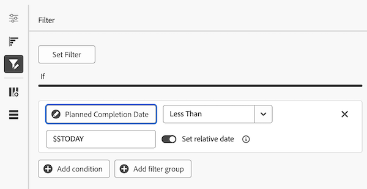

# Filtrare un rapporto in un dashboard di Canvas

>[!IMPORTANT]
>
>La funzione Dashboard di Canvas è attualmente disponibile solo per gli utenti che partecipano alla fase beta. Alcune parti della caratteristica potrebbero non essere complete o non funzionare come previsto in questa fase. Invia un feedback relativo alla tua esperienza seguendo le istruzioni riportate nella sezione [Provide feedback](/help/quicksilver/product-announcements/betas/canvas-dashboards-beta/canvas-dashboards-beta-information.md#provide-feedback) dell&#39;articolo di panoramica di Canvas Dashboards beta. 
>In caso di feedback su un possibile bug o problema tecnico, invia un ticket al supporto Workfront. Per ulteriori informazioni, consulta [Contattare l’Assistenza clienti](/help/quicksilver/workfront-basics/tips-tricks-and-troubleshooting/contact-customer-support.md). 
>Tieni presente che questa versione beta non è disponibile sui seguenti provider cloud:
>
>* Porta la tua chiave per Amazon Web Services
>* Azure
>* Piattaforma Google Cloud

Puoi filtrare un rapporto per controllare quali dati visualizzare, sia durante la generazione del rapporto che in qualsiasi momento successivo. Le opzioni e il comportamento di filtro sono gli stessi in entrambi i casi.

## Requisiti di accesso

+++ Espandi per visualizzare i requisiti di accesso per la funzionalità descritta in questo articolo.

<table style="table-layout:auto"> 
<col> 
</col> 
<col> 
</col> 
<tbody> 
<tr> 
   <td role="rowheader">
Pacchetto Adobe Workfront
</td> 
   <td> 

Qualsiasi 
 
   </td> 
<tr> 
 <tr> 
   <td role="rowheader">
Licenza di Adobe Workfront
</td> 
   <td> 

Standard
 

Piano
 
   </td> 
   </tr> 
  </tr> 
  <tr> 
   <td role="rowheader">
Configurazioni del livello di accesso
</td> 
   <td>
Modificare l’accesso a rapporti, dashboard e calendari

  </td> 
  </tr>  
        <tr> 
   <td role="rowheader">
Autorizzazioni sugli oggetti
</td> 
   <td>
Gestire le autorizzazioni per il dashboard

  </td> 
  </tr>
</tbody> 
</table>

Per ulteriori dettagli sulle informazioni contenute in questa tabella, consulta [Requisiti di accesso nella documentazione Workfront](/help/quicksilver/administration-and-setup/add-users/access-levels-and-object-permissions/access-level-requirements-in-documentation.md).
+++

## Prerequisiti

Prima di poter filtrare un dashboard, è necessario disporre di un report su di esso o crearne uno. Per ulteriori informazioni, vedere [Creare un dashboard Canvas](/help/quicksilver/reports-and-dashboards/canvas-dashboards/create-dashboards/create-dashboards.md).

## Aggiungere o modificare un filtro per la generazione di rapporti

Per aggiungere o modificare un filtro in un report:

1. Apri il pannello dei filtri del rapporto:

   * Se stai creando un report, fai clic sull&#39;icona **Filtro** nel pannello a sinistra della finestra di dialogo **Configura**.
   * Se stai modificando un report esistente, fai clic sull&#39;icona **Altro** nell&#39;angolo superiore destro, seleziona **Modifica**, quindi fai clic sul pannello **Filtri** nella finestra di dialogo **Configura**.

1. Fare clic su **Modifica filtro**.

1. Fai clic su **Aggiungi condizione**, quindi definisci la condizione:

   * Fai clic su **Scegli campo**, quindi seleziona il campo in base al quale desideri filtrare.
   * Seleziona il modificatore che definisce il tipo di condizione che il campo deve soddisfare.
   * Digitate o selezionate il valore su cui eseguire la valutazione, se il modificatore ne richiede uno.

   

1. (Facoltativo) Ripeti il passaggio precedente per aggiungere altre condizioni.

1. (Facoltativo) Fai clic su **Aggiungi gruppo di filtri** per aggiungere un altro set di criteri di filtro. L&#39;operatore di default tra i set è AND. Fai clic sull’operatore per modificarlo in O.

>[!NOTE]
>
>Per l&#39;elenco completo dei campi, degli operatori, dei caratteri jolly e delle regole di filtro speciali, vedere [Riferimento filtro report per dashboard di area di lavoro](/help/quicksilver/reports-and-dashboards/canvas-dashboards/manage-reports/filter-reference.md).

1. Fai clic su **Salva**.
