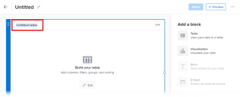

# Aggiungere o modificare un blocco di tabella nell’area di lavoro rapporti

In una tabella le informazioni sui campi vengono visualizzate in colonne che possono essere filtrate, raggruppate e ordinate.

## Prerequisiti

Prima di iniziare, devi iscriverti alla versione beta di Reporting Canvas. Per ulteriori informazioni, vedere [Reporting Canvas beta: overview](/help/quicksilver/product-announcements/betas/canvas-dashboards-beta/reporting-canvas-beta-overview.md).

## Aggiungere o modificare un blocco di tabella

1. Fai clic sull&#39;icona  del **Main Menu** nell&#39;angolo superiore destro di Adobe Workfront, quindi fai clic su **Reporting**.
1. Fare clic su **Nuovo report**.

   Oppure

   Vai a un report esistente, fai clic sull&#39;icona **Altro**  nell&#39;intestazione del report, quindi fai clic su **Modifica**.

1. Sul lato destro della schermata in **Aggiungi un blocco**:

   Trascina l&#39;icona  della **Tabella** nell&#39;area di lavoro direttamente nella posizione desiderata.

   Oppure

   Fare doppio clic sull&#39;icona  della **Tabella** per aggiungere una tabella nella parte superiore dell&#39;area di lavoro.

   >[!TIP]
   >
   >Puoi modificare le dimensioni del blocco dopo averlo posizionato trascinandone le maniglie d’angolo.

1. Fare clic su **Tabella senza titolo** nell&#39;intestazione della tabella, quindi digitare un titolo per la tabella.

   

1. Fai clic su **Modifica** al centro del blocco di tabella per configurare la tabella.

   >[!NOTE]
   >
   >Se la tabella faceva già parte dell&#39;area di lavoro (ad esempio durante la modifica di un report esistente), il pulsante **Modifica** non viene visualizzato al centro del blocco. Per modificare la tabella, fai clic sull&#39;icona  di **Modifica** nell&#39;intestazione della tabella.
   >

1. Nel pannello **Campi** a destra, individua un campo che desideri aggiungere come colonna alla tabella, quindi trascinalo nella tabella in cui lo desideri o fai doppio clic su di esso per aggiungerlo come ultima colonna della tabella.

   È possibile digitare testo nella casella **Cerca** per trovare un campo specifico in base al nome. È inoltre possibile utilizzare i due menu a discesa sotto questa casella per limitare l&#39;elenco dei campi visualizzati a uno o a entrambi i seguenti elementi:

   * Tipo di oggetto associato al campo desiderato, ad esempio Progetto o Attività
   * Il tipo di campo desiderato, ad esempio Data o Valuta

   Ripetere questo passaggio per ogni campo che si desidera aggiungere come colonna.

   >[!TIP]
   >
   >È possibile modificare l&#39;ordine delle colonne di una tabella trascinando una colonna selezionata in una nuova posizione.

1. Effettua una delle seguenti operazioni per configurare ulteriormente la tabella:

   * **Aggiungi un campo formula**: fai clic su **Nuovo +** nella parte superiore dell&#39;elenco **Campi**. Per ulteriori istruzioni sulla creazione di un campo formula, vedere [Creare un campo formula nell&#39;area di lavoro Reporting](../../../reports-and-dashboards/reporting-canvas/table-blocks/create-formula-field.md).
   * **Aggiungere un filtro**: trascinare il campo in base al quale si desidera filtrare la tabella nella sezione **Filter** sopra la tabella. Per ulteriori informazioni sulla configurazione delle regole di filtro, vedere [Filtrare una tabella nell&#39;area di lavoro Reporting](../../../reports-and-dashboards/reporting-canvas/table-blocks/configure-filter-rules-for-table.md).
   * **Raggruppa righe per attributi specifici**: Trascinare il campo in base al quale si desidera raggruppare la tabella nella sezione **Raggruppa** sopra la tabella. Per ulteriori informazioni sulla creazione di gruppi di righe, vedere [Raggruppare le righe della tabella nell&#39;area di lavoro Reporting](../../../reports-and-dashboards/reporting-canvas/table-blocks/group-rows-in-table.md).
