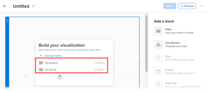

# Aggiungere o modificare un blocco di visualizzazione nell’area di lavoro rapporti

Una visualizzazione può aiutarti a raccontare una storia con i tuoi dati evidenziando informazioni importanti in un modo facile da capire.

Puoi aggiungere i seguenti tipi di visualizzazioni a un rapporto:

* Barra
* Colonna
* Torta
* KPI

## Prerequisiti

Prima di iniziare, devi iscriverti alla versione beta di Reporting Canvas. Per ulteriori informazioni, vedere [Reporting Canvas beta: overview](/help/quicksilver/product-announcements/betas/canvas-dashboards-beta/reporting-canvas-beta-overview.md).

## Aggiungere o modificare un blocco di visualizzazione

>[!TIP]
>
>Tutte le modifiche vengono salvate automaticamente durante la generazione e la modifica dei blocchi nel report.

1. Fai clic sull&#39;icona  del **Main Menu** nell&#39;angolo superiore destro di Adobe Workfront, quindi fai clic su **Reporting**.
1. Fare clic su **Nuovo report**, quindi creare un report con tabelle contenenti dati, come descritto in [Creare un report nell&#39;area di lavoro Reporting](../../../reports-and-dashboards/reporting-canvas/manage-reports/build-report.md) e [Aggiungere o modificare un blocco di tabella nell&#39;area di lavoro Reporting](../../../reports-and-dashboards/reporting-canvas/table-blocks/add-or-edit-report-table.md).

   Oppure

   In un report esistente con tabelle contenenti dati, fare clic sull&#39;icona  di **Altro menu** nell&#39;intestazione del report, quindi selezionare **Modifica**.

1. Nella parte destra della schermata, in **Aggiungi un blocco**:

   Trascina l&#39;icona **Visualizzazione** **** nell&#39;area di lavoro direttamente nella posizione desiderata.

   Oppure

   Fai doppio clic sull&#39;icona **Visualizzazione** **** per aggiungere una visualizzazione all&#39;inizio dell&#39;area di lavoro.

   Oppure

   Seleziona l&#39;icona **Visualizza** **** nella parte superiore di una tabella esistente nell&#39;area di lavoro.

   >[!TIP]
   >
   >È possibile modificare le dimensioni del blocco dopo averlo posizionato trascinandone le maniglie d&#39;angolo.

1. (Condizionale) Se il report contiene più di una tabella, nella casella **Genera la visualizzazione** visualizzata, seleziona la tabella di origine per la visualizzazione.

   

   >[!NOTE]
   >
   >Se si seleziona **+ Aggiungi nuova tabella**, viene creato un nuovo blocco di tabella sotto il blocco di visualizzazione. Devi compilare la tabella con i dati prima di poter aggiungere una visualizzazione per essa. Per ulteriori informazioni sulla creazione e la modifica di tabelle, vedere [ [Aggiungere o modificare un blocco di tabella in Reporting Canvas](../../../reports-and-dashboards/reporting-canvas/table-blocks/add-or-edit-report-table.md)](../../../reports-and-dashboards/reporting-canvas/table-blocks/add-or-edit-report-table.md)

1. Seleziona il tipo di visualizzazione da aggiungere.

   

   Viene visualizzata la visualizzazione, che rappresenta i dati della tabella selezionata.

   >[!TIP]
   >
   >I colori dei punti accanto al titolo della visualizzazione e al titolo della tabella di origine corrispondono. In un rapporto con più tabelle, questo consente di far corrispondere facilmente le visualizzazioni con le tabelle associate.

1. Continua e configura la visualizzazione:

   * Visualizzazione **Barre**: per istruzioni, vedere [Configurare una visualizzazione a barre nell&#39;area di lavoro Reporting](../../../reports-and-dashboards/reporting-canvas/visualization-blocks/configure-bar-visualization.md#bar).
   * Visualizzazione **Colonna**: per istruzioni, vedere [Configurare una visualizzazione di colonna nell&#39;area di lavoro Reporting](../../../reports-and-dashboards/reporting-canvas/visualization-blocks/configure-column-visualization.md).
   * Visualizzazione **Torta**: per istruzioni, consulta [Configurare la visualizzazione della torta nell&#39;area di lavoro Reporting](../../../reports-and-dashboards/reporting-canvas/visualization-blocks/configure-pie-visualization.md).
   * Visualizzazione **KPI**: per istruzioni, vedere [Configurare una visualizzazione KPI nell&#39;area di lavoro Reporting](../../../reports-and-dashboards/reporting-canvas/visualization-blocks/configure-kpi-visualization.md).
