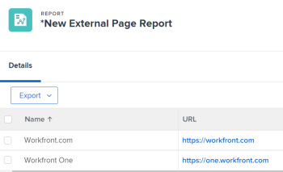

# Incorporare una pagina web esterna in una dashboard

<!--Audited: 01/2024-->

Puoi incorporare una pagina web esterna in un dashboard per fornire accesso alle informazioni correlate provenienti da altri sistemi o dall’interno di Adobe Workfront.

Ad esempio, se la tua organizzazione dispone di un archivio documenti basato su Web, di un wiki o di un altro sistema di gestione dei contenuti che contiene informazioni sul progetto a cui si accede regolarmente tramite un URL, puoi visualizzare tali informazioni in Workfront creando una pagina esterna su un dashboard.

>[!IMPORTANT]
>
>* Per motivi di sicurezza, alcuni siti web non consentono di incorporare le pagine web come iframe. Se la pagina web che desideri incorporare in un dashboard non lo consente, la pagina non viene visualizzata nel dashboard. Tuttavia, è comunque possibile accedere alla pagina esterna facendo clic sul nome della dashboard.\
>\
>Per consentire l’incorporamento per un sito web di tua proprietà, rivolgiti al tuo amministratore web per modificare **X-Frame-Options** impostazione. Per ulteriori informazioni, consulta [X-Frame-Options](https://developer.mozilla.org/en-US/docs/Web/HTTP/Headers/X-Frame-Options).
>
>
>* Le pagine del dashboard non sono più supportate come pagine esterne incorporate nei dashboard. Anche se i dashboard esistenti non verranno modificati automaticamente per rimuovere queste pagine esterne, qualsiasi modifica a un dashboard che include tale riferimento non potrà essere salvata fino a quando il riferimento non verrà rimosso o modificato.
> In particolare, i seguenti sottodomini Workfront.com non sono più supportati:
>
>     * /dashboard&#x200B;
>     * /dashboard/:ID&#x200B;
>     * /portfolio/:ID/content-dashboard__:dashboardID&#x200B;
>     * /program/:ID/content-dashboard__:dashboardID&#x200B;
>     * /project/:ID/content-dashboard__:dashboardID&#x200B;
>     * /task/:ID/content-dashboard__:dashboardID&#x200B;
>     * /template/:ID/content-dashboard__:dashboardID&#x200B;
>     * /templatetask/:ID/content-dashboard__:dashboardID&#x200B;
>     * /gestione risorse/:ID/
>     * content-dashboard__:dashboardID&#x200B;
>     * /team/:ID/content-dashboard__:dashboardID&#x200B;
>     * /iteration/:ID/content-dashboard__:dashboardID&#x200B;
>     * /requests/:ID/content-dashboard__:dashboardID&#x200B;
>     * /group/:ID/content-dashboard__:dashboardID&#x200B;
>     * /billingrecord/:ID/content-dashboard__:dashboardID
>
>In alternativa, puoi includere un rapporto elenco nel dashboard, come spiegato in [Aggiungere un rapporto a un dashboard](/help/quicksilver/reports-and-dashboards/dashboards/creating-and-managing-dashboards/add-report-dashboard.md)

## Requisiti di accesso

Devi avere i seguenti:

<table style="table-layout:auto"> 
 <col> 
 <col> 
 <tbody> 
  <tr> 
   <td role="rowheader"><strong>piano Adobe Workfront</strong></td> 
   <td> 
Qualsiasi
 </td> 
  </tr> 
  <tr> 
   <td role="rowheader"><strong>Licenza Adobe Workfront*</strong></td> 
   <td> 
Corrente: Piano 

   Oppure
   
Nuovo: Standard 
 </td> 
  </tr> 
  <tr> 
   <td role="rowheader"><strong>Configurazioni del livello di accesso</strong></td> 
   <td> 
Modificare l’accesso a rapporti, dashboard e calendari
 </td> 
  </tr> 
  <tr> 
   <td role="rowheader"><strong>Autorizzazioni oggetto</strong></td> 
   <td> </td> 
  </tr> 
 </tbody> 
</table>

*Per informazioni sulla pianificazione, il tipo di licenza o l&#39;accesso disponibili, contattare l&#39;amministratore Workfront. Per ulteriori informazioni, consulta [Requisiti di accesso nella documentazione di Workfront](/help/quicksilver/administration-and-setup/add-users/access-levels-and-object-permissions/access-level-requirements-in-documentation.md).

## Prerequisiti

È necessario creare un dashboard prima di incorporarvi una pagina esterna.

Per informazioni sulla creazione di dashboard, consulta [Creare un dashboard](../../../reports-and-dashboards/dashboards/creating-and-managing-dashboards/create-dashboard.md).

## Incorporare una pagina esterna in una dashboard

>[!IMPORTANT]
>
>Se non è più necessario, è possibile rimuovere una pagina esterna da un dashboard. Tuttavia, non è possibile eliminare una pagina esterna dopo che è stata creata in Workfront. Puoi eliminare una pagina esterna solo utilizzando l’API. Per ulteriori informazioni, consulta [Rimuovere una pagina esterna da un dashboard](../../../reports-and-dashboards/dashboards/creating-and-managing-dashboards/remove-external-page-from-dashboard.md).

1. Individua l’URL della pagina da visualizzare in Workfront e copia l’URL che si trova nella barra degli indirizzi.

   >[!NOTE]
   >
   >Se condividi gli URL di oggetti Workfront, ricorda che alcuni URL scadono nel tempo. Ad esempio, gli URL del documento scadono dopo l’apertura. Questo è configurato come misura di sicurezza e, per progettazione, è considerato un URL non statico e non deve essere condiviso.

{{step1-to-dashboards}}

1. Per modificare un dashboard esistente, seleziona il dashboard in cui desideri incorporare la pagina del sito web, quindi fai clic su **Azioni dashboard**, quindi fai clic su **Modifica**
Oppure\
   Per creare un nuovo dashboard, fai clic su **Nuovo dashboard**.\
   Per ulteriori informazioni sulla creazione di un dashboard, consulta [Creare un dashboard](../../../reports-and-dashboards/dashboards/creating-and-managing-dashboards/create-dashboard.md).

1. Clic **Aggiungi pagina esterna** sotto **Seleziona layout/ Aggiungi report/ Aggiungi calendari** area.

   

   Il **Aggiungi pagina esterna** viene visualizzata la casella.

1. Specifica le seguenti informazioni sulla pagina esterna:

   * **Nome**: aggiungi un nome per il dashboard.
   * **Descrizione**: aggiungi ulteriori informazioni sul dashboard per identificare le informazioni in esso contenute. La descrizione viene visualizzata nel dashboard per tutti coloro che possono accedervi dopo averlo salvato.
   * **URL**: incolla l’URL copiato in precedenza in questo campo.

     Puoi specificare i seguenti tipi di URL:

      * Un URL https (crittografato) di una pagina web.\
        Solo le pagine https (crittografate) vengono caricate con l’URL.\
        

      * URL del modello che contiene informazioni sulla sessione per un sito Web specifico.\
        Ad esempio: *https://localhost/?session={$$SESSION}*
Per visualizzare la pagina esterna, è necessario aver effettuato l&#39;accesso al sito Web specificato.\
        Per informazioni su come ottenere un ID sessione da Workfront, vedi [Nozioni di base sulle API](../../../wf-api/general/api-basics.md).\
        L’amministratore di Workfront può configurare le preferenze di sistema in modo da non consentire l’utilizzo delle informazioni sulla sessione nelle pagine esterne per motivi di sicurezza. In questo caso, la pagina esterna non viene caricata sul dashboard.\
        Per ulteriori informazioni sulle preferenze di protezione del sistema, vedere [Configurare le preferenze di sicurezza del sistema](../../../administration-and-setup/manage-workfront/security/configure-security-preferences.md).\
        

     >[!WARNING]
     >
     >L&#39;utilizzo di SessionID non è sicuro e consigliato.
     >

   * **Altezza**: digita un numero maggiore di 0 per definire lo spazio occupato dalla pagina esterna sul dashboard. L&#39;altezza predefinita è 500.

1. Fai clic su **Salva**.

   La pagina viene aggiunta automaticamente al dashboard.

   Se crei dashboard aggiuntivi, puoi trovare questa pagina esterna e aggiungerla ad altre dashboard. Puoi trovare tutte le pagine esterne esistenti nell’elenco Rapporti e calendari disponibili durante la creazione o la modifica di un dashboard.

   <!--
    *** This is linked to: Creating Dashboards, and Editing Dashboards.
   -->

## Aggiornare una pagina esterna in un dashboard

Per aggiornare le informazioni per una pagina esterna utilizzata in un dashboard:

{{step1-to-dashboards}}

1. Fare clic sul nome del dashboard che si desidera aggiornare per aprirlo e quindi fare clic su **Azioni dashboard**, quindi **Modifica**.

   Il **Dettagli Cruscotto** viene visualizzata la casella.

1. In **Seleziona layout / Aggiungi report / Aggiungi calendari** area del **Dettagli Cruscotto** , individuare la pagina esterna che si desidera aggiornare, posizionare il puntatore del mouse su di essa e fare clic sul pulsante **Modifica** icona.\
   

1. In **Modifica pagina esterna** , aggiorna i campi che desideri modificare, quindi fai clic su **Salva**.
1. (Facoltativo) Fai clic su **Elimina** icona  per rimuovere la pagina esterna dal dashboard. Per ulteriori informazioni, consulta [Rimuovere una pagina esterna da un dashboard](../../../reports-and-dashboards/dashboards/creating-and-managing-dashboards/remove-external-page-from-dashboard.md).
1. Fai clic su **Salva e Chiudi**.

## Visualizzare pagine esterne in un rapporto

Puoi visualizzare tutte le pagine esterne in Workfront in un rapporto di pagina esterna.

{{step1-to-reports}}

1. Clic **Nuovo rapporto** > seleziona **Pagina esterna**.

   

1. (Facoltativo) Aggiorna le schede Visualizza, Filtri o Raggruppamenti del rapporto.

   Per ulteriori informazioni, consulta [Creare un rapporto personalizzato](../../../reports-and-dashboards/reports/creating-and-managing-reports/create-custom-report.md).

1. Clic **Salva+Chiudi**.

   Puoi visualizzare il nome e l’URL associati alle pagine esterne nel tuo sistema nel nuovo rapporto.

   
