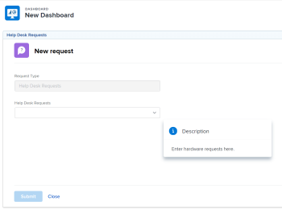

# Incorporare una coda di richiesta in un dashboard

È possibile incorporare una nuova coda di richiesta in un dashboard per fornire accesso diretto alla coda di richiesta agli utenti, senza dover passare all’area Richieste . 

Ad esempio, se disponi di una coda di richiesta aperta a tutta l’organizzazione, come una coda del servizio di assistenza o una coda di richiesta PTO a cui tutti devono accedere regolarmente, potrebbe essere utile inserire la coda di richiesta direttamente in una delle loro dashboard per un accesso rapido e semplice. Il processo di configurazione è simile a quello di creazione di una pagina esterna su un dashboard.

Innanzitutto, devi ottenere un URL per la coda delle richieste. In secondo luogo, puoi incorporare l’URL in un dashboard aggiungendo una pagina esterna.

## Requisiti di accesso

Per eseguire i passaggi descritti in questo articolo, è necessario disporre dei seguenti diritti di accesso:

<table style="table-layout:auto"> 
 <col> 
 <col> 
 <tbody> 
  <tr> 
   <td role="rowheader"><strong>piano Adobe Workfront*</strong></td> 
   <td> 
Qualsiasi
 </td> 
  </tr> 
  <tr> 
   <td role="rowheader"><strong>Licenza Adobe Workfront*</strong></td> 
   <td> 
Piano 
 </td> 
  </tr> 
  <tr> 
   <td role="rowheader"><strong>Configurazioni a livello di accesso*</strong></td> 
   <td> 
Accesso a rapporti, dashboard, calendari
 
Nota: Se non disponi ancora dell’accesso, chiedi all’amministratore Workfront se ha impostato ulteriori restrizioni nel livello di accesso. Per informazioni su come un amministratore Workfront può modificare il livello di accesso, consulta <a href="../../../administration-and-setup/add-users/configure-and-grant-access/create-modify-access-levels.md" class="MCXref xref">Creare o modificare livelli di accesso personalizzati</a>.
 </td> 
  </tr> 
  <tr> 
   <td role="rowheader"><strong>Autorizzazioni oggetto</strong></td> 
   <td> 
Gestione delle autorizzazioni al dashboard
 
Per informazioni sulla richiesta di accesso aggiuntivo, vedi <a href="../../../workfront-basics/grant-and-request-access-to-objects/request-access.md" class="MCXref xref">Richiedere l’accesso agli oggetti </a>.
 </td> 
  </tr> 
 </tbody> 
</table>

&#42;Per informazioni sul piano, il tipo di licenza o l&#39;accesso, contattare l&#39;amministratore Workfront.

## Prerequisiti

Per incorporare una coda di richiesta in un dashboard è necessario creare entrambe le operazioni seguenti:

* **Dashboard**: Per informazioni sulla creazione di dashboard, consulta [Creare un dashboard](../../../reports-and-dashboards/dashboards/creating-and-managing-dashboards/create-dashboard.md).
* **Coda richieste**: Per informazioni sulla creazione delle code di richiesta, vedi [Creare una coda di richiesta](../../../manage-work/requests/create-and-manage-request-queues/create-request-queue.md)

## Ottieni l’URL della coda di richiesta {#obtain-the-url-of-the-request-queue}

Puoi ottenere l’URL di una coda di richiesta in più modi, a seconda della parte della coda di richiesta che desideri esporre agli utenti quando accedono a essa da un dashboard.

* [Ottieni un collegamento a un argomento della coda specifico con la possibilità di modificare il tipo di richiesta](#obtain-a-link-to-a-specific-queue-topic-with-ability-to-change-the-request-type)
* [Ottieni un collegamento a una coda di richiesta e possibilità di modificare il tipo di richiesta](#obtain-a-link-to-a-request-queue-and-ability-to-change-the-request-type)
* [Ottenere un collegamento a una coda di richiesta senza la possibilità di modificare il tipo di richiesta](#obtain-a-link-to-a-request-queue-with-no-ability-to-change-the-request-type)

### Ottieni un collegamento a un argomento della coda specifico con la possibilità di modificare il tipo di richiesta {#obtain-a-link-to-a-specific-queue-topic-with-ability-to-change-the-request-type}

Quando condividi un collegamento a un argomento della coda specifico con altri utenti, il modulo di richiesta si apre nell’argomento della coda che devono utilizzare per inviare la richiesta. Questo è utile quando gli utenti potrebbero non essere sicuri dell’argomento della coda da scegliere quando registrare le richieste per una coda di richiesta specifica.

Gli utenti possono modificare il tipo di richiesta o scegliere un altro argomento se necessario. Viene visualizzata anche la navigazione dell’area Richieste.

1. Fai clic sul pulsante **Menu principale** > **Richieste** > **Nuova richiesta**.
1. Continua a selezionare i gruppi di argomenti e gli argomenti della coda fino a raggiungere la coda che desideri condividere sul dashboard, se desideri condividere una coda specifica. Per informazioni sull&#39;invio delle richieste, vedi [Creare e inviare richieste Adobe Workfront](../../../manage-work/requests/create-requests/create-submit-requests.md).

   >[!TIP]
   >
   >La selezione dei gruppi di argomenti e degli argomenti della coda è facoltativa.

1. Fai clic su **Percorso di condivisione** nell’angolo superiore destro dell’area Nuova richiesta.

   Il collegamento viene copiato nella coda delle richieste o nell’argomento della coda quando viene visualizzato sullo schermo. Gli utenti possono aggiornare il tipo di richiesta o uno qualsiasi dei gruppi di argomenti e degli argomenti della coda disponibili.

   

### Ottieni un collegamento a una coda di richiesta e possibilità di modificare il tipo di richiesta {#obtain-a-link-to-a-request-queue-and-ability-to-change-the-request-type}

Quando condividi un collegamento a un tipo di richiesta, l’utente seleziona il tipo di richiesta. Questa funzione è utile quando gli utenti devono scegliere tra più gruppi di argomenti o argomenti della coda per lo stesso tipo di richiesta. Gli utenti possono modificare il tipo di richiesta e sceglierne un altro. Viene visualizzata anche la navigazione dell’area Richieste.

1. Passa a un progetto designato come coda di richiesta.

   Per informazioni sulla creazione di una coda di richiesta da un progetto, vai a [Creare una coda di richiesta](../../../manage-work/requests/create-and-manage-request-queues/create-request-queue.md).

1. Vai a **Dettagli coda**.
1. Copia il codice che trovi nella **URL di accesso diretto** campo .

   Il codice deve essere simile al seguente:

   `https://<yourdomain>.my.workfront.com/requests/new?activeTab=tab-new-helpRequest&projectID=50062d6f000849c95ab3513c0e84a51e&path=`

   Questo è il collegamento alla coda di richiesta associata al progetto selezionato. Il tipo di richiesta è preselezionato.

   Gli utenti possono selezionare qualsiasi gruppo di argomenti o argomento della coda di cui hanno bisogno, oppure possono scegliere un altro tipo di richiesta.

   

### Ottenere un collegamento a una coda di richiesta senza la possibilità di modificare il tipo di richiesta {#obtain-a-link-to-a-request-queue-with-no-ability-to-change-the-request-type}

Quando condividi un collegamento a un tipo di richiesta preselezionata, il tipo di richiesta viene selezionato per l’utente e non può essere modificato (è disattivato). Gli utenti possono scegliere i gruppi di argomenti o gli argomenti della coda di cui hanno bisogno. Questa funzione è utile se non desideri che gli utenti visualizzino e selezionino altri tipi di richiesta. La navigazione nell’area Richieste non viene visualizzata.

1. Passa a un progetto designato come coda di richiesta.

   Per informazioni sulla creazione di una coda di richiesta da un progetto, vai a [Creare una coda di richiesta](../../../manage-work/requests/create-and-manage-request-queues/create-request-queue.md).

1. Vai a **Dettagli coda**.
1. Copia il codice che trovi nella **Codice incorporato** campo .

   Il codice deve essere simile al seguente:

   `<iframe src="https://<yourdomain>my.workfront.com/requests/newRequestEmbedded?projectID=612518c7000404462d3bc9a0bc09fa71" frameborder="0" width="500" height="600"></iframe>`

1. Modifica il codice per conservare solo le informazioni seguenti:

   `https://<yourdomain>.my.workfront.com/requests/newRequestEmbedded?projectID=612518c7000404462d3bc9a0bc09fa71`

   >[!TIP]
   >
   >Puoi aggiungere una `<samp>iframe </samp>` quando si incorpora il codice in un&#39;applicazione diversa da Workfront.

   Questo è il collegamento alla coda di richiesta associata al progetto selezionato. Il tipo di richiesta è preselezionato e non può essere modificato.

   Gli utenti possono selezionare qualsiasi gruppo di argomenti o argomento della coda di cui hanno bisogno per il tipo di richiesta selezionato. Gli utenti non possono selezionare un altro tipo di richiesta.

   

## Incorporare una coda di richiesta in un dashboard

Puoi incorporare un collegamento alla coda delle richieste o a un argomento della coda nidificato sotto una coda di richiesta in un dashboard per consentire agli utenti di accedere direttamente alle richieste di immissione.

1. Ottieni un URL della coda di richiesta utilizzando uno dei metodi descritti in [Ottieni l’URL della coda di richiesta](#obtain-the-url-of-the-request-queue) sezione di questo articolo.
1. Fai clic sul pulsante **Menu principale** > **Dashboard** > **Nuovo dashboard**.
1. Tipo a **Nome** per il dashboard. Questo è un campo obbligatorio.
1. Fai clic su **Aggiungi pagina esterna**.

   

1. In **Aggiungi pagina esterna** modificare i campi seguenti:

   * **Nome**: immetti il nome della coda di richiesta come desideri che appaia sul dashboard. Questo è un campo obbligatorio.

   * **Descrizione**: inserisci una descrizione della visualizzazione della pagina esterna. Questo campo non è obbligatorio ed è importante solo a scopo di reporting. Non viene visualizzato nel dashboard.
   * **URL**: incolla l’URL ottenuto utilizzando uno dei metodi descritti nel passaggio 1.

      <!--   
     <MadCap:conditionalText data-mc-conditions="QuicksilverOrClassic.Draft mode">   
     <MadCap:conditionalText data-mc-conditions="">   
     (NOTE: ensure this stays accurate)   
     </MadCap:conditionalText>   
     </MadCap:conditionalText>   
     -->

   * **Altezza**: immetti l’altezza della pagina esterna. Questo definisce lo spazio occupato dalla pagina esterna contenente la coda di richiesta sul dashboard. Questo è un campo obbligatorio e il valore predefinito è 500.

1. Fai clic su **Salva**.
1. Fai clic su **Salva e chiudi**. 

   La coda di richiesta viene visualizzata nel dashboard come componente dashboard separato.

   

1. (Facoltativo) Fai clic su **Azioni dashboard**, quindi **Modifica** per aggiungere rapporti, calendari o pagine esterne aggiuntive allo stesso dashboard.\
   Per informazioni sull’aggiunta di componenti a un dashboard, consulta [Creare un dashboard](../../../reports-and-dashboards/dashboards/creating-and-managing-dashboards/create-dashboard.md).

 

 

<!--

(NOTE: drafted - old information)

-->

<!--
<ol data-mc-conditions="QuicksilverOrClassic.Draft mode">
<li value="1"> 
Click the <strong>Main Menu</strong> > Requests >&nbsp;<strong>New Request</strong>. 
 </li>
<li class="preview" value="2" data-mc-conditions="QuicksilverOrClassic.Quicksilver"> 
Continue entering the request.&nbsp;For information about submitting requests, see <a href="../../../manage-work/requests/create-requests/create-submit-requests.md" class="MCXref xref">Create and submit Adobe Workfront requests</a>. 
 </li>
<li value="3"> 
Select the <strong>Request Type</strong> for the queue you would like added to the dashboard.
 </li>
<li value="4"> 
(Optional) Select a Queue Topic and a Topic Group. Depending on how the project manager set up the request queue, the names of these fields are different in each Workfront instance.
 </li>
<li class="preview" value="5" data-mc-conditions="QuicksilverOrClassic.Quicksilver"> 
Click <strong>Share path</strong> to obtain a shared link from the request queue you want to embed on a dashboard.
 
For information about sharing a request queue, see <a href="../../../manage-work/requests/create-requests/share-link-to-request-queue.md" class="MCXref xref">Share a link to a request queue</a>
 </li>
<li value="6"> 
For example, enter a URL similar to one of the following: 
 </li>
</ol>
-->
