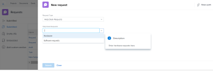

# Incorporare una coda di richieste in un dashboard

<!-- Audited: 1/2025 -->

Puoi incorporare una nuova coda di richieste in un dashboard per fornire accesso diretto alla coda di richieste agli utenti, senza dover passare all’area Richieste.

Ad esempio, se disponi di una coda di richieste aperta all’intera organizzazione, come una coda di helpdesk o una coda di richieste PTO a cui tutti devono accedere regolarmente, potrebbe essere utile inserire la coda di richieste direttamente in una delle loro dashboard per accedervi in modo rapido e semplice. Il processo di configurazione è simile a quello di creazione di una pagina esterna su una dashboard.

Innanzitutto, devi ottenere un URL per la coda delle richieste. In secondo luogo, puoi incorporare l’URL in una dashboard aggiungendo una pagina esterna.

## Requisiti di accesso

+++ Espandi per visualizzare i requisiti di accesso per la funzionalità in questo articolo.

Per eseguire i passaggi descritti in questo articolo, è necessario disporre dei seguenti diritti di accesso:

<table style="table-layout:auto"> 
 <col> 
 <col> 
 <tbody> 
  <tr> 
   <td role="rowheader"><strong>piano Adobe Workfront</strong></td> 
   <td> 
Qualsiasi
 </td> 
  </tr> 
  <tr> 
   <td role="rowheader"><strong>Licenza Adobe Workfront</strong></td> 
   <td> 
      
Nuovo:

         <ul>
         <li>
Standard
</li>
         </ul>
      
Corrente:

         <ul>
         <li>
Piano
</li>
         </ul>
   </td> 
  </tr> 
  <tr> 
   <td role="rowheader"><strong>Configurazioni del livello di accesso</strong></td> 
   <td> 
Modificare l’accesso a Rapporti, Dashboard, Calendari
 </td> 
  </tr> 
  <tr> 
   <td role="rowheader"><strong>Autorizzazioni oggetto</strong></td> 
   <td> 
Gestire le autorizzazioni per il dashboard
 </td> 
  </tr> 
 </tbody> 
</table>

Per informazioni, consulta [Requisiti di accesso nella documentazione di Workfront](/help/quicksilver/administration-and-setup/add-users/access-levels-and-object-permissions/access-level-requirements-in-documentation.md).

+++

## Prerequisiti

Prima di poter incorporare una coda di richieste in un dashboard, è necessario creare entrambe le operazioni seguenti:

* **Dashboard**: per informazioni sulla creazione dei dashboard, vedere [Creare un dashboard](../../../reports-and-dashboards/dashboards/creating-and-managing-dashboards/create-dashboard.md).

* **Coda richieste**: per informazioni sulla creazione di code richieste, vedere [Creare una coda richieste](../../../manage-work/requests/create-and-manage-request-queues/create-request-queue.md)

## Ottenere l’URL della coda di richieste {#obtain-the-url-of-the-request-queue}

Puoi ottenere l’URL di una coda di richieste in diversi modi, a seconda della parte di coda che desideri esporre agli utenti quando vi accedono da un dashboard.

* [Ottieni un collegamento a un argomento della coda specifico con la possibilità di modificare il tipo di richiesta](#obtain-a-link-to-a-specific-queue-topic-with-ability-to-change-the-request-type)

* [Ottieni un collegamento a una coda di richieste e modifica del tipo di richiesta](#obtain-a-link-to-a-request-queue-and-ability-to-change-the-request-type)

* [Ottenere un collegamento a una coda di richieste senza la possibilità di modificare il tipo di richiesta](#obtain-a-link-to-a-request-queue-with-no-ability-to-change-the-request-type)

### Ottieni un collegamento a un argomento della coda specifico con la possibilità di modificare il tipo di richiesta {#obtain-a-link-to-a-specific-queue-topic-with-ability-to-change-the-request-type}

Quando si condivide un collegamento a un argomento della coda specifico con altri utenti, il modulo di richiesta viene aperto in corrispondenza dell&#39;argomento della coda che devono utilizzare per inviare la richiesta. Questa opzione è utile quando gli utenti non sono sicuri dell’argomento della coda da scegliere quando registrano le richieste per una coda di richieste specifica.

Gli utenti possono modificare il tipo di richiesta o scegliere un altro argomento, se necessario. Viene visualizzata anche la navigazione dell’area Richieste.

1. Fai clic sul **menu principale** > **richieste** > **nuova richiesta**.
1. Se si desidera condividere una coda specifica, continuare a selezionare i gruppi di argomenti e gli argomenti della coda fino a raggiungere la coda che si desidera condividere nel dashboard. Per informazioni sull&#39;invio di richieste, vedere [Creare e inviare richieste Adobe Workfront](../../../manage-work/requests/create-requests/create-submit-requests.md).

   >[!TIP]
   >
   >La selezione dei gruppi di argomenti e degli argomenti della coda è facoltativa.

1. Fai clic su **Condividi percorso** nell&#39;angolo superiore destro dell&#39;area Nuova richiesta.

   In questo modo il collegamento viene copiato nella coda richieste o nell&#39;argomento della coda mentre viene visualizzato sullo schermo. Gli utenti possono aggiornare il Tipo di richiesta o uno qualsiasi dei gruppi di argomenti e degli argomenti della coda disponibili.

   

### Ottenere un collegamento a una coda di richieste e modificare il tipo di richiesta {#obtain-a-link-to-a-request-queue-and-ability-to-change-the-request-type}

Quando condividi un collegamento a un tipo di richiesta, questo viene selezionato per l’utente. Questa funzione è utile quando gli utenti devono scegliere tra più gruppi di argomenti o argomenti in coda per lo stesso tipo di richiesta. Gli utenti possono modificare il tipo di richiesta e sceglierne un altro. Viene visualizzata anche la navigazione dell’area Richieste.

1. Vai a un progetto designato come coda di richieste.

   Per informazioni sulla creazione di una coda di richieste da un progetto, vai a [Creare una coda di richieste](../../../manage-work/requests/create-and-manage-request-queues/create-request-queue.md).

1. Vai a **Dettagli coda**.
1. Copiare il codice trovato nel campo **URL di accesso diretto**.

   Il codice deve essere simile al seguente:

   `https://<yourdomain>.my.workfront.com/requests/new?activeTab=tab-new-helpRequest&projectID=50062d6f000849c95ab3513c0e84a51e&path=`

   Questo è il collegamento alla coda di richieste associata al progetto selezionato. Il Tipo di richiesta è preselezionato.

   Gli utenti possono selezionare qualsiasi gruppo di argomenti o argomento di coda di cui hanno bisogno oppure scegliere un altro tipo di richiesta.

   

### Ottenere un collegamento a una coda di richieste senza la possibilità di modificare il tipo di richiesta {#obtain-a-link-to-a-request-queue-with-no-ability-to-change-the-request-type}

Quando condividi un collegamento a un tipo di richiesta preselezionato, il tipo di richiesta viene selezionato per l’utente e non può essere modificato (è disattivato). Gli utenti possono scegliere i gruppi di argomenti o gli argomenti in coda necessari. Questa funzione è utile quando non si desidera che gli utenti visualizzino e selezionino altri tipi di richiesta. La navigazione dell’area Richieste non viene visualizzata.

1. Vai a un progetto designato come coda di richieste.

   Per informazioni sulla creazione di una coda di richieste da un progetto, vai a [Creare una coda di richieste](../../../manage-work/requests/create-and-manage-request-queues/create-request-queue.md).

1. Vai a **Dettagli coda**.
1. Copia il codice trovato nel campo **Codice incorporato**.

   Il codice deve essere simile al seguente:

   `<iframe src="https://<yourdomain>my.workfront.com/requests/newRequestEmbedded?projectID=612518c7000404462d3bc9a0bc09fa71" frameborder="0" width="500" height="600"></iframe>`

1. Modifica il codice per mantenere solo le informazioni seguenti:

   `https://<yourdomain>.my.workfront.com/requests/newRequestEmbedded?projectID=612518c7000404462d3bc9a0bc09fa71`

   >[!TIP]
   >
   >È possibile aggiungere un tag `<samp>iframe </samp>` quando si incorpora il codice in un&#39;applicazione diversa da Workfront.

   Questo è il collegamento alla coda di richieste associata al progetto selezionato. Il tipo di richiesta è preselezionato e non può essere modificato.

   Gli utenti possono selezionare qualsiasi gruppo di argomenti o argomento di coda di cui hanno bisogno per il tipo di richiesta selezionato. Gli utenti non possono selezionare un altro tipo di richiesta.

   

## Incorporare una coda di richieste in un dashboard

Puoi incorporare in un dashboard un collegamento alla coda delle richieste o a un argomento della coda nidificato sotto una coda di richieste, in modo da consentire agli utenti di accedere direttamente all’immissione delle richieste.

1. Ottenere un URL della coda richieste utilizzando uno dei metodi descritti nella sezione [Ottenere l&#39;URL della coda richieste](#obtain-the-url-of-the-request-queue) di questo articolo.

1. Fai clic sul **menu principale** > **dashboard** > **nuovo dashboard**.

1. Digita un **Nome** per il dashboard. Questo è un campo obbligatorio.

1. Fare clic su **Aggiungi pagina esterna**.

   

1. Nella casella **Aggiungi pagina esterna** modificare i campi seguenti:

   * **Nome**: immettere il nome della coda di richieste che si desidera visualizzare nel dashboard. Questo è un campo obbligatorio.

   * **Descrizione**: immettere una descrizione per la visualizzazione di questa pagina esterna. Questo campo non è obbligatorio ed è importante solo a scopo di reporting. Non viene visualizzato nel dashboard.

   * **URL**: incolla l&#39;URL ottenuto utilizzando uno dei metodi descritti nel passaggio 1.

   * **Altezza**: immettere l&#39;altezza della pagina esterna. Questo definisce quanto spazio occupa nel dashboard la pagina esterna contenente la coda di richieste. Questo campo è obbligatorio e il valore predefinito è 500.

1. Fai clic su **Salva**.

1. Fai clic su **Salva e Chiudi**.

   La coda di richieste viene visualizzata nel dashboard come componente separato del dashboard.

1. (Facoltativo) Fai clic su **Azioni dashboard**, quindi su **Modifica** per aggiungere report, calendari o altre pagine esterne alla stessa dashboard.

   Per informazioni sull&#39;aggiunta di componenti a un dashboard, vedere [Creare un dashboard](../../../reports-and-dashboards/dashboards/creating-and-managing-dashboards/create-dashboard.md).

<!--
<ol data-mc-conditions="QuicksilverOrClassic.Draft mode">
<li value="1"> 
Click the <strong>Main Menu</strong> > Requests >&nbsp;<strong>New Request</strong>. 
 </li>
<li class="preview" value="2" data-mc-conditions="QuicksilverOrClassic.Quicksilver"> 
Continue entering the request.&nbsp;For information about submitting requests, see <a href="../../../manage-work/requests/create-requests/create-submit-requests.md" class="MCXref xref">Create and submit Adobe Workfront requests</a>. 
 </li>
<li value="3"> 
Select the <strong>Request Type</strong> for the queue you would like added to the dashboard.
 </li>
<li value="4"> 
(Optional) Select a Queue Topic and a Topic Group. Depending on how the project manager set up the request queue, the names of these fields are different in each Workfront instance.
 </li>
<li class="preview" value="5" data-mc-conditions="QuicksilverOrClassic.Quicksilver"> 
Click <strong>Share path</strong> to obtain a shared link from the request queue you want to embed on a dashboard.
 
For information about sharing a request queue, see <a href="../../../manage-work/requests/create-requests/share-link-to-request-queue.md" class="MCXref xref">Share a link to a request queue</a>
 </li>
<li value="6"> 
For example, enter a URL similar to one of the following: 
 </li>
</ol>
-->
