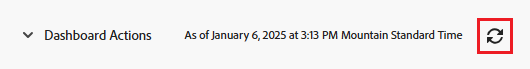

# Introduzione alle dashboard

<!-- Audited: 1/2025 -->

Lo scopo di un dashboard è fornire un accesso rapido alle informazioni provenienti da più report. Innanzitutto, è possibile raccogliere le informazioni nei report e quindi inserire più report nei dashboard per semplificare l’accesso alle informazioni.

## Requisiti di accesso

+++ Espandi per visualizzare i requisiti di accesso per la funzionalità descritta in questo articolo.

<table style="table-layout:auto"> 
 <col> 
 <col> 
 <tbody> 
  <tr> 
   <td role="rowheader">Pacchetto Adobe Workfront</td> 
   <td> 
Qualsiasi
 </td> 
  </tr> 
  <tr> 
   <td role="rowheader">Licenza di Adobe Workfront</td> 
   <td> 
      
Collaboratore o successiva

      
Revisione o superiore

   </td> 
  </tr> 
  <tr> 
   <td role="rowheader">Configurazioni del livello di accesso</td> 
   <td> 
Visualizzare l’accesso a report, dashboard e calendari
</td> 
  </tr>  
  <tr> 
   <td role="rowheader">Autorizzazioni sugli oggetti</td> 
   <td> 
Visualizzare le autorizzazioni per il dashboard
 </td> 
  </tr> 
 </tbody> 
</table>

Per ulteriori dettagli sulle informazioni contenute in questa tabella, consulta [Requisiti di accesso nella documentazione Workfront](/help/quicksilver/administration-and-setup/add-users/access-levels-and-object-permissions/access-level-requirements-in-documentation.md).

+++

## Oggetti che è possibile aggiungere a un dashboard

In Adobe Workfront è possibile inserire in un dashboard fino a 25 dei seguenti elementi:

* Rapporti\
  Per ulteriori informazioni sulla creazione di report, vedere [Creare un report personalizzato](../../../reports-and-dashboards/reports/creating-and-managing-reports/create-custom-report.md).

* Calendari\
  Per ulteriori informazioni sulla creazione di calendari, vedere [Panoramica dei report del calendario](../../../reports-and-dashboards/reports/calendars/calendar-reports-overview.md).

* Pagine esterne\
  Per ulteriori informazioni sulla creazione di pagine esterne, vedere [Incorporare una pagina Web esterna in un dashboard](../../../reports-and-dashboards/dashboards/creating-and-managing-dashboards/embed-external-web-page-dashboard.md).

Per ulteriori informazioni sulla creazione di un dashboard, vedere [Creare un dashboard](../../../reports-and-dashboards/dashboards/creating-and-managing-dashboards/create-dashboard.md).

## Condividi dashboard

È possibile condividere un dashboard con gli utenti nei modi seguenti:

* Condivisione individuale.\
  Per ulteriori informazioni sulla condivisione dei dashboard, vedere [Condividere report, dashboard e calendari](../../../workfront-basics/grant-and-request-access-to-objects/permissions-reports-dashboards-calendars.md) e [Condividere un dashboard](../../../reports-and-dashboards/dashboards/creating-and-managing-dashboards/share-dashboard.md).

* Aggiungete un dashboard a qualsiasi area o oggetto in Workfront nel pannello a sinistra.\
  Per ulteriori informazioni sull&#39;aggiunta di dashboard al pannello sinistro, consulta [Navigazione a sinistra in Adobe Workfront](../../../workfront-basics/the-new-workfront-experience/simplified-left-navigation.md).

* Posiziona i dashboard nei modelli di layout, che puoi condividere con gli utenti.\
  Per ulteriori informazioni sulla condivisione dei dashboard tramite i modelli di layout, vedere [Personalizzare il pannello sinistro utilizzando un modello di layout](../../../administration-and-setup/customize-workfront/use-layout-templates/customize-left-panel.md).

* Stampane una copia cartacea da condividere con gli utenti.\
  Per ulteriori informazioni sulla stampa dei dashboard, vedere [Stampare un dashboard](../../../reports-and-dashboards/dashboards/creating-and-managing-dashboards/print-dashboard.md).

* Esportateli come file PDF in modo da poterli inviare tramite e-mail agli utenti.\
  Per ulteriori informazioni sull&#39;esportazione di un dashboard in un file PDF, vedere [Esportare un dashboard](../../../reports-and-dashboards/dashboards/creating-and-managing-dashboards/export-dashboard.md).

Quando si condivide un dashboard con gli utenti, per impostazione predefinita vengono condivisi con gli stessi utenti anche tutti i report, i calendari e le pagine esterne presenti nel dashboard.

>[!IMPORTANT]
>
>Se un utente viene eliminato, i dashboard creati non saranno più accessibili. Per ulteriori informazioni, consulta [Eliminare gli utenti](../../../administration-and-setup/add-users/create-and-manage-users/delete-a-user.md).

## Visualizza dashboard

È possibile visualizzare un dashboard nei modi seguenti:

* Accedi al dashboard tramite il pannello sinistro di un oggetto.
Per ulteriori informazioni sull&#39;inserimento dei dashboard nel pannello sinistro, consulta [Navigazione a sinistra in Adobe Workfront](../../../workfront-basics/the-new-workfront-experience/simplified-left-navigation.md).

* Cerca e accedi manualmente al dashboard.

## Accedere a un dashboard

1. Fate clic sull&#39;icona **[!UICONTROL Menu principale]**  nell&#39;angolo superiore destro di Adobe Workfront oppure, se disponibile, fate clic sull&#39;icona **[!UICONTROL Menu principale]**  nell&#39;angolo superiore sinistro, quindi fate clic su **Dashboard**.
1. Passa il mouse sulla barra laterale sinistra, quindi seleziona una delle seguenti opzioni:

   * **Dashboard personali**: i dashboard creati sono elencati qui.

     >[!TIP]
     >
     >Se non disponi dell’accesso in Modifica a Report, Dashboard e Calendari nel tuo livello di accesso, non puoi creare dashboard. In questo caso, l&#39;elenco Dashboard personali è vuoto.

   * **Dashboard condivisi**: i dashboard creati da altri utenti e condivisi con te sono elencati qui.
   * **Tutti i dashboard**: sono elencati sia i dashboard che i dashboard condivisi dagli altri utenti.

   

1. Fare clic sul nome di un dashboard per visualizzarlo.\
   Il dashboard visualizza le informazioni incluse nei report, nei calendari o nelle pagine esterne che lo popolano.
1. (Facoltativo e condizionale) Fare clic sull&#39;icona **Ricarica** nell&#39;angolo superiore destro del dashboard per aggiornare le informazioni nel dashboard.\
   Le informazioni sul dashboard vengono sincronizzate in tempo reale al primo accesso. Se il dashboard è visualizzato da un po’ nel browser, le informazioni all’interno dei report nel dashboard potrebbero diventare obsolete. A sinistra di questa icona sono elencate la data e l&#39;ora dell&#39;ultimo aggiornamento del dashboard.\
   

## Elimina dashboard

Se desideri rimuovere un dashboard da Workfront, puoi eliminarlo.

Per ulteriori informazioni, vedere [Eliminare un dashboard](../../../reports-and-dashboards/dashboards/creating-and-managing-dashboards/delete-dashboard.md).
