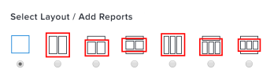

# Comprendere come vengono visualizzati i rapporti in un dashboard

<!-- Audited: 1/2025 -->

Puoi gestire il modo in cui i rapporti aggiunti alle dashboard vengono visualizzati nelle dashboard.

Per informazioni sulla modifica del layout dei report in un dashboard, vedere [Creare un dashboard](../../../reports-and-dashboards/dashboards/creating-and-managing-dashboards/create-dashboard.md).

Puoi selezionare le colonne del rapporto da visualizzare in un dashboard quando crei o modifichi un rapporto facendo clic su [!UICONTROL **Opzioni avanzate**] in [!UICONTROL **Impostazioni colonna**]. Se desideri visualizzare tutte le colonne del rapporto su un dashboard, accertati di specificarlo per ogni colonna del rapporto.

Per ulteriori informazioni sulla selezione delle colonne da visualizzare in un dashboard, vedere [Creare un report personalizzato](../../../reports-and-dashboards/reports/creating-and-managing-reports/create-custom-report.md).

## Mostra tutte le colonne del report su un dashboard

Quando il report viene selezionato per un&#39;area del dashboard che occupa l&#39;intera larghezza del dashboard, per impostazione predefinita tutte le colonne del report vengono visualizzate nel dashboard.\

## Mostra solo la prima colonna del report su un dashboard

Quando il rapporto è selezionato per un’area del dashboard che occupa meno della larghezza intera del dashboard, per impostazione predefinita nel dashboard viene visualizzata solo la prima colonna del rapporto.\

