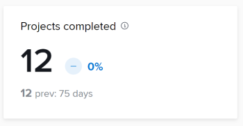

# Query KPI

Puoi utilizzare le query in questo articolo per creare visualizzazioni di dati simili a quelle in Analisi avanzate.

>[!IMPORTANT]
>
>Le query produrranno risultati simili a quelli mostrati in Analisi avanzate, ma potrebbero non corrispondere esattamente.


## Prerequisiti

Prima di iniziare, è necessario

1. Stabilire una connessione con lo strumento Business Intelligence (BI):
   1. [Creare un account o una connessione di lettura per Snowflake](/help/quicksilver/reports-and-dashboards/data-lake/create-a-reader-account.md)
   1. [Stabilire una connessione a Workfront Data Connect](/help/quicksilver/reports-and-dashboards/data-lake/share-data-externally.md)

Una volta stabilita una connessione, puoi utilizzare le query in questo articolo per estrarre e visualizzare i dati.

## Progetti completati

L&#39;indicatore prestazioni chiave Progetti completati mostra quanti progetti sono stati completati nel periodo di tempo filtrato e come la percentuale è aumentata o diminuita rispetto al periodo di tempo precedente. Sotto questi numeri è possibile visualizzare il numero di progetti completati nel periodo di tempo precedente e il numero di giorni nel periodo di tempo precedente.



### Query

```
WITH completedProjectsInRange as ( 
SELECT COUNT(t0.PROJECTID) as PROJECT_COUNT FROM PROJECTS_CURRENT t0 
WHERE t0.ACTUALCOMPLETIONDATE >= '2025-01-01' 
AND t0.ACTUALCOMPLETIONDATE <= '2025-01-31' 
), completedProjectsPreviousRange as ( 
SELECT COUNT(t0.PROJECTID) as PROJECT_COUNT FROM PROJECTS_CURRENT t0 
WHERE t0.ACTUALCOMPLETIONDATE >= '2024-12-01' 
AND t0.ACTUALCOMPLETIONDATE <= '2024-12-31' 
), rawChange as ( 
SELECT (a.PROJECT_COUNT - b.PROJECT_COUNT) as CHANGE_FROM_PREVIOUS_PERIOD FROM completedProjectsInRange a, completedProjectsPreviousRange b 
), percentChange as ( 
SELECT  
CASE 
WHEN a.PROJECT_COUNT = b.PROJECT_COUNT THEN 0.00 
WHEN b.PROJECT_COUNT > 0 THEN ((a.PROJECT_COUNT - b.PROJECT_COUNT) / b.PROJECT_COUNT * 100) 
END AS PERCENT_CHANGE_FROM_PREVIOUS_PERIOD 
FROM completedProjectsInRange a, completedProjectsPreviousRange b 
) 
SELECT 
a.PROJECT_COUNT, 
b.PROJECT_COUNT as PREVIOUS_PROJECT_COUNT, 
c.CHANGE_FROM_PREVIOUS_PERIOD, 
d.PERCENT_CHANGE_FROM_PREVIOUS_PERIOD 
FROM completedProjectsInRange a, completedProjectsPreviousRange b, rawChange c, 
percentChange d
```

## Progetti completati in tempo

L&#39;indicatore prestazioni chiave Progetti completati puntualmente mostra la percentuale di progetti completati puntualmente entro il periodo di tempo filtrato, nonché il modo in cui la percentuale è aumentata o diminuita rispetto al periodo di tempo precedente. Sotto questi numeri è possibile visualizzare la percentuale di progetti completati puntualmente nel periodo di tempo precedente, nonché il numero di giorni nel periodo di tempo precedente.


## Media durata progetto

La media indicatore prestazioni chiave durata progetto mostra la quantità media di tempo di completamento (in giorni, settimane o anni) per i progetti con date di fine effettive entro il periodo di tempo filtrato, nonché la percentuale di aumento o di diminuzione rispetto al periodo di tempo precedente. Al di sotto di questi numeri, è possibile visualizzare la quantità media di tempo di completamento per i progetti con date di fine effettive nel periodo di tempo precedente, nonché il numero di giorni nel periodo di tempo precedente.


## Attività medie per progetto

L&#39;indicatore prestazioni chiave Attività medie per progetto mostra il numero medio di attività assegnate ai progetti nel periodo di tempo filtrato e il modo in cui la percentuale è aumentata o diminuita rispetto al periodo di tempo precedente. Sotto questi numeri è possibile visualizzare il numero medio di attività assegnate ai progetti nel periodo di tempo precedente e il numero di giorni nel periodo di tempo precedente.

