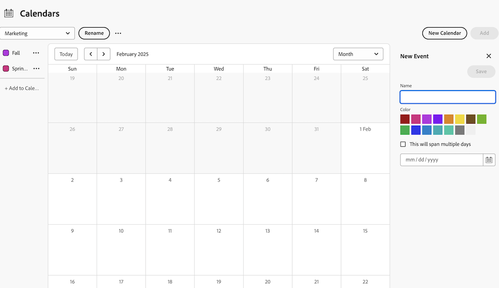

# Aggiungere eventi ad-hoc a un report calendario

Puoi aggiungere eventi ad hoc a un calendario. Un evento ad hoc funge semplicemente da promemoria nel calendario e non è associato a un progetto, un’attività o un problema.

## Requisiti di accesso

+++ Espandi per visualizzare i requisiti di accesso per la funzionalità descritta in questo articolo.

<table style="table-layout:auto"> 
 <col> 
 </col> 
 <col> 
 </col> 
 <tbody> 
  <tr> 
   <td role="rowheader">Pacchetto Adobe Workfront</td> 
   <td> 
Qualsiasi
 </td> 
  </tr> 
  <tr> 
   <td role="rowheader">Licenza di Adobe Workfront</td> 
   <td>
Standard

       
Piano
</td> 
  </tr> 
  <tr> 
   <td role="rowheader">Configurazioni del livello di accesso</td> 
   <td> 
 Modificare l’accesso a rapporti, dashboard e calendari
</td> 
  </tr> 
  <tr> 
   <td role="rowheader">Autorizzazioni sugli oggetti</td> 
   <td>Gestire l’accesso al report del calendario</td> 
  </tr> 
 </tbody> 
</table>

Per ulteriori dettagli sulle informazioni contenute in questa tabella, consulta [Requisiti di accesso nella documentazione Workfront](/help/quicksilver/administration-and-setup/add-users/access-levels-and-object-permissions/access-level-requirements-in-documentation.md).

+++

## Aggiungere eventi ad-hoc a un report calendario

1. Vai al Calendario a cui desideri aggiungere un evento ad hoc.
1. Fai clic su **Aggiungi** nella parte superiore del calendario.
1. Nel pannello laterale a destra, **Denomina** l&#39;evento.
1. Scegli un colore per l’evento.
1. Scegli se l’evento deve estendersi su più giorni.
1. Immettere o scegliere una data utilizzando l&#39;icona Calendario.
   