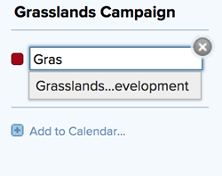

# Modificare un report calendario esistente

Puoi modificare un calendario esistente aggiungendo o eliminando un collegamento a un progetto. È inoltre possibile modificare i raggruppamenti di calendari associati a un report calendario.

>[!NOTE]
>
>Un rapporto calendario può contenere un massimo di 15 raggruppamenti.

## Requisiti di accesso

Per eseguire i passaggi descritti in questo articolo, è necessario disporre dei seguenti diritti di accesso:

<table style="table-layout:auto"> 
 <col> 
 </col> 
 <col> 
 </col> 
 <tbody> 
  <tr> 
   <td role="rowheader"><strong>[!DNL Adobe Workfront plan*]</strong></td> 
   <td> 
Qualsiasi
 </td> 
  </tr> 
  <tr> 
   <td role="rowheader"><strong>[!DNL Adobe Workfront] licenza*</strong></td> 
   <td> 
[!UICONTROL Plan] 
 </td> 
  </tr> 
  <tr> 
   <td role="rowheader"><strong>Configurazioni del livello di accesso*</strong></td> 
   <td> 
Accesso di [!UICONTROL Edit] a [!UICONTROL Reports], [!UICONTROL Dashboards] e [!UICONTROL Calendars]
 
Nota: se non disponi ancora dell'accesso, chiedi all'amministratore [!DNL Workfront] se ha impostato restrizioni aggiuntive nel tuo livello di accesso. Per informazioni su come un amministratore di [!DNL Workfront] può modificare il tuo livello di accesso, vedi <a href="../../../administration-and-setup/add-users/configure-and-grant-access/create-modify-access-levels.md" class="MCXref xref">Creare o modificare livelli di accesso personalizzati</a>.
 </td> 
  </tr> 
  <tr> 
   <td role="rowheader"><strong>Autorizzazioni oggetto</strong></td> 
   <td> 
Accesso [!UICONTROL Gestisci] al report calendario
 
Per informazioni sulla richiesta di accesso aggiuntivo, vedere <a href="../../../workfront-basics/grant-and-request-access-to-objects/request-access.md" class="MCXref xref">Richiedere l'accesso agli oggetti </a>.
 </td> 
  </tr> 
 </tbody> 
</table>

&#42;Per conoscere il piano, il tipo di licenza o l&#39;accesso di cui si dispone, contattare l&#39;amministratore [!DNL Workfront].

## Modificare un report calendario esistente

1. Fai clic sull&#39;icona  del **[!UICONTROL menu principale]** nell&#39;angolo superiore destro di [!DNL Adobe Workfront], quindi fai clic su **[!UICONTROL Calendari]**.

1. (Facoltativo) Per modificare il nome del report calendario, fare clic sul campo [!UICONTROL nome calendario], quindi apportare le modifiche desiderate.\
   \
   Se hai condiviso il report sul calendario con altri utenti o team, il nome del calendario modificato viene aggiornato automaticamente nella relativa vista calendario.

1. (Facoltativo) Per aggiungere un progetto al rapporto del calendario:

   1. Fai clic su **[!UICONTROL Aggiungi al calendario].**
   1. Nel campo **[!UICONTROL Nome progetto]**, inizia a digitare il nome di un progetto dal quale si desidera aggiungere eventi di calendario, quindi fai clic sul nome quando viene visualizzato nell&#39;elenco a discesa.\

      
Gli elementi del progetto e le attività e i problemi associati vengono aggiunti al rapporto del calendario.

1. (Facoltativo) Per aggiungere un raggruppamento di calendari o per modificare un raggruppamento di calendari esistente:

   1. Passa il puntatore del mouse sul nome del progetto, fai clic sulla freccia a discesa accanto al nome del progetto, quindi fai clic su **[!UICONTROL Modifica]**.\

      

   1. Scegliere la modalità di raggruppamento degli elementi:

      * [Usa [!UICONTROL date pianificate] in un report calendario](../../../reports-and-dashboards/reports/calendars/use-planned-dates.md)
      * [Usa [!UICONTROL Date previste] in un report calendario](../../../reports-and-dashboards/reports/calendars/use-projected-dates.md)
      * [Utilizzare campi data personalizzati in un report calendario](../../../reports-and-dashboards/reports/calendars/use-custom-dates.md)
