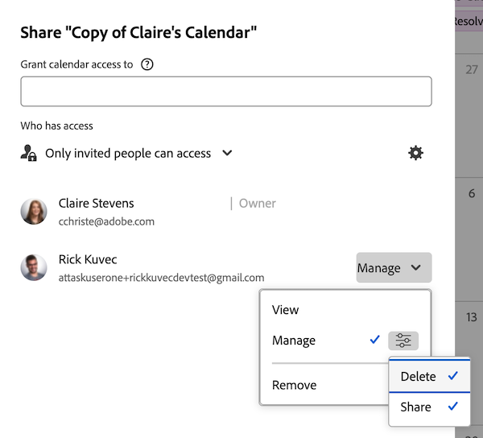

# Condivisione di un report calendario

Le informazioni evidenziate in questa pagina si riferiscono a funzionalità non ancora generalmente disponibili. È disponibile solo nell&#39;ambiente Sandbox di anteprima.

È possibile condividere un calendario con altri utenti e renderlo disponibile pubblicamente, consentendo a un utente senza una licenza [!DNL Adobe Workfront] di visualizzarlo.

## Requisiti di accesso

+++ Espandi per visualizzare i requisiti di accesso per la funzionalità in questo articolo.

Per eseguire i passaggi descritti in questo articolo, è necessario disporre dei seguenti diritti di accesso:

<table style="table-layout:auto"> 
 <col> 
 </col> 
 <col> 
 </col> 
 <tbody> 
  <tr> 
   <td role="rowheader">[!DNL Adobe Workfront plan]</td> 
   <td> 
Qualsiasi
 </td> 
  </tr> 
  <tr> 
   <td role="rowheader">[!DNL Adobe Workfront] licenza</td> 
   <td>
Nuovo: Chiaro

       
oppure

       
Corrente: Revisione
</td> 
  </tr> 
  <tr> 
   <td role="rowheader">Configurazioni del livello di accesso</td> 
   <td> 
Accesso di [!UICONTROL View] o versione successiva a [!UICONTROL Reports], [!UICONTROL Dashboards] e [!UICONTROL Calendars]
</td> 
  </tr> 
  <tr> 
   <td role="rowheader">Autorizzazioni oggetto</td> 
   <td>Autorizzazioni di [!UICONTROL View] o superiori per il report del calendario, con accesso alla condivisione</td> 
  </tr> 
 </tbody> 
</table>

Per ulteriori dettagli sulle informazioni contenute in questa tabella, vedere [Requisiti di accesso nella documentazione di Workfront](/help/quicksilver/administration-and-setup/add-users/access-levels-and-object-permissions/access-level-requirements-in-documentation.md).

+++

## Condividi un calendario con [!DNL Workfront] utenti {#share-a-calendar-with-workfront-users}

La condivisione di un calendario è simile alla condivisione di altri oggetti. Per ulteriori informazioni sulla condivisione di oggetti in [!DNL Adobe Workfront], vedere [Panoramica sulle autorizzazioni di condivisione per gli oggetti](../../../workfront-basics/grant-and-request-access-to-objects/sharing-permissions-on-objects-overview.md).

I calendari condivisi con l&#39;utente vengono visualizzati con un asterisco (&#42;) accanto al nome del calendario.

Per condividere un calendario in [!DNL Workfront]:

1. Vai al calendario che desideri condividere.
1. In Anteprima, fai clic sul menu **Altro** accanto al nome del calendario, quindi fai clic su **Condivisione**.
   
1. Fai clic su **[!UICONTROL Azioni calendario]**, quindi su **[!UICONTROL Condivisione]**.

1. Nel campo **[!UICONTROL Concedi accesso al calendario]**, inizia a digitare il nome dell&#39;utente, del team, della mansione, del gruppo o della società che desideri condividere il calendario, quindi fai clic sul nome quando viene visualizzato nell&#39;elenco a discesa.\
   Per informazioni sull&#39;impostazione delle autorizzazioni, vedere [Panoramica sulle autorizzazioni di condivisione per gli oggetti](../../../workfront-basics/grant-and-request-access-to-objects/sharing-permissions-on-objects-overview.md).

1. (Facoltativo) Ripeti il passaggio 3 per ogni utente, team, ruolo o gruppo a cui desideri concedere l’accesso al calendario.
1. Specifica le autorizzazioni per ogni utente, team, ruolo, gruppo o azienda aggiunti al passaggio 3 facendo clic sul menu a discesa, quindi seleziona il livello di autorizzazione che desideri concedere:

   * **[!UICONTROL Visualizza]:** Gli utenti possono esaminare e condividere il calendario.

     
     <!---->

   * **[!UICONTROL Gestisci]:** Gli utenti hanno accesso completo al calendario, meno i diritti amministrativi concessi al livello di accesso, più tutte le autorizzazioni di visualizzazione.

     
     <!---->

     >[!NOTE]
     >
     >L&#39;amministratore [!DNL Workfront] e l&#39;autore del calendario possono rimuovere le autorizzazioni da queste entità.

1. (Facoltativo) A seconda del ruolo di un utente, è possibile fare clic su **[!UICONTROL Opzioni avanzate]**, quindi su **[!UICONTROL Condividi]**&#x200B; per consentire all&#39;utente di condividere il calendario con altri utenti.

   Per ulteriori informazioni sui livelli di autorizzazione, vedere [Panoramica sulla condivisione delle autorizzazioni sugli oggetti](../../../workfront-basics/grant-and-request-access-to-objects/sharing-permissions-on-objects-overview.md).

1. (Facoltativo) Per rendere il calendario disponibile a tutti gli utenti [!DNL Workfront], fai clic sull&#39;icona a forma di ingranaggio, quindi nel menu a discesa fai clic su **[!UICONTROL Rendi visibile a livello di sistema]** per rendere l&#39;oggetto disponibile a tutti gli utenti [!DNL Workfront].\
   Tutti gli utenti possono visualizzare l’oggetto in base alle autorizzazioni impostate.

1. Fai clic su **[!UICONTROL Salva]**.

## Condividere un calendario con un collegamento pubblico

È possibile rendere pubblico un calendario e condividere un collegamento con utenti che non dispongono di una licenza [!DNL Workfront].

1. Vai al calendario che desideri condividere.
1. Fai clic su **[!UICONTROL Azioni calendario]**, quindi su **[!UICONTROL Condivisione]**.
1. In Anteprima, fare clic sul menu **Altro** accanto al nome del calendario.
   

1. Fai clic sull&#39;icona a forma di ingranaggio, quindi fai clic su **[!UICONTROL Rendi pubblico per gli utenti esterni]**.
1. Fai clic su **[!UICONTROL Copia collegamento]**.
1. In anteprima, fai clic su **Copia collegamento pubblico**.
1. Fai clic su **[!UICONTROL Salva]**.

## Condividere un calendario con un collegamento privato

È possibile condividere un collegamento privato al calendario con [!DNL Workfront] utenti. Gli utenti devono effettuare l’accesso per visualizzare il calendario quando utilizzano il collegamento.

1. Vai al calendario che desideri condividere.
1. In Anteprima, fai clic sul menu **Altro** accanto al nome del calendario, quindi fai clic su **[!UICONTROL Ottieni collegamento condivisibile]**.
   
1. Fai clic su **[!UICONTROL Azioni calendario]**, quindi su **[!UICONTROL Ottieni collegamento condivisibile]**.
1. Fai clic su **[!UICONTROL Copia collegamento]**.

   >[!NOTE]
   >
   >[!DNL Workfront] utenti devono avere accesso al calendario per potervi accedere con il collegamento. Per concedere l&#39;accesso, vedi [Condividere un calendario con [!DNL Workfront] utenti](#share-a-calendar-with-workfront-users).\
   >Se gli utenti non dispongono dell’accesso, possono richiederlo dopo aver incollato il collegamento nel browser.
