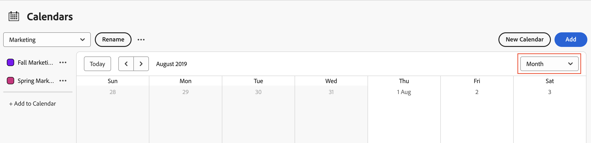

# Visualizzare i report calendario e i dettagli dell’evento

Puoi visualizzare i report del calendario e i dettagli degli eventi creati o condivisi con te in Adobe Workfront.

## Requisiti di accesso

+++ Espandi per visualizzare i requisiti di accesso per la funzionalità descritta in questo articolo.

<table style="table-layout:auto"> 
 <col> 
 </col> 
 <col> 
 </col> 
 <tbody> 
  <tr> 
   <td role="rowheader">Pacchetto Adobe Workfront</td> 
   <td> 
Qualsiasi
 </td> 
  </tr> 
  <tr> 
   <td role="rowheader">Licenza di Adobe Workfront</td> 
   <td>
Collaboratore

       
Richiesta
</td> 
  </tr> 
  <tr> 
   <td role="rowheader">Configurazioni del livello di accesso</td> 
   <td> 
Visualizzare o accedere più facilmente a report, dashboard e calendari
</td> 
  </tr> 
  <tr> 
   <td role="rowheader">Autorizzazioni sugli oggetti</td> 
   <td>Visualizzare o aumentare le autorizzazioni per il report del calendario</td> 
  </tr> 
 </tbody> 
</table>

Per ulteriori dettagli sulle informazioni contenute in questa tabella, consulta [Requisiti di accesso nella documentazione Workfront](/help/quicksilver/administration-and-setup/add-users/access-levels-and-object-permissions/access-level-requirements-in-documentation.md).

+++

## Visualizzare un report calendario

<!--{{step1-to-calendars}}-->

1. Fate clic sull&#39;icona **[!UICONTROL Menu principale]**  nell&#39;angolo superiore destro di Adobe Workfront oppure, se disponibile, fate clic sull&#39;icona **[!UICONTROL Menu principale]**  nell&#39;angolo superiore sinistro, quindi fate clic su **[!UICONTROL Calendari]**.

   A seconda del livello di accesso, è possibile che vengano elencati i calendari seguenti:

   * Calendario predefinito di [!DNL Adobe Workfront]

     Workfront crea automaticamente un calendario in base ai progetti, alle attività e ai problemi assegnati all&#39;utente o ai team, ai gruppi o ai ruoli a cui è assegnato l&#39;utente.

   * Calendari creati

     Per informazioni sulla creazione di calendari, vedere [Panoramica dei report del calendario](../../../reports-and-dashboards/reports/calendars/calendar-reports-overview.md).

   * Calendari condivisi da altri utenti

     Per informazioni sulla condivisione dei calendari, vedere [[!UICONTROL Condividi un calendario] report](../../../reports-and-dashboards/reports/calendars/share-a-calendar-report.md).

1. (Condizionale) Fare clic sul menu a discesa **[!UICONTROL Visualizza]**, quindi selezionare la durata del calendario che si desidera visualizzare.
   
È possibile scegliere tra le seguenti visualizzazioni di report del calendario:

   * **[!UICONTROL Mese]**: visualizza quattro settimane del calendario
   * **[!UICONTROL Settimana]**: visualizza una settimana del calendario
   * **[!UICONTROL Gantt]**: visualizza una visualizzazione continua del calendario

     Puoi visualizzare più eventi in una visualizzazione **Gantt** scorrendo verso il basso o lateralmente. Durante la compilazione dei dati per la visualizzazione viene visualizzato un simbolo di caricamento.

   >[!NOTE]
   >
   >Nelle visualizzazioni **Mese** e **Settimana**, gli eventi correnti o futuri (inclusi gli eventi che si estendono su più giorni, a condizione che contengano oggi o un giorno futuro) hanno uno sfondo corrispondente al colore nel progetto o nel raggruppamento del calendario. Gli eventi passati hanno un’ombreggiatura più chiara per indicare che non sono più attuali, ma potete comunque selezionarli e visualizzarli.

1. (Facoltativo) Se stai visualizzando il calendario nelle visualizzazioni **Mese** o **Settimana**, puoi modificare la visualizzazione del calendario con le seguenti opzioni:

   <!--   * To include or exclude weekends:
      1. On the **[!UICONTROL Calendar]** toolbar, click **[!UICONTROL Calendar Actions]**, then from the drop-down list select either **[!UICONTROL Show Weekend]** or **[!UICONTROL Hide Weekend]**.-->

   * Per modificare rapidamente le date visualizzate:

      1. Sulla barra degli strumenti **[!UICONTROL Calendario]** fare clic sulla freccia sinistra dell&#39;indicatore della data per spostarsi nuovamente nel calendario oppure sulla freccia destra per spostarsi in avanti.

         

         Le date visualizzate vengono modificate in base a un intervallo in base alla visualizzazione corrente del calendario. Ad esempio, se si visualizza il calendario nella visualizzazione **Settimana**, il calendario visualizza una settimana avanti o indietro, a seconda della freccia selezionata.

      1. (Facoltativo) Per tornare al giorno corrente, fare clic su [!UICONTROL **Oggi**].

1. (Facoltativo) Per nascondere gli eventi di un progetto o di un gruppo di calendari collegato al calendario, deselezionare il gruppo di progetti o di calendari nell&#39;elenco dei progetti.
   
È possibile rendere nuovamente visibili gli eventi selezionando il [!UICONTROL progetto] o il raggruppamento di calendari nell&#39;elenco dei progetti.

## Visualizza dettagli evento report calendario

È possibile visualizzare i dettagli di un evento in un calendario, sia per gli eventi correnti che per quelli passati.

1. Passare all&#39;evento per il quale si desidera conoscere i dettagli, quindi fare clic sull&#39;evento. I dettagli si aprono in un pannello sul lato destro.
1. (Facoltativo) Per aprire il progetto, l&#39;attività o il problema associato, fare clic sul titolo dell&#39;oggetto.
