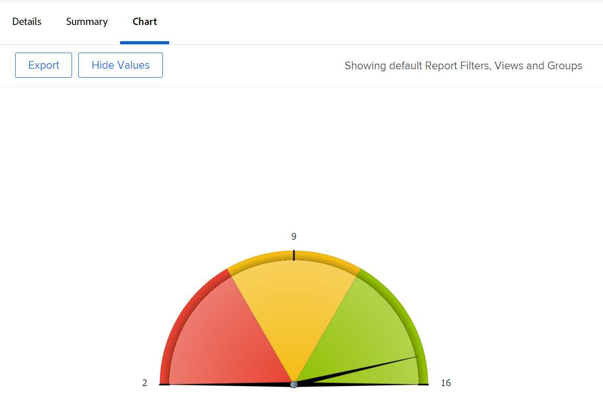

# Aggiungere un grafico a un report

Puoi migliorare i rapporti aggiungendo un grafico. È possibile aggiungere grafici a rapporti esistenti o a rapporti in fase di creazione.

Prima di aggiungere un grafico a un rapporto, è necessario creare una visualizzazione e un raggruppamento per il rapporto. La maggior parte dei grafici può essere aggiunta solo se le informazioni sono raggruppate nel rapporto. L’unico grafico che può essere aggiunto senza un raggruppamento è un grafico a indicatori.\
Per informazioni su come creare una visualizzazione, consulta [Panoramica delle visualizzazioni in Adobe Workfront](../../../reports-and-dashboards/reports/reporting-elements/views-overview.md).\
Per ulteriori informazioni sui raggruppamenti, vedi [Panoramica sui raggruppamenti in Adobe Workfront](../../../reports-and-dashboards/reports/reporting-elements/groupings-overview.md).

Se il rapporto visualizza troppi elementi, non viene creato alcun grafico. In questo caso, devi anche aggiungere un filtro al rapporto per ridurre il numero di risultati nel rapporto.\
Per ulteriori informazioni sui filtri, vedi [Panoramica sui filtri in Adobe Workfront](../../../reports-and-dashboards/reports/reporting-elements/filters-overview.md).

## Requisiti di accesso

Per eseguire i passaggi descritti in questo articolo, è necessario disporre dei seguenti diritti di accesso:

<table style="table-layout:auto"> 
 <col> 
 <col> 
 <tbody> 
  <tr> 
   <td role="rowheader">piano Adobe Workfront*</td> 
   <td> 
Qualsiasi
 </td> 
  </tr> 
  <tr> 
   <td role="rowheader">Licenza Adobe Workfront*</td> 
   <td> 
Piano 
 </td> 
  </tr> 
  <tr> 
   <td role="rowheader">Configurazioni a livello di accesso*</td> 
   <td> 
Accesso a rapporti, dashboard, calendari
 
Modificare l’accesso a Filtri, Visualizzazioni, Gruppi
 
Nota: Se non disponi ancora dell’accesso, chiedi all’amministratore Workfront se ha impostato ulteriori restrizioni nel livello di accesso. Per informazioni su come un amministratore Workfront può modificare il livello di accesso, consulta <a href="../../../administration-and-setup/add-users/configure-and-grant-access/create-modify-access-levels.md" class="MCXref xref">Creare o modificare livelli di accesso personalizzati</a>.
 </td> 
  </tr> 
  <tr> 
   <td role="rowheader">Autorizzazioni oggetto</td> 
   <td> 
Gestire le autorizzazioni per un rapporto
 
Per informazioni sulla richiesta di accesso aggiuntivo, vedi <a href="../../../workfront-basics/grant-and-request-access-to-objects/request-access.md" class="MCXref xref">Richiedere l’accesso agli oggetti </a>.
 </td> 
  </tr> 
 </tbody> 
</table>

&#42;Per informazioni sul piano, il tipo di licenza o l&#39;accesso, contattare l&#39;amministratore Workfront.

## Aggiungere un grafico a un report

1. Passa a un rapporto esistente o creane uno nuovo. Per ulteriori informazioni sulla creazione di un nuovo rapporto, vedi [Creare un rapporto personalizzato](../../../reports-and-dashboards/reports/creating-and-managing-reports/create-custom-report.md).
1. (Condizionale) Se hai passato a un rapporto esistente, fai clic su **Azioni dei rapporti** > **Modifica**.

1. Assicurati che **Colonne (visualizzazione)** è stata aggiornata per soddisfare le esigenze del rapporto.\
   Per informazioni su come creare o modificare la visualizzazione del rapporto, vedi [Panoramica delle visualizzazioni in Adobe Workfront](../../../reports-and-dashboards/reports/reporting-elements/views-overview.md).

1. Fai clic sul pulsante **Raggruppamenti** e aggiungi un raggruppamento.

   >[!TIP]
   >
   >* È possibile aggiungere un grafico a un rapporto solo quando i risultati del rapporto sono raggruppati.
   >* I raggruppamenti in modalità testo non sono supportati nei grafici. Per ulteriori informazioni sui raggruppamenti in modalità testo, consulta [Modificare la modalità di testo in un raggruppamento](../../../reports-and-dashboards/reports/text-mode/edit-text-mode-in-grouping.md).
   >* Se aggiungi un singolo raggruppamento che rappresenta una metrica, tutti i grafici, tranne un grafico a torta, visualizzano ogni risultato nel raggruppamento come lo stesso colore.

   Per ulteriori informazioni sui raggruppamenti, vedi [Panoramica sui raggruppamenti in Adobe Workfront](../../../reports-and-dashboards/reports/reporting-elements/groupings-overview.md).

1. Seleziona la **Grafico** scheda .
1. Fare clic su un tipo di grafico per selezionarlo.\
   

1. È possibile aggiungere i seguenti tipi di grafici a un rapporto di Adobe Workfront:

   * [Grafico a colonne](#column-chart)
   * [Grafico a barre](#bar-chart)
   * [Grafico a torta](#pie-chart)
   * [Grafico a linee](#line-chart)
   * [Grafico a barre](#gauge-chart)
   * [Grafico a bolle](#bubble-chart)

1. Fai clic su **Salva e chiudi** per salvare il grafico e il rapporto.

### Grafico a colonne {#column-chart}

Per aggiungere una **Colonna** grafico al rapporto:

1. Inizia ad aggiungere un grafico al report come descritto in [Aggiungere un grafico a un report](#add-a-chart-to-a-report).
1. In **Asse sinistro (Y)** selezionare i valori che si desidera includere sull&#39;asse Y del grafico, nonché la modalità di riepilogo delle informazioni.
1. In **Asse inferiore (X)** selezionare il gruppo da includere nel grafico.
1. (Facoltativo) Seleziona **Colori personalizzati** per assegnare i colori preferiti a ciascuna colonna.\
   Per ulteriori informazioni sulla personalizzazione dei colori dei grafici, consulta [Personalizzare i colori del grafico](#customize-chart-colors).

1. (Facoltativo) Seleziona **Mostra in 3D** per visualizzare il grafico in una vista tridimensionale.
1. (Facoltativo) **Colonne dei gruppi**: Selezionare questa opzione per definire la modalità di raggruppamento delle colonne.\
   Seleziona tra le seguenti opzioni:

   * Fare clic su una delle opzioni seguenti per selezionare la modalità di visualizzazione delle colonne raggruppate:\
      **- Lato a fianco**

      **- Impilate**
      **- Impilate al 100%**

   * Selezionare il raggruppamento da includere nel grafico.
   * (Facoltativo) Seleziona **Colori personalizzati** personalizzare i colori delle colonne.\
      Per ulteriori informazioni sulla personalizzazione dei colori dei grafici, consulta [Personalizzare i colori del grafico](#customize-chart-colors).

1. (Facoltativo) Seleziona **Grafico a combinazione** per includere un valore aggiuntivo nel grafico, nonché come si desidera riepilogare le informazioni.\
   Considera le seguenti opzioni:

   * **Traccia su asse secondario**: Selezionare questa opzione per tracciare i dati sul lato destro del grafico.
   * **Tipo di grafico**: Seleziona se desideri che questo valore aggiuntivo venga visualizzato come una riga o una terza colonna.\
      

1. Fai clic su **Salva e chiudi** per salvare il grafico e il rapporto.

### Grafico a barre {#bar-chart}

Per aggiungere una **Barre** grafico al rapporto:

1. Inizia ad aggiungere un grafico al report come descritto in [Aggiungere un grafico a un report](#add-a-chart-to-a-report).
1. In **Asse inferiore (X)** selezionare i valori che si desidera includere sull&#39;asse X del grafico, nonché la modalità di riepilogo delle informazioni.
1. In **Asse sinistro (Y)** selezionare il gruppo da includere nel grafico.
1. (Facoltativo) Seleziona **Colori personalizzati** personalizzare i colori delle barre.\
   Per ulteriori informazioni sulla personalizzazione dei colori dei grafici, consulta [Personalizzare i colori del grafico](#customize-chart-colors).

1. (Facoltativo) Seleziona **Mostra in 3D** per visualizzare il grafico in una vista tridimensionale.
1. (Facoltativo)**Barre dei gruppi**: Selezionare questa opzione per definire la modalità di raggruppamento delle barre.\
   Seleziona tra le seguenti opzioni:

   * Fare clic su una delle opzioni seguenti per selezionare la modalità di visualizzazione delle barre raggruppate:\
      **- Lato a fianco**

      **- Impilate**
      **- Impilate al 100%**

   * Selezionare il raggruppamento da includere nel grafico.
   * (Facoltativo) Seleziona **Colori personalizzati** personalizzare i colori delle colonne.\
      Per ulteriori informazioni sulla personalizzazione dei colori dei grafici, consulta [Personalizzare i colori del grafico](#customize-chart-colors).

1. (Facoltativo) Seleziona **Grafico a combinazione** per includere un valore aggiuntivo nel grafico, nonché come si desidera riepilogare le informazioni.\
   

1. Fai clic su **Salva e chiudi** per salvare il grafico e il rapporto.

### Grafico a torta {#pie-chart}

Per aggiungere una **Torta** grafico al rapporto:

1. Inizia ad aggiungere un grafico al report come descritto in [Aggiungere un grafico a un report](#add-a-chart-to-a-report).
1. In **Valori** selezionare i valori che si desidera visualizzare nel rapporto, nonché la modalità di riepilogo.\
   In **Borde** selezionare il gruppo da includere nel grafico. Il raggruppamento è rappresentato dai bordi del grafico.

1. (Facoltativo) Seleziona **Colori personalizzati** personalizzare i colori dei bordi del grafico.\
   Per ulteriori informazioni sulla personalizzazione dei colori dei grafici, consulta [Personalizzare i colori del grafico](#customize-chart-colors).

1. (Facoltativo) Seleziona **Mostra in 3D** per visualizzare il grafico in una vista tridimensionale.
1. In **Mostra risultati come** selezionare la modalità di visualizzazione dei risultati nel grafico. Considera le seguenti opzioni:

   * **Percentuale**: I risultati del grafico vengono visualizzati come percentuale.
   * **Numeri**: I risultati del grafico vengono visualizzati sotto forma di numero.\
      

1. Fai clic su **Salva e chiudi** per salvare il grafico e il rapporto.

### Grafico a linee {#line-chart}

Per aggiungere una **Linea** grafico al rapporto:

1. Inizia ad aggiungere un grafico al report come descritto in [Aggiungere un grafico a un report](#add-a-chart-to-a-report).
1. In **Asse sinistro (Y)** selezionare i valori che si desidera includere sull&#39;asse Y del grafico, nonché la modalità di riepilogo delle informazioni.
1. In **Asse inferiore (X)** selezionare il gruppo da includere nel grafico.
1. (Facoltativo) Selezionare un colore per personalizzare il colore della linea.
1. (Facoltativo) Seleziona **Linee di gruppo**, per selezionare un raggruppamento aggiuntivo per il grafico.\
   (Facoltativo) Seleziona **Colori personalizzati** per personalizzare i colori del nuovo raggruppamento.\
   Per ulteriori informazioni sulla personalizzazione dei colori dei grafici, consulta [Personalizzare i colori del grafico](#customize-chart-colors).

1. (Facoltativo) Seleziona **Grafico a combinazione** per combinare le righe in base a un valore aggiuntivo.\
   Prendi in considerazione le seguenti opzioni:

   * Selezionare il valore che si desidera includere nel grafico, nonché la modalità di riepilogo delle informazioni.
   * Seleziona la **Traccia su asse secondario** per tracciare i dati sul lato destro del grafico.\
      

1. Fai clic su **Salva e chiudi** per salvare il grafico e il rapporto.

### Grafico a barre {#gauge-chart}

A **Gabbia** grafico visualizza il numero di record che soddisfano determinati criteri in un formato indicatore. L&#39;indicatore del misuratore punta al numero di record che soddisfano i criteri selezionati nella visualizzazione e nel raggruppamento del report. Non è necessario un raggruppamento di rapporti per configurare un grafico a indicatori.

Per aggiungere una **Gabbia** grafico al rapporto:

1. Inizia ad aggiungere un grafico al report come descritto in [Aggiungere un grafico a un report](#add-a-chart-to-a-report).
1. In **Valori** selezionare i valori che si desidera visualizzare nel rapporto, nonché la modalità di riepilogo. Se si seleziona **Conteggio record**, i valori visualizzati sono l&#39;oggetto del rapporto.

1. In **Indicatori** selezionare il gruppo da includere nel grafico. Il raggruppamento è rappresentato dalla linea dell’indicatore sul grafico.\
   Se si dispone di un raggruppamento che contiene due elementi, sul grafico vengono visualizzati due indicatori.\
   Ad esempio, se disponi di un gruppo di stato del progetto e sono presenti due stati del progetto (corrente e in attesa), il grafico Gage contiene due indicatori di sagoma. Essi indicheranno il numero di progetti che si trovano in tale stato.\
   (Facoltativo) Seleziona **Totale** in **Indicatori** per visualizzare il totale degli oggetti selezionati nella **Valori** campo .

1. In **Intervallo valori** specificare l&#39;intervallo di valori e il colore da visualizzare nel grafico a intervalli.
1. (Facoltativo) Fai clic su **Aggiungi un altro intervallo di valori** per aggiungere al grafico intervalli di valori aggiuntivi.\
   

1. Fai clic su **Salva e chiudi** per salvare il grafico e il rapporto.

### Grafico a bolle {#bubble-chart}

È possibile visualizzare fino a tre campi di un oggetto in un **Bolla** grafico. Ciò significa che è possibile visualizzare fino a quattro punti dati in un grafico a bolle. Ogni entità con tre campi associati viene visualizzata come un cerchio che esprime due dei campi all’interno della relativa posizione all’interno degli assi X e Y. Il terzo campo è rappresentato dalle dimensioni del cerchio.

Per aggiungere una **Bolla** grafico al rapporto:

1. Inizia ad aggiungere un grafico al report come descritto in [Aggiungere un grafico a un report](#add-a-chart-to-a-report).
1. In **Asse sinistro (Y)** selezionare i valori che si desidera includere sull&#39;asse Y del grafico. I valori provengono dalla vista del rapporto. Specificare la modalità di riepilogo delle informazioni.
1. In **Campo Asse inferiore (X)**, selezionare i valori che si desidera includere sull&#39;asse X del grafico. I valori provengono dalla vista del rapporto. Specificare la modalità di riepilogo delle informazioni.

   >[!NOTE]
   >
   >Assicurati di disporre di almeno una colonna riepilogata per attivare il campo.\
   >Per ulteriori informazioni su come riepilogare le informazioni in una colonna del rapporto, consulta [Creare un rapporto personalizzato](../../../reports-and-dashboards/reports/creating-and-managing-reports/create-custom-report.md).

1. In **Dimensioni bolle** selezionare i valori che si desidera rappresentare in base alle dimensioni delle bolle nel grafico. I valori provengono dalla vista del rapporto. Specificare la modalità di riepilogo delle informazioni.

   >[!NOTE]
   >
   >Assicurati di disporre di almeno una colonna riepilogata per attivare il campo.\
   >Per ulteriori informazioni su come riepilogare le informazioni in una colonna del rapporto, consulta [Creare un rapporto personalizzato](../../../reports-and-dashboards/reports/creating-and-managing-reports/create-custom-report.md).

1. In **Bolle** selezionare il gruppo da includere nel grafico. Il raggruppamento è rappresentato dal posizionamento delle bolle nel grafico.
1. In **Colore bolle** selezionare il campo che si desidera rappresentare dai colori delle bolle. La **Colore bolle** può essere un raggruppamento definito nel rapporto, ma può essere solo un campo dell’oggetto selezionato come **Bolle**. Ad esempio, se hai selezionato Nome attività, puoi aggiungere Stato attività, ma non Stato progetto come **Colore bolle**.\
   

1. Fai clic su **Salva e chiudi** per salvare le modifiche apportate al generatore di interfacce.

## Esportare un grafico

È possibile esportare un grafico in un file .pdf.

Per esportare un grafico:

1. Fai clic su **Esporta** per esportare il grafico in formato .pdf.\
   Un file .pdf viene scaricato sul computer.

1. Apri il file .pdf .\
   Il file esportato include le seguenti informazioni:

   * Immagine del grafico.
   * Titolo che rappresenta il nome del report.
   * Un nome file univoco che corrisponde al nome del report.
   * Un piè di pagina con la data e l’ora dell’esportazione del rapporto e il numero di pagina.

## Personalizzare i colori del grafico {#customize-chart-colors}

È possibile consentire a Workfront di selezionare i colori degli elementi nel grafico oppure personalizzarli durante l&#39;aggiunta di un grafico ai rapporti. Se il grafico contiene un singolo raggruppamento che rappresenta una metrica, ad esempio un rapporto di attività che mostra la quantità di attività raggruppate per Data completamento effettivo, ogni risultato del raggruppamento viene visualizzato con lo stesso colore.

È possibile scegliere un solo colore per i campi visualizzati nella visualizzazione del rapporto. Puoi scegliere diversi colori, uno per ogni opzione, per i campi visualizzati nel Raggruppamento del rapporto.

>[!IMPORTANT]
>
>Per i campi data, è possibile selezionare un solo colore per gli elementi grafico.

Per personalizzare i colori del grafico:

1. Durante la creazione di un rapporto, vai alla pagina **Grafico** nel generatore di report.
1. Selezionare un tipo di grafico da aggiungere al rapporto.\
   Per ulteriori informazioni sull&#39;aggiunta di un grafico al rapporto, consulta [Aggiungere un grafico a un report](#add-a-chart-to-a-report).

1. Fai clic su **Colori personalizzati** quando questo campo è disponibile.\
   Viene visualizzata la finestra di dialogo Colori personalizzati.\
   

   >[!NOTE]
   >
   >È possibile associare colori personalizzati a qualsiasi campo in cui è possibile raggruppare per e con alcuni campi che possono essere visualizzati in una visualizzazione, compresi i campi personalizzati. I campi personalizzati o le opzioni personalizzate dei campi selezionati nella finestra di dialogo Colore personalizzato fanno distinzione tra maiuscole e minuscole.

1. Scegli una delle seguenti opzioni:

   * **Utilizza un colore**: Tutti gli elementi del grafico verranno visualizzati nel colore selezionato.

      1. Inizia a digitare il nome di un’opzione del campo selezionato, quindi seleziona un colore. Questa opzione viene visualizzata nel colore selezionato del grafico.
      1. (Facoltativo) Specifica un valore di colore esadecimale per il colore, invece di selezionarne uno dai campioni di colore disponibili\
         Oppure\
         Fai clic sul selettore colore visualizzato dopo aver fatto clic sul codice esadecimale e seleziona un altro colore.
   * **Aggiungi colore**: Continua ad aggiungere colori personalizzati per tutte le altre opzioni possibili del campo selezionato.
   * **Rimuovi tutto**: Selezionare questa opzione per rimuovere tutti i colori e le opzioni del campo selezionato in precedenza.
   * **Opzioni avanzate**: Seleziona tra le seguenti opzioni:

      * **Nessun valore**: Selezionare questo campo e un colore personalizzato per visualizzare la colonna del grafico che raggruppa gli elementi &quot;nessun valore&quot;. Si tratta di elementi che non possono essere raggruppati in base alle opzioni del campo selezionato nel raggruppamento.
      * **Tutti gli altri valori**: Selezionare questo campo e un colore personalizzato per visualizzare tutti gli altri elementi del grafico le cui opzioni non sono selezionate sopra.

         >[!NOTE]
         >
         >I colori utilizzati più di recente vengono visualizzati nella parte superiore della finestra di dialogo Colori personalizzati. Quando passi il mouse su un colore utilizzato di recente, viene visualizzato il nome del campo associato.

1. Fare clic sulla &quot;x&quot; nell&#39;angolo superiore destro della finestra di dialogo Colori personalizzati per chiudere la finestra di dialogo Colori personalizzati. I colori selezionati vengono salvati automaticamente.
1. Fai clic su **Salva e chiudi** per salvare il grafico ed eseguire il rapporto.

## Rimuovere un grafico da un report

Per rimuovere un grafico da un report:

1. Apri **Grafico** scheda del generatore di report.
1. Passa il puntatore del mouse sull&#39;icona del tipo di grafico scelto e nell&#39;angolo superiore destro dell&#39;icona verrà visualizzato un pulsante &quot;x&quot;.
1. Fare clic sulla &quot;x&quot; per rimuovere il grafico.
1. Fai clic su **Salva e chiudi**.

## Limitazioni durante l’utilizzo dei grafici

Quando lavori con i grafici, tieni presente le seguenti limitazioni:

* La **Anteprima grafico** a destra di Report Builder non contiene dati effettivi provenienti dal report. È necessario salvare il grafico e visualizzarlo dal **Grafico** per visualizzare il grafico con i dati.

* Alcuni elementi del grafico non sono modificabili:

   * Non è possibile modificare il tipo di carattere né le dimensioni dei valori di ciascun elemento.
   * Non è possibile modificare i nomi degli assi nel grafico.

* Non è possibile modificare la legenda del grafico.
* Quando si utilizzano campi calcolati per i raggruppamenti, non è possibile fare clic sugli elementi del grafico.
* La maggior parte dei punti dati che è possibile visualizzare in un grafico è in quattro, in un grafico a bolle. Tutti gli altri tipi di grafico presentano due o un massimo di tre punti di dati.
