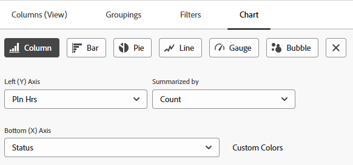

# Aggiungere un grafico a un report

<!--Audited: 11/2024-->

Puoi migliorare i rapporti aggiungendo un grafico. È possibile aggiungere grafici ai rapporti esistenti o ai rapporti che si stanno creando.

Prima di aggiungere un grafico a un report, è necessario creare una visualizzazione e un raggruppamento per il report.

Non è possibile aggiungere grafici alla maggior parte dei rapporti a meno che non si raggruppino prima le informazioni nel rapporto. L&#39;unico grafico che può essere aggiunto senza raggruppamento è un grafico a contatori.

Per informazioni sulle visualizzazioni, vedere [Panoramica delle visualizzazioni in Adobe Workfront](../../../reports-and-dashboards/reports/reporting-elements/views-overview.md).

Per ulteriori informazioni sui raggruppamenti, vedere [Panoramica sui raggruppamenti in Adobe Workfront](../../../reports-and-dashboards/reports/reporting-elements/groupings-overview.md).

Se nel report vengono visualizzati troppi elementi, non viene creato un grafico. In questo caso, devi anche aggiungere un filtro al rapporto per ridurre il numero di risultati.

Per ulteriori informazioni sui filtri, vedere [Panoramica sui filtri](../../../reports-and-dashboards/reports/reporting-elements/filters-overview.md).

## Requisiti di accesso

+++ Espandi per visualizzare i requisiti di accesso per la funzionalità in questo articolo.

Per eseguire i passaggi descritti in questo articolo, è necessario disporre dei seguenti diritti di accesso:

<table style="table-layout:auto"> 
 <col> 
 <col> 
 <tbody> 
  <tr> 
   <td role="rowheader">piano Adobe Workfront</td> 
   <td> 
Qualsiasi
 </td> 
  </tr> 
  <tr> 
   <td role="rowheader">Licenza Adobe Workfront*</td> 
   <td> 
      
Nuovo:

         <ul>
         <li>
Standard
</li>
         </ul>
      
Corrente:

         <ul>
         <li>
Piano
</li>
         </ul>
   </td>
  </tr> 
  <tr> 
   <td role="rowheader">Configurazione del livello di accesso</td> 
   <td> 
Modificare l’accesso a Rapporti, Dashboard, Calendari
 
Modifica accesso a Filtri, Viste, Raggruppamenti
 </td> 
  </tr> 
  <tr> 
   <td role="rowheader">Autorizzazioni oggetto</td> 
   <td> 
Gestire le autorizzazioni per un rapporto
  </td> 
  </tr> 
 </tbody> 
</table>

*Per informazioni, consulta [Requisiti di accesso nella documentazione di Workfront](/help/quicksilver/administration-and-setup/add-users/access-levels-and-object-permissions/access-level-requirements-in-documentation.md).

+++

## Aggiungere un grafico a un report

1. Passa a un rapporto esistente o creane uno nuovo. Per ulteriori informazioni sulla creazione di un nuovo report, vedere [Creare un report personalizzato](../../../reports-and-dashboards/reports/creating-and-managing-reports/create-custom-report.md).

1. (Condizionale) Se hai scelto un report esistente, fai clic su **Azioni report** > **Modifica**.

1. Verificare che la scheda **Colonne (visualizzazione)** sia stata aggiornata per visualizzare le informazioni che si desidera tracciare nel report.

   Per informazioni su come creare o modificare la visualizzazione per il report, vedere [Creare o modificare le visualizzazioni in Adobe Workfront](/help/quicksilver/reports-and-dashboards/reports/reporting-elements/create-edit-views.md).

1. Fai clic sulla scheda **Raggruppamenti** e aggiungi un raggruppamento.

   >[!TIP]
   >
   >* È possibile aggiungere un grafico a un report solo quando i risultati sono raggruppati.
   >* I raggruppamenti in modalità testo non sono supportati nei grafici. Per ulteriori informazioni sui raggruppamenti in modalità testo, vedere [Modificare un raggruppamento utilizzando la modalità testo](../../../reports-and-dashboards/reports/text-mode/edit-text-mode-in-grouping.md).
   >* Se aggiungi un singolo raggruppamento che rappresenta una metrica, tutti i grafici eccetto un grafico a torta visualizzano ciascuno come risultato del raggruppamento dello stesso colore.

   Per ulteriori informazioni sulla creazione di raggruppamenti, vedere [Creare raggruppamenti in Adobe Workfront](/help/quicksilver/reports-and-dashboards/reports/reporting-elements/create-groupings.md).

1. Selezionare la scheda **Grafico**.

1. Fare clic su un tipo di grafico per selezionarlo.\
   

1. Selezionare uno dei seguenti tipi di grafici:

   * [Istogramma](#column-chart)
   * [Grafico a barre](#bar-chart)
   * [Grafico a torta](#pie-chart)
   * [Grafico a linee](#line-chart)
   * [Grafico a barre](#gauge-chart)
   * [Grafico a bolle](#bubble-chart)

1. Fai clic su **Salva + Chiudi** per salvare il grafico e il report.

### Istogramma {#column-chart}

Per aggiungere un grafico **Colonna** al report:

1. Inizia ad aggiungere un grafico al tuo report, come descritto in [Aggiungi un grafico a un report](#add-a-chart-to-a-report).

1. Nel campo **Asse sinistro**, selezionare i valori che si desidera includere sull&#39;asse Y del grafico, quindi selezionare la modalità di riepilogo delle informazioni nel campo **Riepilogato per**.

1. (Facoltativo) Fai clic su **Colori personalizzati** per assegnare colori preferiti a ciascuna colonna.\
   Per ulteriori informazioni sulla personalizzazione dei colori dei grafici, vedere [Personalizzare i colori dei grafici](#customize-chart-colors).

1. Nel campo **Asse inferiore (X)** selezionare il raggruppamento che si desidera includere nel grafico.

1. (Facoltativo) Fare clic su **Mostra in 3D** per visualizzare il grafico in una visualizzazione tridimensionale.

1. (Facoltativo) **Raggruppa colonne**: selezionare questa opzione per definire la modalità di raggruppamento delle colonne.\
   Selezionare una delle opzioni seguenti:

   * Fare clic su una delle opzioni seguenti per selezionare la modalità di visualizzazione delle colonne raggruppate:

      * **Affiancati**
      * **In pila**
      * **Sovrapposizione al 100%**

   * Selezionare il raggruppamento che si desidera includere nel grafico dal menu a discesa **Raggruppa dati per**.
   * (Facoltativo) Fai clic su **Colori personalizzati** per personalizzare i colori delle colonne.\
     Per ulteriori informazioni sulla personalizzazione dei colori dei grafici, vedere [Personalizzare i colori dei grafici](#customize-chart-colors).

1. (Facoltativo) Fare clic su **Grafico combinato** per includere un valore aggiuntivo nel grafico, nonché su come si desidera riepilogare le informazioni.\
   Considera le seguenti opzioni:

   * **Traccia sull&#39;asse secondario**: selezionare questa opzione per tracciare i dati sul lato destro del grafico.
   * **Tipo di grafico**: selezionare se si desidera che questo valore aggiuntivo venga visualizzato come una riga o una terza colonna.

1. Fai clic su **Salva + Chiudi** per salvare il grafico e il report.

### Grafico a barre {#bar-chart}

Per aggiungere un grafico a **barre** al report:

1. Inizia ad aggiungere un grafico al tuo report, come descritto in [Aggiungi un grafico a un report](#add-a-chart-to-a-report).

1. Nel campo **Asse inferiore (X)**, selezionare i valori che si desidera includere sull&#39;asse X del grafico, quindi selezionare la modalità di riepilogo delle informazioni nel campo **Riepilogato per**.

1. (Facoltativo) Fai clic su **Colori personalizzati** per personalizzare i colori delle barre.\
   Per ulteriori informazioni sulla personalizzazione dei colori dei grafici, vedere [Personalizzare i colori dei grafici](#customize-chart-colors).

1. Nel campo **Asse sinistro** selezionare il raggruppamento che si desidera includere nel grafico.

1. (Facoltativo) Fare clic su **Mostra in 3D** per visualizzare il grafico in una visualizzazione tridimensionale.

1. (Facoltativo) Fai clic su **Raggruppa barre** per definire la modalità di raggruppamento delle barre.\
   Selezionare una delle opzioni seguenti:

   * Fare clic su una delle opzioni seguenti per selezionare la modalità di visualizzazione delle barre raggruppate:

      * **Affiancati**
      * **In pila**
      * **Sovrapposizione al 100%**

   * Selezionare la modalità di raggruppamento delle informazioni nel grafico dal menu a discesa **Raggruppa dati per**.
   * (Facoltativo) Fai clic su **Colori personalizzati** per personalizzare i colori delle colonne.\
     Per ulteriori informazioni sulla personalizzazione dei colori dei grafici, vedere [Personalizzare i colori dei grafici](#customize-chart-colors).

1. (Facoltativo) Fare clic su **Grafico combinato** per includere un valore aggiuntivo nel grafico, nonché su come si desidera riepilogare le informazioni.

1. Fai clic su **Salva + Chiudi** per salvare il grafico e il report.

>[!IMPORTANT]
>
>Limitare i grafici a barre a un massimo di 23 barre, poiché i grafici a barre che includono più di 23 barre non visualizzano correttamente tutte le etichette delle barre.

### Grafico a torta {#pie-chart}

Per aggiungere un grafico **Torta** al report:

1. Inizia ad aggiungere un grafico al tuo report, come descritto in [Aggiungi un grafico a un report](#add-a-chart-to-a-report).

1. Nel campo **Valori**, selezionare i valori che si desidera visualizzare nel report, quindi selezionare la modalità di riepilogo delle informazioni nel campo **Riepilogato per**.\
   Nel campo **Cunei** selezionare il raggruppamento che si desidera includere nel grafico. Il raggruppamento è rappresentato dai cunei del grafico.

1. (Facoltativo) Fai clic su **Colori personalizzati** per personalizzare i colori dei cunei nel grafico.\
   Per ulteriori informazioni sulla personalizzazione dei colori dei grafici, vedere [Personalizzare i colori dei grafici](#customize-chart-colors).

1. (Facoltativo) Fare clic su **Mostra in 3D** per visualizzare il grafico in una visualizzazione tridimensionale.

1. Nel campo **Mostra risultati come**, selezionare la modalità di visualizzazione dei risultati nel grafico. Considera le seguenti opzioni:

   * **Percentuale**: i risultati del grafico vengono visualizzati come percentuale.
   * **Numeri**: i risultati del grafico vengono visualizzati sotto forma di numero.

1. Fai clic su **Salva + Chiudi** per salvare il grafico e il report.

### Grafico a linee {#line-chart}

Per aggiungere un grafico **Line** al report:

1. Inizia ad aggiungere un grafico al tuo report, come descritto in [Aggiungi un grafico a un report](#add-a-chart-to-a-report).

1. Nel campo **Asse sinistro**, selezionare i valori che si desidera includere sull&#39;asse Y del grafico, quindi selezionare la modalità di riepilogo delle informazioni nel campo **Riepilogato per**.

1. Nel campo **Asse inferiore (X)** selezionare il raggruppamento che si desidera includere nel grafico.

1. (Facoltativo) Fare clic su **Raggruppa righe** per selezionare un raggruppamento aggiuntivo per il grafico.\
   (Facoltativo) Fai clic su **Colori personalizzati** per personalizzare i colori del nuovo raggruppamento.\
   Per ulteriori informazioni sulla personalizzazione dei colori dei grafici, vedere [Personalizzare i colori dei grafici](#customize-chart-colors).

1. (Facoltativo) Fai clic su **Grafico combinato** per combinare le righe di un valore aggiuntivo.\
   Considera tra le seguenti opzioni:

   * Selezionare il valore che si desidera includere nel grafico, nonché la modalità di riepilogo delle informazioni.
   * Fare clic sul campo **Traccia sull&#39;asse secondario** per tracciare i dati sul lato destro del grafico.

1. Fai clic su **Salva + Chiudi** per salvare il grafico e il report.

### Grafico a barre {#gauge-chart}

Un grafico **Misuratore** visualizza il numero di record che soddisfano determinati criteri in un formato di contatore. L&#39;indicatore del contatore punta al numero di record che soddisfano i criteri selezionati nella visualizzazione e nel raggruppamento del report. Non è necessario un raggruppamento di rapporti per configurare un grafico a contatori.

Per aggiungere un grafico **Misuratore** al report:

1. Inizia ad aggiungere un grafico al tuo report, come descritto in [Aggiungi un grafico a un report](#add-a-chart-to-a-report).

1. Nel campo **Valori**, selezionare i valori che si desidera visualizzare nel report, quindi selezionare la modalità di riepilogo delle informazioni nel campo **Riepilogato per**. Se si seleziona **Conteggio record**, i valori visualizzati sono l&#39;oggetto del report.

1. Nel campo **Indicatori** selezionare il raggruppamento che si desidera includere nel grafico. Il Raggruppamento è rappresentato dalla linea dell&#39;indicatore nel grafico.\
   Se si dispone di un raggruppamento che contiene due elementi, nel grafico vengono visualizzati due indicatori.\
   Ad esempio, se si dispone di un raggruppamento dello stato del progetto e sono presenti due stati del progetto (Corrente e In sospeso), il grafico Misuratore contiene due indicatori di contatore. Indicheranno il numero di progetti che si trovano in quello stato.\
   (Facoltativo) Seleziona **Totale** nel campo **Indicatori** per visualizzare il totale degli oggetti selezionati nel campo **Valori**.

1. (Facoltativo) Fai clic su **Aggiungi un altro intervallo di valori** per aggiungere un intervallo di valori al grafico.

1. (Facoltativo) Nel campo **Intervallo di valori**, specificare l&#39;intervallo di valori e il colore per rappresentare tali valori da visualizzare nel grafico Misuratore.

1. Fai clic su **Salva + Chiudi** per salvare il grafico e il report.

### Grafico a bolle {#bubble-chart}

È possibile visualizzare fino a tre campi di un oggetto in un grafico **A bolle**. Ciò significa che è possibile visualizzare fino a quattro punti dati in un grafico a bolle. Ogni entità con tre campi associati viene visualizzata come un cerchio che esprime due dei campi all&#39;interno della sua posizione all&#39;interno degli assi X e Y. Il terzo campo è rappresentato dalla dimensione del cerchio.

Per aggiungere un grafico a **bolle** al report:

1. Inizia ad aggiungere un grafico al tuo report, come descritto in [Aggiungi un grafico a un report](#add-a-chart-to-a-report).

1. Nel campo **Asse sinistro**, selezionare i valori che si desidera includere sull&#39;asse Y del grafico. I valori provengono dalla vista del rapporto. Specificare la modalità di riepilogo delle informazioni nel campo **Riassunto per**.

1. Nel campo **Asse inferiore (X)**, selezionare i valori che si desidera includere sull&#39;asse X del grafico. I valori provengono dalla vista del rapporto. Specificare la modalità di riepilogo delle informazioni.

   >[!NOTE]
   >
   >Assicurati di disporre di almeno una colonna riepilogata per attivare questo campo.\
   >Per ulteriori informazioni sul riepilogo delle informazioni nella colonna di un report, vedere [Creare un report personalizzato](../../../reports-and-dashboards/reports/creating-and-managing-reports/create-custom-report.md).

1. Nel campo **Dimensioni bolle**, selezionare i valori che si desidera rappresentare in base alle dimensioni delle bolle nel grafico. I valori provengono dalla vista del rapporto. Specificare la modalità di riepilogo delle informazioni.

   >[!NOTE]
   >
   >Assicurati di disporre di almeno una colonna riepilogata per attivare questo campo.\
   >Per ulteriori informazioni sul riepilogo delle informazioni nella colonna di un report, vedere [Creare un report personalizzato](../../../reports-and-dashboards/reports/creating-and-managing-reports/create-custom-report.md).

1. Nel campo **Bolle** selezionare il raggruppamento che si desidera includere nel grafico. Il Raggruppamento è rappresentato dalla posizione delle bolle sul grafico.

1. Nel campo **Colore bolle** selezionare il campo che si desidera rappresentare con i colori delle bolle.

   Il **Colore bolla** può essere un raggruppamento definito nel report, ma l&#39;opzione è disponibile solo se si sceglie un raggruppamento nel campo **Bolle** che contiene il **Nome** di un oggetto padre relativo all&#39;oggetto del report, ad esempio **Nome progetto** per un report attività o **Nome programma** per un report progetto.

   Ad esempio, se hai selezionato **Nome progetto** in un report attività, puoi aggiungere **Stato attività** come campo **Colore bolla**.

   

   Tuttavia, se hai selezionato **Stato attività** per il campo **Bolle**, non puoi selezionare un campo **Colore bolla**. Inoltre, non puoi selezionare **Nome progetto** per il campo **Colore bolla**, nemmeno quando selezioni **Nome progetto** per il campo **Bolle**.

   

1. Fai clic su **Salva + Chiudi** per salvare le modifiche apportate al generatore di interfacce.

## Personalizzare i colori del grafico {#customize-chart-colors}

È possibile consentire a Workfront di selezionare i colori degli elementi del grafico oppure personalizzarli durante l&#39;aggiunta di un grafico ai report. Se il grafico contiene un singolo raggruppamento che rappresenta una metrica, ad esempio un report di attività che mostra il numero di attività raggruppate per data di completamento effettiva, ogni risultato del raggruppamento viene visualizzato con lo stesso colore.

È possibile scegliere un solo colore per i campi visualizzati nella visualizzazione del report. È possibile scegliere diversi colori, uno per ogni opzione, per i campi visualizzati nel Raggruppamento del report.

>[!IMPORTANT]
>
>Per i campi data, è possibile selezionare un solo colore per gli elementi del grafico.

Per personalizzare i colori dei grafici:

1. Durante la creazione di un report, passare alla scheda **Grafico** nel Report Builder.

1. Selezionare un tipo di grafico da aggiungere al report.\
   Per ulteriori informazioni sull&#39;aggiunta di un grafico al report, vedere [Aggiungere un grafico a un report](#add-a-chart-to-a-report).

1. Fare clic su **Colori personalizzati** quando questo campo è disponibile.\
   Viene visualizzata la finestra di dialogo Colori personalizzati.\
   

   >[!NOTE]
   >
   >È possibile associare colori personalizzati a qualsiasi campo che è possibile raggruppare in base a e ad alcuni campi che è possibile visualizzare in una visualizzazione, inclusi i campi personalizzati. Nei campi personalizzati o nelle opzioni personalizzate dei campi selezionati nella finestra di dialogo Colore personalizzato viene fatta distinzione tra maiuscole e minuscole.

1. Prendi in considerazione di selezionare una delle seguenti opzioni:

   * **Usa un solo colore**: tutti gli elementi del grafico verranno visualizzati nel colore selezionato.
   * **Aggiungi colore**: aggiungi un colore personalizzato per un possibile valore del campo selezionato.
   * **Rimuovi tutto**: selezionare questa opzione per rimuovere tutti i valori di campo e i colori specificati sopra.
   * **Nessun valore**: selezionare questo campo e un colore personalizzato per visualizzare la colonna del grafico che raggruppa gli elementi &quot;nessun valore&quot;. Si tratta di elementi che non possono essere raggruppati in base alle opzioni del campo selezionato nel raggruppamento.
   * **Tutti gli altri valori**: selezionare questo campo e un colore personalizzato per visualizzare tutti gli altri elementi del grafico le cui opzioni non sono definite in precedenza.

     >[!NOTE]
     >
     >I colori modificati più di recente vengono visualizzati a destra del pulsante **Colori personalizzati**. Quando passi il mouse su un colore, viene visualizzato il nome del campo associato. Puoi anche fare clic su un colore per modificarlo senza riaprire **Colori personalizzati**.

1. Per scegliere un colore:
Fate clic all&#39;interno del selettore colore per selezionare un colore.
OPPURE
Specificare un valore esadecimale per il colore.

1. Fate clic in un punto qualsiasi all&#39;esterno della finestra di dialogo Colori personalizzati (Custom Colors) per chiuderla. I colori selezionati vengono salvati automaticamente.

1. Fare clic su **Salva + Chiudi** per salvare il grafico ed eseguire il report.

## Esportare un grafico

È possibile esportare un grafico in un file PDF.

Per esportare un grafico:

1. Nella scheda grafico di un report, fare clic su **Esporta** per esportare il grafico in formato .pdf.\
   Nel computer viene scaricato un file .pdf.

1. Apri il file .pdf.\
   Il file esportato include le seguenti informazioni:

   * Immagine del grafico.
   * Titolo che rappresenta il nome del report.
   * Un nome file univoco basato sul nome del report.
   * Un piè di pagina con la data e l’ora in cui il report è stato esportato e il numero di pagina.

## Rimuovere un grafico da un report

Per rimuovere un grafico da un report:

1. Apri la scheda **Grafico** del Report Builder.

1. Fare clic sul pulsante &quot;x&quot; a destra dei tipi di grafico per rimuovere il grafico.

1. Fai clic su **Salva e Chiudi**.

## Limitazioni durante l’utilizzo dei grafici

Tieni presente le seguenti limitazioni quando lavori con i grafici:

* La sezione **Anteprima grafico** a destra del generatore di report non contiene dati effettivi provenienti dal report. Per visualizzare il grafico con i dati, è necessario salvarlo e visualizzarlo dalla scheda **Grafico**.

* Alcuni elementi del grafico non sono modificabili:

   * Non è possibile modificare il tipo di carattere né le dimensioni dei valori di ciascun elemento.
   * Non è possibile modificare i nomi degli assi nel grafico.

* Non è possibile modificare la legenda del grafico.
* Quando si utilizzano campi calcolati per i raggruppamenti, non è possibile fare clic sugli elementi del grafico.
* Il numero massimo di coordinate visualizzabili in un grafico è quattro, in un grafico a bolle. Tutti gli altri tipi di grafico visualizzano due o un massimo di tre punti dati.
