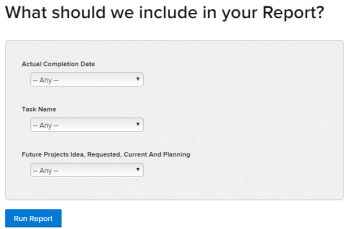

# Aggiungere un prompt a un report

## Differenza tra prompt e filtri

I filtri e i prompt sono simili nel senso che entrambi limitano la quantità di informazioni visualizzate in un rapporto.

Puoi creare un filtro quando desideri che le informazioni visualizzate nel rapporto siano filtrate in base agli stessi criteri ogni volta che esegui il rapporto. I filtri vengono generati una sola volta e sono codificati nel rapporto. Per ulteriori informazioni sulla creazione dei filtri, consulta l’articolo [Panoramica sui filtri in Adobe Workfront](../../../reports-and-dashboards/reports/reporting-elements/filters-overview.md).

I prompt sono filtri aperti che possono essere personalizzati e applicati in modo diverso ogni volta che si esegue un rapporto.

Quando aggiungi prompt al rapporto, puoi personalizzare le informazioni di filtraggio modificando i criteri dei prompt ogni volta che esegui il rapporto. Il rapporto viene eseguito ogni volta con un filtro diverso, a seconda dei modificatori scelti, anziché codificare i modificatori una volta nel filtro del rapporto.

I prompt fungono da filtro personalizzabile per i rapporti che possono essere aggiornati immediatamente prima dell’esecuzione del rapporto. È possibile creare rapporti generici e quindi limitare i risultati in base alle informazioni che si desidera visualizzare per quel giorno o alle informazioni pertinenti per un insieme di criteri specifici. Ad esempio, se disponi di un rapporto Ore e desideri modificare le informazioni del rapporto in base ai seguenti criteri:

* Le date in cui sono state registrate le ore
* Gli utenti che hanno inserito le ore
* Quantità di ore inserite

Puoi creare tre prompt in cui le condizioni sono i criteri richiesti e il rapporto ha un aspetto diverso ogni volta che lo esegui, in base alle informazioni che scegli per i prompt.

Un filtro può dire ad Adobe Workfront di mostrare solo le ore inserite tra giugno e agosto di quest’anno. Tuttavia, con un prompt, è possibile utilizzare un intervallo di tempo diverso ogni volta che si esegue il rapporto (ad esempio, tra gennaio e febbraio o ottobre e dicembre).

## Requisiti di accesso

Per eseguire i passaggi descritti in questo articolo, è necessario disporre dei seguenti diritti di accesso:

<table style="table-layout:auto"> 
 <col> 
 <col> 
 <tbody> 
  <tr> 
   <td role="rowheader">piano Adobe Workfront*</td> 
   <td> <p>Qualsiasi</p> </td> 
  </tr> 
  <tr> 
   <td role="rowheader">Licenza Adobe Workfront*</td> 
   <td> <p>Piano </p> </td> 
  </tr> 
  <tr> 
   <td role="rowheader">Configurazioni a livello di accesso*</td> 
   <td> <p>Accesso a rapporti, dashboard, calendari</p> <p>Modificare l’accesso a Filtri, Visualizzazioni, Gruppi</p> <p>Nota: Se non disponi ancora dell’accesso, chiedi all’amministratore Workfront se ha impostato ulteriori restrizioni nel livello di accesso. Per informazioni su come un amministratore Workfront può modificare il livello di accesso, consulta <a href="../../../administration-and-setup/add-users/configure-and-grant-access/create-modify-access-levels.md" class="MCXref xref">Creare o modificare livelli di accesso personalizzati</a>.</p> </td> 
  </tr> 
  <tr> 
   <td role="rowheader">Autorizzazioni oggetto</td> 
   <td> <p>Gestire le autorizzazioni per un rapporto</p> <p>Per informazioni sulla richiesta di accesso aggiuntivo, vedi <a href="../../../workfront-basics/grant-and-request-access-to-objects/request-access.md" class="MCXref xref">Richiedere l’accesso agli oggetti </a>.</p> </td> 
  </tr> 
 </tbody> 
</table>

&#42;Per informazioni sul piano, il tipo di licenza o l&#39;accesso, contattare l&#39;amministratore Workfront.

## Prerequisiti

È necessario creare un rapporto prima di potervi aggiungere un prompt.

Per istruzioni su come creare un rapporto, consulta [Creare un rapporto](../../../reports-and-dashboards/reports/creating-and-managing-reports/create-report.md)

## Creare un prompt

1. Passa al rapporto in cui desideri aggiungere un prompt.
1. Espandi **Azioni dei rapporti**, quindi fai clic su **Modifica**.

1. Fai clic su **Impostazioni dei rapporti**.
1. In **Richieste di rapporto** area, fai clic su **Aggiungi un prompt**.\
   

1. (Condizionale) Seleziona il campo su cui desideri basare il prompt. Inizia a digitare il nome del campo e fai clic su per selezionarlo quando viene visualizzato nell’elenco.\
   Le opzioni disponibili per gli utenti che eseguono il rapporto variano a seconda del campo selezionato.\
   Ad esempio, se si seleziona un campo data, ad esempio Data completamento effettivo, in un rapporto di attività, &quot;Data completamento effettivo&quot; è il nome del prompt. Quando modifichi questo prompt mentre esegui questo rapporto, puoi scegliere tra un set di modificatori per creare l’istruzione di filtro. Questo processo è identico alla creazione di un filtro. Per ulteriori informazioni sui modificatori, consulta [Modificatori di filtri e condizioni](../../../reports-and-dashboards/reports/reporting-elements/filter-condition-modifiers.md).

1. (Condizionale) Fai clic su **Prompt personalizzato** per creare un prompt personalizzato.

   Un prompt personalizzato è un prompt predefinito in cui codificare i criteri di filtro prima di eseguire il rapporto. In questo senso, un prompt personalizzato è più vicino a un filtro che a un prompt.

   Tuttavia, il prompt rimane flessibile come un prompt regolare perché è possibile scegliere tra diverse istruzioni predefinite, invece di avere un solo filtro hardcoded nel rapporto.

   Specifica le seguenti informazioni per il prompt personalizzato: La condizione di un prompt personalizzato può essere modificata solo utilizzando la modalità testo. Ciò consente di applicare più condizioni in un singolo campo.

   * **Nome campo:** Questo è il nome del prompt, come mostrato prima di eseguire il report.
   * **Etichetta:** Questo è il nome di una delle opzioni all&#39;interno del prompt come lo si vede prima di eseguire il report.
   * **Condizione:** Immettere una condizione che definisce il prompt.

   Utilizza la stessa sintassi che utilizzeresti quando immetti un filtro in modalità testo e unisci le tue istruzioni con &quot;&amp;&quot;. Per ulteriori informazioni sulla modifica di un filtro in modalità testo, consulta [Modificare un filtro utilizzando la modalità testo](../../../reports-and-dashboards/reports/text-mode/edit-text-mode-in-filter.md).

   Ad esempio, il **Condizione** Il campo del prompt personalizzato per i seguenti scenari potrebbe essere simile al seguente:

   * tutte le attività sui progetti futuri in cui lo stato del progetto è Idea, Richiesto, Pianificato e Corrente:

      ```
      project:plannedStartDate=$$TODAY&project:plannedStartDate_Mod=gte&project:status=IDA,REQ,PLN,CUR&project:status_Mod=in
      ```

   * tutte le attività in progetti completati (passati) in cui lo stato del progetto è Completato o Morto:

      ```
      project:actualCompletionDate=$$TODAY&project:actualCompletionDate_Mod=lte&project:status=CPL,DED&project:status_Mod=in
      ```
   Per ulteriori informazioni sui modificatori della modalità testo, consulta [Modificatori di filtri e condizioni](../../../reports-and-dashboards/reports/reporting-elements/filter-condition-modifiers.md).

   >[!NOTE]
   >
   >Non è possibile modificare le condizioni di un prompt personalizzato quando si esegue il rapporto, come si farebbe con un prompt standard. È possibile disporre di tutte le condizioni predefinite per un prompt personalizzato necessarie.

1. (Facoltativo) Ripeti i passaggi 4 o 5 per creare tutti i prompt necessari.
1. Fai clic su **Fine**, quindi fai clic su **Salva e chiudi** per salvare il rapporto.

## Applicare un prompt a un report

Quando viene aggiunto un prompt a un rapporto, la scheda predefinita del rapporto è sempre la scheda Prompt.

Per eseguire un rapporto con un prompt:

1. Passa al report con il prompt .

   

1. Scegliere una condizione per uno o tutti i prompt visualizzati nella **Prompt** scheda .\
   (Facoltativo) È possibile lasciare i prompt vuoti e non filtrare il rapporto in base alle condizioni dei prompt.

1. Fai clic su **Esegui rapporto**.\
   (Condizionale) Se hai popolato i prompt, il rapporto viene filtrato in base alle condizioni scelte per i prompt.\
   (Condizionale) Se le istruzioni sono lasciate vuote, il rapporto non viene filtrato in base alle condizioni dei prompt. Il rapporto viene visualizzato come se non fosse stato filtrato.

   >[!NOTE]
   >
   >Un rapporto che contiene un filtro oltre a un prompt filtra i risultati in base ai criteri definiti nel filtro e al prompt combinato.

## Limitazioni della condivisione dei rapporti richiesti

>[!CAUTION]
>
>Quando condividi un report richiesto all&#39;esterno di Workfront, l&#39;utente che visualizza il report deve essere connesso a Workfront per eseguire il report utilizzando il prompt. Se l’utente che visualizza il rapporto non ha effettuato l’accesso, vengono visualizzati tutti i risultati del rapporto senza applicare il prompt.

Di seguito sono riportate le limitazioni nella condivisione di rapporti richiesti da Workfront:

* Quando condividi un rapporto pubblicamente, gli utenti non possono eseguire il rapporto applicando il prompt, a meno che non dispongano delle credenziali Workfront e non effettuino prima l’accesso per visualizzare il rapporto in Workfront.

   Per ulteriori informazioni sulla condivisione dei rapporti, consulta l’articolo [Condivisione di un rapporto in Adobe Workfront](../../../reports-and-dashboards/reports/creating-and-managing-reports/share-report.md).
* Quando si pianifica un report richiesto per la consegna, il report nell&#39;allegato e-mail include i dati del report richiesti. Quando l’utente fa clic sul collegamento nell’e-mail per accedere al rapporto, deve prima accedere per visualizzare il rapporto ed eseguire il prompt stesso.

   Per informazioni sulla pianificazione di un rapporto consegnato, vedi [Pianificare una consegna automatica dei rapporti](../../../reports-and-dashboards/reports/creating-and-managing-reports/set-up-automatic-report-delivery.md).
