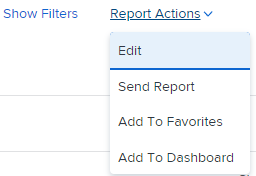

# Creare una copia di un rapporto

Puoi creare una copia di qualsiasi rapporto a cui hai accesso. È possibile creare una copia esatta di un rapporto personalizzato oppure salvare una nuova versione di un rapporto predefinito. Dopo aver copiato un report, l&#39;utente diventa il proprietario del report copiato e viene visualizzato nella sezione I miei report.

## Requisiti di accesso

Per eseguire i passaggi descritti in questo articolo, è necessario disporre dei seguenti diritti di accesso:

<table style="table-layout:auto"> 
 <col> 
 <col> 
 <tbody> 
  <tr> 
   <td role="rowheader">Piano Adobe Workfront*</td> 
   <td> 
Qualsiasi
 </td> 
  </tr> 
  <tr> 
   <td role="rowheader">Licenza Adobe Workfront*</td> 
   <td> 
Piano 
 </td> 
  </tr> 
  <tr> 
   <td role="rowheader">Configurazioni del livello di accesso*</td> 
   <td> 
Modificare l’accesso a Rapporti, Dashboard, Calendari
 
Modifica accesso a Filtri, Viste, Raggruppamenti
 
Nota: se non disponi ancora dell’accesso, chiedi all’amministratore di Workfront se ha impostato restrizioni aggiuntive nel tuo livello di accesso. Per informazioni su come un amministratore di Workfront può modificare il tuo livello di accesso, consulta <a href="../../../administration-and-setup/add-users/configure-and-grant-access/create-modify-access-levels.md" class="MCXref xref">Creare o modificare livelli di accesso personalizzati</a>.
 </td> 
  </tr> 
  <tr> 
   <td role="rowheader">Autorizzazioni oggetto</td> 
   <td> 
Visualizzare le autorizzazioni per un rapporto
 
Per informazioni sulla richiesta di accesso aggiuntivo, consulta <a href="../../../workfront-basics/grant-and-request-access-to-objects/request-access.md" class="MCXref xref">Richiedi accesso agli oggetti </a>.
 </td> 
  </tr> 
 </tbody> 
</table>

&#42;Per conoscere il piano, il tipo di licenza o l&#39;accesso di cui si dispone, contattare l&#39;amministratore Workfront.

## Creare una copia esatta di un rapporto

Se si desidera creare una copia di un report di cui si è proprietari, eseguire le operazioni seguenti:

1. Fai clic su **Menu principale** icona  nell’angolo superiore destro di Adobe Workfront.

1. Clic **Rapporti**, quindi **Tutti i report**.
1. Apri un rapporto.
1. Clic **Azioni report**, quindi **Copia**.

   >[!TIP]
   >
   >Se si tratta di un report predefinito, l&#39;opzione Copia non viene visualizzata nel menu Azioni report.\
   >Per informazioni su come creare una copia di un report predefinito, vedere [Creare una nuova versione di un rapporto](#create-a-new-version-of-a-report).

   

   Viene creata una copia del report originale con il nome predefinito *Copia di [Nome del rapporto originale]*. Ad esempio, il nome del rapporto &quot;Attività completate Q4&quot; potrebbe essere &quot;Copia delle attività completate Q4&quot;.

1. (Facoltativo) Per rinominare il rapporto, inizia a digitare un nuovo nome.

   >[!TIP]
   >
   >Se deselezioni il titolo prima di digitare il nuovo nome, seleziona il titolo del rapporto, elimina il nome, quindi inserisci il nuovo nome.

1. (Facoltativo) Per condividere la nuova versione del rapporto con altri utenti, fai clic su **Azioni report**, quindi **Condivisione**.

   >[!NOTE]
   >
   >Le informazioni di condivisione non vengono trasferite al report copiato dalla versione originale.\
   >Per informazioni su come vedere con chi è stato condiviso il report precedente, vedi [Creare un rapporto sulle attività di reporting](../../../reports-and-dashboards/reports/report-usage/create-report-reporting-activities.md#identify).

1. (Facoltativo) Se disponi delle autorizzazioni di gestione per il rapporto originale e il rapporto originale non è più necessario, puoi eliminarlo per rimuovere i rapporti duplicati non necessari in Workfront.

   Per eliminare il report originale, effettuare le seguenti operazioni:

   1. Passa al rapporto.
   1. Clic **Azioni report**, quindi **Elimina**.

   1. Clic **Sì, elimina** per confermare l’eliminazione del rapporto.

## Creare una nuova versione di un rapporto {#create-a-new-version-of-a-report}

Se si desidera creare una copia di un report predefinito, eseguire le operazioni seguenti:

1. Fai clic su **Menu principale** icona  nell’angolo superiore destro di Adobe Workfront.

1. Clic **Rapporti**, quindi **Tutti i report**.
1. Fare clic sul nome di un report predefinito per aprirlo.
1. Clic **Azioni report**, quindi **Modifica**.

   

1. Apporta le modifiche necessarie nelle seguenti schede del rapporto:

   * **Colonne (visualizzazione)**: per ulteriori informazioni sulla personalizzazione delle visualizzazioni, consulta l’articolo [Panoramica delle visualizzazioni in Adobe Workfront](../../../reports-and-dashboards/reports/reporting-elements/views-overview.md).
   * **Raggruppamenti**: per ulteriori informazioni sulla personalizzazione dei raggruppamenti, consulta l’articolo [Panoramica sui raggruppamenti in Adobe Workfront](../../../reports-and-dashboards/reports/reporting-elements/groupings-overview.md).
   * **Filtri**: per ulteriori informazioni sulla personalizzazione dei filtri, consulta l’articolo [Panoramica sui filtri](../../../reports-and-dashboards/reports/reporting-elements/filters-overview.md).
   * **Grafico**: per ulteriori informazioni sulla personalizzazione di un grafico del rapporto, consulta l’articolo [Aggiungere un grafico a un report](../../../reports-and-dashboards/reports/creating-and-managing-reports/add-chart-report.md).

1. Nell’angolo superiore destro, fai clic su **Impostazioni dei rapporti**.
1. In **Titolo report** , assegna al rapporto un nuovo nome.
1. Clic **Fine**.
1. Clic **Salva come nuovo report**.

   

1. (Facoltativo) Per condividere la nuova versione del rapporto con altri utenti, fai clic su **Azioni report**, quindi **Condivisione**.
