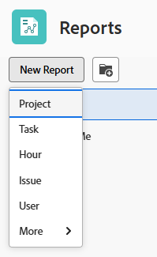

# Creare un rapporto personalizzato

Puoi fornire l’accesso alle informazioni di cui la tua organizzazione ha bisogno in Adobe Workfront creando rapporti. Puoi utilizzare uno qualsiasi dei rapporti incorporati disponibili in Workfront, oppure creare rapporti personalizzati da zero.

Per ulteriori informazioni sui rapporti incorporati, vedi [Utilizzare i rapporti incorporati di Adobe Workfront](../../../reports-and-dashboards/reports/using-built-in-reports/use-workfront-built-in-reports.md).

Per informazioni sulla creazione di un report copiandolo, vedere [Creare una copia di un rapporto](../../../reports-and-dashboards/reports/creating-and-managing-reports/create-copy-report.md).

Per ulteriori informazioni sulla creazione e la gestione dei rapporti, inclusi classi, video e tutorial, consulta la sezione Informazioni sul sito Adobe Experience League.

## Requisiti di accesso

Per eseguire i passaggi descritti in questo articolo, è necessario disporre dei seguenti diritti di accesso:

<table style="table-layout:auto"> 
 <col> 
 <col> 
 <tbody> 
  <tr> 
   <td role="rowheader">Piano Adobe Workfront*</td> 
   <td> 
Qualsiasi
 </td> 
  </tr> 
  <tr> 
   <td role="rowheader">Licenza Adobe Workfront*</td> 
   <td> 
Nuovo: Standard 

   oppure
   
Corrente: Piano 
 </td> 
  </tr> 
  <tr> 
   <td role="rowheader">Configurazioni del livello di accesso*</td> 
   <td> 
Modificare l’accesso a Rapporti, Dashboard, Calendari
 
Modifica accesso a Filtri, Viste, Raggruppamenti
 
<b>NOTA</b>

   
 Se non disponi ancora dell’accesso, chiedi all’amministratore di Workfront se ha impostato restrizioni aggiuntive nel tuo livello di accesso. Per informazioni su come un amministratore di Workfront può modificare il tuo livello di accesso, consulta <a href="../../../administration-and-setup/add-users/configure-and-grant-access/create-modify-access-levels.md" class="MCXref xref">Creare o modificare livelli di accesso personalizzati</a>.
 </td> 
  </tr> 
  <tr> 
   <td role="rowheader">Autorizzazioni oggetto</td> 
   <td> 
Ottieni le autorizzazioni di gestione per i rapporti creati.
 
Per informazioni sulla richiesta di accesso aggiuntivo, consulta <a href="../../../workfront-basics/grant-and-request-access-to-objects/request-access.md" class="MCXref xref">Richiedi accesso agli oggetti </a>.
 </td> 
  </tr> 
 </tbody> 
</table>

&#42;Per conoscere il piano, il tipo di licenza o l&#39;accesso di cui si dispone, contattare l&#39;amministratore Workfront.

## Creare un rapporto {#create-a-report}

{{step1-to-reports}}

1. Clic **Nuovo rapporto**, quindi selezionare il tipo di oggetto desiderato per il report.

   Il generatore di report viene caricato.

   Per informazioni specifiche sui report degli oggetti disponibili, vedere la sezione [Report sugli oggetti](../../../workfront-basics/navigate-workfront/workfront-navigation/understand-objects.md#reporting-on-objects) nell’articolo [Comprendere gli oggetti in Adobe Workfront](../../../workfront-basics/navigate-workfront/workfront-navigation/understand-objects.md).

   

   >[!TIP]
   >
   >Puoi anche creare un rapporto effettuandone una copia esistente. Per ulteriori informazioni, consulta [Creare una copia di un rapporto](../../../reports-and-dashboards/reports/creating-and-managing-reports/create-copy-report.md).

1. Nel generatore di report, aggiungi quanto segue al report:

   <table style="table-layout:auto"> 
    <col> 
    <col> 
    <thead> 
     <tr> 
      <th>Funzionalità</th> 
      <th>Descrizione</th> 
     </tr> 
    </thead> 
    <tbody> 
     <tr> 
      <td>Colonne (Visualizzazione)</td> 
      <td> 
L'aggiunta di colonne al report determina le informazioni contenute nel report.
 
Per informazioni su come aggiungere una colonna, consulta <a href="#add-columns-view-to-a-report" class="MCXref xref">Aggiungere colonne (visualizzazione) a un rapporto</a>. 
 </td> 
     </tr> 
     <tr> 
      <td>Raggruppamenti</td> 
      <td> 
L’aggiunta di raggruppamenti al rapporto determina il modo in cui il rapporto è organizzato.
 
Per informazioni su come aggiungere un raggruppamento, consulta <a href="#add-groupings-to-a-report" class="MCXref xref">Aggiungere raggruppamenti a un rapporto</a>.
 </td> 
     </tr> 
     <tr> 
      <td>Filtri</td> 
      <td> 
L’aggiunta di regole di filtro al rapporto determina le informazioni visualizzate nel rapporto.
 
Per informazioni su come aggiungere un filtro, consulta <a href="#add-filters-to-a-report" class="MCXref xref">Aggiungere filtri a un rapporto</a>.
 </td> 
     </tr> 
     <tr> 
      <td>Diagramma</td> 
      <td> 
L’aggiunta di un grafico al rapporto determina il modo in cui le informazioni in esso contenute vengono presentate visivamente.
 
Per informazioni su come aggiungere un grafico, consulta <a href="#add-a-chart-to-a-report" class="MCXref xref">Aggiungere un grafico a un report</a>.
 </td> 
     </tr> 
    </tbody> 
   </table>

1. In qualsiasi momento durante il processo di creazione del rapporto, fai clic su **Applica** per salvare le modifiche.
1. Al termine, fai clic su **Salva e chiudi**.

### Aggiungere colonne (visualizzazione) a un rapporto {#add-columns-view-to-a-report}

1. Inizia a creare un rapporto come descritto in [Creare un rapporto](#create-a-report) in questo articolo.
1. Nel generatore di report, seleziona la **Colonne (visualizzazione)** per identificare le colonne da visualizzare nel rapporto.
1. (Facoltativo) Fai clic su **Applicare una vista esistente** e fare clic sul nome di una visualizzazione nel menu a discesa per utilizzare una visualizzazione esistente.

   Per ulteriori informazioni sulla creazione di una visualizzazione, vedere [Panoramica delle visualizzazioni in Adobe Workfront](../../../reports-and-dashboards/reports/reporting-elements/views-overview.md).

1. (Facoltativo) Per rimuovere una colonna esistente, fai clic sulla colonna da rimuovere, quindi fai clic su **x** accanto al nome corrente nell’intestazione della colonna.

1. Per aggiungere una nuova colonna, fai clic su **Aggiungi colonna**.

   Oppure

   Per modificare una colonna esistente, fai clic sulla colonna e quindi sul pulsante **Rimuovi** icona  a sinistra del campo corrente nella **Mostra in questo campo colonna** nell’angolo in alto a sinistra del report builder e inizia a digitare un nuovo campo, quindi fai clic su di esso quando viene visualizzato nell’elenco.

   Per ulteriori informazioni sui campi visualizzati nelle colonne, consulta [Glossario della terminologia di Adobe Workfront](../../../workfront-basics/navigate-workfront/workfront-navigation/workfront-terminology-glossary.md).

   

1. (Facoltativo) In **Impostazioni colonna** area, seleziona **Ordina per questa colonna** per ordinare i valori nella colonna in ordine alfabetico crescente o decrescente, indicare se l&#39;elenco deve utilizzare questa colonna come primo ordinamento.

   È possibile disporre di più livelli di ordinamento in una visualizzazione report se si desidera ordinare in base al valore di una prima colonna, al valore di una seconda colonna e così via.

   Se più risultati sono identici in base al primo criterio di ordinamento, vengono ordinati in base al secondo criterio. Se più risultati sono identici in base al primo e al secondo criterio di ordinamento, vengono ordinati in base al terzo ordinamento e così via.

   >[!NOTE]
   >
   >Se aggiungi un campo che fa riferimento a un oggetto troppo lontano dall’oggetto su cui stai eseguendo il reporting, potresti non essere in grado di ordinare per questo campo.\
   >Ad esempio, un report di problemi non può essere ordinato in base al campo Proprietario progetto perché fa riferimento a 3 oggetti aggiuntivi: Progetto, Proprietario e Nome. Tuttavia, è comunque possibile aggiungere questo campo a un report sui problemi e visualizzarne le informazioni.

   <!--outdated: To learn more about cross-object references in reports, see the section "Advanced Reporting Part 1 of 3" in the [Reports and Dashboards Learning Path](https://one.workfront.com/s/learningpath2/workfront-reporting-MC7MZT2BOL2ZC2LMJ4MA3EMHOCNY?tabset-dc70e=2).-->

1. (Facoltativo) Se utilizzi i raggruppamenti e desideri riepilogare (aggregare) le informazioni in una colonna, fai clic su **Riepiloga questa colonna per** elenco a discesa nella **Impostazioni colonna** , quindi selezionare l&#39;opzione da utilizzare per aggregare le informazioni nella colonna.

   Le informazioni aggregate vengono visualizzate nella colonna delle righe di raggruppamento.

   

   Per ulteriori informazioni sul riepilogo dei dati in una colonna, vedere [Panoramica delle visualizzazioni in Adobe Workfront](../../../reports-and-dashboards/reports/reporting-elements/views-overview.md).

   >[!NOTE]
   >
   >Le eccezioni riportate di seguito si applicano agli oggetti padre, ad esempio i task padre, quando si aggregano i valori per i campi seguenti nei raggruppamenti:
   >
   >* Tutti i campi relativi al numero e alla divisa, ad eccezione delle ore effettive (ad esempio Costo manodopera pianificato o effettivo, Costo spesa pianificato o effettivo, Costo pianificato o effettivo, Ore pianificate), aggregano solo i valori per le attività figlio e le attività autonome. Non aggregano i valori per le attività padre o i padri dei padri.
   >* Le ore effettive aggregano i valori per le attività padre principale e le attività autonome; non aggregano i numeri per le attività padre o figlio.
   >* I campi dati personalizzati per i valori numerici e di valuta aggregano tutte le attività: padri, figli, padri e attività autonome.

   Per ulteriori informazioni sull’utilizzo dei raggruppamenti in un rapporto, consulta [Panoramica sui raggruppamenti in Adobe Workfront](../../../reports-and-dashboards/reports/reporting-elements/groupings-overview.md).

1. (Facoltativo) Fai clic su **Opzioni avanzate** per specificare le seguenti informazioni per la colonna:

   <table style="table-layout:auto"> 
    <col> 
    <col> 
    <tbody> 
     <tr> 
      <td role="rowheader">Etichetta colonna personalizzata</td> 
      <td> 
Specifica un’etichetta personalizzata per la colonna. Questa etichetta sostituisce quella predefinita.
 </td> 
     </tr> 
     <tr> 
      <td role="rowheader">Formato campo</td> 
      <td> 
Selezionare il formato in cui si desidera visualizzare i valori per i campi della colonna.
 </td> 
     </tr> 
     <tr> 
      <td role="rowheader">Mostra questa colonna quando in un dashboard</td> 
      <td> 
Selezionare questa opzione per visualizzare questa colonna in un dashboard quando il report viene visualizzato affiancato a un altro report. Se questa opzione non è selezionata, questa colonna non viene visualizzata quando si visualizza il report su un dashboard in cui i report vengono visualizzati affiancati.
 </td> 
     </tr> 
     <tr> 
      <td role="rowheader">Regole colonna</td> 
      <td> 
Clic <strong>Aggiungi una regola per questa colonna</strong> per aggiungere la formattazione condizionale alla colonna. Dopo aver aggiunto una regola, è possibile definire stili di campo e di testo per la visualizzazione dei campi corrispondenti alla regola. Clic <strong>Aggiungi regola</strong> al termine della definizione della regola. Per ulteriori informazioni sulla formattazione condizionale di una visualizzazione, vedere <a href="../../../reports-and-dashboards/reports/reporting-elements/use-conditional-formatting-views.md" class="MCXref xref">Utilizzare la formattazione condizionale nelle visualizzazioni</a>.
 </td> 
     </tr> 
    </tbody> 
   </table>

1. Clic **Applica** per applicare le modifiche apportate e continuare a modificare il rapporto con le opzioni seguenti.

   Clic **Salva e chiudi** dopo aver modificato le colonne del rapporto, salvare il rapporto.

### Aggiungere raggruppamenti a un rapporto {#add-groupings-to-a-report}

1. Inizia a creare un rapporto come descritto in [Creare un rapporto](#create-a-report) in questo articolo.
1. Nel generatore di report, seleziona la **Raggruppamenti** per identificare la modalità di raggruppamento degli elementi nel report.
1. Clic **Aggiungi raggruppamento** per aggiungere un nuovo raggruppamento.

   Oppure

   Scegli **Applicare un raggruppamento esistente** per selezionare un raggruppamento esistente quando viene visualizzato nell&#39;elenco.

   

1. Inizia a digitare il campo che desideri aggiungere come raggruppamento. Se il campo è disponibile, viene compilato per ogni oggetto a cui può essere associato. Fai clic sul nome del campo per aggiungerlo al raggruppamento.
1. (Facoltativo) Puoi scegliere di creare un raggruppamento in modalità testo, facendo clic su **Passa alla modalità testo**. Per ulteriori informazioni sull&#39;utilizzo della modalità testo, vedere [Panoramica sulla modalità testo](../../../reports-and-dashboards/reports/text-mode/understand-text-mode.md).

   Per ulteriori informazioni sulla creazione di nuovi raggruppamenti, consulta [Panoramica sui raggruppamenti in Adobe Workfront](../../../reports-and-dashboards/reports/reporting-elements/groupings-overview.md).

1. (Facoltativo) Seleziona **Comprimi questo raggruppamento per impostazione predefinita** se si desidera che i risultati di questo raggruppamento vengano visualizzati compressi anziché espansi.

   Questa impostazione è disattivata per impostazione predefinita e i risultati del raggruppamento vengono sempre visualizzati in un elenco espanso.

   >[!TIP]
   >
   >* Quando si modificano manualmente i raggruppamenti durante la visualizzazione di un elenco, Workfront ricorda la preferenza manuale fino alla disconnessione. Quando effettui di nuovo l’accesso, l’elenco viene visualizzato in base a questa impostazione.
   >* I risultati di un raggruppamento vengono sempre visualizzati in modalità espansa dopo essere stati accessibili da un elemento del grafico.

1. (Facoltativo) Fai clic su **Passa al raggruppamento di matrici**, per creare un raggruppamento di matrici e visualizzare i risultati in formato griglia.

   Per ulteriori informazioni sulla creazione di un rapporto matrice, vedere [Creare un rapporto matrice](../../../reports-and-dashboards/reports/creating-and-managing-reports/create-matrix-report.md).

1. Clic **Applica** per applicare le modifiche apportate e continuare a modificare il rapporto con le opzioni seguenti.

   Clic **Salva e chiudi** se hai finito di modificare i raggruppamenti nel rapporto e desideri salvarlo.

### Aggiungere filtri a un rapporto {#add-filters-to-a-report}

1. Inizia a creare un rapporto come descritto in [Creare un rapporto](#create-a-report) in questo articolo.
1. Nel generatore di report, seleziona la **Filtri** per identificare la quantità di informazioni che si desidera includere nel rapporto.
1. Clic **Aggiungere una regola di filtro** per aggiungere un filtro personalizzato.\
   Oppure\
   Scegli **Applicare un filtro esistente** per utilizzare un filtro esistente.

   

1. Se hai fatto clic su **Aggiungere una regola di filtro**, inizia a digitare il campo che desideri aggiungere come filtro. Se il campo è disponibile, viene compilato per ogni oggetto a cui può essere associato. Fai clic sul nome del campo per aggiungerlo a tale filtro.\
   Utilizza i modificatori di filtro per creare il filtro. Per ulteriori informazioni sui modificatori di filtri, consulta [Modificatori di filtri e condizioni](../../../reports-and-dashboards/reports/reporting-elements/filter-condition-modifiers.md).

   Per ulteriori informazioni sulla creazione di nuovi filtri, consulta [Panoramica sui filtri in Adobe Workfront](../../../reports-and-dashboards/reports/reporting-elements/filters-overview.md).

1. (Facoltativo) Puoi scegliere di creare un filtro in modalità testo facendo clic su **Passa alla modalità testo**.

   Per ulteriori informazioni sull&#39;utilizzo della modalità testo, vedere [Panoramica sulla modalità testo](../../../reports-and-dashboards/reports/text-mode/understand-text-mode.md).

1. Clic **Applica** dopo aver modificato i filtri nel rapporto, applica le modifiche apportate e continua a modificare il rapporto con le opzioni seguenti.

   Clic **Salva e chiudi** se il rapporto e desideri salvarlo.

### Aggiungere un grafico a un report {#add-a-chart-to-a-report}

1. Inizia a creare un rapporto come descritto in [Creare un rapporto](#create-a-report) in questo articolo.
1. Nel generatore di report, seleziona la **Grafico** , quindi selezionare il tipo di grafico da aggiungere.

   

   Per ulteriori informazioni sulla creazione di un grafico in un report, vedere [Aggiungere un grafico a un report](../../../reports-and-dashboards/reports/creating-and-managing-reports/add-chart-report.md).

1. Clic **Applica** per applicare le modifiche apportate e continuare a modificare il rapporto con le opzioni seguenti.

   Clic **Salva e chiudi** se hai terminato di modificare il rapporto e desideri salvarlo.
