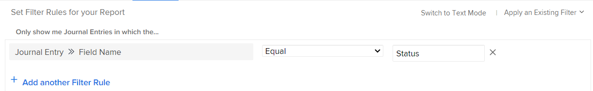

# Rapporto sulla sezione Aggiornamenti

Il rapporto Voce diario evidenzia gli aggiornamenti di sistema dall’area Aggiornamenti di progetti, attività, problemi e altri oggetti precedentemente disponibili solo tramite l’API Adobe Workfront. Anche se si tratta di un rapporto avanzato destinato a casi d’uso specifici, il formato più digeribile consente di creare un rapporto più semplice sull’attività del progetto e sugli aggiornamenti del sistema in Workfront.

>[!TIP]
>
>Il rapporto Voce diario contiene solo gli aggiornamenti di sistema dall&#39;area Aggiornamenti degli oggetti. Per creare rapporti sui commenti rimasti nell&#39;area Aggiornamenti, è necessario utilizzare il rapporto Nota.\
>Per ulteriori informazioni sul rapporto Nota, vedere [Visualizzare tutti gli aggiornamenti in un report Nota](../../../workfront-basics/updating-work-items-and-viewing-updates/view-all-updates-in-a-report.md).

Il rapporto Voce diario può mostrare:

* Quante modifiche di stato si sono verificate
* Quando un&#39;attività o un problema è stato eliminato
* Modifica dei valori nei campi personalizzati importanti nel corso del ciclo di vita di un progetto
* Quali date importanti sono cambiate nel corso del ciclo di vita di un progetto?
* Se il proprietario di un progetto cambia

## Requisiti di accesso

+++ Espandi per visualizzare i requisiti di accesso per la funzionalità in questo articolo.

Per eseguire i passaggi descritti in questo articolo, è necessario disporre dei seguenti diritti di accesso:

<table style="table-layout:auto"> 
 <col> 
 <col> 
 <tbody> 
  <tr> 
   <td role="rowheader">piano Adobe Workfront</td> 
   <td> 
Qualsiasi
 </td> 
  </tr> 
  <tr> 
   <td role="rowheader">Licenza Adobe Workfront</td> 
   <td> 
Nuovo: Standard 

Oppure 

Corrente: Piano 
 </td> 
  </tr> 
  <tr> 
   <td role="rowheader">Configurazioni del livello di accesso</td> 
   <td> 
Modificare l’accesso a Rapporti, Dashboard, Calendari
 
Modifica accesso a Filtri, Viste, Raggruppamenti
 </td> 
  </tr> 
  <tr> 
   <td role="rowheader">Autorizzazioni oggetto</td> 
   <td> 
Visualizza le autorizzazioni per gli oggetti che contengono le voci diario visualizzate nel report
 
Dopo la creazione, otterrai le autorizzazioni di gestione per il report
 </td> 
  </tr> 
 </tbody> 
</table>

Per ulteriori dettagli sulle informazioni contenute in questa tabella, vedere [Requisiti di accesso nella documentazione di Workfront](/help/quicksilver/administration-and-setup/add-users/access-levels-and-object-permissions/access-level-requirements-in-documentation.md).

+++

## Prerequisiti

Prima di poter eseguire le azioni descritte in questo articolo, è necessario verificare quanto segue:

* Tutti i campi su cui desideri creare rapporti vengono tracciati in Workfront. È possibile creare rapporti solo sui dati dell&#39;area Aggiornamenti tracciati.

  Per scoprire come aggiungere campi di cui tenere traccia in Workfront, consulta [Configurare gli aggiornamenti di sistema](../../../administration-and-setup/set-up-workfront/system-tracked-update-feeds/configure-system-updates.md).

* L’impostazione di qualsiasi campo personalizzato su cui desideri creare un rapporto **Visualizzare le modifiche dei campi nei feed di aggiornamento** abilitato.

  Per informazioni su come abilitare questa impostazione per un campo personalizzato, consulta [Creare o modificare un modulo personalizzato](../../../administration-and-setup/customize-workfront/create-manage-custom-forms/create-or-edit-a-custom-form.md#).

## Panoramica del rapporto Voce diario

Poiché il report Voce diario esegue query sugli aggiornamenti di sistema, può restituire un numero significativo di risultati. Per questo motivo, è consigliabile filtrare in base a oggetti specifici, ad esempio progetti, programmi, portfolio, gruppi e così via, durante la creazione del report.

Per ulteriori informazioni sui diversi tipi di oggetto disponibili in Workfront, consulta [Comprendere gli oggetti in Adobe Workfront](../../../workfront-basics/navigate-workfront/workfront-navigation/understand-objects.md).

>[!NOTE]
>
>Poiché il rapporto Voce diario restituisce una quantità eccessiva di dati, l&#39;esportazione e la consegna pianificata del rapporto non sono supportate.

La visualizzazione predefinita per questo report contiene le colonne seguenti:

<table style="table-layout:auto"> 
 <col> 
 <col> 
 <thead> 
  <tr> 
   <th>Campo</th> 
   <th>Spiegazione</th> 
  </tr> 
 </thead> 
 <tbody> 
  <tr> 
   <td><strong>Nome campo</strong> </td> 
   <td> 
Nome del campo interessato. A seconda della modalità di impostazione del rapporto, questa colonna può contenere i campi Stato, ID proprietario, Nome attività, Data di completamento pianificata o altri campi. 
 
Quando <strong>DE</strong>: indica che il campo elencato è un campo personalizzato.
 </td> 
  </tr> 
  <tr> 
   <td><strong>Cambia tipo</strong> </td> 
   <td> 
Tipo di modifica apportata al campo interessato. A seconda delle regole di filtro impostate e delle azioni eseguite dagli utenti, in questo campo potrebbero essere visualizzati i seguenti elementi:
 
    <ul> 
     <li> 
Aggiungi
 </li> 
     <li> 
Controllo
 </li> 
     <li> 
Elimina
 </li> 
     <li> 
Digest
 </li> 
     <li> 
Modifica
 </li> 
     <li> 
Ripristina
 </li> 
    </ul> </td> 
  </tr> 
  <tr> 
   <td><strong>Top ObjCode</strong> </td> 
   <td> 
L'oggetto padre più alto nella gerarchia.
 </td> 
  </tr> 
  <tr> 
   <td><strong>Ambito</strong> </td> 
   <td> 
Tipo di oggetto modificato.
 </td> 
  </tr> 
  <tr> 
   <td><strong>Data immissione</strong> </td> 
   <td> 
Data in cui il campo è stato modificato.
 </td> 
  </tr> 
  <tr> 
   <td><strong>Modificato da Nome</strong> </td> 
   <td> 
Utente che ha modificato il campo.
 </td> 
  </tr> 
 </tbody> 
</table>

Per organizzare le informazioni in questo report, è possibile utilizzare il raggruppamento predefinito denominato Progetto. Il raggruppamento di progetti consente di ottenere un raggruppamento principale di Nome progetto e un raggruppamento secondario di Data di ingresso. Puoi applicare questo raggruppamento esistente durante la creazione del rapporto oppure durante la visualizzazione del rapporto.

Per informazioni su come impostare le visualizzazioni, i filtri e i raggruppamenti desiderati per il rapporto, consulta la sezione pertinente:

<!--

(NOTE: from&nbsp;Luke: Take this for what it's worth, but part of me wonders if all of these subsections should be separate articles.

The biggest reason for breaking these up would be searchability, in my mind. For example, as a user, I might want to know how to see if the owner of a project changed. If I search the help site for that, I would be a lot more likely to find a separate article called "See if the owner of a project changed" vs an article titled "Create a Journal Entry report" because "Journal Entry" might mean nothing to me.) 

-->

* [Visualizzare le modifiche di stato](#see-what-status-changes-occurred)
* [Vedere quando un&#39;attività o un problema è stato eliminato](#see-when-a-task-or-issue-was-deleted)
* [Scopri come sono cambiati i campi personalizzati nel corso del ciclo di vita di un progetto](#see-how-custom-fields-changed-over-the-course-of-a-project-s-life-cycle)
* [Scopri come è cambiata la data di completamento pianificata nel corso del ciclo di vita di un progetto](#see-how-the-planned-completion-date-changed-over-the-course-of-a-project-s-life-cycle)
* [Verifica se il proprietario di un progetto è cambiato](#see-if-the-owner-of-a-project-changed)

## Visualizzare le modifiche di stato {#see-what-status-changes-occurred}

È possibile impostare il rapporto Scrittura contabile in modo da visualizzare:

* Quante modifiche di stato sono state apportate a un progetto, a un’attività o a un problema

* Lo stato precedente al cambiamento
* Chi ha cambiato lo stato
* Quando è avvenuta la modifica dello stato

Se desideri visualizzare lo stato di un progetto, puoi anche impostare il rapporto in modo che visualizzi le stesse informazioni utilizzando il progetto **Condizione** campo.

Queste informazioni possono essere utilizzate per facilitare il controllo e per illustrare il livello di pianificazione dell&#39;azienda.

<!--

(NOTE:&nbsp;for tip below: When analytics adds the status option, update this note to say "these entries (status or condition changes)")

-->

>[!TIP]
>
>Se desideri confrontare la differenza di giorni tra le modifiche di condizione, puoi utilizzare Analisi avanzate.\
>Per ulteriori informazioni sulle funzioni di analisi avanzate, consulta [Panoramica di analisi avanzate](../../../enhanced-analytics/enhanced-analytics-overview.md).

1. Fai clic su **[!UICONTROL Menu principale]** icona  nell’angolo superiore destro di Adobe Workfront, oppure (se disponibile) fai clic sul pulsante **[!UICONTROL Menu principale]** icona  nell’angolo superiore sinistro, quindi fai clic su **Rapporti**.
1. Clic **Nuovo rapporto**, quindi seleziona **Voce diario**.

   

   Il generatore di report viene caricato.

1. In **Colonne (visualizzazione)** , aggiungi le seguenti colonne:

   <table style="table-layout:auto"> 
    <col> 
    <col> 
    <thead> 
     <tr> 
      <th>Colonna</th> 
      <th>Spiegazione</th> 
     </tr> 
    </thead> 
    <tbody> 
     <tr> 
      <td> 
Nome Campo
 </td> 
      <td> 
Nome del campo interessato. In questo caso, <strong>stato</strong> deve essere visualizzato in questa colonna.
 </td> 
     </tr> 
     <tr> 
      <td> 
Tipo di modifica
 </td> 
      <td> 
Tipo di modifica apportata al campo interessato, ad esempio <strong>Aggiungi</strong>, <strong>Elimina</strong>, o <strong>Modifica</strong>.
 </td> 
     </tr> 
     <tr> 
      <td> 
Modificato da Nome
 </td> 
      <td> 
Nome dell'utente che ha aggiornato lo stato.
 </td> 
     </tr> 
     <tr> 
      <td> 
Data inserimento
 </td> 
      <td> 
La data in cui lo stato è stato modificato.
 </td> 
     </tr> 
     <tr> 
      <td> 
Vecchio valore testuale
 </td> 
      <td> 
Chiave per lo stato precedente. Di seguito sono riportate le chiavi di stato per gli stati predefiniti del progetto:
 
       <ul> 
        <li> 
 <strong>CUR</strong>: Corrente
 </li> 
        <li> 
<strong>DED</strong>: Inattivo
 </li> 
        <li> 
<strong>ONH</strong>: In attesa
 </li> 
        <li> 
<strong>PIAN</strong>: Pianificazione
 </li> 
        <li> 
<strong>CPL</strong>: completato
 </li> 
        <li> 
<strong>REQ</strong>: richiesto
 </li> 
        <li> 
<strong>APR</strong>: Approvato
 </li> 
        <li> 
<strong>REJ</strong>: Rifiutato
 </li> 
        <li> 
<strong>IDA</strong>: Idea
 </li> 
       </ul> 
Se l’organizzazione ha impostato stati personalizzati, in questa colonna potrebbero essere visualizzate altre chiavi di stato. Per informazioni sullo stato personalizzato correlato a una chiave di stato, contatta l’amministratore di Workfront o l’amministratore del gruppo.
 </td> 
     </tr> 
     <tr> 
      <td> 
Nuovo valore testo
 </td> 
      <td> 
Chiave per lo stato aggiornato.
 </td> 
     </tr> 
     <tr> 
      <td> 
Top ObjCode
 </td> 
      <td> 
L'oggetto padre di livello più alto per il campo il cui stato è stato modificato.
 </td> 
     </tr> 
     <tr> 
      <td> 
Limite
 </td> 
      <td> 
Tipo di oggetto con stato modificato.
 </td> 
     </tr> 
     <tr> 
      <td> 
Nome problema (Facoltativo)
 </td> 
      <td> 
Nome del problema con stato modificato.
 </td> 
     </tr> 
     <tr> 
      <td> 
Nome attività (Facoltativo)
 </td> 
      <td> 
Il nome dell'attività che ha avuto un cambiamento di stato.
 </td> 
     </tr> 
    </tbody> 
   </table>

   Per ulteriori informazioni sull&#39;aggiunta di colonne, vedere [Panoramica delle visualizzazioni in Adobe Workfront](../../../reports-and-dashboards/reports/reporting-elements/views-overview.md).

1. In **Filtri** , fare clic su **Aggiungi regola filtro**, quindi aggiungi la regola del filtro **Nome campo** > **Uguale** > **stato**.

   

   >[!TIP]
   >
   >Per generare rapporti sulle modifiche delle condizioni, puoi invece aggiungere la regola del filtro **Nome campo** > **Uguale** > **Condizione**.

   Per ulteriori informazioni sull’aggiunta di filtri, consulta [Panoramica sui filtri](../../../reports-and-dashboards/reports/reporting-elements/filters-overview.md).

1. (Facoltativo) Per restringere l’ambito del rapporto e ridurre i tempi di caricamento, aggiungi un prompt.

   Oppure

   Crea regole di filtro aggiuntive per includere progetti, attività o problemi specifici.

   >[!IMPORTANT]
   >
   >Creazione di una regola di filtro che utilizza il modificatore **Contiene** può effettivamente aumentare i tempi di caricamento. Per questo motivo, è consigliabile utilizzare un modificatore diverso, ad esempio **Uguale** quando possibile, per filtrare un progetto specifico o un ID oggetto di livello superiore.

   Per informazioni su come aggiungere un prompt, consulta [Aggiungere una richiesta a un report](../../../reports-and-dashboards/reports/creating-and-managing-reports/add-prompt-report.md).

1. In **Raggruppamenti** , fare clic su **Applicare un raggruppamento esistente**, quindi seleziona **Progetto**.

   Per ulteriori informazioni sull’aggiunta di raggruppamenti, consulta [Panoramica sui raggruppamenti in Adobe Workfront](../../../reports-and-dashboards/reports/reporting-elements/groupings-overview.md).

1. Fai clic su **Salva e Chiudi**.

   Il nuovo rapporto viene caricato.

## Vedere quando un&#39;attività o un problema è stato eliminato {#see-when-a-task-or-issue-was-deleted}

È possibile impostare il rapporto Scrittura contabile in modo da visualizzare:

* Quali attività o problemi sono stati eliminati
* Chi ha eliminato un’attività o un problema

Per vedere quando un&#39;attività o un problema è stato eliminato:

1. Fai clic su **[!UICONTROL Menu principale]** icona  nell’angolo superiore destro di Adobe Workfront, oppure (se disponibile) fai clic sul pulsante **[!UICONTROL Menu principale]** icona  nell’angolo superiore sinistro, quindi fai clic su **Rapporti**.
1. Clic **Nuovo rapporto**, quindi seleziona **Voce diario**.

   

   Il generatore di report viene caricato.

1. In **Colonne (visualizzazione)** , aggiungi le seguenti colonne:

   <table style="table-layout:auto"> 
    <col> 
    <col> 
    <thead> 
     <tr> 
      <th>Colonna</th> 
      <th>Spiegazione</th> 
     </tr> 
    </thead> 
    <tbody> 
     <tr> 
      <td> 
Limite
 </td> 
      <td> 
Tipo di oggetto eliminato.
 </td> 
     </tr> 
     <tr> 
      <td> 
Tipo di modifica
 </td> 
      <td> 
Tipo di modifica eseguita. Il <strong>Elimina</strong> la modifica viene visualizzata in questa colonna.
 </td> 
     </tr> 
     <tr> 
      <td> 
Data inserimento
 </td> 
      <td> 
La data in cui l’attività o il problema è stato eliminato.
 </td> 
     </tr> 
     <tr> 
      <td> 
Modificato da Nome
 </td> 
      <td> 
Nome dell’utente che ha eliminato l’attività o il problema.
 </td> 
     </tr> 
     <tr> 
      <td> 
Nome progetto
 </td> 
      <td> 
Nome del progetto in cui sono state eliminate le attività o i problemi.
 </td> 
     </tr> 
    </tbody> 
   </table>

   Per ulteriori informazioni sull&#39;aggiunta di colonne, vedere [Panoramica delle visualizzazioni in Adobe Workfront](../../../reports-and-dashboards/reports/reporting-elements/views-overview.md).

1. In **Filtri** , fare clic su **Aggiungi regola filtro**, quindi aggiungi i seguenti filtri:

   * **Cambia tipo** > **Uguale** > **Elimina**
   * **ID Progetto** > **Uguale** > **`<project>`**

     <!--WRITER check link; this png file has spaces
     -->

   Per ulteriori informazioni sull’aggiunta di filtri, consulta [Panoramica sui filtri](../../../reports-and-dashboards/reports/reporting-elements/filters-overview.md).

1. (Facoltativo) Per restringere l’ambito del rapporto e ridurre i tempi di caricamento, aggiungi un prompt.

   Oppure

   Crea regole di filtro aggiuntive per includere progetti, attività o problemi specifici.

   >[!IMPORTANT]
   >
   >Creazione di una regola di filtro che utilizza il modificatore **Contiene** può effettivamente aumentare i tempi di caricamento. Per questo motivo, è consigliabile utilizzare un modificatore diverso, ad esempio **Uguale** quando possibile, per filtrare un progetto specifico o un ID oggetto di livello superiore.

   Per informazioni su come aggiungere un prompt, consulta [Aggiungere una richiesta a un report](../../../reports-and-dashboards/reports/creating-and-managing-reports/add-prompt-report.md).

1. (Facoltativo) In **Raggruppamenti** , fare clic su **Applicare un raggruppamento esistente**, quindi seleziona **Progetto**.

   Per ulteriori informazioni sull’aggiunta di raggruppamenti, consulta [Panoramica sui raggruppamenti in Adobe Workfront](../../../reports-and-dashboards/reports/reporting-elements/groupings-overview.md).

1. Fai clic su **Salva e Chiudi**.

   Il nuovo rapporto viene caricato.

## Scopri come sono cambiati i campi personalizzati nel corso del ciclo di vita di un progetto {#see-how-custom-fields-changed-over-the-course-of-a-project-s-life-cycle}

Puoi tenere traccia di importanti modifiche di campo nel corso del progetto. A tale scopo, è possibile impostare la voce del diario per tenere traccia di:

* Se sono stati aggiunti, aggiornati o modificati alcuni campi personalizzati
* Quando si sono verificati questi cambiamenti
* Chi ha apportato le modifiche

Per vedere come sono cambiati i campi personalizzati nel corso del ciclo di vita di un progetto:

1. Fai clic su **[!UICONTROL Menu principale]** icona  nell’angolo superiore destro di Adobe Workfront, oppure (se disponibile) fai clic sul pulsante **[!UICONTROL Menu principale]** icona  nell’angolo superiore sinistro, quindi fai clic su **Rapporti**.
1. Clic **Nuovo rapporto**, quindi seleziona **Voce diario**.

   

   Il generatore di report viene caricato.

1. In **Colonne (visualizzazione)** , aggiungi le seguenti colonne:

   <table style="table-layout:auto"> 
    <col> 
    <col> 
    <thead> 
     <tr> 
      <th>Colonna</th> 
      <th>Spiegazione</th> 
     </tr> 
    </thead> 
    <tbody> 
     <tr> 
      <td> 
Nome Campo
 </td> 
      <td> 
Nome del campo personalizzato interessato.
 
Quando <strong>DE</strong>: indica che il campo elencato è un campo personalizzato.
 </td> 
     </tr> 
     <tr> 
      <td> 
Tipo di modifica
 </td> 
      <td> 
Tipo di modifica apportata al campo interessato, ad esempio <strong>Aggiungi</strong>, <strong>Elimina</strong>, o <strong>Modifica</strong>.
 </td> 
     </tr> 
     <tr> 
      <td> 
Modificato da Nome
 </td> 
      <td> 
Nome dell'utente che ha aggiornato il campo personalizzato.
 </td> 
     </tr> 
     <tr> 
      <td> 
Data inserimento
 </td> 
      <td> 
Data in cui è stato modificato il valore nel campo personalizzato.
 
È necessario ordinare in base a questo campo in ordine decrescente.
 </td> 
     </tr> 
     <tr> 
      <td> 
Vecchio valore numerico
 </td> 
      <td> 
Il numero precedente nel campo personalizzato.
 </td> 
     </tr> 
     <tr> 
      <td> 
Nuovo valore numerico
 </td> 
      <td> 
Il valore numerico corrente nel campo personalizzato.
 </td> 
     </tr> 
     <tr> 
      <td> 
Vecchio valore data
 </td> 
      <td> 
Il valore della data precedente nel campo personalizzato.
 </td> 
     </tr> 
     <tr> 
      <td> 
Nuovo valore data
 </td> 
      <td> 
Il valore della data corrente nel campo personalizzato.
 </td> 
     </tr> 
     <tr> 
      <td> 
Vecchio valore testuale
 </td> 
      <td> 
Il valore di testo precedente nel campo personalizzato.
 </td> 
     </tr> 
     <tr> 
      <td> 
Nuovo valore testo
 </td> 
      <td> 
Il valore del testo corrente nel campo personalizzato.
 
Se il campo personalizzato è un campo di digitazione, il campo <strong>Nuovo valore testo</strong> visualizza l'ID dell'oggetto.
 </td> 
     </tr> 
    </tbody> 
   </table>

   Per ulteriori informazioni sull&#39;aggiunta di colonne, vedere [Panoramica delle visualizzazioni in Adobe Workfront](../../../reports-and-dashboards/reports/reporting-elements/views-overview.md).

1. In **Filtri** , fare clic su **Aggiungi regola filtro**, quindi aggiungi i seguenti filtri:

   * **Nome campo voce diario** > **Contiene** > **DE**

     >[!TIP]
     >
     >Per limitare questo rapporto a campi personalizzati specifici, aggiungi la regola del filtro **Nome campo voce diario** > **Uguale** > **`<custom field>`**.

   * **ID Progetto** > **Uguale** > **`<project>`**

     

   Per ulteriori informazioni sull’aggiunta di filtri, consulta [Panoramica sui filtri](../../../reports-and-dashboards/reports/reporting-elements/filters-overview.md).

1. (Facoltativo) Per restringere l’ambito del rapporto e ridurre i tempi di caricamento, aggiungi un prompt.

   Oppure

   Crea regole di filtro aggiuntive per includere progetti, attività o problemi specifici.

   >[!IMPORTANT]
   >
   >Creazione di una regola di filtro che utilizza il modificatore **Contiene** può effettivamente aumentare i tempi di caricamento. Per questo motivo, è consigliabile utilizzare un modificatore diverso, ad esempio **Uguale** quando possibile, per filtrare un progetto specifico o un ID oggetto di livello superiore.

   Per informazioni su come aggiungere un prompt, consulta [Aggiungere una richiesta a un report](../../../reports-and-dashboards/reports/creating-and-managing-reports/add-prompt-report.md).

1. In **Raggruppamenti** , fare clic su **Applicare un raggruppamento esistente**, quindi seleziona **Progetto**.

   Per ulteriori informazioni sull’aggiunta di raggruppamenti, consulta [Panoramica sui raggruppamenti in Adobe Workfront](../../../reports-and-dashboards/reports/reporting-elements/groupings-overview.md).

1. Fai clic su **Salva e Chiudi**.

   Il nuovo rapporto viene caricato.

## Scopri come è cambiata la data di completamento pianificata nel corso del ciclo di vita di un progetto {#see-how-the-planned-completion-date-changed-over-the-course-of-a-project-s-life-cycle}

È possibile impostare il rapporto Scrittura contabile per visualizzare la frequenza con cui la data di completamento pianificata cambia nel corso della vita di un progetto.

1. Fai clic su **[!UICONTROL Menu principale]** icona  nell’angolo superiore destro di Adobe Workfront, oppure (se disponibile) fai clic sul pulsante **[!UICONTROL Menu principale]** icona  nell’angolo superiore sinistro, quindi fai clic su **Rapporti**.
1. Clic **Nuovo rapporto**, quindi seleziona **Voce diario**.

   

   Il generatore di report viene caricato.

1. In **Colonne (visualizzazione)** , aggiungi le seguenti colonne:

   <table style="table-layout:auto"> 
    <col> 
    <col> 
    <thead> 
     <tr> 
      <th>Colonna</th> 
      <th>Spiegazione</th> 
     </tr> 
    </thead> 
    <tbody> 
     <tr> 
      <td> 
Nome Campo
 </td> 
      <td> 
Nome del campo interessato.
 
Quando <strong>DE</strong>: indica che il campo elencato è un campo personalizzato.
 </td> 
     </tr> 
     <tr> 
      <td> 
Tipo di modifica
 </td> 
      <td>Il tipo di modifica che è avvenuta, ad esempio <strong>Aggiungi</strong>, <strong>Elimina</strong>, o <strong>Modifica</strong>.</td> 
     </tr> 
     <tr> 
      <td> 
Modificato da Nome
 </td> 
      <td> 
Il nome dell’utente che ha aggiornato la Data di completamento pianificata del progetto.
 </td> 
     </tr> 
     <tr> 
      <td> 
Data inserimento
 </td> 
      <td> 
La data in cui è stata modificata la Data di completamento pianificata del progetto.
 
È necessario ordinare in base a questo campo in ordine decrescente.
 </td> 
     </tr> 
     <tr> 
      <td> 
Top ObjCode
 </td> 
      <td> 
L'oggetto padre di livello più alto per il campo per il quale è stata modificata la Data di completamento pianificata.
 </td> 
     </tr> 
     <tr> 
      <td> 
Limite
 </td> 
      <td> 
L’oggetto per il quale è stata modificata la Data di completamento pianificata.
 </td> 
     </tr> 
     <tr> 
      <td> 
Vecchio valore data
 </td> 
      <td> 
Il valore precedente per Data di completamento pianificata.
 </td> 
     </tr> 
     <tr> 
      <td> 
Nuovo valore data
 </td> 
      <td> 
Il valore corrente per Data di completamento pianificata.
 </td> 
     </tr> 
     <tr> 
      <td> 
Nome progetto
 
(Facoltativo)
 </td> 
      <td> 
Il nome del progetto per il quale è stata modificata la Data di completamento pianificata.
 </td> 
     </tr> 
     <tr> 
      <td> 
Nome attività
 
(Facoltativo)
 </td> 
      <td> 
Nome delle attività del progetto per le quali è stata modificata la Data di completamento pianificata.
 </td> 
     </tr> 
     <tr> 
      <td> 
Nome Issue
 
(Facoltativo)
 </td> 
      <td>Nome dei problemi del progetto per i quali è stata modificata la Data di completamento pianificata.</td> 
     </tr> 
    </tbody> 
   </table>

   Per ulteriori informazioni sull&#39;aggiunta di colonne, vedere [Panoramica delle visualizzazioni in Adobe Workfront](../../../reports-and-dashboards/reports/reporting-elements/views-overview.md).

1. In **Filtri** , fare clic su **Aggiungi regola filtro**, quindi aggiungi quanto segue:

   * **Nome campo** > **Uguale** > **Data**
   * **ID Progetto** > **Uguale** > **`<project>`**

   

   Per ulteriori informazioni sull’aggiunta di filtri, consulta [Panoramica sui filtri](../../../reports-and-dashboards/reports/reporting-elements/filters-overview.md).

1. (Facoltativo) Per restringere l’ambito del rapporto e ridurre i tempi di caricamento, aggiungi un prompt.

   Oppure

   Crea regole di filtro aggiuntive per includere progetti, attività o problemi specifici.

   >[!IMPORTANT]
   >
   >Creazione di una regola di filtro che utilizza il modificatore **Contiene** può effettivamente aumentare i tempi di caricamento. Per questo motivo, è consigliabile utilizzare un modificatore diverso, ad esempio **Uguale** quando possibile, per filtrare un progetto specifico o un ID oggetto di livello superiore.

   Per informazioni su come aggiungere un prompt, consulta [Aggiungere una richiesta a un report](../../../reports-and-dashboards/reports/creating-and-managing-reports/add-prompt-report.md).

1. In **Raggruppamenti** , fare clic su **Applicare un raggruppamento esistente**, quindi seleziona **Progetto**.

   Per ulteriori informazioni sull’aggiunta di raggruppamenti, consulta [Panoramica sui raggruppamenti in Adobe Workfront](../../../reports-and-dashboards/reports/reporting-elements/groupings-overview.md).

1. Fai clic su **Salva e Chiudi**.

   Il nuovo rapporto viene caricato.

## Verifica se il proprietario di un progetto è cambiato {#see-if-the-owner-of-a-project-changed}

È possibile impostare il rapporto Voce diario per visualizzare il numero di modifiche apportate dal proprietario del progetto o dal project manager nel corso della vita di un progetto.

1. Fai clic su **[!UICONTROL Menu principale]** icona  nell’angolo superiore destro di Adobe Workfront, oppure (se disponibile) fai clic sul pulsante **[!UICONTROL Menu principale]** icona  nell’angolo superiore sinistro, quindi fai clic su **Rapporti**.
1. Clic **Nuovo rapporto**, quindi seleziona **Voce diario**.

   

   Il generatore di report viene caricato.

1. In **Colonne (visualizzazione)** , aggiungi le seguenti colonne:

   <table style="table-layout:auto"> 
    <col> 
    <col> 
    <thead> 
     <tr> 
      <th>Colonna</th> 
      <th>Spiegazione</th> 
     </tr> 
    </thead> 
    <tbody> 
     <tr> 
      <td> 
Nome Campo
 </td> 
      <td>Nome del campo interessato. Il <strong>ownerID</strong> viene visualizzato in questa colonna.</td> 
     </tr> 
     <tr> 
      <td> 
Tipo di modifica
 </td> 
      <td> 
Il tipo di modifica che è avvenuta, ad esempio <strong>Aggiungi</strong>, <strong>Elimina</strong>, o <strong>Modifica</strong>.
 </td> 
     </tr> 
     <tr> 
      <td> 
Top ObjCode
 </td> 
      <td> 
L’oggetto principale di livello più alto per il progetto per il quale è stato aggiornato il proprietario del progetto.
 </td> 
     </tr> 
     <tr> 
      <td> 
Data inserimento
 </td> 
      <td>La data in cui il proprietario del progetto è stato modificato. È necessario ordinare in base a questo campo in ordine decrescente.</td> 
     </tr> 
     <tr> 
      <td> 
Modificato da Nome
 </td> 
      <td> 
Nome dell'utente che ha aggiornato il proprietario del progetto.
 </td> 
     </tr> 
     <tr> 
      <td> 
Info aggiuntive 1
 </td> 
      <td> 
Il proprietario corrente del progetto.
 </td> 
     </tr> 
     <tr> 
      <td> 
Info aggiuntive 2
 </td> 
      <td> 
Il precedente proprietario del progetto.
 </td> 
     </tr> 
     <tr> 
      <td> 
Nome progetto
 </td> 
      <td> 
Progetto per il quale è stato aggiornato il campo Proprietario progetto.
 </td> 
     </tr> 
    </tbody> 
   </table>

   Per ulteriori informazioni sull&#39;aggiunta di colonne, vedere [Panoramica delle visualizzazioni in Adobe Workfront](../../../reports-and-dashboards/reports/reporting-elements/views-overview.md).

1. In **Filtri** , fare clic su **Aggiungi regola filtro**, quindi aggiungi quanto segue:

   * **Nome campo** > **Uguale** > **ownerID**
   * **ID Progetto** > **Uguale** > **`<project name>`**

     

   Per ulteriori informazioni sull’aggiunta di filtri, consulta [Panoramica sui filtri](../../../reports-and-dashboards/reports/reporting-elements/filters-overview.md).

1. (Facoltativo) Per restringere l’ambito del rapporto e ridurre i tempi di caricamento, aggiungi un prompt.

   Oppure

   Crea regole di filtro aggiuntive per includere progetti, attività o problemi specifici.

   >[!IMPORTANT]
   >
   >Creazione di una regola di filtro che utilizza il modificatore **Contiene** può effettivamente aumentare i tempi di caricamento. Per questo motivo, è consigliabile utilizzare un modificatore diverso, ad esempio **Uguale** quando possibile, per filtrare un progetto specifico o un ID oggetto di livello superiore.

   Per informazioni su come aggiungere un prompt, consulta [Aggiungere una richiesta a un report](../../../reports-and-dashboards/reports/creating-and-managing-reports/add-prompt-report.md).

1. (Facoltativo) In **Raggruppamenti** , fare clic su **Applicare un raggruppamento esistente**, quindi seleziona **Progetto**.

   Per ulteriori informazioni sull’aggiunta di raggruppamenti, consulta [Panoramica sui raggruppamenti in Adobe Workfront](../../../reports-and-dashboards/reports/reporting-elements/groupings-overview.md).

1. Fai clic su **Salva e Chiudi**.

   Il nuovo rapporto viene caricato.
