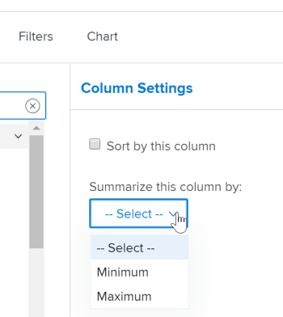

# Creare un rapporto matrice

I report matrice presentano informazioni di riepilogo in un formato di tabella aggregata, semplificando la visualizzazione rispetto a un elenco in un report tradizionale.

## Quando utilizzare un rapporto matrice

È possibile creare un report matrice per qualsiasi report contenente 2 o più raggruppamenti. Un report tradizionale può contenere fino a 3 raggruppamenti e un report matrice può contenere fino a 4 raggruppamenti.

Ad esempio, desideri creare un rapporto sulle ore che visualizzi le ore registrate durante un periodo di 3 mesi e che sia organizzato in base a chi ha inserito le ore, nonché in base al mese e alla settimana.

## Visualizzazione dei dati in un rapporto matrice

Le informazioni nel rapporto matrice vengono sempre visualizzate come valore numerico. Nella maggior parte dei casi, le colonne contenenti un valore numerico sono indicate per la visualizzazione in un rapporto matrice (ad esempio ore registrate e costo effettivo).

Tuttavia, altre colonne (ad esempio Stato) possono ancora essere visualizzate nel rapporto matrice come illustrato nell&#39;immagine seguente:\

## Requisiti di accesso

+++ Espandi per visualizzare i requisiti di accesso per la funzionalità in questo articolo.

Per eseguire i passaggi descritti in questo articolo, è necessario disporre dei seguenti diritti di accesso:

<table style="table-layout:auto"> 
 <col> 
 <col> 
 <tbody> 
  <tr> 
   <td role="rowheader">Piano Adobe Workfront*</td> 
   <td> 
Qualsiasi
 </td> 
  </tr> 
  <tr> 
   <td role="rowheader">Licenza Adobe Workfront*</td> 
      <td> 
      
Nuovo:

         <ul>
         <li>
Standard
</li>
         </ul>
      
Corrente:

         <ul>
         <li>
Piano
</li>
         </ul>
   </td>
  </tr> 
  <tr> 
   <td role="rowheader">Configurazioni del livello di accesso*</td> 
   <td>
Modificare l’accesso a Rapporti, Dashboard, Calendari
 
Modifica accesso a Filtri, Viste, Raggruppamenti
</td> 
  </tr> 
  <tr> 
   <td role="rowheader">Autorizzazioni oggetto</td> 
   <td> 
Gestire le autorizzazioni per un rapporto
</td> 
  </tr> 
 </tbody> 
</table>

*Per informazioni, consulta [Requisiti di accesso nella documentazione di Workfront](/help/quicksilver/administration-and-setup/add-users/access-levels-and-object-permissions/access-level-requirements-in-documentation.md).

+++

## Configurare un rapporto matrice

1. Crea un rapporto tradizionale che contiene dati numerici nell’output del rapporto.\
   Per informazioni su come creare un report, vedere [Creare un report personalizzato](../../../reports-and-dashboards/reports/creating-and-managing-reports/create-custom-report.md).

1. Vai al report creato nel passaggio 1, fai clic su **Azioni report**, quindi seleziona **Modifica**.

1. (Condizionale) Se hai già creato una visualizzazione e desideri applicarla a questo report, fai clic su **Applica una visualizzazione esistente**, quindi seleziona la visualizzazione dall&#39;elenco a discesa.
1. (Condizionale) Se desideri creare una nuova visualizzazione per il rapporto, completa i passaggi seguenti:

   1. Fare clic sulla scheda **Colonne (visualizzazione)**, quindi selezionare una colonna che si desidera riepilogare nel report matrice.
   1. Nell&#39;area **Impostazioni colonna** fare clic sull&#39;elenco a discesa **Riepiloga colonna per**, quindi selezionare una delle opzioni disponibili per il riepilogo delle informazioni.

      >[!IMPORTANT]
      >
      >Se questa opzione non è selezionata, le informazioni della colonna non vengono visualizzate correttamente nel report matrice.

      

   1. Ripetere il processo per ogni colonna nella scheda Colonne (Visualizzazione), quindi fare clic su **Fine**.

1. Fare clic sulla scheda **Raggruppamenti**.
1. (Condizionale) Se hai già creato un raggruppamento e desideri applicarlo a questo report, fai clic su **Applica un raggruppamento esistente**, quindi seleziona il raggruppamento dall&#39;elenco a discesa.
1. (Condizionale) Se si desidera creare un nuovo raggruppamento di matrici per il rapporto, completare i passaggi seguenti:

   1. Selezionare **Passa al raggruppamento di matrici** nell&#39;angolo superiore destro dell&#39;interfaccia del generatore.
   1. Nella sezione **Raggruppamenti righe**, identifica il raggruppamento di righe, che stabilisce i raggruppamenti orizzontali della tabella.
   1. (Facoltativo) Per aggiungere un ulteriore raggruppamento di righe, fare clic su **Aggiungi raggruppamento di righe secondario**.
   1. Nella sezione **Raggruppamenti di colonne** identificare il raggruppamento di colonne, che stabilisce i raggruppamenti verticali della tabella.
   1. (Facoltativo) Per aggiungere un ulteriore raggruppamento di colonne, fare clic su **Aggiungi raggruppamento di colonne secondario**.
   1. (Condizionale) Se aggiungi un raggruppamento per data, specifica anche se i risultati sono raggruppati per giorno, settimana, mese, trimestre o anno.\
      

   1. (Condizionale) Se si è scelto di raggruppare per data e visualizzare i risultati per trimestre, ad esempio, specificare se si desidera visualizzare i trimestri senza dati selezionando la casella di controllo **Mostra trimestri senza risultati**.\
      

      >[!NOTE]
      >
      >Il campo **Mostra trimestri senza risultati** è disponibile solo per i raggruppamenti di matrici e non per i raggruppamenti standard.\
      >Solo i trimestri senza dati che si trovano tra due trimestri con dati validi visualizzeranno zero per i valori dei dati nella scheda della matrice. I trimestri privi di dati che si trovano all’inizio e alla fine dell’intervallo temporale selezionato dal filtro non vengono visualizzati nel raggruppamento di matrici. I trimestri senza risultati non vengono visualizzati in un raggruppamento nella scheda Dettagli del rapporto.

1. (Facoltativo e condizionale) Fare clic su **Impostazioni matrice**, quindi selezionare una delle opzioni seguenti:\
   **Mostra conteggi record:** Selezionare questa opzione per visualizzare una riga con il numero totale di voci per il campo specificato.\
   **Mostra colonna valore:** Selezionare questa opzione per visualizzare le seguenti informazioni nella matrice:

   * Conteggi record
   * Colonna Valore

     >[!NOTE]
     >
     >Questa colonna contiene informazioni che descrivono ciò che rappresentano i dati in ogni riga.\
     >Le eccezioni riportate di seguito si applicano agli oggetti padre, ad esempio i task padre, quando si aggregano i valori per i campi seguenti nei raggruppamenti:
     >
     >   
     >   
     >   * Tutti i campi relativi al numero e alla divisa tranne Ore effettive (ad esempio Costo manodopera pianificato/effettivo, Costo spesa pianificato/effettivo, Costo pianificato/effettivo, Ore pianificate) aggregano solo i valori per le attività figlio e le attività autonome. Non aggregano i valori per le attività padre o i padri dei padri.
     >   * Le ore effettive aggregano i valori per le attività padre principale e le attività autonome; non aggregano i numeri per le attività padre o figlio.
     >   * I campi dati personalizzati per i valori numerici e di valuta aggregano tutte le attività: padri, figli, padri e attività autonome. Se hai creato il report matrice per visualizzare le ore pianificate o le ore effettive nella colonna **Valore**, tieni presente che le ore o le informazioni sui costi per qualsiasi oggetto padre (come le attività padre) non vengono visualizzate nel report matrice. Per visualizzare le ore sugli oggetti padre, è necessario visualizzare la scheda **Dettagli**.
     >   
     >   
     >**Regole condizionali:** Impostare le regole di formattazione per i valori aggregati.\

   Dopo aver aggiunto una regola, è possibile definire stili di campo e di testo per la visualizzazione dei campi corrispondenti alla regola. Fai clic su **Aggiungi regola** al termine della definizione della regola, quindi su **Fine** per salvare la regola.

1. Fai clic sulla scheda **Filtri** per definire quali informazioni verranno visualizzate nel rapporto.
1. (Condizionale) Se hai già creato un filtro e desideri applicarlo a questo report, fai clic su **Applica un filtro esistente**, quindi seleziona il filtro dall&#39;elenco a discesa.
1. (Condizionale) Se desideri creare un nuovo filtro per questo report, vedi [Filtri e modificatori di condizioni](../../../reports-and-dashboards/reports/reporting-elements/filter-condition-modifiers.md)

   <!--
   <MadCap:conditionalText data-mc-conditions="QuicksilverOrClassic.Draft mode">
   and
   <a href="../../../reports-and-dashboards/reports/reporting-elements/advanced-filter-condition-qualifiers.md" class="MCXref xref">Advanced Filter and condition qualifiers </a>
   </MadCap:conditionalText>
   -->

   per informazioni sui vari qualificatori che è possibile utilizzare per la creazione dei filtri.

1. Fai clic su **Salva+Chiudi** per salvare e visualizzare il report matrice.
