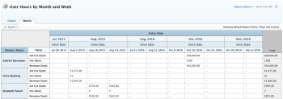

# Creare un rapporto sulla matrice

I rapporti matrice presentano informazioni di riepilogo in formato tabella aggregata, facilitando la visualizzazione rispetto a se fossero visualizzate in un elenco come in un rapporto tradizionale.

## Quando utilizzare un rapporto sulla matrice

Puoi creare un rapporto a matrice per qualsiasi rapporto contenente 2 o più Raggruppamenti. Un rapporto tradizionale può contenere fino a 3 raggruppamenti e un rapporto matrice può contenere fino a 4 raggruppamenti.

Ad esempio, se desideri creare un rapporto Ora che visualizzi le ore registrate durante un periodo di 3 mesi e desideri che il rapporto sia organizzato in base a chi è entrato nelle ore, nonché in base al mese e alla settimana.

## Visualizzazione dei dati in un rapporto matrice

Le informazioni nel rapporto matrice vengono sempre visualizzate come valore numerico. Nella maggior parte dei casi, le colonne che contengono un valore numerico sono ideali per la visualizzazione in un rapporto a matrice (ad esempio le ore registrate e il costo effettivo).

Tuttavia, altre colonne (come Status) possono ancora essere visualizzate nel rapporto della matrice come mostrato nell&#39;immagine seguente:\

## Requisiti di accesso

Per eseguire i passaggi descritti in questo articolo, è necessario disporre dei seguenti diritti di accesso:

<table style="table-layout:auto"> 
 <col> 
 <col> 
 <tbody> 
  <tr> 
   <td role="rowheader">piano Adobe Workfront*</td> 
   <td> 
Qualsiasi
 </td> 
  </tr> 
  <tr> 
   <td role="rowheader">Licenza Adobe Workfront*</td> 
   <td> 
Piano 
 </td> 
  </tr> 
  <tr> 
   <td role="rowheader">Configurazioni a livello di accesso*</td> 
   <td> 
Accesso a rapporti, dashboard, calendari
 
Modificare l’accesso a Filtri, Visualizzazioni, Gruppi
 
Nota: Se non disponi ancora dell’accesso, chiedi all’amministratore Workfront se ha impostato ulteriori restrizioni nel livello di accesso. Per informazioni su come un amministratore Workfront può modificare il livello di accesso, consulta <a href="../../../administration-and-setup/add-users/configure-and-grant-access/create-modify-access-levels.md" class="MCXref xref">Creare o modificare livelli di accesso personalizzati</a>.
 </td> 
  </tr> 
  <tr> 
   <td role="rowheader">Autorizzazioni oggetto</td> 
   <td> 
Gestire le autorizzazioni per un rapporto
 
Per informazioni sulla richiesta di accesso aggiuntivo, vedi <a href="../../../workfront-basics/grant-and-request-access-to-objects/request-access.md" class="MCXref xref">Richiedere l’accesso agli oggetti </a>.
 </td> 
  </tr> 
 </tbody> 
</table>

&#42;Per informazioni sul piano, il tipo di licenza o l&#39;accesso, contattare l&#39;amministratore Workfront.

## Impostare un rapporto sulle matrici

1. Crea un rapporto tradizionale contenente dati numerici nell’output del rapporto.\
   Per informazioni su come creare un rapporto, vedi [Creare un rapporto personalizzato](../../../reports-and-dashboards/reports/creating-and-managing-reports/create-custom-report.md).

1. Passa al rapporto creato al passaggio 1 e fai clic su **Azioni dei rapporti**, quindi seleziona **Modifica**.

1. (Condizionale) Se hai già creato una visualizzazione e desideri applicarla al rapporto, fai clic su **Applicare una visualizzazione esistente**, quindi seleziona Vista dall’elenco a discesa.
1. (Condizionale) Se desideri creare una nuova visualizzazione per il rapporto, completa i passaggi seguenti:

   1. Fai clic sul pulsante **Colonne (visualizzazione)** , quindi selezionare una colonna da riepilogare nel rapporto della matrice.
   1. In **Impostazioni colonna** fai clic sull’area **Riepiloga questa colonna per** dall’elenco a discesa, quindi seleziona una delle opzioni disponibili per il riepilogo delle informazioni.

      >[!IMPORTANT]
      >
      >Se questa opzione non è selezionata, le informazioni della colonna non vengono visualizzate correttamente nel rapporto matrice.

      

   1. Ripetere questo processo per ogni colonna della scheda Colonne (visualizzazione), quindi fare clic su **Fine**.

1. Fai clic sul pulsante **Raggruppamenti** scheda .
1. (Condizionale) Se hai già creato un raggruppamento e desideri applicarlo al rapporto, fai clic su **Applicare un raggruppamento esistente**, quindi seleziona Raggruppamento dall’elenco a discesa.
1. (Condizionale) Se desideri creare un nuovo gruppo di matrici per il rapporto, completa i passaggi seguenti:

   1. Seleziona **Passa al raggruppamento a matrice** nell&#39;angolo superiore destro dell&#39;interfaccia del generatore.
   1. In **Raggruppamenti di righe** , identificare il raggruppamento di righe, che stabilisce i raggruppamenti orizzontali della tabella.
   1. (Facoltativo) Per aggiungere un raggruppamento di righe aggiuntivo, fai clic su **Aggiungi raggruppamento di righe secondarie**.
   1. In **Raggruppamenti colonne** identificare il raggruppamento di colonne, che determinano i raggruppamenti verticali della tabella.
   1. (Facoltativo) Per aggiungere un raggruppamento di colonne aggiuntivo, fai clic su **Aggiungi raggruppamento colonne secondario**.
   1. (Condizionale) Se aggiungi un raggruppamento per data, specifica anche se i risultati sono raggruppati per giorno, settimana, mese, trimestre o anno.\
      

   1. (Condizionale) Se è stato selezionato per raggruppare per data e visualizzare i risultati per trimestre, ad esempio, specificare se si desidera visualizzare i trimestri senza dati selezionando l&#39;opzione **Mostra trimestri senza risultati** casella di controllo.\
      

      >[!NOTE]
      >
      >La **Mostra trimestri senza risultati** Il campo è disponibile solo per i raggruppamenti di matrici e non per i raggruppamenti standard.\
      >Solo i trimestri senza dati che si trovano tra due trimestri con dati validi verranno visualizzati zero per i valori dei dati nella scheda Matrice. I trimestri privi di dati che si trovano all’inizio e alla fine dell’intervallo temporale selezionato dal filtro non vengono visualizzati del tutto nel raggruppamento delle matrici. I trimestri senza risultati non verranno visualizzati in un raggruppamento nella scheda Dettagli del rapporto.

1. (Facoltativo e condizionale) Fai clic su **Impostazioni matrice**, quindi seleziona una delle seguenti opzioni:\
   **Mostra conteggi record:** Selezionare questa opzione per visualizzare una riga con il numero totale di voci per il campo specificato.\
   **Mostra colonna valore:** Selezionare questa opzione per visualizzare le seguenti informazioni nella matrice:

   * Conteggi record
   * Colonna Valore

      >[!NOTE]
      >
      >Questa colonna contiene informazioni che descrivono i dati rappresentati in ogni riga.\
      >Le seguenti eccezioni si applicano agli oggetti principali (ad esempio, le attività principali) quando si aggregano valori per i seguenti campi nei raggruppamenti:
      >
      >   
      >   
      >   * Tutti i campi relativi al numero e alla divisa, ad eccezione delle ore effettive (ad esempio, Costo manodopera pianificato/effettivo, Costo spesa pianificato/effettivo, Costo pianificato/effettivo, Ore pianificate) aggregano solo i valori relativi alle attività figlio e alle attività autonome. Non aggregano i valori per le attività principali o le attività principali dei genitori.
      >   * Le ore effettive aggregano i valori per le attività principali e le attività autonome; non aggregano i numeri relativi alle attività principali o alle attività figlio per le attività padre.
      >   * I campi dati personalizzati per i valori di numero e valuta aggregano tutte le attività: genitori, figli, genitori di genitori e compiti autonomi. Se hai creato il rapporto della matrice per visualizzare le ore pianificate o effettive nel **Valore** tenere presente che le informazioni sulle ore o sui costi per gli oggetti principali (ad esempio le attività principali) non vengono visualizzate nel rapporto matrice. Per visualizzare le ore sugli oggetti principali, è necessario visualizzare il **Dettagli** scheda .

   **Regole condizionali:** Imposta le regole di formattazione per i valori aggregati.\
   Dopo aver aggiunto una regola, puoi definire gli stili di campo e testo per la modalità di visualizzazione dei campi corrispondenti a tale regola. Fai clic su **Aggiungi regola** dopo aver definito la regola, **Fine** per salvare la regola.

1. Fai clic sul pulsante **Filtri** per definire quali informazioni verranno visualizzate nel rapporto.
1. (Condizionale) Se hai già creato un filtro e desideri applicarlo a questo rapporto, fai clic su **Applicare un filtro esistente**, quindi seleziona Filtro dall’elenco a discesa.
1. (Condizionale) Per creare un nuovo filtro per il rapporto, consulta [Modificatori di filtri e condizioni](../../../reports-and-dashboards/reports/reporting-elements/filter-condition-modifiers.md)

   <!--
   <MadCap:conditionalText data-mc-conditions="QuicksilverOrClassic.Draft mode">
   and
   <a href="../../../reports-and-dashboards/reports/reporting-elements/advanced-filter-condition-qualifiers.md" class="MCXref xref">Advanced Filter and condition qualifiers </a>
   </MadCap:conditionalText>
   -->

   per informazioni sui vari qualificatori utilizzabili per la creazione di filtri.

1. Fai clic su **Salva e chiudi** per salvare e visualizzare il rapporto della matrice.
