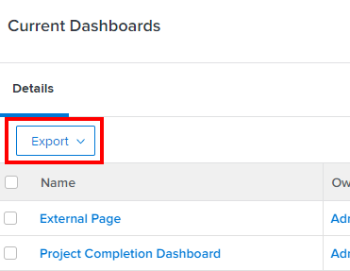

# Esportare i dati

<!-- Audited: 5/2025 -->

Puoi esportare i dati di Adobe Workfront da elenchi, report, dashboard e ricerche.

Ecco alcuni motivi per esportare i dati:

* Si desidera fornire una copia cartacea dei dati a un utente esterno a Workfront.
* Si desidera inviare i risultati di un report come allegato a un utente esterno.
* Si desidera creare un backup esterno dei dati Workfront.
* Esiste un limite per visualizzare solo 2.000 risultati in una pagina all&#39;interno dell&#39;applicazione Web Workfront. Se il report produce più di 2.000, è possibile esportarlo in uno qualsiasi dei formati disponibili e visualizzare tutti i risultati in un unico elenco.

Puoi esportare un report manualmente dall’interfaccia di Workfront oppure pianificare la consegna di un report che ti verrà inviato in un secondo momento. Per ulteriori informazioni sulla pianificazione dei report consegnati, vedere [Panoramica sulla consegna dei report](../../../reports-and-dashboards/reports/creating-and-managing-reports/set-up-report-deliveries.md).

Le informazioni contenute in questo articolo non si applicano alle seguenti esportazioni:

* Esportazione di informazioni dai report grafico.

  Per ulteriori informazioni sull&#39;esportazione di un report grafico, vedere [Aggiungere un grafico a un report](../../../reports-and-dashboards/reports/creating-and-managing-reports/add-chart-report.md).

* Esportazione di informazioni dal diagramma di Gantt.

  Per ulteriori informazioni sull&#39;esportazione del grafico Gantt, vedere [Esportare il grafico Gantt in PDF](../../../manage-work/gantt-chart/use-the-gantt-chart/export-gantt-chart-to-pdf.md).

* Esportazione di informazioni dal planner risorse.

  Per ulteriori informazioni sull&#39;esportazione delle informazioni da Pianificazione risorse, vedere &quot;Opzione di esportazione&quot; in [Panoramica della navigazione di Pianificazione risorse](../../../resource-mgmt/resource-planning/resource-planner-navigation.md).

## Requisiti di accesso

+++ Espandi per visualizzare i requisiti di accesso per la funzionalità descritta in questo articolo.

<table style="table-layout:auto"> 
 <col> 
 <col> 
 <tbody> 
  <tr> 
   <td role="rowheader">Pacchetto Adobe Workfront</td> 
   <td> 
Qualsiasi
 </td> 
  </tr> 
  <tr> 
   <td role="rowheader">Licenza di Adobe Workfront</td> 
   <td> 
      
Light

      
Rivedi

   </td>
  </tr> 
  <tr> 
   <td role="rowheader">Configurazioni del livello di accesso</td> 
   <td> 
View or higher access to Reports, Dashboards, and Calendars to export reports
 
Accesso di visualizzazione o superiore agli oggetti visualizzati in un elenco per esportare l'elenco
 </td> 
  </tr> 
  <tr> 
   <td role="rowheader">Autorizzazioni sugli oggetti</td> 
   <td> 
Visualizzare o concedere autorizzazioni superiori a un report o a un dashboard per esportare il report o il dashboard
 
Visualizza o autorizzazioni superiori per gli oggetti visualizzati in un elenco per esportare l'elenco
 </td> 
  </tr> 
 </tbody> 
</table>

Per ulteriori dettagli sulle informazioni contenute in questa tabella, consulta [Requisiti di accesso nella documentazione Workfront](/help/quicksilver/administration-and-setup/add-users/access-levels-and-object-permissions/access-level-requirements-in-documentation.md).

+++

## Prerequisiti

Per poter esportare i dati del report, è necessario crearlo.

Per ulteriori informazioni sulla creazione di report, vedere [Creare un report personalizzato](/help/quicksilver/reports-and-dashboards/reports/creating-and-managing-reports/create-custom-report.md) oppure [Creare una copia di un report](/help/quicksilver/reports-and-dashboards/reports/creating-and-managing-reports/create-copy-report.md).

## Formati e limiti di esportazione

### Esportare i formati {#export-formats}

Le informazioni possono essere esportate nei seguenti formati:

* PDF (Landscape or Portrait)
* Excel
* Excel (.xlsx)
* Delimitato in tabella

>[!NOTE]
>
>Dashboards can either be printed or exported only to a PDF file.

### Limiti di esportazione {#export-limits}

<!--
NOTE: Alina: [! This information is shared between "Exporting Data" and "Setting Up Report Deliveries."]
-->

Esistono diverse limitazioni riguardo al modo in cui i report vengono visualizzati in Workfront e al modo in cui vengono esportati mediante un’esportazione manuale, un report fornito o tramite l’API.

* **50.000 celle:** Il numero massimo di celle consentito in un&#39;esportazione di report per file Excel.
* **50.000 righe:** numero di righe di dati consentite in un&#39;esportazione di report per file PDF e delimitati da tabulazioni.

   * Per i file di Excel, questo limite è di **65.000 righe**.
   * Per i file di Excel (.xlsx), questo limite è di **100.000 righe**.
   * Questi limiti escludono le intestazioni di colonna e le righe per i raggruppamenti nel report. Ad esempio, se in un report sono presenti 6 raggruppamenti e 50.000 righe di dati, il file esportato conterrà 50.000 righe.

  >[!IMPORTANT]
  >
  >L’esportazione di un report che include un riferimento alla raccolta in una colonna può generare un errore, anche se il report rientra nei limiti di esportazione elencati. Se la raccolta a cui si fa riferimento è troppo grande, il processo di esportazione si interrompe e successivamente genera un errore.
  >
  >Per evitare questo errore, escludete le colonne che fanno riferimento a raccolte di grandi dimensioni o riducete le dimensioni delle raccolte a cui si fa riferimento prima dell&#39;esportazione.

  Se il report contiene più elementi di questi limiti, viene visualizzato un messaggio di errore che indica che l’esportazione non è riuscita. Per esportare i risultati, riduci il numero di elementi visualizzati sullo schermo a un numero inferiore o uguale a questi limiti.

  If your report has more than 50,000/ 65,000/ 100,000 rows and you want to export all the data, we suggest that you use filters or prompts to obtain smaller loads of data, and perform multiple exports.

  For information on using filters, see [Filters overview](../../../reports-and-dashboards/reports/reporting-elements/filters-overview.md).

  For information about using prompts, see [Add a prompt to a report](../../../reports-and-dashboards/reports/creating-and-managing-reports/add-prompt-report.md).

* Questi limiti si applicano a:

   * Esportazione manuale di un report.
   * Un report pianificato.
   * Esportazione tramite un’integrazione API.
   * Dati esportati mediante avvio.

     Per ulteriori informazioni sull&#39;esportazione di dati tramite avvio, vedere [Esportare dati da Adobe Workfront tramite avvio](../../../administration-and-setup/manage-workfront/using-kick-starts/export-data-from-wf-via-kick-starts.md).

     >[!NOTE]
     >
     >Puoi esportare 50.000 righe in un file di avvio rapido, anche se puoi esportare i dati solo in un file in formato Excel.

   * Esportazione delle informazioni sull&#39;utilizzo per un progetto.

     Per ulteriori informazioni sull&#39;esportazione delle informazioni sull&#39;utilizzo per un progetto, vedere [Panoramica del report Utilizzo risorse](../../../reports-and-dashboards/reports/using-built-in-reports/resource-utilization-report.md#exporting-utilization-information-for-a-project).

* **Dimensione file di 10 MB:** Limite dimensione file per qualsiasi report esportato pianificato per il recapito. Se un file esportato allegato a un messaggio e-mail supera i 5 MB, viene inviato per e-mail un collegamento tramite il quale è possibile scaricare il file, anziché il report di esportazione allegato.
* **65.530 collegamenti ipertestuali:** Limite imposto da Excel ai documenti contenenti più di 65.530 collegamenti ipertestuali. Questi documenti non possono essere aperti quando vengono esportati manualmente o inviati in un report consegnato. Si noti che un documento di Excel può avere solo 200 righe di dati, ma se il documento contiene più di 65.530 collegamenti, il documento non si apre. Questo limite esiste solo per i file di Excel e non per gli altri formati supportati.
* **256 colonne**: limite imposto da Excel ai documenti contenenti più di 256 colonne. Questi documenti non possono essere esportati manualmente o inviati in un report consegnato. Questo limite esiste solo per i file di Excel e non per gli altri formati supportati.

  >[!IMPORTANT]
  >
  >L’esportazione di un report che include una colonna Report può generare un errore anche se il report non rientra nei limiti di esportazione elencati.
  >
  >Se si utilizza la funzione di esportazione per condividere un report contenente una colonna Report con altri utenti, può essere utile condividere il report rendendolo pubblico. Per ulteriori informazioni su come rendere pubblico un report, vedere [Condividere un report in Adobe Workfront](/help/quicksilver/reports-and-dashboards/reports/creating-and-managing-reports/share-report.md).
  >
  >Se utilizzi la funzione di esportazione per valutare i dati esternamente, ti consigliamo invece di utilizzare Workfront Data Connect. Per ulteriori informazioni, vedere [Panoramica di Workfront Data Connect](/help/quicksilver/reports-and-dashboards/data-lake/data-lake-overview.md).

Se si tenta di esportare dati oltre il limite, è possibile che non vengano ricevuti tutti i dati previsti nell&#39;esportazione. Piuttosto, viene prodotto un report modificato entro il limite.

Inoltre, i report che richiedono più di 60 minuti verranno arrestati.

In caso di dubbi o problemi relativi al limite, contattare il supporto tecnico Workfront.

## Esportare i dati

### Esportare dati da un report o un elenco {#export-data-from-a-report-or-list}

1. Passare al report o all&#39;elenco da esportare.
1. Seleziona gli elementi da esportare. Se si selezionano singoli elementi, vengono esportati solo gli elementi selezionati.

   For example, in a project, select the tasks you want to export.

   Oppure

   Leave all items deselected to export the entire list.

1. Fai clic su **Esporta**, quindi seleziona un formato.

   <!--
   This note doesn't seem to be true (I tested with e reviewer and they could export the dashboard and its reports), and there's another article all about exporting dashboards. Lisa 12/23
   >[!NOTE]
   >
   >To export a Dashboard report, you must have a Plan license.  
   >
   -->

   Oppure

   Fai clic sull&#39;icona **Esporta** , quindi seleziona un formato.

   Le opzioni disponibili per l’esportazione in PDF dipendono dalle impostazioni delle impostazioni internazionali e-mail nelle impostazioni utente di Workfront:

   * Nord America - Lettera - Orizzontale, Lettera - Verticale, Altre dimensioni

   * Tutte le località al di fuori del Nord America - A4 - Orizzontale, A4 - Verticale, Altre dimensioni

1. (Condizionale) A seconda del sistema operativo utilizzato, è possibile che sia disponibile l&#39;opzione di apertura o salvataggio del file. Apri il file con l&#39;applicazione associata o salvalo sul disco rigido.
1. Per comprendere come vengono visualizzate le informazioni nel file esportato, continuate a leggere la sezione [Utilizzare il documento esportato](#use-the-exported-document) in questo articolo.

### Esportare i dati da un dashboard {#export-data-from-a-dashboard}

È possibile stampare le informazioni da un dashboard oppure esportarle come file PDF.

For more information about exporting data from a dashboard, see [Export a dashboard](../../../reports-and-dashboards/dashboards/creating-and-managing-dashboards/export-dashboard.md).

## Utilizzare il documento esportato {#use-the-exported-document}

Le sezioni seguenti descrivono la modalità di visualizzazione delle informazioni in un file esportato:

* [File names](#file-names)
* [Titles](#titles)
* [Timestamps](#timestamps)
* [Formattazione](#formatting)
* [Collegamenti](#links)
* [Branding](#branding)

### Nomi file {#file-names}

Indipendentemente dall&#39;esportazione di un elenco di oggetti o di un report, il file esportato avrà un nome e un titolo. È possibile trovare il file esportato nel computer facendo riferimento al nome del file. Il titolo del report fornirà agli utenti un&#39;indicazione di ciò che rappresenta il file esportato quando lo condividi con loro.

#### Nomi file per elenchi esportati {#file-names-for-exported-lists}

Quando esportate un elenco di oggetti, il tipo di oggetto viene visualizzato nel file esportato nel nome file e nel titolo dell&#39;elenco.

Quando si esporta un elenco di attività o problemi, **Nome file** può essere uno dei seguenti:

* Quando si esportano elenchi di attività e di problemi in un progetto:

   * *The_project_name_Exported_Tasks*(*in PDF, Excel, Excel (.xlsx) o nei formati delimitati da tabulazione)*
   * *The_project_name_Exported_Issues*(*in PDF, Excel, Excel (.xlsx), or Tab delimited formats)*

* When you export task and issue lists in a task (subtasks):

   * **The_project_name_the_task_name_Exported_Tasks**(*in PDF, Excel, Excel (.xlsx), or Tab delimited formats)*
   * **The_project_name_the_task_name_Exported_Issues**(*in PDF, Excel, Excel (.xlsx), or Tab delimited formats)*

When you export a list of any other objects from a project to a PDF file, the file name of the exported document indicates the type of objects you exported.\
Ad esempio, il nome del file può essere:

* *Utenti_esportati*, durante l&#39;esportazione della scheda Persone nel progetto (*in PDF, Excel, Excel (.xlsx) o nei formati delimitati da tabulazione)*
* *Rischi_esportati*, durante l&#39;esportazione di un elenco di rischi nel progetto (*in PDF, Excel, Excel (.xlsx) o nei formati delimitati da tabulazioni)*

#### Nomi dei file per i report esportati {#file-names-for-exported-reports}

Quando esporti un report, il nome file del report esportato è:

*Nome_report*(*nei formati PDF, Excel, Excel (.xlsx) o delimitato da tabulazione)*

### Titoli {#titles}

Quando esportate un elenco di oggetti, solo il file in formato PDF avrà un titolo. Se si esporta un elenco o un report in formato Excel, Excel (.xlsx) o Tab Delimited, il file non ha un titolo.

#### Titoli per elenchi esportati {#titles-for-exported-lists}

Quando si esportano gli elenchi di attività e problemi di un progetto in un file PDF, il titolo del documento esportato è uno dei seguenti:

* *Nome progetto - Attività esportate*
* *Nome progetto - Problemi esportati*

Quando si esportano elenchi di attività e di problemi in un&#39;attività in un file PDF, il riquadro del documento esportato è uno dei seguenti:

* *Nome progetto - Nome attività - Attività esportate*
* *Nome progetto - Nome attività - Problemi esportati*

Quando esportate un elenco di qualsiasi altro oggetto da un progetto in un file PDF, il titolo del documento esportato indica il tipo di oggetto esportato.\
Ad esempio, il titolo può essere:

* *Utenti esportati*, durante l&#39;esportazione della scheda Persone nel progetto.
* *Rischi esportati*, durante l&#39;esportazione di un elenco di rischi nel progetto.

#### Titoli per i report esportati {#titles-for-exported-reports}

Un report esportato in un file PDF avrà un titolo.

Se il report viene esportato in Excel, Excel (.xlsx) o Tab Delimited, il report esportato non avrà un titolo. Il titolo del file esportato è il nome del report visualizzato nell&#39;applicazione Web Workfront.

Se il report ha una descrizione, viene incluso nel file esportato.

### Marca temporale {#timestamps}

A timestamp is displayed on the exported document from the context of the user who exported the item.

La marca temporale include:

* Data
* Ora
* Fuso orario in cui l&#39;elemento è stato esportato

A seconda del tipo di documento esportato, le marche temporali vengono visualizzate in varie posizioni:

* **PDF:** Le marche temporali vengono visualizzate nel piè di pagina di ogni pagina e nel nome del file.
* **Excel:** Le marche temporali sono visualizzate nel nome del file.

### Formattazione {#formatting}

Quando si esporta un progetto in PDF, tutte le sottoattività vengono visualizzate come rientrate rispetto alle relative attività principali. Gli elenchi esportati non comprimono alcuna attività padre.

Quando un report viene inviato o programmato per una consegna, si riceve sempre la scheda predefinita di un report, a meno che il report non abbia una visualizzazione speciale.

Se il report ha una formattazione speciale nell&#39;applicazione Web, il report deve essere consegnato con la formattazione speciale quando vengono consegnate le schede Dettagli e Matrice, solo per i file PDF ed Excel.

>[!NOTE]
>
>Se i dati esportati contengono colonne condivise ed esportate in formato Excel o Tab Delimited, tali colonne verranno separate nel file esportato.

Per ulteriori informazioni sulla personalizzazione della formattazione in un report, vedere [Utilizzo della formattazione condizionale nelle visualizzazioni](../../../reports-and-dashboards/reports/reporting-elements/use-conditional-formatting-views.md).

### Collegamenti {#links}

I collegamenti possono puntare a qualsiasi oggetto in Workfront che supporta il collegamento. Quando si esporta un elenco in Workfront in PDF, tutti i collegamenti supportati presenti nel documento originale rimangono attivi nel documento esportato.

>[!TIP]
>
>If the line `valueformat=HTML` appears in text mode for a custom field column and the link values do not display in an exported PDF file, you need to enter additional lines of code to your column in text mode.
>
>For example, if you have a custom field called Open Q1 Projects that contains links, you would add the following code:
>
>`link.url=customDataLabelsAsString(Open Q1 Projects)`
>`linkedname=direct`

Quando si esegue l&#39;esportazione in un formato Excel, nel file esportato vengono inclusi solo i collegamenti agli oggetti all&#39;interno di Workfront e sono supportati solo nelle posizioni in cui è possibile selezionare l&#39;opzione per consentire i collegamenti nei documenti Excel esportati, ad esempio le consegne dei report.

## Branding {#branding}

>[!IMPORTANT]
>
>Il branding si applica solo alle organizzazioni che non hanno ancora effettuato l’onboarding in Adobe Experience Cloud.
>
>Se la tua organizzazione è stata integrata in Adobe Experience Cloud, il branding non è disponibile.

Se l’amministratore di Workfront ha aggiunto un marchio personalizzato all’istanza Workfront per la barra di navigazione globale, nei file PDF esportati è presente anche il logo personalizzato.

I dati esportati in altri formati non possono essere personalizzati con il logo.

Per ulteriori informazioni sul branding dell&#39;istanza di Workfront e sulla barra di navigazione globale, consulta [Aggiungere il tuo branding all&#39;istanza di Adobe Workfront](../../../administration-and-setup/customize-workfront/brand-workfront/brand-your-workfront-instance.md).
