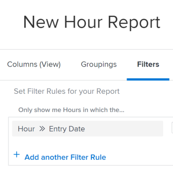

# Filtrare i rapporti per intervalli di tempo

È possibile filtrare un rapporto in base all&#39;intervallo di tempo di una data esistente su un oggetto. Ad esempio, puoi filtrare un rapporto sulle ore per un determinato intervallo di tempo in cui sono state inserite le ore.

## Requisiti di accesso

Per eseguire i passaggi descritti in questo articolo, è necessario disporre dei seguenti diritti di accesso:

<table style="table-layout:auto"> 
 <col> 
 <col> 
 <tbody> 
  <tr> 
   <td role="rowheader">piano Adobe Workfront*</td> 
   <td> 
Qualsiasi
 </td> 
  </tr> 
  <tr> 
   <td role="rowheader">Licenza Adobe Workfront*</td> 
   <td> 
Piano 
 </td> 
  </tr> 
  <tr> 
   <td role="rowheader">Configurazioni a livello di accesso*</td> 
   <td> 
Accesso a rapporti, dashboard, calendari
 
Modificare l’accesso a Filtri, Visualizzazioni, Gruppi
 
Nota: Se non disponi ancora dell’accesso, chiedi all’amministratore Workfront se ha impostato ulteriori restrizioni nel livello di accesso. Per informazioni su come un amministratore Workfront può modificare il livello di accesso, consulta <a href="../../../administration-and-setup/add-users/configure-and-grant-access/create-modify-access-levels.md" class="MCXref xref">Creare o modificare livelli di accesso personalizzati</a>.
 </td> 
  </tr> 
  <tr> 
   <td role="rowheader">Autorizzazioni oggetto</td> 
   <td> 
Gestire le autorizzazioni per un rapporto
 
Per informazioni sulla richiesta di accesso aggiuntivo, vedi <a href="../../../workfront-basics/grant-and-request-access-to-objects/request-access.md" class="MCXref xref">Richiedere l’accesso agli oggetti </a>.
 </td> 
  </tr> 
 </tbody> 
</table>

&#42;Per informazioni sul piano, il tipo di licenza o l&#39;accesso, contattare l&#39;amministratore Workfront.

## Prerequisiti

È necessario creare il rapporto prima di filtrarne i risultati.

Per ulteriori informazioni sulla creazione di rapporti, vedi [Creare un rapporto](../../../reports-and-dashboards/reports/creating-and-managing-reports/create-report.md).

## Filtrare un rapporto per l’intervallo di tempo di una data {#filter-a-report-by-the-time-frame-of-a-date}

1. Fai clic sul pulsante **Menu principale** icona , quindi fai clic su **Reporting**.

1. Fai clic su **Nuovo rapporto**, quindi seleziona il tipo di rapporto desiderato.\
   Ad esempio, seleziona **Rapporto orario**.

1. Seleziona la **Filtri** scheda .
1. Fai clic su **Aggiungere una regola filtro**, quindi seleziona **Data ingresso ora**.\
   

1. Nel menu a discesa seguente, seleziona una delle seguenti opzioni:

   <table style="table-layout:auto"> 
    <col> 
    <col> 
    <tbody> 
     <tr> 
      <td role="rowheader">Equal</td> 
      <td>Dopo aver selezionato questo modificatore, specifica la data in cui sono state inserite le ore.</td> 
     </tr> 
     <tr> 
      <td role="rowheader">Not Equal</td> 
      <td>Dopo aver selezionato questo modificatore, specifica la data in cui sono state inserite le ore, in modo da escludere tale data dal rapporto. Il rapporto mostra le ore registrate in tutte le date, previste per la data specificata.</td> 
     </tr> 
     <tr> 
      <td role="rowheader">Null</td> 
      <td>Selezionare questo modificatore per visualizzare solo le ore in cui manca la data di immissione.</td> 
     </tr> 
     <tr> 
      <td role="rowheader">Not Null</td> 
      <td>Selezionare questo modificatore per visualizzare solo le ore in cui la Data di immissione ha un valore.</td> 
     </tr> 
     <tr> 
      <td role="rowheader">Tra</td> 
      <td>Dopo aver selezionato questo modificatore, specifica un intervallo di date al momento dell’immissione delle ore. Il rapporto mostra le ore inserite tra le date specificate.</td> 
     </tr> 
     <tr> 
      <td role="rowheader">Minore di</td> 
      <td>Dopo aver selezionato questo modificatore, specifica una data prima della quale sono state inserite le ore. Il rapporto mostra le ore inserite prima della data specificata e non include la data specificata.</td> 
     </tr> 
     <tr> 
      <td role="rowheader">Less Than Equal</td> 
      <td>Dopo aver selezionato questo modificatore, specifica una data prima della quale sono state inserite le ore. Il rapporto mostra le ore inserite prima della data specificata, inclusa la data specificata.</td> 
     </tr> 
     <tr> 
      <td role="rowheader">Maggiore di</td> 
      <td>Dopo aver selezionato questo modificatore, specifica una data dopo la quale sono state inserite le ore. Il rapporto mostra le ore inserite dopo la data specificata e non include la data specificata.</td> 
     </tr> 
     <tr> 
      <td role="rowheader">Greater Than Equal</td> 
      <td> 
Dopo aver selezionato questo modificatore, specifica una data dopo la quale sono state inserite le ore. Il rapporto mostra le ore inserite dopo la data specificata, inclusa la data specificata.
 
Seleziona uno dei modificatori di frame di tempo incorporati, come descritto in <a href="#built-in-time-frame-modifiers" class="MCXref xref">Modificatori di frame temporali incorporati</a>.
 </td> 
     </tr> 
    </tbody> 
   </table>

1. Questi modificatori sono disponibili per qualsiasi campo data in un filtro o un prompt in qualsiasi report.
1. Fai clic su **Salva e chiudi**.

## Modificatori di frame temporali incorporati {#built-in-time-frame-modifiers}

Adobe Workfront dispone di modificatori di frame di tempo incorporati che è possibile utilizzare senza definire una data specifica. 

Questi modificatori sono disponibili per qualsiasi campo data in un filtro o un prompt in qualsiasi report. 

Per ulteriori informazioni su come filtrare un rapporto in base a un intervallo di tempo associato a una data, consulta  [Filtrare un rapporto per l’intervallo di tempo di una data](#filter-a-report-by-the-time-frame-of-a-date).

Ad esempio, se si crea un rapporto sulle ore e si desidera visualizzare le ore immesse in un intervallo di tempo specifico, è possibile scegliere tra le seguenti opzioni di filtro per l&#39;intervallo di tempo integrato:

<table style="table-layout:auto"> 
 <col> 
 <col> 
 <tbody> 
  <tr> 
   <td role="rowheader">Oggi</td> 
   <td>Visualizza le ore in cui la data di ingresso è odierna.</td> 
  </tr> 
  <tr> 
   <td role="rowheader">Questa settimana</td> 
   <td>Visualizza le ore in cui la data di ingresso è una data della settimana corrente, in cui la settimana inizia su una domenica e termina su un sabato.</td> 
  </tr> 
  <tr> 
   <td role="rowheader">Settimana Prossima</td> 
   <td>Visualizza le ore in cui la data di ingresso è una data della settimana successiva alla settimana corrente, in cui la settimana inizia su una domenica e termina su un sabato. </td> 
  </tr> 
  <tr> 
   <td role="rowheader">Settimana scorsa</td> 
   <td>Visualizza le ore in cui la data di ingresso è una data della settimana precedente la settimana corrente, in cui la settimana inizia su una domenica e termina su un sabato. </td> 
  </tr> 
  <tr> 
   <td role="rowheader">Questo mese</td> 
   <td>Visualizza le ore in cui la data di immissione è una data del mese corrente.</td> 
  </tr> 
  <tr> 
   <td role="rowheader">Mese Prossimo</td> 
   <td>Visualizza le ore in cui la data di immissione è una data nel mese successivo al mese corrente.</td> 
  </tr> 
  <tr> 
   <td role="rowheader">Mese scorso</td> 
   <td>Visualizza le ore in cui la data di immissione è una data nel mese precedente il mese corrente</td> 
  </tr> 
  <tr> 
   <td role="rowheader">Questo TriMestre</td> 
   <td> 
Visualizza le ore in cui la data di immissione è una data del trimestre corrente, dove i trimestri sono definiti come:
 
    <ul> 
     <li>Primo trimestre: 1 gennaio - 30 marzo</li> 
     <li>Secondo trimestre: 1 aprile - 30 giugno</li> 
     <li>Terzo trimestre: 1 luglio - 30 settembre</li> 
     <li>Quarto trimestre: 1 ottobre - 31 dicembre</li> 
    </ul> </td> 
  </tr> 
  <tr> 
   <td role="rowheader">Prossimo TriMestre</td> 
   <td>Visualizza le ore in cui la data di immissione è una data nel trimestre successivo al trimestre corrente, dove i trimestri sono definiti sopra.</td> 
  </tr> 
  <tr> 
   <td role="rowheader">Ultimo TriMestre</td> 
   <td> 
Visualizza le ore in cui la Data di immissione è una data nel trimestre precedente il trimestre corrente, dove i trimestri sono definiti sopra.
 
Nota: Se l’amministratore di Workfront ha abilitato e definito i trimestri personalizzati per il sistema, i filtri incorporati per i trimestri vengono sostituiti con le informazioni sui trimestri personalizzati. Per ulteriori informazioni sull'abilitazione dei trimestri personalizzati, vedi <a href="../../../administration-and-setup/set-up-workfront/configure-system-defaults/enable-custom-quarters-projects.md" class="MCXref xref">Abilita trimestri personalizzati per i progetti</a>.
 </td> 
  </tr> 
  <tr> 
   <td role="rowheader">Quest'anno</td> 
   <td>Visualizza le ore in cui la Data di ingresso è una data dell'anno corrente, in cui l'anno corrente inizia il 1° gennaio e termina il 31 dicembre.</td> 
  </tr> 
  <tr> 
   <td role="rowheader">Ultimo anno</td> 
   <td>Visualizza le ore in cui la data di immissione è una data dell'anno precedente, in cui l'anno precedente inizia 12 mesi prima della data corrente.</td> 
  </tr> 
  <tr> 
   <td role="rowheader">Anno scorso</td> 
   <td> 
Visualizza le ore in cui la Data di ingresso è una data dell'ultimo anno, in cui l'ultimo anno inizia il 1° gennaio e termina il 31 dicembre dell'anno precedente l'anno corrente.
 
Nota: Non esiste un periodo di tempo integrato per l'anno fiscale. È possibile creare un rapporto e filtrare le informazioni per data utilizzando un modificatore personalizzato per l'intervallo di date dell'anno fiscale, come definito nell'organizzazione. Se si desidera scegliere un intervallo di tempo per un anno fiscale in loco, è necessario utilizzare un prompt invece di un filtro. 
 </td> 
  </tr> 
 </tbody> 
</table>
