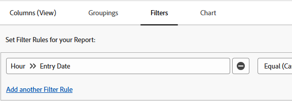

# Filtrare i rapporti per intervalli di tempo

È possibile filtrare un report in base all&#39;intervallo di tempo di una data esistente su un oggetto. Ad esempio, puoi filtrare un rapporto orario per un particolare intervallo di tempo in cui sono state inserite le ore.

## Requisiti di accesso

Per eseguire i passaggi descritti in questo articolo, è necessario disporre dei seguenti diritti di accesso:

<table style="table-layout:auto"> 
 <col> 
 <col> 
 <tbody> 
  <tr> 
   <td role="rowheader">Piano Adobe Workfront*</td> 
   <td> 
Qualsiasi
 </td> 
  </tr> 
  <tr> 
   <td role="rowheader">Licenza Adobe Workfront*</td> 
   <td> 
Piano 
 </td> 
  </tr> 
  <tr> 
   <td role="rowheader">Configurazioni del livello di accesso*</td> 
   <td> 
Modificare l’accesso a Rapporti, Dashboard, Calendari
 
Modifica accesso a Filtri, Viste, Raggruppamenti
 
Nota: se non disponi ancora dell’accesso, chiedi all’amministratore di Workfront se ha impostato restrizioni aggiuntive nel tuo livello di accesso. Per informazioni su come un amministratore di Workfront può modificare il tuo livello di accesso, consulta <a href="../../../administration-and-setup/add-users/configure-and-grant-access/create-modify-access-levels.md" class="MCXref xref">Creare o modificare livelli di accesso personalizzati</a>.
 </td> 
  </tr> 
  <tr> 
   <td role="rowheader">Autorizzazioni oggetto</td> 
   <td> 
Gestire le autorizzazioni per un rapporto
 
Per informazioni sulla richiesta di accesso aggiuntivo, vedere <a href="../../../workfront-basics/grant-and-request-access-to-objects/request-access.md" class="MCXref xref">Richiedere l'accesso agli oggetti </a>.
 </td> 
  </tr> 
 </tbody> 
</table>

&#42;Per conoscere il piano, il tipo di licenza o l&#39;accesso di cui si dispone, contattare l&#39;amministratore di Workfront.

## Prerequisiti

Il report deve essere creato prima di filtrarne i risultati.

Per ulteriori informazioni sulla creazione di report, vedere [Creare un report](../../../reports-and-dashboards/reports/creating-and-managing-reports/create-report.md).

## Filtrare un rapporto in base all’intervallo di tempo di una data {#filter-a-report-by-the-time-frame-of-a-date}

1. Fai clic sull&#39;icona  del **Main Menu**, quindi fai clic su **Reporting**.

1. Fai clic su **Nuovo rapporto**, quindi seleziona il tipo di rapporto desiderato.\
   Ad esempio, seleziona **Rapporto ore**.

1. Selezionare la scheda **Filtri**.
1. Fai clic su **Aggiungi regola filtro**, quindi seleziona **Data immissione ore**.\
   

1. Nel menu a discesa seguente, selezionare una delle opzioni seguenti:

   <table style="table-layout:auto"> 
    <col> 
    <col> 
    <tbody> 
     <tr> 
      <td role="rowheader">Equal</td> 
      <td>Dopo aver selezionato questo modificatore, specifica la data in cui sono state inserite le ore.</td> 
     </tr> 
     <tr> 
      <td role="rowheader">Not Equal</td> 
      <td>Dopo aver selezionato questo modificatore, specifica la data in cui sono state inserite le ore, per escludere questa data dal rapporto. Il rapporto mostra le ore registrate in tutte le date, in base alla data specificata.</td> 
     </tr> 
     <tr> 
      <td role="rowheader">Null</td> 
      <td>Selezionare questo modificatore per visualizzare solo le ore in cui manca la data di immissione.</td> 
     </tr> 
     <tr> 
      <td role="rowheader">Not Null</td> 
      <td>Selezionare questo modificatore per visualizzare solo le ore per le quali la data di immissione ha un valore.</td> 
     </tr> 
     <tr> 
      <td role="rowheader">Tra</td> 
      <td>Dopo aver selezionato questo modificatore, specifica un intervallo di date in cui sono state immesse le ore. Il rapporto mostra le ore inserite tra le date specificate.</td> 
     </tr> 
     <tr> 
      <td role="rowheader">Minore di</td> 
      <td>Dopo aver selezionato questo modificatore, specifica una data prima della quale sono state inserite le ore. Il rapporto mostra le ore inserite prima della data specificata, esclusa la data specificata.</td> 
     </tr> 
     <tr> 
      <td role="rowheader">Less Than Equal</td> 
      <td>Dopo aver selezionato questo modificatore, specifica una data prima della quale sono state inserite le ore. Il rapporto mostra le ore inserite prima della data specificata, inclusa la data specificata.</td> 
     </tr> 
     <tr> 
      <td role="rowheader">Maggiore di</td> 
      <td>Dopo aver selezionato questo modificatore, specifica una data dopo la quale sono state inserite le ore. Il rapporto mostra le ore inserite dopo la data specificata, esclusa la data specificata.</td> 
     </tr> 
     <tr> 
      <td role="rowheader">Greater Than Equal</td> 
      <td> 
Dopo aver selezionato questo modificatore, specifica una data dopo la quale sono state inserite le ore. Il rapporto mostra le ore inserite dopo la data specificata, inclusa la data specificata.
 
Selezionare uno dei modificatori predefiniti per l'intervallo di tempo, come descritto in <a href="#built-in-time-frame-modifiers" class="MCXref xref">Modificatori incorporati per l'intervallo di tempo</a>.
 </td> 
     </tr> 
    </tbody> 
   </table>

1. Questi modificatori sono disponibili per qualsiasi campo data in un filtro o in un prompt in qualsiasi rapporto.
1. Fai clic su **Salva e Chiudi**.

## Modificatori di intervallo temporale incorporati {#built-in-time-frame-modifiers}

Adobe Workfront dispone di modificatori di intervalli di tempo incorporati che è possibile utilizzare senza definire una data specifica. 

Questi modificatori sono disponibili per qualsiasi campo data in un filtro o in un prompt in qualsiasi rapporto. 

Per ulteriori informazioni su come filtrare un rapporto in base a un intervallo di tempo associato a una data, consulta  [Filtrare un report per intervallo di tempo di una data](#filter-a-report-by-the-time-frame-of-a-date).

Ad esempio, se desideri visualizzare le ore inserite in un determinato intervallo di tempo durante la creazione di un rapporto orario, puoi scegliere tra le seguenti opzioni di filtro integrate per l’intervallo di tempo:

<table style="table-layout:auto"> 
 <col> 
 <col> 
 <tbody> 
  <tr> 
   <td role="rowheader">Oggi</td> 
   <td>Visualizza le ore in cui la data di immissione è oggi.</td> 
  </tr> 
  <tr> 
   <td role="rowheader">Questa settimana</td> 
   <td>Visualizza le ore in cui la Data immissione è una data della settimana corrente, in cui la settimana inizia di domenica e termina di sabato.</td> 
  </tr> 
  <tr> 
   <td role="rowheader">Settimana Prossima</td> 
   <td>Visualizza le ore in cui la Data immissione è una data della settimana successiva alla settimana corrente, in cui la settimana inizia di domenica e termina di sabato. </td> 
  </tr> 
  <tr> 
   <td role="rowheader">Settimana scorsa</td> 
   <td>Visualizza le ore in cui la Data immissione è una data della settimana precedente alla settimana corrente, in cui la settimana inizia di domenica e termina di sabato. </td> 
  </tr> 
  <tr> 
   <td role="rowheader">Questo mese</td> 
   <td>Visualizza le ore in cui la Data immissione è una data del mese corrente.</td> 
  </tr> 
  <tr> 
   <td role="rowheader">Mese Prossimo</td> 
   <td>Visualizza le ore in cui la Data immissione è una data nel mese successivo al mese corrente.</td> 
  </tr> 
  <tr> 
   <td role="rowheader">Mese scorso</td> 
   <td>Visualizza le ore in cui la Data immissione è una data nel mese precedente il mese corrente</td> 
  </tr> 
  <tr> 
   <td role="rowheader">Questo TriMestre</td> 
   <td> 
Visualizza le ore in cui Data inserimento è una data del trimestre corrente, in cui i trimestri sono definiti come:
 
    <ul> 
     <li>Primo Trimestre: 1° gennaio - 30 marzo</li> 
     <li>Secondo Trimestre: 1 Aprile - 30 Giugno</li> 
     <li>Terzo Trimestre: 1 Luglio - 30 Settembre</li> 
     <li>Quarto Trimestre: 1 ottobre - 31 dicembre</li> 
    </ul> </td> 
  </tr> 
  <tr> 
   <td role="rowheader">Prossimo TriMestre</td> 
   <td>Visualizza le ore in cui la Data inserimento è una data nel trimestre successivo al trimestre corrente, in cui i trimestri sono definiti in precedenza.</td> 
  </tr> 
  <tr> 
   <td role="rowheader">Ultimo TriMestre</td> 
   <td> 
Visualizza le ore in cui la Data inserimento è una data nel trimestre precedente il trimestre corrente, in cui i trimestri sono definiti in precedenza.
 
Nota: se l'amministratore di Workfront ha abilitato e definito i trimestri personalizzati per il sistema, i filtri incorporati per i trimestri vengono sostituiti con le informazioni personalizzate relative al trimestre. Per ulteriori informazioni sull'abilitazione dei trimestri personalizzati, vedere <a href="../../../administration-and-setup/set-up-workfront/configure-system-defaults/enable-custom-quarters-projects.md" class="MCXref xref">Abilitare i trimestri personalizzati per i progetti</a>.
 </td> 
  </tr> 
  <tr> 
   <td role="rowheader">Quest'anno</td> 
   <td>Visualizza le ore in cui Data immissione è una data dell'anno corrente, in cui l'anno corrente inizia il 1 gennaio e termina il 31 dicembre.</td> 
  </tr> 
  <tr> 
   <td role="rowheader">Ultimo anno</td> 
   <td>Visualizza le ore in cui la Data immissione è una data dell'anno precedente, in cui l'anno precedente inizia 12 mesi prima della data corrente.</td> 
  </tr> 
  <tr> 
   <td role="rowheader">Anno scorso</td> 
   <td> 
Visualizza le ore in cui Data immissione è una data dell'ultimo anno, in cui l'ultimo anno inizia il 1 gennaio e termina il 31 dicembre dell'anno precedente l'anno corrente.
 
Nota: non esiste un periodo di tempo predefinito per l'anno fiscale. È possibile creare un rapporto e filtrare le informazioni per data utilizzando un modificatore personalizzato per l'intervallo di date dell'anno fiscale, come definito nell'organizzazione. Se si desidera scegliere un intervallo di tempo per un anno fiscale sul posto, è necessario utilizzare un prompt anziché un filtro. 
 </td> 
  </tr> 
 </tbody> 
</table>
