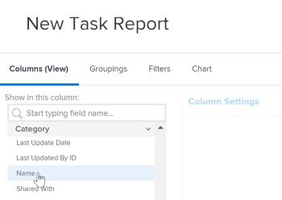
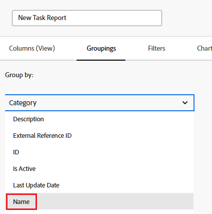

# Fare riferimento a un modulo personalizzato in un report

È possibile fare riferimento alle maschere personalizzate di un oggetto nelle visualizzazioni, nei filtri e nei raggruppamenti di un report per tale oggetto.

È possibile fare riferimento al contenuto dei moduli personalizzati da includere in un report oppure alle informazioni sui moduli personalizzati da includere in un report.

## Requisiti di accesso

Per eseguire i passaggi descritti in questo articolo, è necessario disporre dei seguenti diritti di accesso:

<table style="table-layout:auto"> 
 <col> 
 <col> 
 <tbody> 
  <tr> 
   <td role="rowheader">Piano Adobe Workfront*</td> 
   <td> 
Qualsiasi
 </td> 
  </tr> 
  <tr> 
   <td role="rowheader">Licenza Adobe Workfront*</td> 
   <td> 
Piano 
 </td> 
  </tr> 
  <tr> 
   <td role="rowheader">Configurazioni del livello di accesso*</td> 
   <td> 
Modificare l’accesso a Rapporti, Dashboard, Calendari
 
Modifica accesso a Filtri, Viste, Raggruppamenti
 
Nota: se non disponi ancora dell’accesso, chiedi all’amministratore di Workfront se ha impostato restrizioni aggiuntive nel tuo livello di accesso. Per informazioni su come un amministratore di Workfront può modificare il tuo livello di accesso, consulta <a href="../../../administration-and-setup/add-users/configure-and-grant-access/create-modify-access-levels.md" class="MCXref xref">Creare o modificare livelli di accesso personalizzati</a>.
 </td> 
  </tr> 
  <tr> 
   <td role="rowheader">Autorizzazioni oggetto</td> 
   <td> 
Gestire le autorizzazioni per un rapporto
 
Per informazioni sulla richiesta di accesso aggiuntivo, vedere <a href="../../../workfront-basics/grant-and-request-access-to-objects/request-access.md" class="MCXref xref">Richiedere l'accesso agli oggetti </a>.
 </td> 
  </tr> 
 </tbody> 
</table>

&#42;Per conoscere il piano, il tipo di licenza o l&#39;accesso di cui si dispone, contattare l&#39;amministratore di Workfront.

## Prerequisiti

Il modulo personalizzato deve esistere prima di potervi fare riferimento in un rapporto.

Per ulteriori informazioni sulla creazione di moduli personalizzati, vedere [Progettare un modulo con il progettista del modulo](/help/quicksilver/administration-and-setup/customize-workfront/create-manage-custom-forms/form-designer/design-a-form/design-a-form.md).

## Fare riferimento al contenuto dei moduli personalizzati

Puoi fare riferimento ai campi all’interno dei moduli personalizzati. Dopo aver applicato un modulo personalizzato a un oggetto, tutti i campi associati a tale modulo personalizzato sono disponibili per essere referenziati in un report come qualsiasi altro campo dell’oggetto.

>[!NOTE]
>
>Per i campi con più opzioni, tutte le opzioni sono disponibili nei Filtri e nei Prompt del rapporto, inclusi quelli nascosti.\
>Per ulteriori informazioni su come nascondere le scelte da un campo personalizzato con più opzioni, vedere l&#39;articolo [Progettare un modulo con il progettista del modulo](/help/quicksilver/administration-and-setup/customize-workfront/create-manage-custom-forms/form-designer/design-a-form/design-a-form.md).

Durante la creazione del report, è sufficiente utilizzare il tipo di oggetto del modulo come origine del campo e utilizzare il nome del campo personalizzato come nome del campo.

Ad esempio, potresti avere un modulo personalizzato applicato a tutti i progetti che include il campo personalizzato **Consulente**. Per creare un report che elenca tutti i progetti di cui Olivia Kim è consulente, utilizzare il tipo di oggetto **Progetto** come origine del campo e utilizzare **Consulente** come nome del campo. Imposta il qualificatore del filtro su **Equal**, quindi digita Olivia Kim.

Per ulteriori informazioni sulla creazione di un report, vedere l&#39;articolo [Creare un report personalizzato](../../../reports-and-dashboards/reports/creating-and-managing-reports/create-custom-report.md).

## Informazioni di riferimento sui moduli personalizzati

È possibile fare riferimento a informazioni sui moduli personalizzati, ad esempio il nome di tutti i moduli personalizzati associati a un oggetto.

&#x200B;A seconda dell’elemento (Visualizza, Filtro o Raggruppamento), puoi fare riferimento a:

* Il modulo personalizzato principale applicato a un oggetto:

  Si tratta del modulo visualizzato per primo nella pagina Dettagli dell&#39;oggetto.

* Tutti i moduli personalizzati (se a un oggetto sono applicati più moduli personalizzati)

Puoi fare riferimento a moduli personalizzati su Visualizzazioni, Filtri e Raggruppamenti:

* [Fare riferimento a moduli personalizzati in una visualizzazione report (colonna)](#reference-custom-forms-in-a-report-view-column)
* [Fare riferimento a moduli personalizzati in un filtro per report](#reference-custom-forms-in-a-report-filter)
* [Fare riferimento a moduli personalizzati in un raggruppamento di rapporti](#reference-custom-forms-in-a-report-grouping)

### Fare riferimento a moduli personalizzati in una visualizzazione report (colonna) {#reference-custom-forms-in-a-report-view-column}

Per visualizzare tutti i moduli personalizzati associati a un oggetto:

1. Iniziare a creare un report come descritto nell&#39;articolo [Creare un report personalizzato](../../../reports-and-dashboards/reports/creating-and-managing-reports/create-custom-report.md).
1. Nella scheda **Colonne**, espandi il tipo di oggetto a cui è applicato il modulo personalizzato a cui desideri fare riferimento, quindi fai clic su **Nome categoria**.\
   Ad esempio, per visualizzare tutti i moduli personalizzati associati a un&#39;attività, espandi l&#39;origine campo **Attività**, quindi fai clic sul nome campo **Nome categoria**.\
   

Per visualizzare solo il modulo personalizzato principale associato all&#39;oggetto:

1. Iniziare a creare un report come descritto nell&#39;articolo [Creare un report personalizzato](../../../reports-and-dashboards/reports/creating-and-managing-reports/create-custom-report.md).
1. Nella scheda **Colonne**, espandi l&#39;origine campo **Categoria**, quindi fai clic sul nome campo **Nome**.\
   

### Fare riferimento a maschere personalizzate in un filtro per report {#reference-custom-forms-in-a-report-filter}

Per filtrare in base a tutti i moduli personalizzati associati al tipo di oggetto:

1. Iniziare a creare un report come descritto nell&#39;articolo [Creare un report personalizzato](../../../reports-and-dashboards/reports/creating-and-managing-reports/create-custom-report.md).
1. Nella scheda **Filtri**, espandi **Categorie**, quindi fai clic su **Nome**.\
   

1. Selezionare il qualificatore di condizione che si desidera utilizzare:

   * Blank
   * Not Blank
   * Contiene
   * Non contiene
   * Uguale a
   * Diverso da

   Per ulteriori informazioni su ciascun qualificatore, vedere l&#39;articolo [Filtri e modificatori di condizioni](../../../reports-and-dashboards/reports/reporting-elements/filter-condition-modifiers.md).

   >[!NOTE]
   >
   >Se il campo per il quale si sta filtrando ha più opzioni e si utilizzano i qualificatori **Not Equal** o **Does Not Contain**, i risultati che contengono solo la scelta specificata verranno esclusi. Se il campo contiene opzioni aggiuntive, inclusa quella specificata, tali risultati non vengono filtrati dal rapporto. Ciò include il filtraggio per più Forms personalizzati se sono collegati allo stesso oggetto.

1. Inizia a digitare il nome del modulo personalizzato su cui desideri filtrare, quindi fai clic sul nome quando viene visualizzato nell’elenco a discesa.
1. (Facoltativo) Fai clic su **Aggiungi un&#39;altra regola di filtro**, quindi ripeti i passaggi 2-4 per creare altre regole di filtro.
1. Fai clic su **Salva+Chiudi**.

Per filtrare solo il modulo personalizzato principale associato al tipo di oggetto:

1. Iniziare a creare un report come descritto nell&#39;articolo [Creare un report personalizzato](../../../reports-and-dashboards/reports/creating-and-managing-reports/create-custom-report.md).
1. Nella scheda **Filtri**, espandi l&#39;origine campo **Categoria**, quindi fai clic sul nome campo **Nome**.\
   

1. Selezionare il qualificatore di condizione che si desidera utilizzare:

   * Blank
   * Not Blank
   * Contiene
   * Non contiene
   * Uguale a
   * Diverso da

   Per ulteriori informazioni su ciascun qualificatore, vedere l&#39;articolo [Filtri e modificatori di condizioni](../../../reports-and-dashboards/reports/reporting-elements/filter-condition-modifiers.md).

1. Inizia a digitare il nome del modulo personalizzato su cui desideri filtrare, quindi fai clic sul nome quando viene visualizzato nell’elenco a discesa.
1. (Facoltativo) Fai clic su **Aggiungi un&#39;altra regola di filtro**, quindi ripeti i passaggi 2-4 per creare altre regole di filtro.
1. Fai clic su **Salva+Chiudi**.

### Fare riferimento a moduli personalizzati in un raggruppamento di rapporti {#reference-custom-forms-in-a-report-grouping}

>[!NOTE]
>
>È possibile raggruppare gli elementi solo in base al modulo personalizzato principale associato all&#39;oggetto, ma non in base a tutti i moduli associati all&#39;oggetto.

1. Iniziare a creare un report come descritto nell&#39;articolo [Creare un report personalizzato](../../../reports-and-dashboards/reports/creating-and-managing-reports/create-custom-report.md).
1. Nella scheda **Raggruppamenti** espandere **Categoria**, quindi fare clic su **Nome**.\
   
