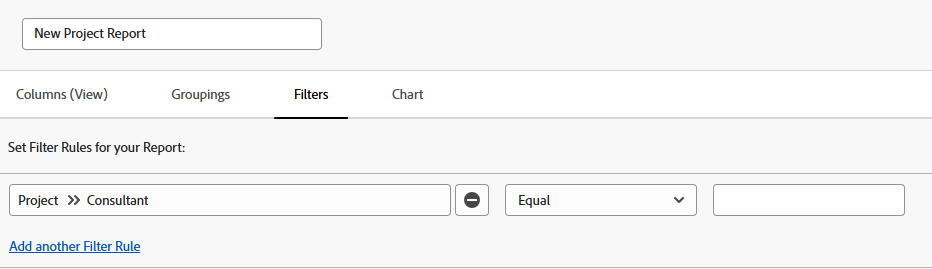
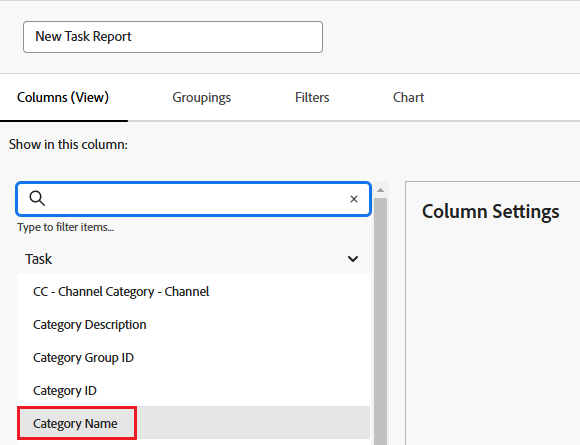
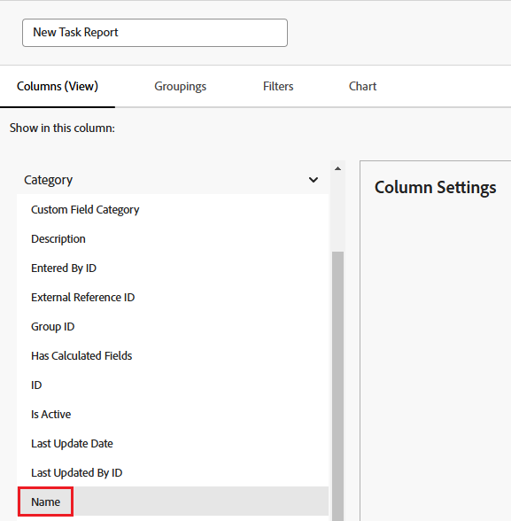
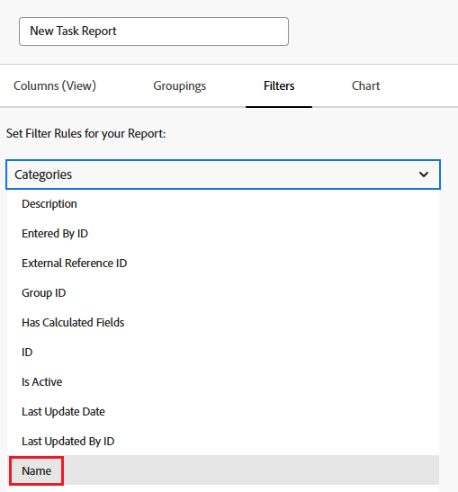
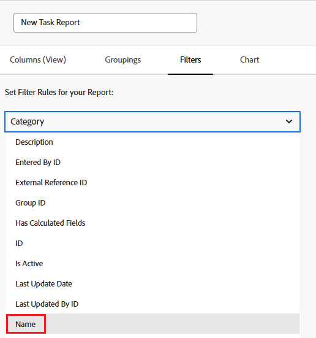
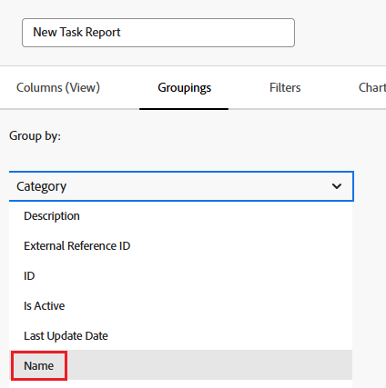

# Fare riferimento a un modulo personalizzato in un rapporto

<!-- Audited: 11/2024 -->

È possibile fare riferimento alle maschere personalizzate di un oggetto in Visualizzazioni, Filtri e Raggruppamenti di un report relativo a tale oggetto.

È possibile fare riferimento al contenuto dei moduli personalizzati da includere in un report oppure alle informazioni sui moduli personalizzati da includere in un report.

## Requisiti di accesso

+++ Espandi per visualizzare i requisiti di accesso per la funzionalità descritta in questo articolo. 

<table style="table-layout:auto"> 
 <col> 
 <col> 
 <tbody> 
  <tr> 
   <td role="rowheader">Pacchetto Adobe Workfront</td> 
   <td> 
Qualsiasi
 </td> 
  </tr> 
  <tr> 
   <td role="rowheader">Licenza di Adobe Workfront</td> 
   <td> 
      
Standard

      
Piano

   </td>
  </tr> 
  <tr> 
   <td role="rowheader">Configurazioni del livello di accesso</td> 
   <td> 
Modificare l’accesso a Rapporti, Dashboard, Calendari
 
Modifica accesso a Filtri, Viste, Raggruppamenti
</td> 
  </tr> 
  <tr> 
   <td role="rowheader">Autorizzazioni sugli oggetti</td> 
   <td> 
Gestire le autorizzazioni per un report
</td> 
  </tr> 
 </tbody> 
</table>

Per ulteriori dettagli sulle informazioni contenute in questa tabella, consulta [Requisiti di accesso nella documentazione Workfront](/help/quicksilver/administration-and-setup/add-users/access-levels-and-object-permissions/access-level-requirements-in-documentation.md).

+++

## Prerequisiti

Il modulo personalizzato deve esistere prima di potervi fare riferimento in un report.

Per ulteriori informazioni sulla creazione di moduli personalizzati, vedere [Creare un modulo personalizzato](/help/quicksilver/administration-and-setup/customize-workfront/create-manage-custom-forms/form-designer/design-a-form/design-a-form.md).

## Fare riferimento al contenuto dei moduli personalizzati

È possibile fare riferimento a campi all&#39;interno di moduli personalizzati. Dopo aver applicato un modulo personalizzato a un oggetto, è possibile fare riferimento a tutti i campi associati a tale modulo in un report, come qualsiasi altro campo dell&#39;oggetto.

>[!NOTE]
>
>Per i campi con più opzioni, tutte le opzioni sono disponibili nei filtri e nei prompt del report, inclusi quelli nascosti.\
>Per ulteriori informazioni su come nascondere le scelte da un campo personalizzato con più opzioni, vedere l&#39;articolo [Creare un modulo personalizzato](/help/quicksilver/administration-and-setup/customize-workfront/create-manage-custom-forms/form-designer/design-a-form/design-a-form.md).

Quando si crea il report, è sufficiente utilizzare il tipo di oggetto del modulo come origine del campo e il nome del campo personalizzato come nome del campo.

È possibile, ad esempio, che a tutti i progetti sia applicato un modulo personalizzato che include il campo personalizzato **Consulente**. Per creare un rapporto che elenchi tutti i progetti per i quali Olivia Kim è consulente, utilizzare il tipo di oggetto **Progetto** come origine del campo e il nome del campo **Consulente**. Imposta il qualificatore del filtro su **Uguale a**, quindi digita Olivia Kim.

Per ulteriori informazioni sulla creazione di un rapporto, consulta l’articolo [Creare un rapporto personalizzato](../../../reports-and-dashboards/reports/creating-and-managing-reports/create-custom-report.md).

## Informazioni di riferimento sui moduli personalizzati

È possibile fare riferimento a informazioni sui moduli personalizzati, ad esempio il nome di qualsiasi modulo personalizzato associato a un oggetto.

&#x200B;A seconda dell’elemento (Visualizza, Filtro o Raggruppamento), puoi fare riferimento a:

* Il modulo personalizzato principale applicato a un oggetto:

  Si tratta del modulo visualizzato per primo nella pagina Dettagli dell&#39;oggetto.

* Tutti i moduli personalizzati (se a un oggetto sono applicati più moduli personalizzati)

Puoi fare riferimento a moduli personalizzati su Visualizzazioni, Filtri e Raggruppamenti:

* [Fare riferimento a moduli personalizzati in una visualizzazione report (colonna)](#reference-custom-forms-in-a-report-view-column)
* [Fare riferimento a moduli personalizzati in un filtro di report](#reference-custom-forms-in-a-report-filter)
* [Fare riferimento a moduli personalizzati in un raggruppamento di report](#reference-custom-forms-in-a-report-grouping)

### Fare riferimento a moduli personalizzati in una visualizzazione report (colonna) {#reference-custom-forms-in-a-report-view-column}

Per visualizzare tutti i moduli personalizzati associati a un oggetto:

1. Iniziare a creare un report come descritto nell&#39;articolo [Creare un report personalizzato](../../../reports-and-dashboards/reports/creating-and-managing-reports/create-custom-report.md).
1. Nella scheda **Colonne** espandere il tipo di oggetto a cui è applicato il modulo personalizzato a cui si desidera fare riferimento, quindi fare clic su **Nome categoria**.\
   Per visualizzare ad esempio tutti i moduli personalizzati associati a un&#39;attività, espandere l&#39;origine campi **Attività**, quindi fare clic sul nome campo **Nome categoria**.\
   

Per visualizzare solo il modulo personalizzato principale associato all&#39;oggetto:

1. Iniziare a creare un report come descritto nell&#39;articolo [Creare un report personalizzato](../../../reports-and-dashboards/reports/creating-and-managing-reports/create-custom-report.md).
1. Nella scheda **Colonne** espandere l&#39;origine dei campi **Categoria**, quindi fare clic sul nome del campo **Nome**.\
   

### Fare riferimento a maschere personalizzate in un filtro per report {#reference-custom-forms-in-a-report-filter}

Per filtrare in base a tutti i moduli personalizzati associati al tipo di oggetto:

1. Iniziare a creare un report come descritto nell&#39;articolo [Creare un report personalizzato](../../../reports-and-dashboards/reports/creating-and-managing-reports/create-custom-report.md).
1. Nella scheda **Filtri**, espandi **Categorie**, quindi fai clic su **Nome**.\
   

1. Selezionare il qualificatore di condizione che si desidera utilizzare:

   * Blank
   * Not Blank
   * Contiene
   * Does Not Contain
   * Uguale
   * Non uguale

   Per ulteriori informazioni su ciascun qualificatore, vedere l&#39;articolo [Filtro e modificatori di condizioni](../../../reports-and-dashboards/reports/reporting-elements/filter-condition-modifiers.md).

   >[!NOTE]
   >
   >Se il campo per il quale si sta filtrando dispone di più opzioni e si utilizzano i qualificatori **Diverso** o **Non contiene**, verranno filtrati i risultati che contengono solo la scelta specificata. Se il campo contiene opzioni aggiuntive, tra cui quella specificata, tali risultati non vengono filtrati dal report. Questo include filtri per più Forms personalizzati, se associati allo stesso oggetto.

1. Iniziare a digitare il nome del modulo personalizzato su cui si desidera filtrare, quindi fare clic sul nome quando viene visualizzato nell&#39;elenco a discesa.
1. (Facoltativo) Fare clic su **Aggiungi un&#39;altra regola di filtro**, quindi ripetere i passaggi da 2 a 4 per creare ulteriori regole di filtro.
1. Fai clic su **Salva+Chiudi**.

Per filtrare solo il modulo personalizzato principale associato al tipo di oggetto:

1. Iniziare a creare un report come descritto nell&#39;articolo [Creare un report personalizzato](../../../reports-and-dashboards/reports/creating-and-managing-reports/create-custom-report.md).
1. Nella scheda **Filtri**, espandi l&#39;origine campo **Categoria**, quindi fai clic sul nome campo **Nome**.\
   

1. Selezionare il qualificatore di condizione che si desidera utilizzare:

   * Blank
   * Not Blank
   * Contiene
   * Does Not Contain
   * Uguale
   * Non uguale

   Per ulteriori informazioni su ciascun qualificatore, vedere l&#39;articolo [Filtro e modificatori di condizioni](../../../reports-and-dashboards/reports/reporting-elements/filter-condition-modifiers.md).

1. Iniziare a digitare il nome del modulo personalizzato su cui si desidera filtrare, quindi fare clic sul nome quando viene visualizzato nell&#39;elenco a discesa.
1. (Facoltativo) Fare clic su **Aggiungi un&#39;altra regola di filtro**, quindi ripetere i passaggi da 2 a 4 per creare ulteriori regole di filtro.
1. Fai clic su **Salva+Chiudi**.

### Fare riferimento a moduli personalizzati in un raggruppamento di report {#reference-custom-forms-in-a-report-grouping}

>[!NOTE]
>
>È possibile raggruppare gli elementi solo in base al modulo personalizzato principale associato all&#39;oggetto. Non è possibile raggruppare gli elementi in base a tutti i moduli associati all&#39;oggetto.

1. Iniziare a creare un report come descritto nell&#39;articolo [Creare un report personalizzato](../../../reports-and-dashboards/reports/creating-and-managing-reports/create-custom-report.md).
1. Nella scheda **Raggruppamenti** espandere **Categoria**, quindi fare clic su **Nome**.\
   
