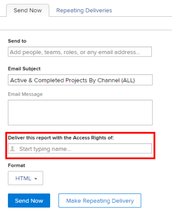

# Eseguire e consegnare un report con i diritti di accesso di un altro utente

Per impostazione predefinita, gli utenti possono visualizzare solo gli oggetti di un report per il quale dispongono delle autorizzazioni di visualizzazione.

È possibile consentire a tutti gli utenti di visualizzare in un report gli stessi risultati di un altro utente, indipendentemente dal loro livello di accesso o di autorizzazione sugli oggetti all&#39;interno del report.

Se esegui un rapporto con i diritti di accesso di un altro utente con un livello di accesso superiore (ad esempio, i diritti di accesso di un amministratore di Adobe Workfront), tutti gli utenti che dispongono delle autorizzazioni per visualizzare il rapporto possono visualizzare le informazioni contenute nel rapporto come l’utente specificato nel generatore di rapporti. Puoi impostare questa opzione sia per i rapporti trovati dagli utenti nell’interfaccia di Workfront, sia per i rapporti consegnati agli utenti come allegato a un messaggio e-mail.

>[!TIP]
>
>Sostituire il **Esegui questo report con i diritti di accesso di:** con un utente attivo solo quando si desidera che il report venga visualizzato con i diritti di accesso di tale utente. Ad esempio, un utente con licenza Lavoro potrebbe non disporre delle autorizzazioni necessarie per visualizzare tutti gli elementi di un report creato da un utente con licenza Pianificazione o da un amministratore di sistema, a meno che il report non venga visualizzato con i diritti di accesso di un planner o di un amministratore di sistema.\
Se il report viene condiviso con utenti con un accesso simile a quello specificato nell&#39; **Esegui questo report con i diritti di accesso di:** , è possibile lasciare vuoto questo campo.

## Requisiti di accesso

Per eseguire i passaggi descritti in questo articolo, è necessario disporre dei seguenti diritti di accesso:

<table style="table-layout:auto"> 
 <col> 
 <col> 
 <tbody> 
  <tr> 
   <td role="rowheader">Piano Adobe Workfront*</td> 
   <td> 
Qualsiasi
 </td> 
  </tr> 
  <tr> 
   <td role="rowheader">Licenza Adobe Workfront*</td> 
   <td> 
Piano 
 </td> 
  </tr> 
  <tr> 
   <td role="rowheader">Configurazioni del livello di accesso*</td> 
   <td> 
Modificare l’accesso a Rapporti, Dashboard, Calendari
 
Modifica accesso a Filtri, Viste, Raggruppamenti
 
Nota: se non disponi ancora dell’accesso, chiedi all’amministratore di Workfront se ha impostato restrizioni aggiuntive nel tuo livello di accesso. Per informazioni su come un amministratore di Workfront può modificare il tuo livello di accesso, consulta <a href="../../../administration-and-setup/add-users/configure-and-grant-access/create-modify-access-levels.md" class="MCXref xref">Creare o modificare livelli di accesso personalizzati</a>.
 </td> 
  </tr> 
  <tr> 
   <td role="rowheader">Autorizzazioni oggetto</td> 
   <td> 
Visualizzare le autorizzazioni per un rapporto (per visualizzare il rapporto consegnato)
 
Gestire le autorizzazioni per un report (per eseguire il report)
 
Per informazioni sulla richiesta di accesso aggiuntivo, consulta <a href="../../../workfront-basics/grant-and-request-access-to-objects/request-access.md" class="MCXref xref">Richiedi accesso agli oggetti </a>.
 </td> 
  </tr> 
 </tbody> 
</table>

&#42;Per conoscere il piano, il tipo di licenza o l&#39;accesso di cui si dispone, contattare l&#39;amministratore Workfront.

## Visualizzare un report con i diritti di accesso di un altro utente

Compilazione di **Esegui questo report con i diritti di accesso di:** fa sì che un rapporto contenga gli stessi dati, indipendentemente dall’utente che accede al rapporto. Il report viene visualizzato come per l&#39;utente specificato.

Per essere in grado di visualizzare il report, gli utenti che vi accedono devono disporre almeno delle autorizzazioni di visualizzazione. Se l’utente elencato in **Esegui questo report con i diritti di accesso di:** disattivato, il rapporto non viene più visualizzato per altri utenti con cui è condiviso.

Per eseguire un report con i diritti di accesso di un altro utente:

1. Fai clic su **Menu principale** icona  nell’angolo superiore destro di Workfront, quindi fai clic su **Rapporti**.

1. Seleziona il report da visualizzare con i diritti di accesso di un altro utente.
1. Clic **Azioni report**, quindi fai clic su **Modifica**.

1. Clic **Impostazioni dei rapporti**.

1. In **Esegui questo report con i diritti di accesso di:** , inizia a digitare il nome dell&#39;utente che si desidera venga visualizzato nel report, quindi selezionalo quando lo visualizzi nell&#39;elenco.\
   

   >[!NOTE]
   >
   Gli utenti con un livello di accesso inferiore che sono autorizzati a generare rapporti non possono selezionare un utente diverso da se stessi per **Esegui questo report con i diritti di accesso di:** campo.

1. Clic **Fine**.
1. Clic **Salva e chiudi**.\
   Il rapporto ora viene visualizzato per tutti gli utenti con cui è condiviso, come se fosse visualizzato dall’utente specificato in **Esegui questo report con i diritti di accesso di:** campo.

>[!IMPORTANT]
>
Inserimento di un utente diverso da quello connesso per **Esegui questo report con i diritti di accesso di:** influisce sulle informazioni visualizzate nel rapporto se questo contiene un filtro che utilizza un carattere jolly che fa riferimento all’utente connesso. Il rapporto viene visualizzato in base al valore specificato nella **Esegui questo report con i diritti di accesso di:** anziché quello definito nel filtro con caratteri jolly.
>
Per ulteriori informazioni sui caratteri jolly per i campi utente, consulta la sezione &quot;Variabili basate sugli utenti&quot; in [Panoramica delle variabili filtro con caratteri jolly](../../../reports-and-dashboards/reports/reporting-elements/understand-wildcard-filter-variables.md).

## Consegna di un report con i diritti di accesso di un altro utente

Puoi impostare i rapporti da consegnare come allegati a un messaggio e-mail. Puoi impostare questi rapporti consegnati in modo che vengano visualizzati così come sono per gli utenti di un livello di accesso più alto, in modo che tutti gli utenti possano visualizzare le stesse informazioni nei rapporti consegnati. Gli utenti che vedranno il rapporto consegnato nell’e-mail devono essere aggiunti all’elenco Invia a dei destinatari all’interno della consegna del rapporto. Per ulteriori informazioni sulla configurazione di un rapporto per la consegna, consulta l’articolo [Panoramica sulla consegna dei rapporti](../../../reports-and-dashboards/reports/creating-and-managing-reports/set-up-report-deliveries.md).

Per consegnare un report con i diritti di accesso di un altro utente:

1. Fai clic su **Menu principale** icona  nell’angolo superiore destro di Workfront, quindi fai clic su **Rapporti**.

1. Seleziona il rapporto che desideri consegnare con i diritti di accesso di un altro utente.
1. Fai clic sul nome del rapporto per selezionarlo.
1. Clic **Azioni report**.
1. Clic **Invia rapporto**.

1. In **Consegna questo report con i diritti di accesso di:** , inizia a digitare il nome dell’utente che desideri venga visualizzato nel rapporto come quando viene consegnato in un messaggio e-mail, quindi selezionalo quando lo visualizzi nell’elenco. L’impostazione predefinita è il nome dell’utente che genera il rapporto.\
   

   >[!NOTE]
   >
   Gli utenti con un livello di accesso inferiore che sono autorizzati a generare rapporti non possono selezionare un utente diverso da se stessi per **Consegna il report con i diritti di accesso di:** campo.

1. Seleziona la **Formato** desideri che il rapporto venga visualizzato nell’e-mail:

   * HTML
   * PDF
   * MS Excel
   * MS Excel (.xlsx)
   * TSV

1. Clic **Invia ora** per inviarlo immediatamente.\
   Oppure\
   Clic **Crea consegna ripetuta** per pianificare una consegna ricorrente per il rapporto.\
   Per ulteriori informazioni sulle consegne dei rapporti, consulta l’articolo [Panoramica sulla consegna dei rapporti](../../../reports-and-dashboards/reports/creating-and-managing-reports/set-up-report-deliveries.md).

## Limitazioni per i rapporti con una colonna Origine

Nei seguenti rapporti viene visualizzata una colonna Origine in cui è possibile visualizzare informazioni sull&#39;oggetto padre:

* Rapporti sui problemi
* Rapporti orari
* Report documenti

Se gli utenti non dispongono delle autorizzazioni per l’oggetto principale di un problema, un’ora o un documento, la colonna Origine del rapporto risulta vuota, anche se il rapporto è configurato per la visualizzazione, o per essere consegnato con i diritti di accesso di un altro utente.

Per visualizzare informazioni sull&#39;oggetto padre nel report, è consigliabile aggiungere una colonna per l&#39;oggetto padre in cui è possibile visualizzare il nome dell&#39;oggetto padre.

Ad esempio, è possibile aggiungere uno degli elementi seguenti a un report con una colonna Origine:

* Le colonne Nome progetto, Nome attività o Nome problema in un documento o in una relazione sulle ore.
* Le colonne Nome progetto o Nome attività di un report sui problemi.
* Colonna che utilizza espressioni in modalità testo che fa riferimento a tutti e tre gli oggetti. Di seguito è riportato un esempio per un rapporto di ore:

  `displayname=Custom Source`

  `linkedname=opTask`

  `namekey=view.relatedcolumn`

  `namekeyargkey.0=opTask`

  `namekeyargkey.1=name`

  `textmode=true`

  `valueexpression=IF(!ISBLANK({opTaskID}),{opTask}.{name},IF(!ISBLANK({taskID}),{task}.{name},IF(!ISBLANK({projectID}),{project}.{name},IF(!ISBLANK({timesheetID}),CONCAT({owner}.{name}," ",{timesheet}.{startDate}," - ",{timesheet}.{endDate}),""))))`

  `valueformat=HTML`

  Per informazioni sulle visualizzazioni in modalità testo, vedere [Modificare una vista utilizzando la modalità testo](../text-mode/edit-text-mode-in-view.md).