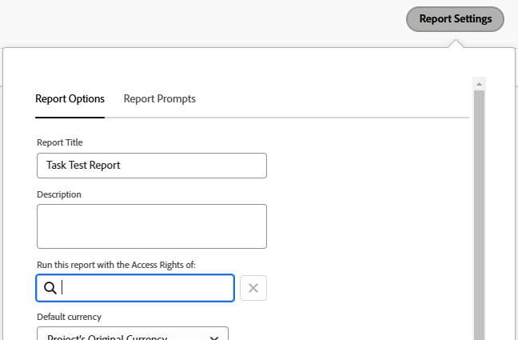
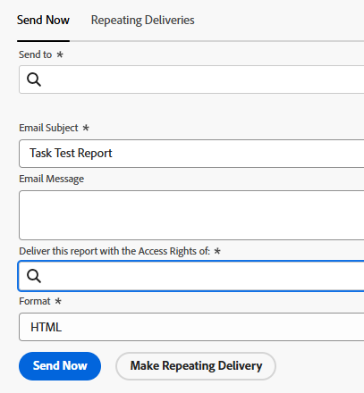

# Eseguire e consegnare un rapporto con i diritti di accesso di un altro utente

<!-- Audited: 11/2024 -->

Per impostazione predefinita, gli utenti possono visualizzare solo gli oggetti di un report per il quale dispongono delle autorizzazioni di visualizzazione.

È possibile consentire a tutti gli utenti di visualizzare gli stessi risultati in un report di un altro utente, indipendentemente dal livello di accesso o di autorizzazione per gli oggetti all&#39;interno del report.

Se esegui un rapporto con i diritti di accesso di un altro utente con un livello di accesso superiore (ad esempio, i diritti di accesso di un amministratore di Adobe Workfront), tutti gli utenti che dispongono delle autorizzazioni per visualizzare il rapporto possono visualizzare le informazioni contenute nel rapporto come l’utente specificato nel generatore di rapporti. Puoi impostare questa opzione sia per i rapporti trovati dagli utenti nell’interfaccia di Workfront, sia per i rapporti consegnati agli utenti come allegato a un messaggio e-mail.

>[!TIP]
>
>Sostituire **Esegui report con il campo Diritti di accesso di:** con un utente attivo solo quando si desidera visualizzare il report con i diritti di accesso di tale utente. Ad esempio, un utente con licenza Lavoro potrebbe non disporre delle autorizzazioni necessarie per visualizzare tutti gli elementi di un report creato da un utente con licenza Pianificazione o da un amministratore di sistema, a meno che il report non venga visualizzato con i diritti di accesso di un planner o di un amministratore di sistema.\
>Se il report è condiviso con utenti con accesso simile a quello specificato dall&#39;utente nel campo **Esegui report con diritti di accesso di:**, è possibile lasciare vuoto il campo.

## Requisiti di accesso

+++ Espandi per visualizzare i requisiti di accesso per la funzionalità descritta in questo articolo. 

<table style="table-layout:auto"> 
 <col> 
 <col> 
 <tbody> 
  <tr> 
   <td role="rowheader">Pacchetto Adobe Workfront</td> 
   <td> <p>Qualsiasi</p> </td> 
  </tr> 
  <tr> 
   <td role="rowheader">Licenza di Adobe Workfront</td> 
   <td> 
      <p>Standard</p>
      <p>Piano</p>
   </td>
  </tr> 
  <tr> 
   <td role="rowheader">Configurazioni del livello di accesso</td> 
   <td> <p>Modificare l’accesso a report, dashboard, calendari</p> <p>Modificare l'accesso a filtri, viste, raggruppamenti</p></td> 
  </tr> 
  <tr> 
   <td role="rowheader">Autorizzazioni sugli oggetti</td> 
     <td> <p>Visualizzare le autorizzazioni per un report per visualizzare il report consegnato</p>
     <p>Gestire le autorizzazioni per un report per eseguire il report</p></td> 
  </tr> 
 </tbody> 
</table>

Per ulteriori dettagli sulle informazioni contenute in questa tabella, consulta [Requisiti di accesso nella documentazione Workfront](/help/quicksilver/administration-and-setup/add-users/access-levels-and-object-permissions/access-level-requirements-in-documentation.md).

+++

## Visualizzare un report con i diritti di accesso di un altro utente

Compilando il campo **Esegui report con i diritti di accesso di:** si garantisce che un report contenga gli stessi dati, indipendentemente dall&#39;utente che accede al report. Il report viene visualizzato come per l&#39;utente specificato.

Gli utenti che accedono al report devono disporre almeno delle autorizzazioni di visualizzazione sul report per poterlo visualizzare. Se l&#39;utente elencato nel campo **Esegui report con diritti di accesso di:** è disattivato, il report non verrà più visualizzato per gli altri utenti con cui è condiviso.

Per eseguire un report con i diritti di accesso di un altro utente:

1. Fai clic sull&#39;icona **[!UICONTROL Main Menu]**  nell&#39;angolo superiore destro di Adobe Workfront oppure, se disponibile, fai clic sull&#39;icona **[!UICONTROL Main Menu]**  nell&#39;angolo superiore sinistro, quindi fai clic su **[!UICONTROL Reports]**.

1. Seleziona il report da visualizzare con i diritti di accesso di un altro utente.
1. Fai clic su **Azioni report**, quindi su **Modifica**.

1. Fare clic su **Impostazioni report**.

1. Nel campo **Esegui il report con diritti di accesso di:**, inizia a digitare il nome dell&#39;utente con cui desideri visualizzare il report, quindi selezionalo quando lo visualizzi nell&#39;elenco.\
   

   >[!NOTE]
   >
   >Gli utenti con un livello di accesso inferiore autorizzati a generare report non possono selezionare un utente diverso da se stessi per il campo **Esegui report con diritti di accesso di:**.

1. Fai clic su **Fine**.
1. Fai clic su **Salva e Chiudi**.\
   Il report ora viene visualizzato per tutti gli utenti con cui è condiviso, come se fosse visualizzato dall&#39;utente specificato nel campo **Esegui il report con diritti di accesso di:**.

>[!IMPORTANT]
>
>L&#39;immissione di un utente diverso dall&#39;utente connesso per **Esegui il report con il campo Diritti di accesso di:** influisce sulle informazioni visualizzate nel report se il report contiene un filtro che utilizza un carattere jolly che fa riferimento all&#39;utente connesso. Il report viene visualizzato in base al valore specificato nel campo **Esegui report con diritti di accesso di:** anziché in base a quanto definito nel filtro con caratteri jolly.
>
>Per ulteriori informazioni sui caratteri jolly per i campi utente, vedere la sezione &quot;Variabili basate su utente&quot; in [Panoramica sulle variabili dei filtri con caratteri jolly](../../../reports-and-dashboards/reports/reporting-elements/understand-wildcard-filter-variables.md).

## Consegna di un report con i diritti di accesso di un altro utente

Puoi impostare i report da inviare come allegati a un’e-mail. È possibile impostare questi report distribuiti in modo che vengano visualizzati per gli utenti di un livello di accesso superiore, in modo che tutti gli utenti possano visualizzare le stesse informazioni nei report distribuiti. Gli utenti che vedranno recapitare il report nell’e-mail devono essere aggiunti all’elenco dei destinatari di Invia a all’interno della consegna del report. Per ulteriori informazioni sulla configurazione di un report per la consegna, consulta l&#39;articolo [Panoramica sulla consegna del report](../../../reports-and-dashboards/reports/creating-and-managing-reports/set-up-report-deliveries.md).

Per consegnare un report con i diritti di accesso di un altro utente:

1. Fai clic sull&#39;icona **Main Menu**  nell&#39;angolo superiore destro di Workfront, quindi fai clic su **Reports**.

1. Seleziona il rapporto che desideri consegnare con i diritti di accesso di un altro utente.
1. Fai clic sul nome del rapporto per selezionarlo.
1. Fai clic su **Azioni report**.
1. Fai clic su **Invia report**.

1. Nel campo **Invia questo report con i diritti di accesso di:**, inizia a digitare il nome dell&#39;utente che desideri venga visualizzato nel report come quando viene inviato tramite e-mail, quindi selezionalo quando lo vedi nell&#39;elenco. L&#39;impostazione predefinita è il nome dell&#39;utente che crea il report.\
   

   >[!NOTE]
   >
   >Gli utenti con un livello di accesso inferiore autorizzati a generare report non possono selezionare un utente diverso da se stessi per il campo **Invia questo report con i diritti di accesso di:**.

1. Selezionare il **Formato** che si desidera venga visualizzato nel messaggio e-mail:

   * HTML
   * PDF
   * Excel
   * Excel (.xlsx)
   * TSV

1. Fai clic su **Invia ora** per inviarlo immediatamente.\
   Oppure\
   Fare clic su **Crea consegna ripetuta** per pianificare una consegna ricorrente per il report.\
   Per ulteriori informazioni sulle consegne dei report, consulta l&#39;articolo [Panoramica sulla consegna dei report](../../../reports-and-dashboards/reports/creating-and-managing-reports/set-up-report-deliveries.md).

## Limitazioni per i rapporti con una colonna Source

Nei seguenti rapporti viene visualizzata una colonna Origine in cui puoi visualizzare informazioni sull’oggetto padre:

* Rapporti problema
* Rapporti ora
* Rapporti documento

Se gli utenti non dispongono delle autorizzazioni per l’oggetto padre di un problema, un’ora o un documento, la colonna Origine del rapporto risulta vuota, anche se il rapporto è configurato per la visualizzazione, o per essere consegnato con i diritti di accesso di un altro utente.

Per visualizzare informazioni sull’oggetto padre nel rapporto, è consigliabile aggiungere una colonna per l’oggetto padre in cui è possibile visualizzare il nome del padre.

Ad esempio, puoi aggiungere uno dei seguenti elementi a un rapporto con una colonna Origine:

* Le colonne Nome progetto, Nome attività o Nome problema a un rapporto ora o documento.
* Le colonne Nome progetto o Nome attività a un rapporto problema.
* Colonna che utilizza espressioni in modalità testo che fa riferimento a tutti e tre gli oggetti. Di seguito è riportato un esempio per un report relativo a un&#39;ora:

  ```
  displayname=Custom Source
  
  linkedname=opTask
  
  namekey=view.relatedcolumn
  
  namekeyargkey.0=opTask
  
  namekeyargkey.1=name
  
  textmode=true
  
  valueexpression=IF(!ISBLANK({opTaskID}),{opTask}.{name},IF(!ISBLANK({taskID}),{task}.{name},IF(!ISBLANK({projectID}),{project}.{name},IF(!ISBLANK({timesheetID}),CONCAT({owner}.{name}," ",{timesheet}.{startDate}," - ",{timesheet}.{endDate}),""))))
  
  valueformat=HTML
  ```

  Per informazioni sulle visualizzazioni in modalità testo, vedere [Modificare una visualizzazione utilizzando la modalità testo](../text-mode/edit-text-mode-in-view.md).
