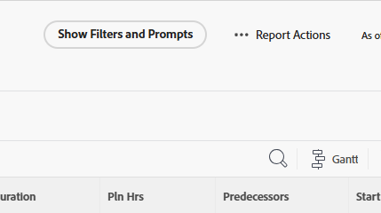

# Eseguire un rapporto

Puoi eseguire qualsiasi rapporto a cui hai accesso.

<!-- Audited: 11/2024 -->

<!--
NOTE: ***Linked to Getting Started with Reporting.***This information is obsolete, because asynchronous timeline is not enabled for all customers (used to be included in the "Viewing a Cached Report" section): Some reports in Workfront can take a significant time to load. If your report takes longer than 30 seconds to load, your report is cached after it is finished loading, and a message is displayed in the upper-right corner of the page indicating that the report being viewed is a saved report from a specific time.

After a report is cached, it is available for the next 12 hours. Any user who runs the report (as described in "Running a Report") sees the cached report.)
-->

## Requisiti di accesso

+++ Espandi per visualizzare i requisiti di accesso per la funzionalità in questo articolo.

Per eseguire i passaggi descritti in questo articolo, è necessario disporre dei seguenti diritti di accesso:

<table style="table-layout:auto"> 
 <col> 
 </col> 
 <col> 
 </col> 
 <tbody> 
  <tr> 
   <td role="rowheader">Piano Adobe Workfront*</td> 
   <td> 
Qualsiasi
 </td> 
  </tr> 
  <tr> 
   <td role="rowheader">Licenza Adobe Workfront*</td> 
      <td> 
      
Nuovo:

         <ul>
         <li>
Standard
</li>
         </ul>
      
Corrente:

         <ul>
         <li>
Piano
</li>
         </ul>
   </td>
  </tr> 
  <tr> 
   <td role="rowheader">Configurazioni del livello di accesso*</td> 
   <td> 
Accesso a report, dashboard e calendari
</td> 
  </tr> 
  <tr> 
   <td role="rowheader">Autorizzazioni oggetto</td> 
   <td> 
Visualizzare le autorizzazioni per un rapporto
</td> 
  </tr> 
 </tbody> 
</table>

*Per informazioni, consulta [Requisiti di accesso nella documentazione di Workfront](/help/quicksilver/administration-and-setup/add-users/access-levels-and-object-permissions/access-level-requirements-in-documentation.md).

+++

## Eseguire un rapporto

1. Fai clic sull&#39;icona **[!UICONTROL Main Menu]**  nell&#39;angolo superiore destro di Adobe Workfront oppure, se disponibile, fai clic sull&#39;icona **[!UICONTROL Main Menu]**  nell&#39;angolo superiore sinistro, quindi fai clic su **[!UICONTROL Reports]**.

1. Selezionare una delle opzioni seguenti:

   * **I miei report:** report creati.
   * **Condiviso con me:** report condivisi da altri utenti con te.
   * **Tutti i report:** Tutti i report nel sistema a cui hai accesso.

1. Fare clic sul nome del report che si desidera eseguire.\
   Oppure\
   Se il report è stato creato utilizzando i prompt, selezionare le informazioni appropriate dai menu a discesa, quindi fare clic su **Esegui report**.\
   Per ulteriori informazioni sui prompt, vedere [Aggiungere un prompt a un report](../../../reports-and-dashboards/reports/creating-and-managing-reports/add-prompt-report.md).\
   Il contenuto del report viene visualizzato con una marca temporale nell’angolo superiore destro del report, che include la data, l’ora e il fuso orario in cui il report è stato eseguito dal contesto dell’utente che ha eseguito il report.

1. (Facoltativo) Fai clic sull&#39;**icona Ricarica**  per aggiornare i risultati in un report, se il report è stato visualizzato nel browser per un po&#39; di tempo.

1. (Condizionale) Se il report utilizza filtri o prompt, fare clic su **Mostra filtri e prompt** per visualizzare un elenco di filtri e prompt utilizzati nel report visualizzato. Se il report contiene solo filtri o solo prompt, verrà visualizzato **Mostra filtri** o **Mostra prompt**.

   

   Le informazioni vengono visualizzate sotto il nome del rapporto sul lato sinistro della pagina. Per i prompt, si tratta di informazioni sulle selezioni effettuate al momento dell&#39;esecuzione del report, come descritto nel passaggio 3.

1. Se si utilizzano i prompt personalizzati, non vengono visualizzati. Vengono visualizzati solo i prompt di sistema. I filtri personalizzati vengono sempre visualizzati.

## Visualizzare un rapporto memorizzato nella cache

Il report potrebbe essere memorizzato nella cache se è stato visualizzato nel browser per un po’. Puoi forzare il ricaricamento di un rapporto memorizzato nella cache quando esegui una delle seguenti azioni:

* Modifica le impostazioni del rapporto e salva il rapporto.
* Modificare la visualizzazione, il gruppo o il filtro.
* Fai clic sull&#39;**icona Ricarica** 
Questa opzione è disponibile nell&#39;angolo superiore destro della pagina all&#39;interno della finestra di messaggio che indica l&#39;ora in cui il report è stato salvato oppure è disponibile nell&#39;angolo superiore destro del dashboard in cui è posizionato il report. Per ulteriori informazioni sul ricaricamento dei dashboard, vedere la sezione &quot;Dashboard di visualizzazione&quot; nell&#39;articolo [Introduzione ai dashboard](../../../reports-and-dashboards/dashboards/understanding-dashboards/get-started-dashboards.md).

* Accedere a qualsiasi pagina del report oltre la prima pagina passando alle schede Riepilogo, Matrice o Grafico.
