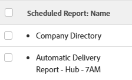
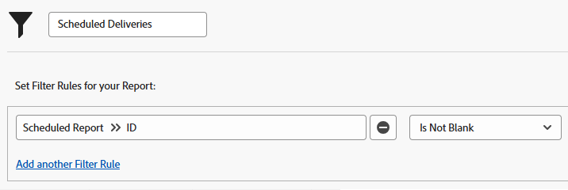
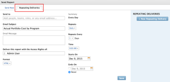
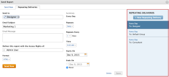
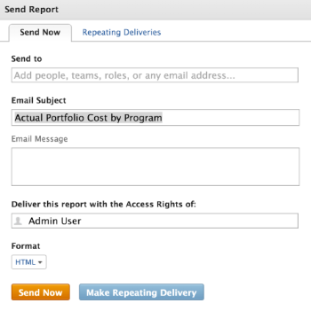

# Panoramica sulla consegna del rapporto

<!-- Audited: 11/2024 -->

<!--

(NOTE: This is linked to the UI in the Send Report box inside the Preview sandbox. If you change title, log bug for Dev to fix the link) 

-->

È possibile pianificare l&#39;invio automatico dei report agli utenti in base a una pianificazione definita oppure l&#39;invio dei report una tantum, manualmente. Quando invii un report da Adobe Workfront, l’utente riceve un’e-mail con il report Workfront in un allegato separato.

Per informazioni sull&#39;impostazione di un report per la consegna, vedere l&#39;articolo [Pianificare la consegna automatica di un report](../../../reports-and-dashboards/reports/creating-and-managing-reports/set-up-automatic-report-delivery.md).

Non è possibile pianificare la consegna dei report, né consegnarli manualmente nell’ambiente Sandbox di anteprima. Per ulteriori informazioni sull’ambiente sandbox di anteprima, consulta l’articolo [Ambiente sandbox di anteprima di Adobe Workfront](../../../administration-and-setup/set-up-workfront/workfront-testing-environments/wf-preview-sandbox-environment.md).\
Per ulteriori informazioni sul recapito dei report nell’ambiente Sandbox di anteprima, consulta l’articolo [Inviare un report nell’ambiente Sandbox di anteprima](../../../reports-and-dashboards/reports/creating-and-managing-reports/send-report-preview-sandbox-environment.md).

## Limiti di recapito dei report

<!--

(NOTE: [! This information is shared between "Exporting Data" and "Setting Up Report Deliveries."])

-->

Quando si programmano i rapporti per la consegna, tenere presente quanto segue:

* È possibile pianificare fino a 10 consegne ripetute di report per ogni report specifico.
* È possibile pianificare la consegna di un report solo se si è l&#39;autore del report. Se devi inviare un report che non hai creato, puoi inviarlo manualmente.

## Limiti di esportazione

Esistono diversi limiti di dimensione che influiscono sulla visualizzazione dei report in Workfront e sulla modalità di esportazione tramite un’esportazione manuale, un report fornito o tramite l’API:

* **10MB file size:** File size limit for any exported report scheduled for delivery. Se un file esportato allegato a un messaggio e-mail supera i 5 MB, viene inviato per e-mail un collegamento tramite il quale è possibile scaricare il file, anziché il report di esportazione allegato.

  >[!NOTE]
  >
  >I file .xlsx di Excel di dimensioni superiori a 10 MB non generano messaggi e-mail. È possibile esportare manualmente il report in questo formato. Per informazioni sull&#39;esportazione di report, vedere [Esportare dati](../../../reports-and-dashboards/reports/creating-and-managing-reports/export-data.md).

* **50.000 righe:** il numero di righe di dati consentite in un&#39;esportazione di report per file .pdf e delimitati da tabulazioni.

  Per i file xls di Excel, questo limite è di **65.000 righe**.

  Per i file xlsx di Excel, questo limite è di **100.000 righe**.

  Questi limiti escludono le intestazioni di colonna e le righe per i raggruppamenti nel report. Ad esempio, se in un report sono presenti 6 raggruppamenti e 50.000 righe di dati, il file esportato conterrà 50.000 righe.

  Se il report contiene più elementi di questi limiti, viene visualizzato un messaggio di errore che indica che l’esportazione e la consegna del report non sono riuscite. Ridurre il numero di elementi visualizzati sullo schermo a un numero minore o uguale a questi limiti per poter fornire i risultati. Se si desidera esportare tutti i dati, si consiglia di utilizzare i filtri per ottenere carichi di dati più piccoli, quindi eseguire più esportazioni. Per ulteriori informazioni, vedere [Panoramica sui filtri](../../../reports-and-dashboards/reports/reporting-elements/filters-overview.md).

  Tali limiti si applicano a:

   * Esportazione manuale di un report.
   * Un report pianificato.
   * Esportazione tramite un’integrazione API.
   * Dati esportati mediante avvio.

     Per ulteriori informazioni sull&#39;esportazione di dati tramite avvii, vedere l&#39;articolo [Esportare dati da Adobe Workfront tramite avvii](../../../administration-and-setup/manage-workfront/using-kick-starts/export-data-from-wf-via-kick-starts.md).

     >[!NOTE]
     >
     >Puoi esportare 50.000 righe in un file di avvio rapido, ma solo in un file in formato Excel.

   * Esportazione delle informazioni sull&#39;utilizzo per un progetto.

     Per ulteriori informazioni sull&#39;esportazione delle informazioni sull&#39;utilizzo per un progetto, vedere [Panoramica del report Utilizzo risorse](../../../reports-and-dashboards/reports/using-built-in-reports/resource-utilization-report.md).

* **65.530 collegamenti ipertestuali:** Limite imposto da Excel ai documenti contenenti più di 65.530 collegamenti ipertestuali. Questi documenti non possono essere aperti quando vengono esportati manualmente o inviati in un report consegnato. Si noti che un documento di Excel può avere solo 200 righe di dati, ma se il documento contiene più di 65.530 collegamenti, il documento non si apre. Questo limite esiste solo per i file di Excel e non per gli altri formati supportati.
* **256 colonne**: limite imposto da Excel ai documenti contenenti più di 256 colonne. Questi documenti non possono essere esportati manualmente o inviati in un report consegnato. Questo limite esiste solo per i file di Excel e non per gli altri formati supportati.

Se si tenta di esportare dati oltre il limite, è possibile che non vengano ricevuti tutti i dati previsti nell&#39;esportazione. Piuttosto, viene prodotto un report modificato entro il limite.

Inoltre, i report che richiedono più di 60 minuti verranno arrestati.

In caso di dubbi o problemi relativi al limite, contattare il supporto tecnico Workfront.

## Informazioni sulle marche temporali per i report consegnati

<!--

(NOTE: Note about if this is delivered at a time based on the user's time zone settings?)

-->

Quando ricevi un report tramite e-mail, la marca temporale e il formato dell’ora nel report potrebbero non corrispondere a quelli in Workfront, se visualizzi il report in Workfront contemporaneamente alla consegna.

Considera i seguenti aspetti:

* Quando si visualizza un report nel browser, la marca temporale e il formato del report corrispondono alle impostazioni internazionali e al fuso orario del browser, come definito nelle impostazioni del browser.
* Quando il report viene inviato tramite e-mail, il report viene inviato con la marca temporale e il formato che corrispondono alle impostazioni internazionali dell’utente e al fuso orario specificati nel profilo Workfront.\
  Per ulteriori informazioni sulle impostazioni internazionali dell&#39;utente e sul fuso orario in Workfront, vedere l&#39;articolo [Modificare il profilo di un utente](../../../administration-and-setup/add-users/create-and-manage-users/edit-a-users-profile.md).

## Report con una visualizzazione speciale {#reports-with-a-special-view}

Quando si applica una visualizzazione speciale a un report, la visualizzazione speciale viene visualizzata nella scheda Dettagli del report in Workfront.

Quando pianifichi la consegna di un report con una visualizzazione speciale, la scheda Dettagli viene fornita nell’allegato dell’e-mail inviata, anziché nella visualizzazione speciale.

Le viste seguenti sono considerate speciali:

* Visualizzazione Cardine in un report Progetto
* Visualizzazione Gantt in una relazione Progetto o Attività
* Report con un grafico come scheda predefinita

>[!NOTE]
>
>Se nel report è presente anche una scheda Matrice oltre alla scheda predefinita con una vista speciale, il report viene consegnato così come viene visualizzato nella scheda Matrice.

Per ulteriori informazioni su come applicare una visualizzazione speciale a un report, vedere l&#39;articolo [Creazione di un report personalizzato](../../../reports-and-dashboards/reports/creating-and-managing-reports/create-custom-report.md).

## Utilizzare il file consegnato

Quando invii un report da Workfront, l’utente riceve un’e-mail con il report in un allegato separato.

* [Oggetto, nome allegato e titolo del report](#subject-line-attachment-name-and-report-title)
* [Timestamp](#timestamps)
* [Branding](#branding)
* [Formattazione](#formatting)
* [Collegamenti](#links)

### Oggetto, nome dell&#39;allegato e titolo del report {#subject-line-attachment-name-and-report-title}

Per ulteriori informazioni sull&#39;oggetto dell&#39;e-mail del report inviato, vedere [Pianificare la consegna automatica di un report](../../../reports-and-dashboards/reports/creating-and-managing-reports/set-up-automatic-report-delivery.md).

Il nome del report allegato è: *The_Name_Of_The_Report* seguito dal formato di file esportato.

Se hai pianificato la formattazione del report consegnato come file PDF o HTML, il titolo del report sarà:

*Nome del report.*

I report pianificati per essere consegnati in formato Excel, Excel (.xlsx) o TSV non hanno un titolo.

>[!NOTE]
>
>Se il report include una descrizione, verrà incluso nel file esportato, se il file è formattato come file PDF o HTML.

### Marca temporale {#timestamps}

Un timestamp viene visualizzato nel file allegato solo se il formato del file è .pdf. La marca temporale si trova nel piè di pagina del file allegato.

La marca temporale include:

* Data
* Ora
* Fuso orario di invio del report

### Branding {#branding}

Se il tuo amministratore Workfront ha aggiunto elementi di branding personalizzati alla tua istanza Workfront, i report inviati in formato .pdf includono anche il tuo logo personalizzato.

I report inviati in tutti gli altri formati non possono essere personalizzati con il tuo logo.

Per ulteriori informazioni sul branding dell&#39;istanza di Workfront, consulta l&#39;articolo [Aggiungere il tuo branding all&#39;istanza di Adobe Workfront](../../../administration-and-setup/customize-workfront/brand-workfront/brand-your-workfront-instance.md).

### Formattazione {#formatting}

La scheda Dettagli di un report viene sempre visualizzata quando un report viene inviato o programmato per una consegna, a meno che il report non abbia una visualizzazione speciale.

Se il report ha una formattazione speciale nell’applicazione Web, il report deve essere fornito con la formattazione speciale quando le schede Dettagli e Matrice vengono fornite solo per i file .pdf ed Excel.

Il filtro, la visualizzazione o il raggruppamento del report non vengono inclusi nel file consegnato. La descrizione del report viene inclusa solo quando lo invii come file PDF.

Per ulteriori informazioni sulla ricezione di report con una visualizzazione speciale, vedere l&#39;articolo [Report con una visualizzazione speciale](#reports-with-a-special-view).\
Per ulteriori informazioni sulla selezione della scheda predefinita di un report e sulla formattazione speciale, vedere [Creare un report personalizzato](../../../reports-and-dashboards/reports/creating-and-managing-reports/create-custom-report.md).

### Collegamenti {#links}

Quando si invia un rapporto dal formato Workfront al formato PDF o Excel, tutti i collegamenti di lavoro esistenti nel documento originale rimangono attivi nel file inviato. I collegamenti possono puntare a qualsiasi oggetto in Workfront che supporti il collegamento.

Anche il nome del report nel messaggio e-mail è un collegamento.

## Report sui report pianificati

Per verificare se un report è stato configurato per essere inviato, creare quanto segue:

* **Una visualizzazione** per l&#39;oggetto Report in un elenco o in un report per i report: creare una visualizzazione in un elenco di report o in un report per i report e aggiungere la colonna seguente alla visualizzazione:\
  *Nome rapporto programmato.\
  *I nomi di tutte le consegne programmate per quel rapporto sono elencati nella colonna di un elenco puntato.\
  

* **Un filtro** per l&#39;oggetto Report: creare un filtro in un elenco di report o in un report di report con l&#39;istruzione seguente: *L&#39;ID report pianificato non è vuoto*.\
  Verranno visualizzati solo i report pianificati nell&#39;elenco o nel report.\
  \
  Per ulteriori informazioni sulla creazione di report, vedere [Creare un report personalizzato](../../../reports-and-dashboards/reports/creating-and-managing-reports/create-custom-report.md). Per informazioni sulla creazione di un report sui report, vedere [Creazione di un report sulle attività di reporting](../../../reports-and-dashboards/reports/report-usage/create-report-reporting-activities.md).

<!--
<h2 data-mc-conditions="QuicksilverOrClassic.Draft mode">Scheduling a Repeating Report Delivery</h2>
-->

<!--

You can schedule up to 10 repeating report deliveries for any given report.

-->

<!--

You can schedule a report to be delivered only if you are the creator of the report. If you need to send a report that you did not create, you can send it on a manual basis.

-->

<!--

To schedule a report for automatic delivery or to edit an existing report delivery: ​

-->

<!--
   <li value="1" data-mc-conditions="QuicksilverOrClassic.Draft mode">Navigate to and click the name of the report for which you want to schedule delivery. </li>
   -->

<!--
   <li value="2" data-mc-conditions="QuicksilverOrClassic.Draft mode">Click <strong>Report Actions</strong>, then <strong>Send Report</strong>.  The <strong>Send Report</strong> dialog box is displayed.</li>
   -->

<!--
   <li value="3" data-mc-conditions="QuicksilverOrClassic.Draft mode">Select the <strong>Repeating Deliveries</strong> tab. </li>
   -->

<!--
   <li value="4" data-mc-conditions="QuicksilverOrClassic.Draft mode">(Conditional) To modify an existing repeating report delivery, select the report delivery in the <strong>Repeating Deliveries</strong> section.</li>
   -->

<!--
   <li value="5" data-mc-conditions="QuicksilverOrClassic.Draft mode">Specify the following information:
   <ul>
   <li data-mc-conditions="QuicksilverOrClassic.Draft mode"><strong>Send to:</strong> Begin typing the name of the user, group, team, or role who you want to send the report to, then click the name when it appears in the drop-down list. Or Specify the email address of a person external to the Workfront system who you want to have access to the report.  Repeat this process to send the report to multiple users, groups, teams, or roles.</li>
   <li data-mc-conditions="QuicksilverOrClassic.Draft mode"><strong>Email Subject:</strong> Specify a subject for the email notification.  By default, the email subject is: <em>Workfront Report: <Name of the report> Date of the Export</em>.<strong></strong></li>
   <li data-mc-conditions="QuicksilverOrClassic.Draft mode"><strong>Email Message:</strong> Specify a message to include in the email. By default, the email message is: <em>Attached is the <report frequency> report <Name of the report> generated by Workfront on <Date>.</em> 
   <note type="note">
   For reports delivered as an Excel file only, the following message is also added to the email: "Please be aware that with MS Excel (XLS) file types, there is a limit (65,530) on the number of hyperlinks these file types support. If you exceed those limits, your file will not open and it is recommended to resend without the hyperlinks. Please go back to the report scheduler to remove hyperlinks and resend the report." The "please go back to the report scheduler" phrase is a link back to the report. 
   </note>
   </li>
   <li data-mc-conditions="QuicksilverOrClassic.Draft mode"><strong>Deliver this report with the Access Rights of:</strong> Begin typing the name of a user who has access to the report, then click the name when it appears in the drop-down list. Users who receive the report will be granted the same level of access to the report as the user that you specify here.  For more information, see <a href="../../../reports-and-dashboards/reports/creating-and-managing-reports/run-deliver-report-access-rights-another-user.md" class="MCXref xref">Run and deliver a report with the access rights of another user</a>
   <note type="note">
   This field does not support wildcards. For example, using the wildcard $$User.ID does not run the report with the access rights of the user who is receiving the report.
   </note>
   </li>
   <li data-mc-conditions="QuicksilverOrClassic.Draft mode"><strong>Format:</strong> Select in which of the following formats you want the report to be delivered:
   <ul>
   <li data-mc-conditions="QuicksilverOrClassic.Draft mode"> HTML</li>
   <li data-mc-conditions="QuicksilverOrClassic.Draft mode">PDF</li>
   <li data-mc-conditions="QuicksilverOrClassic.Draft mode">MS Excel</li>
   <li data-mc-conditions="QuicksilverOrClassic.Draft mode">MS Excel (.xlsx)</li>
   <li data-mc-conditions="QuicksilverOrClassic.Draft mode">TSV  </li>
   </ul></li>
   <li data-mc-conditions="QuicksilverOrClassic.Draft mode"><strong>Include Links:</strong> This option is available only when <strong>MS Excel</strong> is selected in the <strong>Format</strong> drop-down menu. When this option is enabled, any hyperlinks are included in the exported Excel document.  Documents that contain more than 65,530 links cannot be opened. If the exported document will contain more than 65,530 links, deselect this option. This option is enabled by default. </li>
   <li data-mc-conditions="QuicksilverOrClassic.Draft mode"><strong>Summary:</strong> Displays a summary of when the delivery repeats.</li>
   <li data-mc-conditions="QuicksilverOrClassic.Draft mode"><strong>Repeats:</strong> Select whether the report should be delivered daily, weekly, monthly, or yearly.</li>
   <li data-mc-conditions="QuicksilverOrClassic.Draft mode"><strong>Repeats Every:</strong> Select the frequency with which you want the delivery to repeat. The value you select for this option is based on the option that is selected in the <strong>Repeats</strong> drop-down list.</li>
   <li data-mc-conditions="QuicksilverOrClassic.Draft mode"><strong>Time:</strong> Select the time of day for the delivery to be sent.</li>
   
<strong>Repeats On:</strong> This option is available when the <strong>Repeats</strong> option is set to either <strong>Weekly</strong> or <strong>Monthly</strong>.

   <li data-mc-conditions="QuicksilverOrClassic.Draft mode">When the <strong>Repeats</strong> option is set to <strong>Weekly</strong>: Select the days of the week that the delivery is sent.</li>
   <li data-mc-conditions="QuicksilverOrClassic.Draft mode">When the <strong>Repeats</strong> option is set to <strong>Monthly</strong>: Select whether the delivery is sent on the day of the month, day of the week, or last day of the month (these options leverage the date that you select in the <strong>Starts On</strong> field).</li>
   <li data-mc-conditions="QuicksilverOrClassic.Draft mode"><strong>Starts On:</strong> Select the date for the scheduled delivery to begin.</li>
   <li data-mc-conditions="QuicksilverOrClassic.Draft mode"><strong>Ends On:</strong> Select a date for the scheduled delivery to end.  Or</li>
   <li data-mc-conditions="QuicksilverOrClassic.Draft mode">Select <strong>Never</strong> if you want the scheduled delivery to last indefinitely.</li>
   -->

<!--
   <li value="6" data-mc-conditions="QuicksilverOrClassic.Draft mode">Click <strong>Save</strong> to save the report delivery.  The report is saved in the <strong>Repeating Deliveries</strong> section (in the <strong>Send Report</strong> dialog box).  The report will be sent at the schedule time Or To manually send the report, click <strong>Send Now</strong>. For more information about sending the report instantly or manually, see .</li>
   -->

<!--
<h2 data-mc-conditions="QuicksilverOrClassic.Draft mode">Deleting a Scheduled Report Delivery</h2>
-->

<!--
   <li value="1" data-mc-conditions="QuicksilverOrClassic.Draft mode">Go to the report with the delivery you want to delete.</li>
   -->

<!--
   <li value="2" data-mc-conditions="QuicksilverOrClassic.Draft mode">Click <strong>Report Actions</strong>, then <strong>Send Report</strong>. </li>
   -->

<!--
   <li value="3" data-mc-conditions="QuicksilverOrClassic.Draft mode">Click <strong>Repeating Deliveries</strong>. </li>
   -->

<!--
   <li value="4" data-mc-conditions="QuicksilverOrClassic.Draft mode">Click the name of the scheduled delivery you want to delete, then click <strong>Delete</strong>. The report is no longer set up for the scheduled delivery. </li>
   -->

<!--
<h2 data-mc-conditions="QuicksilverOrClassic.Draft mode">Sending a Report Manually, on a One-Time Basis</h2>
-->

<!--

You can manually send a report that has been previously scheduled, or you can create a single-use report delivery.​

-->

<!--
  <li data-mc-conditions="QuicksilverOrClassic.Draft mode"><a title="Setting Up Report Deliveries" href="#sending-a-scheduled-report-now" class="MCXref xref">Sending a Scheduled Report Now</a> </li>
  -->

<!--
  <li data-mc-conditions="QuicksilverOrClassic.Draft mode"><a title="Setting Up Report Deliveries" href="#sending-a-report-one-time-only" class="MCXref xref">Sending a Report (One Time Only)</a> </li>
  -->

<!--
<h3 data-mc-conditions="QuicksilverOrClassic.Draft mode" id="sending-a-scheduled-report-now">Sending a Scheduled Report Now</h3>
-->

<!--

After a scheduled report has been set up, you can manually send the report rather than waiting until the scheduled time.

-->

<!--
   <li value="1" data-mc-conditions="QuicksilverOrClassic.Draft mode">Navigate to and click the name of the report that you want to send now.</li>
   -->

<!--
   <li value="2" data-mc-conditions="QuicksilverOrClassic.Draft mode">Click <strong>Report Actions</strong>, then <strong>Send Report</strong>.  The Send Report dialog box is displayed.</li>
   -->

<!--
   <li value="3" data-mc-conditions="QuicksilverOrClassic.Draft mode">Click the <strong>Repeating Deliveries</strong> tab.</li>
   -->

<!--
   <li value="4" data-mc-conditions="QuicksilverOrClassic.Draft mode">In the <strong>Repeating Deliveries</strong> section, select the report delivery that was previously created. </li>
   -->

<!--
   <li value="5" data-mc-conditions="QuicksilverOrClassic.Draft mode">Click <strong>Send Now</strong>.  The report is sent to all users identified in the scheduled delivery.</li>
   -->

<!--
<h3 data-mc-conditions="QuicksilverOrClassic.Draft mode" id="sending-a-report-one-time-only">Sending a Report (One Time Only)</h3>
-->

<!--

You can manually send a report at any time. When you send a report in this way, delivery information (such as the users you are sending to and the email subject) are not saved. If you want to create a report delivery that you can save for later use, create a repeating scheduled report. 

-->

<!--

To send a report to users (one time only):

-->

<!--
   <li value="1" data-mc-conditions="QuicksilverOrClassic.Draft mode">Navigate to and click the name of the report that you want to send now.</li>
   -->

<!--
   <li value="2" data-mc-conditions="QuicksilverOrClassic.Draft mode">Click <strong>Report Actions</strong>, then <strong>Send Report</strong>.  The <strong>Send Report</strong> dialog box is displayed. </li>
   -->

<!--
   <li value="3" data-mc-conditions="QuicksilverOrClassic.Draft mode">On the <strong>Send Now</strong> tab, specify the following information:
   <ul>
   <li data-mc-conditions="QuicksilverOrClassic.Draft mode"><strong>Send to:</strong> Begin typing the name of the user, group, team, or role who you want to send the report to, then click the name when it appears in the drop-down list. Or, specify the email address of a person external to the Workfront system who you want to have access to the report.  Repeat this process to send the report to multiple users, groups, teams, or roles.</li>
   <li data-mc-conditions="QuicksilverOrClassic.Draft mode"><strong>Email Subject:</strong> Specify a subject for the email notification.  By default, the email subject is: <em>Workfront Report: <Name of the report> Date of the Export</em>.</li>
   <li data-mc-conditions="QuicksilverOrClassic.Draft mode"><strong>Email Message:</strong> Specify a message to include in the email. By default, the email message is: <em>Attached is the <report frequency> report <Name of the report> generated by Workfront on <Date>.</em> 
   <note type="note">
   For reports delivered as an Excel file only, the following message is also added to the email: "Please be aware that with MS Excel (XLS) file types, there is a limit (65,530) on the number of hyperlinks these file types support. If you exceed those limits, your file will not open and it is recommended to resend without the hyperlinks. Please go back to the report scheduler to remove hyperlinks and resend the report." The "please go back to the report scheduler" phrase is a link back to the report. 
   </note>
   </li>
   <li data-mc-conditions="QuicksilverOrClassic.Draft mode"><strong>Deliver this report with the Access Rights of:</strong> Begin typing the name of a user who has access to the report, then click the name when it appears in the drop-down list. Users who receive the report will be granted the same level of access to the report as the user that you specify here.  For more information, see <a href="../../../reports-and-dashboards/reports/creating-and-managing-reports/run-deliver-report-access-rights-another-user.md" class="MCXref xref">Run and deliver a report with the access rights of another user</a>.
   <note type="note">
   This field does not support wildcards. For example, using the wildcard $$User.ID does not run the report with the access rights of the user who is receiving the report.
   </note>
   </li>
   <li data-mc-conditions="QuicksilverOrClassic.Draft mode"><strong>Format:</strong> Select in which of the following formats you want the report to be delivered:
   <ul>
   <li data-mc-conditions="QuicksilverOrClassic.Draft mode"> HTML</li>
   <li data-mc-conditions="QuicksilverOrClassic.Draft mode">PDF</li>
   <li data-mc-conditions="QuicksilverOrClassic.Draft mode">MS Excel</li>
   <li data-mc-conditions="QuicksilverOrClassic.Draft mode">MS Excel (.xlsx)</li>
   <li data-mc-conditions="QuicksilverOrClassic.Draft mode">TSV</li>
   </ul></li>
   <li data-mc-conditions="QuicksilverOrClassic.Draft mode"><strong>Include Links:</strong> This option is available only when <strong>MS Excel</strong> is selected in the <strong>Format</strong> drop-down menu. When this option is enabled, any hyperlinks are included in the exported Excel document.  Documents that contain more than 65,000 links cannot be opened. If the exported document will contain more than 65,000 links, deselect this option. This option is enabled by default.</li>
   </ul></li>
   -->

<!--
   <li value="4" data-mc-conditions="QuicksilverOrClassic.Draft mode">Click <strong>Send Now</strong>.  The report is sent to all users that you identified.  Or  Click <strong>Make Repeating Delivery</strong> if you want to set up a scheduled delivery with this same information, then complete the additional information regarding the frequency of when the report is sent.</li>
   -->
