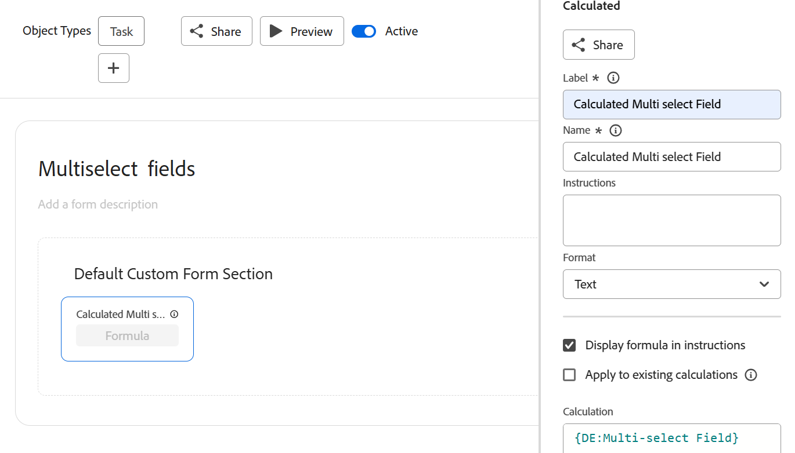

# Creare un grafico di un rapporto in base a un campo personalizzato a selezione multipla

Non è possibile creare un grafico per un rapporto in base a un campo personalizzato con più selezioni. È necessario creare un campo calcolato aggiuntivo che faccia riferimento al campo personalizzato a selezione multipla per creare un grafico del rapporto in base al valore del campo personalizzato a selezione multipla.

## Requisiti di accesso

Per eseguire i passaggi descritti in questo articolo, è necessario disporre dei seguenti diritti di accesso:

<table style="table-layout:auto"> 
 <col> 
 <col> 
 <tbody> 
  <tr> 
   <td role="rowheader">piano Adobe Workfront*</td> 
   <td> <p>Qualsiasi</p> </td> 
  </tr> 
  <tr> 
   <td role="rowheader">Licenza Adobe Workfront*</td> 
   <td> <p>Piano </p> </td> 
  </tr> 
  <tr> 
   <td role="rowheader">Configurazioni a livello di accesso*</td> 
   <td> <p>Accesso a rapporti, dashboard, calendari</p> <p>Modificare l’accesso a Filtri, Visualizzazioni, Gruppi</p> <p>Nota: Se non disponi ancora dell’accesso, chiedi all’amministratore Workfront se ha impostato ulteriori restrizioni nel livello di accesso. Per informazioni su come un amministratore Workfront può modificare il livello di accesso, consulta <a href="../../../administration-and-setup/add-users/configure-and-grant-access/create-modify-access-levels.md" class="MCXref xref">Creare o modificare livelli di accesso personalizzati</a>.</p> </td> 
  </tr> 
  <tr> 
   <td role="rowheader">Autorizzazioni oggetto</td> 
   <td> <p>Gestire le autorizzazioni per un rapporto</p> <p>Per informazioni sulla richiesta di accesso aggiuntivo, vedi <a href="../../../workfront-basics/grant-and-request-access-to-objects/request-access.md" class="MCXref xref">Richiedere l’accesso agli oggetti </a>.</p> </td> 
  </tr> 
 </tbody> 
</table>

&#42;Per informazioni sul piano, il tipo di licenza o l&#39;accesso, contattare l&#39;amministratore Workfront.

## Prerequisiti

Prima di iniziare, è necessario creare un campo personalizzato calcolato che mostri i valori selezionati dal campo personalizzato a selezione multipla. Per informazioni, consulta la sezione [Creare un campo personalizzato calcolato che fa riferimento a un campo personalizzato per selezione multipla](#build-a-calculated-custom-field-that-references-a-multi-select-custom-field) in questo articolo.

## Grafico di un rapporto con più campi personalizzati selezionati

<!--
<p data-mc-conditions="QuicksilverOrClassic.Draft mode">(NOTE: this moved to its own article, linked in the Note above!)</p>
-->

Non è possibile creare un grafico in un rapporto facendo riferimento a un campo personalizzato a selezione multipla. È invece possibile creare un campo calcolato che registra i valori del campo personalizzato a selezione multipla su un determinato oggetto e raggrupparli in base al campo calcolato. 

* [Creare un campo personalizzato calcolato che fa riferimento a un campo personalizzato per selezione multipla](#build-a-calculated-custom-field-that-references-a-multi-select-custom-field)
* [Creare un grafico che faccia riferimento a un campo personalizzato calcolato](#build-a-chart-that-references-a-calculated-custom-field)

### Creare un campo personalizzato calcolato che fa riferimento a un campo personalizzato per selezione multipla {#build-a-calculated-custom-field-that-references-a-multi-select-custom-field}

Per poter creare un campo calcolato che fa riferimento a un campo personalizzato per selezione multipla, è necessario disporre dei seguenti prerequisiti:

* Creare il campo personalizzato per selezione multipla in un modulo personalizzato.\
   Per informazioni sulla creazione di moduli personalizzati e sull’aggiunta di campi personalizzati, vedere l’articolo [Creare o modificare un modulo personalizzato](../../../administration-and-setup/customize-workfront/create-manage-custom-forms/create-or-edit-a-custom-form.md).

* Allegare il modulo personalizzato agli oggetti.
* Compilare il campo personalizzato a selezione multipla con un valore per ciascun oggetto.

Per creare il campo personalizzato calcolato che fa riferimento al campo personalizzato a selezione multipla:

1. Creare un modulo personalizzato o modificarne uno esistente.\
   Per informazioni sulla creazione di moduli personalizzati, consulta l’articolo [Creare o modificare un modulo personalizzato](../../../administration-and-setup/customize-workfront/create-manage-custom-forms/create-or-edit-a-custom-form.md).

1. Selezionare l’oggetto o gli oggetti che si prevede di utilizzare con il modulo personalizzato.
1. Fai clic su **Aggiungi un campo**, quindi **Calcolato** per aggiungere al modulo il campo personalizzato a selezione multipla.

1. In **Etichetta** assegnare un nome al nuovo campo calcolato per indicare che fa riferimento al campo personalizzato per selezione multipla.\
   Ad esempio: &quot;Campo a selezione multipla calcolato.&quot;

1. In **Calcolo** immettere il codice seguente:

   ```
   {DE:Multi-select Custom Field}
   ```

1. Sostituisci &quot;Campo personalizzato con selezione multipla&quot; con il nome effettivo del campo personalizzato con selezione multipla, come visualizzato in Workfront.

   

1. (Facoltativo) Se il campo personalizzato a selezione multipla è già presente in questo modulo e se il modulo è già allegato agli oggetti, abilitare il **Aggiorna calcoli precedenti** opzione .\
   In questo modo il nuovo campo viene compilato automaticamente con il valore del campo personalizzato a selezione multipla aggiunto ai moduli associati agli oggetti già presenti.

1. Fai clic su **Fine**.
1. Fai clic su **Salva +Chiudi**.

### Creare un grafico che faccia riferimento a un campo personalizzato calcolato {#build-a-chart-that-references-a-calculated-custom-field}

1. (Facoltativo) Per fare in modo che tutti i campi calcolati per i quali si desidera creare un grafico siano compilati con valori, selezionare tutti gli oggetti del rapporto che contengono il modulo personalizzato con i campi personalizzati a selezione multipla e il campo personalizzato calcolato, quindi fare clic su **Modifica**.
1. (Facoltativo e condizionale) Abilita l’ **Ricalcola espressioni personalizzate** campo , quindi fai clic su **Salva modifiche**.\
   

1. Passare al rapporto in cui si desidera aggiungere il grafico per il campo calcolato che fa riferimento al campo personalizzato a selezione multipla.
1. Fai clic su **Azioni dei rapporti**, quindi **Modifica**.

1. Seleziona la <strong>Raggruppamenti</strong> scheda , quindi fai clic su <strong>Aggiungi raggruppamento</strong>.
1. Aggiungi il<strong>Campo a selezione multipla calcolato</strong> creato come raggruppamento.
1. Seleziona la <strong>Grafico</strong> e aggiungere un grafico al rapporto.<br>Per informazioni sull&#39;aggiunta di un grafico a un rapporto, vedere la sezione <a href="../../../reports-and-dashboards/reports/creating-and-managing-reports/create-custom-report.md#add-a-chart" class="MCXref xref">Aggiungere un grafico a un report</a> nell&#39;articolo <a href="../../../reports-and-dashboards/reports/creating-and-managing-reports/create-custom-report.md" class="MCXref xref">Creare un rapporto personalizzato</a>.
1. Seleziona la <strong>Campo a selezione multipla calcolato</strong> come uno dei campi da visualizzare nel grafico.
1. Fai clic su <strong>Salva e chiudi</strong>.<br>Il rapporto visualizza i risultati raggruppati in un grafico dal campo a selezione multipla calcolato.
