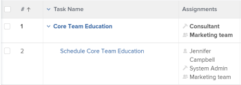

# Report o elenchi: visualizzare gli utenti associati a un oggetto

È possibile visualizzare utenti, ruoli di lavoro e team associati agli oggetti nei rapporti o negli elenchi, nonché fare riferimento a tali utenti nei filtri. Non è possibile raggruppare per utenti, ruoli o team associati agli oggetti.

È possibile visualizzare o filtrare in base a utenti, ruoli o team associati ai seguenti oggetti:

<table style="table-layout:auto"> 
 <col> 
 <col> 
 <tbody> 
  <tr> 
   <td role="rowheader">Oggetto</td> 
   <td>Utenti o ruoli associati</td> 
  </tr> 
  <tr> 
   <td role="rowheader">Progetto</td> 
   <td> 
È possibile visualizzare tutti gli utenti e i ruoli del lavoro che essi svolgono sul progetto in un rapporto di progetto. Non è possibile filtrare in base agli utenti o ai ruoli di lavoro associati in un rapporto di progetto. 
 </td> 
  </tr> 
  <tr> 
   <td role="rowheader">Attività</td> 
   <td>È possibile visualizzare e filtrare tutti gli utenti, i ruoli e i team assegnati a un'attività in un rapporto di attività.</td> 
  </tr> 
  <tr> 
   <td role="rowheader">Problemi</td> 
   <td>Puoi visualizzare e filtrare tutti gli utenti, i ruoli e i team assegnati a un problema in un rapporto del problema.</td> 
  </tr> 
  <tr> 
   <td role="rowheader">Portfolio</td> 
   <td>È possibile visualizzare tutti gli utenti e i ruoli del lavoro che essi svolgono sul progetto in un rapporto di progetto e raggruppare il rapporto per Portfolio. Non è possibile filtrare in base agli utenti o ai ruoli di lavoro associati in un rapporto di progetto.</td> 
  </tr> 
  <tr> 
   <td role="rowheader">Programmi</td> 
   <td>È possibile visualizzare tutti gli utenti e i ruoli del lavoro che essi svolgono sul progetto in un rapporto di progetto e raggruppare il rapporto per programma. Non è possibile filtrare in base agli utenti o ai ruoli di lavoro associati in un rapporto di progetto.</td> 
  </tr> 
 </tbody> 
</table>

## Visualizza tutti gli utenti e i ruoli di lavoro associati a un progetto

Puoi visualizzare tutti gli utenti associati al progetto nella visualizzazione di un elenco o di un rapporto di progetto. Questo include tutti gli utenti elencati nella sezione Persone del progetto. Puoi anche visualizzare i ruoli a cui sono associati quando sono assegnati a attività o problemi del progetto in un rapporto di progetto.

Per informazioni sulla creazione di un rapporto sul progetto per visualizzare tutti gli utenti e i loro ruoli nel progetto, consulta [Visualizza: elenco degli utenti del progetto con ruoli di lavoro](../../../reports-and-dashboards/reports/custom-view-filter-grouping-samples/view-project-user-list.md).

Non è possibile filtrare gli utenti o i ruoli di lavoro associati ai progetti in un filtro di progetto.

## Visualizza tutti gli utenti, i ruoli o i team assegnati a un&#39;attività

È possibile visualizzare tutti gli utenti, i ruoli o i team assegnati a un&#39;attività nella visualizzazione di un elenco di attività o di un rapporto aggiungendo il campo Assegnazioni alla visualizzazione.

È possibile filtrare in base agli utenti, ai ruoli o ai team assegnati alle attività facendo riferimento ai campi seguenti in un filtro attività:

* Assegnazione Utente
* Assegnazioni Ruoli
* Team

## Visualizza tutti gli utenti, i ruoli o i team assegnati a un problema

Puoi visualizzare tutti gli utenti, i ruoli o i team assegnati a un problema nella visualizzazione di un elenco di problemi o di un rapporto aggiungendo il campo Assegnazioni alla visualizzazione.

Puoi filtrare in base agli utenti, ai ruoli o ai team assegnati ai problemi facendo riferimento ai seguenti campi in un filtro dei problemi:

* Assegnazione Utente
* Assegnazioni Ruoli
* Team

## Visualizza tutti gli utenti e i ruoli di lavoro associati a un portfolio

Puoi visualizzare tutti gli utenti e i ruoli associati a un portfolio visualizzandoli in un rapporto di progetto e quindi raggruppando il rapporto per Portfolio.

Per informazioni sulla creazione di un rapporto sul progetto per visualizzare tutti gli utenti e i loro ruoli nel progetto, consulta [Visualizza: elenco degli utenti del progetto con ruoli di lavoro](../../../reports-and-dashboards/reports/custom-view-filter-grouping-samples/view-project-user-list.md).

Non è possibile filtrare gli utenti o i ruoli di lavoro associati ai progetti in un portfolio o in un filtro di progetto.

## Visualizza tutti gli utenti e i ruoli di lavoro associati a un programma

Puoi visualizzare tutti gli utenti e i ruoli associati a un programma visualizzandoli in un rapporto di progetto e quindi raggruppando il rapporto per programma.

Per informazioni sulla creazione di un rapporto sul progetto per visualizzare tutti gli utenti e i loro ruoli nel progetto, consulta [Visualizza: elenco degli utenti del progetto con ruoli di lavoro](../../../reports-and-dashboards/reports/custom-view-filter-grouping-samples/view-project-user-list.md).

Non è possibile filtrare gli utenti o i ruoli di lavoro associati ai progetti in un programma o in un filtro di progetto.
