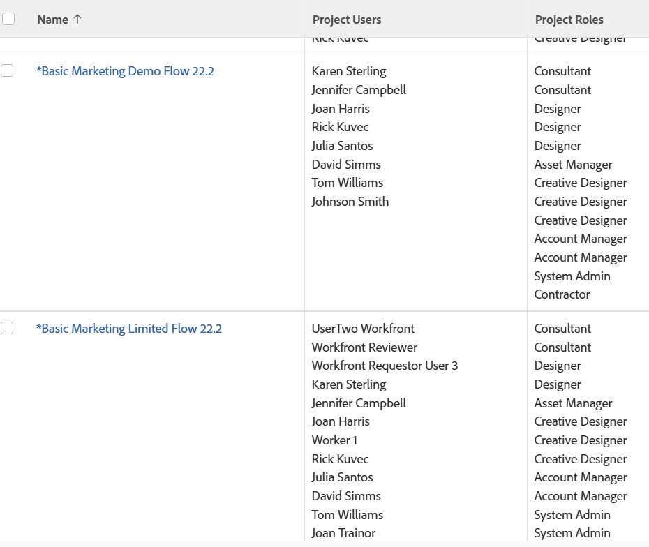
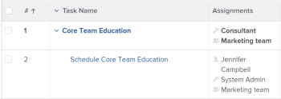

# Rapporti o elenchi: visualizzare gli utenti associati a un oggetto

È possibile visualizzare gli utenti, i ruoli di lavoro e i team associati agli oggetti nei report o negli elenchi e farvi riferimento nei filtri. Non è possibile eseguire il raggruppamento in base a utenti, ruoli di lavoro o team associati a oggetti.

Puoi visualizzare o filtrare per utenti, ruoli o team associati ai seguenti oggetti:

<table style="table-layout:auto"> 
 <col> 
 <col> 
 <tbody> 
  <tr> 
   <td role="rowheader">Oggetto</td> 
   <td>Utenti o mansioni associati</td> 
  </tr> 
  <tr> 
   <td role="rowheader">Progetto</td> 
   <td> 
Puoi visualizzare tutti gli utenti e le mansioni che svolgono sul progetto in un rapporto di progetto. Non è possibile filtrare in base agli utenti o alle mansioni a essi associate in un report di progetto. 
 </td> 
  </tr> 
  <tr> 
   <td role="rowheader">Attività</td> 
   <td>È possibile visualizzare e filtrare in base a tutti gli utenti, le mansioni e i team assegnati a un'attività in un report attività.</td> 
  </tr> 
  <tr> 
   <td role="rowheader">Problemi</td> 
   <td>È possibile visualizzare e filtrare in base a tutti gli utenti, i ruoli di lavoro e i team assegnati a un problema in un report di problema.</td> 
  </tr> 
  <tr> 
   <td role="rowheader">Portfolio</td> 
   <td>Puoi visualizzare tutti gli utenti e le mansioni che svolgono sul progetto in un rapporto di progetto e raggruppare il rapporto per Portfolio. Non è possibile filtrare in base agli utenti o alle mansioni a essi associate in un report di progetto.</td> 
  </tr> 
  <tr> 
   <td role="rowheader">Programmi</td> 
   <td>Puoi visualizzare tutti gli utenti e le mansioni che svolgono sul progetto in un rapporto di progetto e raggruppare il rapporto per programma. Non è possibile filtrare in base agli utenti o alle mansioni a essi associate in un report di progetto.</td> 
  </tr> 
 </tbody> 
</table>

## Visualizza tutti gli utenti e i ruoli associati a un progetto

È possibile visualizzare tutti gli utenti associati al progetto nella visualizzazione di un elenco o di un report di progetti. Sono inclusi tutti gli utenti elencati nella sezione Persone del progetto. Puoi anche visualizzare i ruoli a cui sono associati quando sono assegnati ad attività o problemi sul progetto in un report di progetto.

Per informazioni sulla creazione di un report di progetto per visualizzare tutti gli utenti e i relativi ruoli nel progetto, vedere [Visualizza: elenco di utenti del progetto con ruoli di processo](../../../reports-and-dashboards/reports/custom-view-filter-grouping-samples/view-project-user-list.md).

Non è possibile filtrare gli utenti o i ruoli di lavoro associati ai progetti in un filtro di progetto.

## Visualizzare tutti gli utenti, i ruoli di lavoro o i team assegnati a un&#39;attività

È possibile visualizzare tutti gli utenti, i ruoli o i team assegnati a un&#39;attività nella visualizzazione di un elenco di attività o di un report aggiungendo il campo Assegnazioni alla visualizzazione.

Puoi filtrare in base agli utenti, alle mansioni o ai team assegnati alle attività facendo riferimento ai campi seguenti in un filtro attività:

* Assegnazione Utente
* Assegnazioni Ruoli
* Team

## Visualizza tutti gli utenti, le mansioni o i team assegnati a un problema

È possibile visualizzare tutti gli utenti, i ruoli o i team assegnati a un problema nella visualizzazione di un elenco di problemi o di un report aggiungendo il campo Assegnazioni alla visualizzazione.

Puoi filtrare in base agli utenti, ai ruoli di lavoro o ai team assegnati ai problemi facendo riferimento ai seguenti campi in un filtro per problemi:

* Assegnazione Utente
* Assegnazioni Ruoli
* Team

## Visualizza tutti gli utenti e i ruoli associati a un portfolio

Puoi visualizzare tutti gli utenti e i ruoli associati a un portfolio visualizzandoli in un report del progetto e quindi raggruppando il report per Portfolio.

Per informazioni sulla creazione di un report di progetto per visualizzare tutti gli utenti e i relativi ruoli nel progetto, vedere [Visualizza: elenco di utenti del progetto con ruoli](../../../reports-and-dashboards/reports/custom-view-filter-grouping-samples/view-project-user-list.md).

Non puoi filtrare gli utenti o i ruoli associati ai progetti in un filtro portfolio o progetto.

## Visualizza tutti gli utenti e i ruoli associati a un programma

È possibile visualizzare tutti gli utenti e i ruoli associati a un programma visualizzandoli in un report del progetto e quindi raggruppandoli per programma.

Per informazioni sulla creazione di un report di progetto per visualizzare tutti gli utenti e i relativi ruoli nel progetto, vedere [Visualizza: elenco di utenti del progetto con ruoli di processo](../../../reports-and-dashboards/reports/custom-view-filter-grouping-samples/view-project-user-list.md).

Non è possibile filtrare gli utenti o i ruoli di lavoro associati ai progetti in un programma o in un filtro di progetto.
