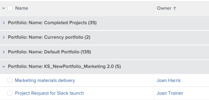

# Raggruppamento: modificare il nome visualizzato in un raggruppamento

<!--Audited: 01/2024-->

È possibile rinominare i raggruppamenti in modo che acquisiscano maggiore familiarità con gli utenti.

Ad esempio, quando applichi il raggruppamento Nome Portfolio standard a un elenco di progetti, il nome del raggruppamento viene visualizzato come *Portfolio: Nome:`<name of portfolio>`*.

È possibile modificare questo raggruppamento utilizzando la modalità testo per visualizzare un nome più facilmente leggibile.

## Requisiti di accesso

+++ Espandi per visualizzare i requisiti di accesso per la funzionalità descritta in questo articolo. 

<table style="table-layout:auto"> 
 <col> 
 <col> 
 <tbody> 
  <tr> 
   <td role="rowheader">Pacchetto Adobe Workfront</td> 
   <td> 
Qualsiasi
 </td> 
  </tr> 
  <tr> 
   <td role="rowheader">Licenza di Adobe Workfront</td> 
   <td> 
   
Collaboratore o richiesta di modifica di un filtro 

   
Standard o piano per modificare un report

  </tr> 
  <tr> 
   <td role="rowheader">Configurazioni del livello di accesso</td> 
   <td> 
Modificare l’accesso a report, dashboard, calendari
 
Modificare l'accesso a Filtri, Viste, Raggruppamenti per modificare un filtro
 </td> 
  </tr> 
  <tr> 
   <td role="rowheader">Autorizzazioni sugli oggetti</td> 
   <td> 
Gestire le autorizzazioni per un report
  </td> 
  </tr> 
 </tbody> 
</table>

Per ulteriori dettagli sulle informazioni contenute in questa tabella, consulta [Requisiti di accesso nella documentazione Workfront](/help/quicksilver/administration-and-setup/add-users/access-levels-and-object-permissions/access-level-requirements-in-documentation.md).

+++

## Modificare il nome visualizzato in un raggruppamento

Per modificare il nome visualizzato in un raggruppamento di progetti:

1. Vai a un elenco di progetti.
1. Dal menu a discesa **Raggruppamento**, seleziona **Nuovo raggruppamento**.

1. Fai clic su **Aggiungi raggruppamento** e inizia a digitare &quot;Nome Portfolio&quot; nel campo **Raggruppa per:**, quindi selezionalo quando viene visualizzato nell&#39;elenco.

1. Fare clic su **Passa alla modalità testo**.
1. Effettuate una delle seguenti operazioni:

   * Aggiungere il codice seguente al testo esistente disponibile nella casella **Raggruppa report**:

     `group.0.displayname=Your Value`

     Ad esempio, aggiungete il codice seguente per modificare il nome visualizzato in &quot;Portfolio&quot;:

     `group.0.displayname=Portfolio`

   * Rimuovi tutte le righe dell’interfaccia della modalità testo del raggruppamento che contengono la parola &quot;nome&quot;, quindi aggiungi la riga:

     `group.0.name=Your Value`

     Ad esempio, aggiungete il codice seguente per modificare il nome visualizzato in &quot;Portfolio&quot;:

     `group.0.name=Portfolio`

     >[!TIP]
     >
     >È inoltre possibile lasciare vuote le righe `group.0.name=` e `group.0.displayname=`, nel qual caso il raggruppamento mostra il valore in base al quale si esegue il raggruppamento.

     

1. Fai clic su **Fine**, quindi su **Salva raggruppamento**.
1. (Facoltativo) Aggiornare il nome del raggruppamento, quindi fare clic su **Salva raggruppamento**.

   Il nome predefinito per il raggruppamento viene modificato in base alle informazioni sulla modalità di testo.
