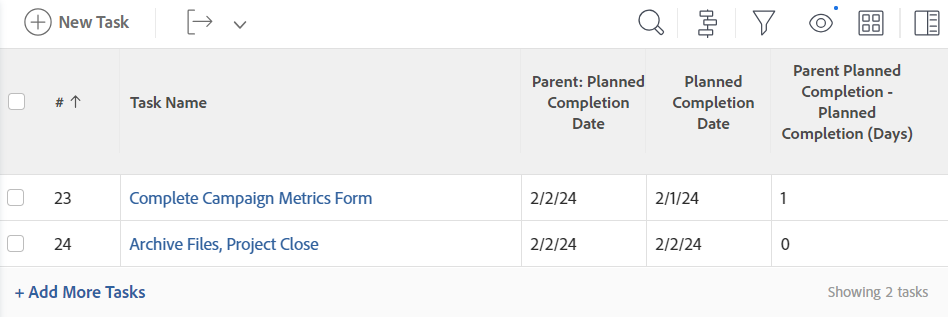

# Visualizza: calcolo delle differenze di data e ora

<!-- Audited: 11/2024 -->

>[!IMPORTANT]
>
>Non puoi calcolare la differenza di data e ora in Adobe Workfront tra due oggetti diversi dello stesso tipo. Ad esempio, non è possibile calcolare la differenza di data e ora tra due date su due progetti, attività o problemi diversi.

Puoi calcolare la differenza tra i seguenti:

* Differenza di data e ora tra due campi data sullo stesso oggetto
* Differenza di data e ora tra un campo di un oggetto e un altro campo dell&#39;oggetto padre

>[!TIP]
>
>Questi calcoli visualizzano il numero di giorni tra le due date. Il risultato viene visualizzato in giorni. Viene considerata anche la marca temporale nel campo data e il numero di giorni potrebbe essere seguito da decimali se le marche temporali non corrispondono. Se l&#39;attività è stata completata in ritardo, il numero di giorni viene visualizzato come valore negativo.

## Requisiti di accesso

+++ Espandi per visualizzare i requisiti di accesso per la funzionalità in questo articolo.

Per eseguire i passaggi descritti in questo articolo, è necessario disporre dei seguenti diritti di accesso:

<table style="table-layout:auto"> 
 <col> 
 <col> 
 <tbody> 
  <tr> 
   <td role="rowheader">piano Adobe Workfront</td> 
   <td> <p>Qualsiasi</p> </td> 
  </tr> 
  <tr> 
   <td role="rowheader">Licenza Adobe Workfront</td> 
   <td> <p>Nuovo: </p><ul><li><p>Collaboratore per modificare una visualizzazione </p></li><li>
   <p>Standard per modificare un rapporto</p></li></ul><p>Oppure</p><p>Corrente:</p><ul><li><p>Richiesta di modifica di una vista </p></li><li>
   <p>Pianificare la modifica di un rapporto</p> </li><ul></td> 
  </tr> 
  <tr> 
   <td role="rowheader">Configurazioni del livello di accesso</td> 
   <td> <p>Modificare l’accesso a Rapporti, Dashboard, Calendari per modificare un rapporto</p> <p>Modificare l'accesso a Filtri, Viste, Raggruppamenti per modificare una vista</p> </td> 
  </tr>  
  <tr> 
   <td role="rowheader">Autorizzazioni oggetto</td> 
   <td> <p>Gestire le autorizzazioni per un rapporto</p>  </td> 
  </tr> 
 </tbody> 
</table>

Per ulteriori dettagli sulle informazioni contenute in questa tabella, vedere [Requisiti di accesso nella documentazione di Workfront](/help/quicksilver/administration-and-setup/add-users/access-levels-and-object-permissions/access-level-requirements-in-documentation.md).

+++

## Calcola la differenza di data e ora tra due campi data sullo stesso oggetto

È ad esempio possibile calcolare la differenza tra la data di completamento pianificata e la data di completamento effettiva di un&#39;attività.


1. Consente di passare a un elenco di attività.
1. Dal menu a discesa **Visualizza**, fare clic su **Nuova visualizzazione**.

1. Fai clic su **Aggiungi colonna** e inizia a digitare &quot;Data di completamento pianificata&quot; nel campo **Mostra in questa colonna**, quindi selezionala quando viene visualizzata nell&#39;elenco.

1. Fai clic su **Aggiungi colonna** e inizia a digitare &quot;Data di completamento effettiva&quot; nel campo **Mostra in questa colonna**, quindi selezionalo quando viene visualizzato nell&#39;elenco.

1. Fai clic su **Aggiungi colonna**, quindi fai clic su **Passa alla modalità testo**.

1. Passa il puntatore del mouse sull&#39;area della modalità testo e fai clic su **Fai clic per modificare il testo**.
1. Rimuovere il testo trovato nella casella **Modalità testo** e sostituirlo con il seguente codice:

   ```
    displayname=Planned-Actual Completion Date
    linkedname=direct
    querysort=plannedCompletionDate
    textmode=true
    valueexpression=ROUND(DATEDIFF({plannedCompletionDate},{actualCompletionDate}),2)
    valueformat=HTML
   ```

1. Fai clic su **Salva**, quindi su **Salva visualizzazione**.

## Calcola la differenza di data e ora tra il campo di un oggetto e un altro campo di un oggetto padre

Per un elenco degli oggetti e dei relativi oggetti padre, vedere la sezione &quot;Informazioni sull&#39;interdipendenza e sulla gerarchia degli oggetti&quot; in [Informazioni sugli oggetti in Adobe Workfront](../../../workfront-basics/navigate-workfront/workfront-navigation/understand-objects.md).\
È ad esempio possibile calcolare la differenza tra la data di completamento pianificata di un&#39;attività e la data di completamento pianificata dell&#39;attività padre o del progetto a cui appartiene l&#39;attività.



1. Consente di passare a un elenco di attività.
1. Dal menu a discesa **Visualizza**, fare clic su **Nuova visualizzazione**.

1. Fai clic su **Aggiungi colonna** e inizia a digitare &quot;Data di completamento pianificata del progetto&quot; o &quot;Data di completamento principale&quot; nel campo **Mostra in questa colonna**, quindi selezionala quando viene visualizzata nell&#39;elenco.

1. Fai clic su **Aggiungi colonna** e inizia a digitare &quot;Data di completamento pianificata&quot; nel campo **Mostra in questa colonna**, quindi selezionala quando viene visualizzata nell&#39;elenco.

1. Fai clic su **Aggiungi colonna**, quindi fai clic su **Passa a modalità testo** > **Modifica modalità testo**.
1. Rimuovere il testo trovato nella casella **Modifica modalità testo** e sostituirlo con uno dei seguenti codici:

   * Per visualizzare la differenza tra la data di completamento pianificata del progetto e quella dell&#39;attività:

     ```
      displayname=Project Planned Completion - Task Planned Completion (Days)
      textmode=true
      valueexpression=ROUND(DATEDIFF({project}.{plannedCompletionDate},{plannedCompletionDate}),2)
      valueformat=HTML
     ```

   * Per visualizzare la differenza tra la data di completamento pianificata dell&#39;attività padre e quella dell&#39;attività:

     ```
      valueexpression=ROUND(DATEDIFF({parent}.{plannedCompletionDate},{plannedCompletionDate}),2)
      textmode=true<br>valueformat=HTML
      displayname=Parent Planned Completion - Planned Completion (Days)
     ```

1. Fai clic su **Fine**, quindi su **Salva visualizzazione**.
