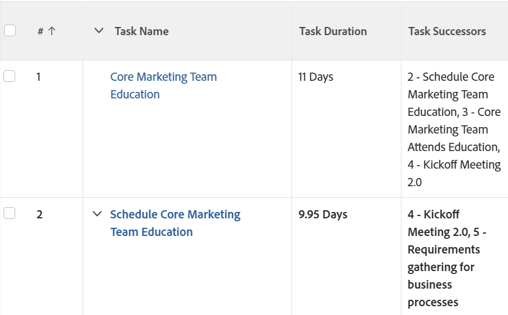

# Visualizzazione: aggiungere un elenco di successori attività in una colonna

<!--Audited: 11/2024-->

È possibile aggiungere una colonna a una visualizzazione delle attività per visualizzare un elenco dei successori delle attività. La colonna **Successori attività** include il numero del successore e il nome.



## Requisiti di accesso

+++ Espandi per visualizzare i requisiti di accesso per la funzionalità descritta in questo articolo. 

<table style="table-layout:auto"> 
 <col> 
 <col> 
 <tbody> 
  <tr> 
   <td role="rowheader">Pacchetto Adobe Workfront</td> 
   <td> <p>Qualsiasi</p> </td> 
  </tr> 
  <tr> 
   <td role="rowheader">Licenza di Adobe Workfront</td> 
   <td> 
   <p>Collaboratore o richiesta di modifica di un filtro </p>
   <p>Standard o piano per modificare un rapporto</p>
  </tr> 
  <tr> 
   <td role="rowheader">Configurazioni del livello di accesso</td> 
   <td> <p>Modificare l’accesso a Rapporti, Dashboard, Calendari per modificare un rapporto</p> <p>Modificare l’accesso a Filtri, Viste, Raggruppamenti per modificare un filtro</p> </td> 
  </tr> 
  <tr> 
   <td role="rowheader">Autorizzazioni sugli oggetti</td> 
   <td> <p>Gestire le autorizzazioni per un rapporto</p>  </td> 
  </tr> 
 </tbody> 
</table>

Per ulteriori dettagli sulle informazioni contenute in questa tabella, consulta [Requisiti di accesso nella documentazione Workfront](/help/quicksilver/administration-and-setup/add-users/access-levels-and-object-permissions/access-level-requirements-in-documentation.md).

+++


## Aggiungere un elenco di successori attività in una colonna

Per aggiungere questa colonna a una visualizzazione delle attività:

1. Consente di passare a un elenco di attività.
1. Espandere il menu a discesa **Visualizza** e fare clic su **Nuova visualizzazione**.
1. Fai clic su **Aggiungi colonna**.
1. Fare clic su **Passa alla modalità testo**, quindi su **Modifica modalità testo**.
1. Rimuovere tutto il testo nella casella **Modifica modalità testo** e sostituirlo con il seguente codice:

   ```
   displayname=Task Successors
   listdelimiter=
   listmethod=nested(successors).lists
   textmode=true
   type=iterate
   valueexpression=CONCAT({successor}.{taskNumber},' - ',{successor}.{name})
   valueformat=HTML
   ```

1. Fai clic su **Fine**, quindi su **Salva visualizzazione**.
