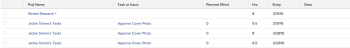

# Visualizza: dettagli combinati su attività e problemi in un elenco di ore

Questa visualizzazione delle ore combina le colonne Task e Issue Name (Nome del problema), nonché le ore pianificate per Attività e Issue (Lavoro pianificato per il problema) utilizzando

```
sharecol
```

tag. Poiché una immissione di ore può appartenere solo a un&#39;attività o a un problema, entrambi gli oggetti non possono essere visualizzati nella stessa colonna contemporaneamente. Ogni riga della visualizzazione viene compilata con le informazioni di un’attività o di un problema.

Per ulteriori informazioni su

```
sharecol
```

, vedere [Visualizzazione: unire le informazioni di più colonne in una colonna condivisa](../../../reports-and-dashboards/reports/custom-view-filter-grouping-samples/view-merge-columns.md).\


## Requisiti di accesso

Per eseguire i passaggi descritti in questo articolo, è necessario disporre dei seguenti diritti di accesso:

<table style="table-layout:auto"> 
 <col> 
 <col> 
 <tbody> 
  <tr> 
   <td role="rowheader">Piano Adobe Workfront*</td> 
   <td> <p>Qualsiasi</p> </td> 
  </tr> 
  <tr> 
   <td role="rowheader">Licenza Adobe Workfront*</td> 
   <td> <p>Richiesta di modifica di una vista </p>
   <p>Pianificare la modifica di un rapporto</p> </td> 
  </tr> 
  <tr> 
   <td role="rowheader">Configurazioni del livello di accesso*</td> 
   <td> <p>Modificare l’accesso a Rapporti, Dashboard, Calendari per modificare un rapporto</p> <p>Modificare l'accesso a Filtri, Viste, Raggruppamenti per modificare una vista</p> <p><b>NOTA</b>

Se non disponi ancora dell’accesso, chiedi all’amministratore di Workfront se ha impostato restrizioni aggiuntive nel tuo livello di accesso. Per informazioni su come un amministratore di Workfront può modificare il tuo livello di accesso, consulta <a href="../../../administration-and-setup/add-users/configure-and-grant-access/create-modify-access-levels.md" class="MCXref xref">Creare o modificare livelli di accesso personalizzati</a>.</p> </td>
</tr>  
  <tr> 
   <td role="rowheader">Autorizzazioni oggetto</td> 
   <td> <p>Gestire le autorizzazioni per un rapporto</p> <p>Per informazioni sulla richiesta di accesso aggiuntivo, vedere <a href="../../../workfront-basics/grant-and-request-access-to-objects/request-access.md" class="MCXref xref">Richiedere l'accesso agli oggetti </a>.</p> </td> 
  </tr> 
 </tbody> 
</table>

&#42;Per conoscere il piano, il tipo di licenza o l&#39;accesso di cui si dispone, contattare l&#39;amministratore di Workfront.

## Visualizzare i dettagli combinati di attività e problemi in un elenco di ore

Per applicare questa visualizzazione:

1. Consente di passare a un elenco di ore.
1. Dal menu a discesa **Visualizza**, selezionare **Nuova visualizzazione**.

1. Nell&#39;area **Anteprima colonna** eliminare tutte le colonne tranne una.
1. Fare clic sull&#39;intestazione della colonna rimanente, quindi fare clic su **Passa alla modalità testo**.
1. Passa il puntatore del mouse sull&#39;area della modalità testo e fai clic su **Fai clic per modificare il testo**.
1. Rimuovere il testo trovato nella casella **Modalità testo** e sostituirlo con il seguente codice:
   <pre>column.1.querysort=project:name<br>column.1.shortview=false<br>column.1.stretch=0<br>column.1.valuefield=project:name<br>column.1.valueformat=HTML<br>column.1.width=100<br>column.2.description=Task o Issue<br>column.2.link.linkproperty.0.name=ID<br>column.2.link.linkproperty.0.valuefield=task:ID<br>column.2.link.linkproperty.0.valueformat=int{9 column.2.link.lookup=link.view<br>column.2.link.valuefield=task:objCode<br>column.2.link.valueformat=val<br>column.2.linkedname=task<br>column.2.listsort=nested(task).string(name)<br>column.2.name=Task o Issue<br>column.2.querysort=task:name<br>column.2.sharecol=true<br>column.2.shortview=false<br>column 2.stretch=0<br>column.2.valuefield=task:name<br>column.2.valueformat=HTML<br>column.2.width=100<br>column.3.descriptionkey=optask<br>column.3.link.linkproperty.0.name=ID<br>column.3.link.linkproperty.0.valuefield=opTask:ID<br>column.3.link.linkproperty.0.valueformat=int<br>column.3.link=link.view<br>column.3.link.valuefield=opTask:objCode<br>column.3.link.valueformat=val<br>column.3.linkedname=optask<br>column.3.listsort=nested(opTask).string(name)<br>column.3.namekey=opTask<br>column.3.querysort=opTask:name<br>column.3.shortview=false<br>column.3.stretch=0<br>column 3.valuefield=opTask:name<br>column.3.valueformat=HTML<br>column.3.width=1<br>column.4.valuefield=task:work<br>column.4.sharecol=true<br>column.4.linkedname=task<br>column.4.valueformat=doubleAsInt<br>column.4.namekey=view.relatedcolumn<br>column.4.querysort=task:work<br>column.4.textmode=45}column.4.namekeyargkey.0=task<br>column.4.namekeyargkey.1=work<br>column.4.displayname=Planned Effort<br>column.5.displayname=Planned Effort<br>column.5.viewalias=opTask:workrequired<br>column.5.linkedname=opTask<br>column.5.valuefield=opTask:workRequired<br>column.5.valueformat=<br>column.querys=opTask:workRequired<br>column.5.namekeyargkey.0=opTask<br>column.5.namekeyargkey.1=workrequired<br>column.5.namekey=view.relatedcolumn<br>column.5.textmode=true<br>column.6.descriptionkey=hours<br>column.6.linkedname=direct<br>column.6.listsort=doubleAsDouble(hours)<br>column.6.namekey=hours.abbr<br>column.6.querysort=hours<br>column.6.shortview=false<br>column.6.stretch=0<br>column.6.valuefield=hours<br>column.6.valueformat=doubleAsString<br>column.6.width=75<br>column.7.descriptionkey=entrydate<br>column.7.linkedname=direct<br>column.7.listsort=atDateAt(entryDate)<br>column.7 ekey=entrydate.abbr<br>column.7.querysort=entryDate<br>column.7.shortview=false<br>column.7.stretch=0<br>column.7.valuefield=entryDate<br>column.7.valueformat=atDate<br>column.7.width=75<br>column.8.descriptionkey=description<br>column.8.linkedname=direct<br>column.8.listsort=string(column)<br>column 8.namekey=description.abbr<br>column.8.querysort=description<br>column.8.shortview=false<br>column.8.stretch=0<br>column.8.valuefield=description<br>column.8.valueformat=HTML<br>column.8.width=150<br><br></pre>

1. Fai clic su **Salva vista**.
