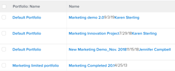

# Visualizzazione: unire le informazioni provenienti da più colonne in una colonna condivisa

<!-- Audited: 11/2024 -->

You can merge the information that displays in multiple separate columns and display it in one shared column.

## Requisiti di accesso

+++ Espandi per visualizzare i requisiti di accesso per la funzionalità descritta in questo articolo.

<table style="table-layout:auto"> 
 <col> 
 <col> 
 <tbody> 
  <tr> 
   <td role="rowheader">Pacchetto Adobe Workfront</td> 
   <td> <p>Qualsiasi</p> </td> 
  </tr> 
  <tr> 
   <td role="rowheader">Licenza di Adobe Workfront</td> 
   <td> 
   <p>Collaboratore o richiesta di modifica di una visualizzazione </p>
   <p>Standard o piano per modificare un rapporto</p>
  </tr> 
  <tr> 
   <td role="rowheader">Configurazioni del livello di accesso</td> 
   <td> <p>Modificare l’accesso a report, dashboard, calendari</p> <p>Modificare l'accesso a Filtri, Viste, Raggruppamenti per modificare una vista</p> </td> 
  </tr> 
  <tr> 
   <td role="rowheader">Autorizzazioni sugli oggetti</td> 
   <td> <p>Gestire le autorizzazioni per un report</p>  </td> 
  </tr> 
 </tbody> 
</table>

Per ulteriori dettagli sulle informazioni contenute in questa tabella, consulta [Requisiti di accesso nella documentazione Workfront](/help/quicksilver/administration-and-setup/add-users/access-levels-and-object-permissions/access-level-requirements-in-documentation.md).


+++

## Considerazioni durante la condivisione o l’unione di colonne

* È possibile unire due colonne adiacenti e visualizzare le informazioni di ciascuna colonna separate da un&#39;interruzione di riga oppure unire le informazioni in due colonne adiacenti senza separatori tra le informazioni di ciascuna colonna.
* È possibile unire le informazioni di più colonne applicando la stessa sintassi descritta in questo articolo a una colonna già condivisa e a una adiacente.
* La riga `valueformat=HTML` è obbligatoria in una colonna condivisa. In caso contrario, le colonne non contengono informazioni (saranno vuote) quando il rapporto viene esportato da Adobe Workfront.
* Conditional formatting may not be supported in merged columns.

  The following exceptions exist:

   * When viewing information in Workfront, the formatting of the first column is kept and the formatting for all other columns is ignored if the columns that make up a merged column have different formatting from one another,.
   * When exporting the view to a PDF file, conditional formatting applies to the first column in a merged column.
   * Quando si esporta la visualizzazione in un file Excel, le colonne unite vengono visualizzate come colonne separate. Le singole colonne visualizzano anche le rispettive regole di formattazione condizionale.

* Columns with the **viewalias** attribute can limit the amount of columns that you can merge. To avoid these limits, avoid using the **viewalias** attribute. If you must include the **viewalias** attribute in a column, make sure that it is the last item listed in the column.

* If you export a list with shared columns to an Excel or Tab Delimited format, these columns are separated out in the exported file.

* When one or both of the columns display a `tile` type field, a forced line-break is automatically introduced in the merged column. For example, Text Fields with Formatting are `tile` type fields. In this case, there is a line code of `type=tile` when viewing the columns in Text Mode.

## Unisci dati da due colonne senza interruzione di riga

È possibile unire i dati di più colonne separate per visualizzarli in una colonna senza interruzioni o spazi tra i valori di ciascuna colonna.

>[!TIP]
>
>Questo approccio è consigliato quando si uniscono due colonne che non possono mai visualizzare contemporaneamente un valore per lo stesso record. Ad esempio, in un rapporto Elemento di lavoro è possibile unire le colonne Nome problema e Nome attività senza un&#39;interruzione di riga tra di esse, in quanto un elemento di lavoro non può mai avere contemporaneamente un Nome problema e un Nome attività. Un elemento di lavoro può essere un problema o un&#39;attività in Workfront.

Per unire i dati di due colonne senza un&#39;interruzione di riga:

1. Consente di passare a un elenco di oggetti.
1. Dal menu a discesa **Visualizza**, seleziona una visualizzazione, quindi fai clic sull&#39;icona **Modifica**  per modificare la visualizzazione.
1. Passare alla prima colonna da unire, quindi fare clic su **Passa alla modalità testo** > **Modifica modalità testo**.
1. Aggiungere il testo seguente alla prima colonna che si desidera unire:

   `sharecol=true`

   Quando si uniscono le prime due colonne di un elenco o di un report, Workfront precede ogni riga di testo contenente informazioni sull&#39;oggetto nella prima colonna con `column.0.` e le righe di testo contenenti informazioni sulla seconda colonna con `column.1.`.

   È necessario anteporre al numero di colonna della prima colonna il numero di tale colonna. Il conteggio delle colonne inizia sempre con la colonna più a sinistra dell&#39;elenco o del report etichettato come `column.0.`.

   If you share more than one column, ensure you add the column number in the lines of code that contain the sharing information for each column.


   **EXAMPLE:** The following is the text mode code for a merged column that contains three separate columns, starting with the second column of the list. The merged values are Project Name, Planned Start Date, and Project Owner&#39;s name and there is no break between the three values:

   ```
   column.1.valuefield=name
   column.1.valueformat=HTML
   column.1.sharecol=true
   column.2.valuefield=plannedStartDate
   column.2.valueformat=atDate
   column.2.sharecol=true
   column.3.valuefield=owner:name
   column.3.valueformat=HTML
   ```

   


1. Fai clic su **Fine**, quindi su **Salva vista**.

## Unisci dati da due colonne con un’interruzione di riga

Per unire i dati di più colonne in modo da visualizzarli in una colonna comune con un&#39;interruzione di riga tra i valori di ciascuna colonna, eseguire le operazioni seguenti:

1. Consente di passare a un elenco di oggetti.
1. Dal menu a discesa **Visualizza**, selezionare una visualizzazione, quindi fare clic sull&#39;icona **Modifica**  per modificare la visualizzazione.
1. Aggiungete una terza colonna tra le due colonne da unire.

   >[!TIP]
   >
   >* Le colonne che si desidera unire devono essere adiacenti.
   >* Fare clic sulla prima colonna che si desidera unire.

1. Fare clic su **Passa a modalità testo** > **Modifica modalità testo** e aggiungere il codice seguente nella colonna centrale aggiunta al passaggio 1:

   ```
   value=<br>
   valueformat=HTML
   width=1
   sharecol=true
   ```

1. Fare clic sulla prima colonna e fare clic su **Passa alla modalità testo** > **Modifica modalità testo**, quindi aggiungere il testo seguente alla colonna:

   `sharecol=true`

   Quando si uniscono le prime due colonne di un elenco o di un report, Workfront precede ogni riga di testo contenente informazioni sull&#39;oggetto nella prima colonna con `column.0.`, la colonna con le informazioni di condivisione con `column.1.` e le righe di testo contenenti informazioni sulla seconda colonna con `column.2.`.

   Se la colonna combinata si trova al centro della vista, le colonne vengono numerate in base alla loro posizione nella vista. Il conteggio delle colonne inizia sempre con la colonna più a sinistra dell&#39;elenco o del report etichettato come `column.0.`.

   If you share more than one column, ensure you add the column number in the lines of code that contain the sharing information.

   **EXAMPLE:** The following is the text mode code for a shared column that contains Project Name, Planned Start Date, and Project Owner&#39;s name with a line break. The shared column is the second column of a project view.

   ```
   column.1.displayname=Project_StartDate_Owner
   column.1.sharecol=true
   column.1.textmode=true
   column.1.valuefield=name
   column.1.valueformat=HTML
   column.2.value=<br>
   column.2.width=1
   column.2.valueformat=HTML
   column.2.sharecol=true
   column.3.valuefield=plannedStartDate
   column.3.valueformat=atDate
   column.3.sharecol=true
   column.4.value=<br>
   column.4.width=1
   column.4.valueformat=HTML
   column.4.sharecol=true
   column.5.textmode=true
   column.5.valuefield=owner:name
   column.5.valueformat=HTML 
   ```

   

1. Fai clic su **Fine**, quindi su **Salva vista**.
